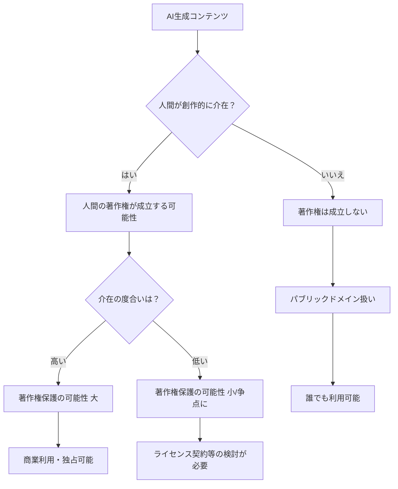

> **💡 この記事のポイント**
> - 米国最高裁判所は、AIが単独で生成した作品に対し著作権を認めない判断を下し、知的財産権の根幹に影響を与えました。
> - これは「人間の創作性」を著作権の必須要件とする米国著作権法の強固な姿勢を示しています。
> - 日本企業は、この国際的な動向を踏まえ、生成AIを活用したコンテンツ制作における法務・ガバナンス戦略を喫緊に見直す必要があります。

2026年3月5日、米国のシリコンバレーでAIの未来を考える者にとって、極めて重要なニュースが静かに報じられました。米国最高裁判所が「**Thaler v. Perlmutter**」訴訟の上告を受理しない（certiorari denied）と決定したのです。これは、AIが生成した作品に対して著作権を認めないという下級裁判所の判断を実質的に追認するものであり、生成AIが当たり前となった今、知的財産権のあり方、そして「作者」の定義そのものに、極めて明確な一石を投じたと言えます。

### 「AIは作者たり得ない」最高裁の明確なスタンス

この歴史的な判断の発端となったのは、コンピューター科学者のスティーブン・ターラー氏が自身の開発したAIシステム「DABUS（Device for the Autonomous Bootstrapping of Unified Sentience）」が生成した美術作品の著作権登録を試みたことです。米国著作権局は、作品の著作権は「人間の作者」に帰属するという理由でこれを拒否。ターラー氏はこれを不服として提訴しましたが、地区裁判所、控訴裁判所ともに著作権局の判断を支持しました。そして今回、最高裁が上告不受理としたことで、**「AIは著作権法上の作者にはなれない」**という原則が、米国において揺るぎないものとなったのです。

この判決が示すのは、米国著作権法が長らく維持してきた「**創作性の源泉は人間にある**」という根幹的な理念です。著作権は、人間の知的な努力と創造的表現を保護するために存在するという考え方です。DABUSのケースでは、AIが自律的に作品を生成したと主張されましたが、それでもなお、法廷は人間の介在がない限り、その作品に法的な保護を与えることに躊躇しませんでした。

この判決は、生成AIの進化が止まらない中、クリエイティブ業界にとって極めて現実的な意味を持ちます。AIが生成したコンテンツの商業利用を検討する企業は、著作権の帰属について、より一層の注意を払う必要が出てきたと言えるでしょう。

### 知的財産権を巡る混迷：米国の法的アプローチ

今回の最高裁の判断は、米国におけるAI関連の知的財産権に関する法的アプローチの一端を示しています。連邦政府はAI規制に対して様々な動きを見せていますが、司法の場では、既存の法律の枠組み内で慎重かつ保守的な判断を下しているのが現状です。

例えば、同時期にはホワイトハウスが議会に対し、AI規制には「**軽微なアプローチ（light touch）**」を求める立法青写真を示しています。これはイノベーションを阻害しないよう、包括的な規制よりも特定の懸念事項に焦点を当てるべきだという産業界寄りの姿勢を示唆するものです。しかし、著作権という知的財産権の根幹に関わる問題では、司法は既存の法原則を強く堅持していることが明らかになりました。

このような状況は、米国におけるAIガバナンスが、行政、立法、司法の間で必ずしも一貫した方向性を示しているわけではないことを意味します。企業としては、各方面からの動向を注意深く見守りながら、自社のAI戦略を構築していく必要があります。特に著作権に関しては、今回の最高裁の判断は、これまでの慣例や法解釈を大きく覆すものではなく、むしろ「**既存の原則の再確認**」という側面が強いと解釈すべきです。

世界的に見ても、AI生成物への著作権付与に関しては国によって対応が異なります。

| 国・地域 | AI生成物への著作権の考え方（概略） | 主な法的アプローチ |
| :------- | :---------------------------------- | :------------------- |
| **米国**   | 人間の創作性が必要。AI単独の作品は原則不可。 | 判例法により「人間の作者」を必須とする。 |
| **EU**     | 人間の知的創作物に限る傾向。AI Actで透明性要求。 | AI Actはデータ利用の透明性を重視。著作権法自体は慎重。 |
| **英国**   | 特定の条件下で「創作者（creator）」をAIの運用者とする可能性。 | 著作権デザイン特許法でAI生成物を扱う条項あり。 |
| **日本**   | 現行法では「人間の思想または感情を創作的に表現したもの」と定義。 | 人間の創作性を重視するが、AI活用と著作権保護のバランスを議論中。 |

この表が示すように、米国は著作権の根源にある「人間性」を最も強く強調する国の一つと言えます。

### 生成AIと著作権：揺れるクリエイティブ業界

今回の最高裁の判断は、生成AIの普及によって著作権を巡る「混沌」が増している現状に、一つの明確な指針を与えました。しかし、これにより全ての著作権問題が解決するわけではありません。むしろ、新たな議論の火種となる可能性も秘めています。

特に、以下の点でクリエイティブ業界に大きな影響を及ぼすでしょう。

1.  **「人間による介在」の重要性**: AIツールを用いてコンテンツを生成する場合、その作品に著作権を主張するには、人間がどの程度創造的に関与したかが問われることになります。単にプロンプトを入力しただけでは不十分であり、具体的な指示、編集、修正といった「人間の創作的寄与」がより重視されるようになるでしょう。
2.  **トレーニングデータへの懸念**: AIが既存の著作物を学習データとして利用する際の著作権侵害問題は、依然として大きな課題です。米国では「CLEAR Act」のような法案が、AIトレーニングデータにおける著作権作品の通知義務の確立を目指しており、今後も法整備の動きは活発化するはずです。今回の最高裁の判断は、AI自体の創作性とは別の文脈で、データの利用に関する規制の重要性を改めて浮き彫りにしました。
3.  **ライセンス戦略の再構築**: 生成AIベンダーやサービス提供者は、ユーザーが生成したコンテンツの著作権帰属について、利用規約やライセンスモデルを再検討する必要に迫られます。また、企業がAIを活用して広告やマーケティングコンテンツを作成する場合、そのコンテンツの権利保護戦略も改めて練り直すことになります。

著作権法における「作者」の定義が、AIの技術的進化の速度に追いついていないのは明らかです。しかし、司法の判断は時に、技術の進歩に倫理的・法的ブレーキをかける役割も果たします。

このシンプルな図が示すように、人間がAI生成物にどれだけ「手を加えるか」が、その著作権の行方を大きく左右する時代が本格的に到来したと言えるでしょう。

### 🧐 エバンジェリストの辛口オピニオン

今回の米国最高裁の決定は、日本企業にとって耳に痛い現実を突きつけるものです。シリコンバレーの技術トレンドを追いかけ、生成AIの可能性に沸き立つ日本のビジネスシーンでは、ともすれば「AIがすべてを解決してくれる」「AIが素晴らしい作品を生み出す」といった過度な期待が先行しがちです。しかし、米国は最高司法機関が「**AIには作者性がない**」という冷徹な判断を下しました。これは、ビジネスの現場で「AIが作ったから著作権は問題ないだろう」と安易に考えることが、いかに危険かを示唆しています。

正直なところ、この決定は日本の企業が持つAIに対する甘い認識に、警鐘を鳴らすものでしょう。多くの日本企業が「AI活用」を掲げる一方で、その法的なリスクや知的財産権の複雑さを深く理解しているとは言えません。特に、社内でAIを活用してコンテンツを作成する際に、「誰が著作権者なのか」「どこまで人間が介在すれば著作権が成立するのか」といった具体的なガイドラインが曖昧なまま進行しているケースが散見されます。

この最高裁の判断は、日本企業が「グローバルな著作権の潮流」から決して目を背けられないことを明確に突きつけています。日本の法体系は米国と異なる部分もありますが、主要国の判例や法整備は必ず相互に影響を与え合います。今、日本企業がすべきは、AIによる創作活動を「効率化」という一言で片付けず、**法務部門を巻き込んだ徹底的なリスクアセスメントと、明確な社内ガバナンスの構築**です。

AI活用における「成果物の著作権は誰に帰属するのか」という問いに対し、明確な答えを持たない企業は、将来的に訴訟リスクや知的財産権の喪失といった深刻な事態に直面する可能性があります。AIを導入すればするほど、そのリスクは指数関数的に増大するでしょう。この最高裁の判断を「他人事」と捉える企業は、生成AI時代の競争から脱落するどころか、法的トラブルの泥沼にはまり込むと断言せざるを得ません。技術の進歩に浮かれるだけでなく、その裏にある法的・倫理的課題に真摯に向き合うことが、今、日本の経営層に求められています。

### 日本企業が取るべき戦略的対応

米国最高裁のこの明確な判断を受け、日本企業は生成AIの活用戦略を再考し、以下の戦略的対応を速やかに講じるべきです。

1.  **社内IPガイドラインの早急な見直しと策定**:
    *   AI生成コンテンツに対する著作権の考え方を明確化し、「人間の創作的寄与」がどこまで必要なのか具体的な基準を定める。
    *   AIツールの利用目的、生成物の商業利用可否、第三者への開示に関するルールを徹底する。
    *   特に、著作権が成立しないと判断されるリスクのあるコンテンツについては、別の形で知的財産を保護する（例：営業秘密としての管理など）方策を検討する。

2.  **生成AI活用プロセスの再設計と人間による監視・介入の強化**:
    *   AIが完全に自律的にコンテンツを生成するケースを極力避け、必ず人間による最終的なレビュー、編集、修正プロセスを組み込む。
    *   プロンプトエンジニアリングだけでなく、生成されたコンテンツに対する人間の創造的な貢献度を記録・証明できる仕組みを導入する。

3.  **法務部門と連携したリスクアセスメントの定期的実施**:
    *   生成AIツールの選定段階から法務部門が関与し、利用規約やライセンス、データプライバシーに関するリスクを評価する。
    *   国際的な著作権法の動向（EU AI Actの透明性要件、英国のライセンス・ファーストアプローチなど）を継続的にモニタリングし、自社の戦略に反映させる。

4.  **オープンソースAIの利用に関する注意喚起**:
    *   オープンソースの生成AIモデルであっても、その学習データに著作権侵害の可能性がないかを慎重に検討する。
    *   ライセンス条件を十分に理解し、違反しない範囲での利用を徹底する。

今回の判断は、単なる一つの判決に留まらず、生成AIが切り拓く新たな時代の知的財産権の基礎を形作るものです。日本企業は、この重要なメッセージを真摯に受け止め、国際競争力を維持するためにも、法務とテクノロジーの双方から堅牢なAIガバナンス体制を構築することが喫緊の課題となります。

## 🔗 関連ツール・サービス

**Google Gemini** — Googleが提供する高性能なAIモデルで、テキストや画像を生成できます。
**ChatGPT (OpenAI)** — OpenAIが開発した大規模言語モデルで、多様なテキスト生成タスクに利用可能です。
**DALL-E 3 (OpenAI)** — OpenAIの画像生成AI。プロンプトから高品質な画像を生成できます。
**Midjourney** — 高品質な画像を生成するAI。クリエイターからの注目度が高いです。