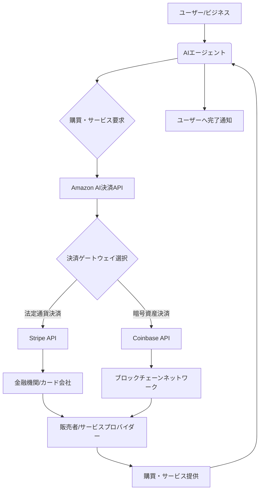

シリコンバレーのテクノロジー動向を長年追い続けてきた私から見ても、今回のAmazonの発表は単なる新機能追加では片付けられない、極めて戦略的な一手だと感じています。米MEXCの報道によれば、**AmazonはCoinbaseおよびStripeと提携し、AIエージェントによる決済サービスを開始しました。** これは、AIがユーザーの意図を理解し、自律的に購買やサービス契約といった金融取引を完結させる、新たな時代の幕開けを告げるものです。

これまで、AIエージェントは主に情報収集、スケジュール管理、タスク自動化といった領域でその能力を発揮してきました。しかし、ここに「決済」という極めて機微な、そして経済活動の根幹をなす機能が組み込まれたことは、テクノロジー業界のみならず、Eコマース、金融、そして私たちの日常生活そのものに計り知れない影響を与えるでしょう。単なる利便性の向上という次元を超え、デジタル経済の構造そのものを再定義する可能性を秘めているのです。

## AIエージェント決済、その衝撃の核心

Amazonが今回発表したAIエージェント決済の最大のポイントは、その「自律性」と「統合性」にあります。これまでのオンライン決済は、あくまで人間の意思決定と操作（ボタンクリック、パスワード入力など）が前提でした。しかし、AIエージェント決済では、AIがユーザーの好み、過去の行動、さらには現在の状況を総合的に判断し、最適な商品やサービスを提案するだけでなく、その**購入プロセス全体を自律的に完了させることが可能になります**。

例えば、冷蔵庫のAIが牛乳の残量を検知し、自動的にAmazon Freshで注文し、決済まで済ませる。あるいは、出張中にホテルの予約変更が必要になった際、ユーザーのスケジュールと予算を考慮したAIエージェントが、最適なホテルを探し、予約・決済までを代行する。これらは、もはやSFの世界の話ではなく、現実のものとなろうとしています。

そして、この革新を支えるのが、決済インフラを提供する**CoinbaseとStripe**の存在です。

*   **Stripe**: 世界中のスタートアップから大企業までが利用する、現代のオンライン決済の屋台骨とも言える存在です。彼らのAPIを通じた柔軟な決済統合能力は、AIエージェントが多様なサービスプロバイダーと連携し、スムーズなフィアット通貨（法定通貨）での取引を可能にする上で不可欠です。既存の金融システムとAIエージェントをシームレスに繋ぐ「橋渡し役」として、その存在感は非常に大きいと言えます。
*   **Coinbase**: 暗号資産（仮想通貨）取引所の最大手であり、ブロックチェーン技術を活用したデジタル資産決済のパイオニアです。AmazonがCoinbaseとの連携を選んだことは、AIエージェントが将来的に、単なる法定通貨だけでなく、暗号資産を用いた決済も自律的に行う未来を示唆しています。これはWeb3.0とAIエージェントが融合する可能性を明確に打ち出したものであり、その影響は特に若い世代の消費者行動に大きく表れると編集部では見ています。

この二つの決済プラットフォームを統合することで、AmazonはAIエージェントに極めて広範な決済オプションを提供し、その応用範囲を爆発的に拡大させることに成功したと言えるでしょう。

## Amazonが狙う「未来のEコマース」と顧客体験

AmazonがこのAIエージェント決済に注力する理由は明らかです。それは、**Eコマースの次のフロンティアを自ら切り開き、顧客体験を根底から変革する**ことにあります。これまでのEコマースは、検索、比較、カート追加、決済といった一連のプロセスをユーザー自身がこなす必要がありました。しかし、AIエージェント決済は、この煩わしいプロセスをAIが肩代わりすることで、ユーザーは「欲しいと思った時には既に手元にある」という究極の利便性を享受できるようになります。

### 究極のパーソナライゼーションとプロアクティブな購買

この新機能により、Amazonは単なる「おすすめ商品」の提示を超え、ユーザーのライフスタイル全体に溶け込むような購買体験を提供することを目指しています。例えば、以下のようなシナリオが考えられます。

*   **スマートホーム連携**: スマート冷蔵庫のセンサーが牛乳の在庫切れを検知。AIエージェントがユーザーの過去の購買履歴と健康状態（アレルギー情報など）を考慮し、最適なブランドの牛乳を自動で再注文・決済。ユーザーは承認するだけで完了。
*   **サブスクリプションの最適化**: AIエージェントがユーザーの利用状況を分析し、過剰なサブスクリプションを自動で停止したり、より安価な代替プランへの移行を提案し、その手続きと決済までを代行。
*   **旅行・エンターテイメント**: ユーザーが「来月、京都に行きたい」と指示するだけで、AIエージェントがフライト、ホテル、観光プランを組み合わせて提案し、最もお得なオプションで予約・決済まで完了させる。

これにより、消費者は「購買する」という行為から解放され、より価値の高い活動に時間を費やせるようになります。そして、Amazonはユーザーの生活の中心により深く食い込み、**顧客ロイヤルティを盤石なものにする**でしょう。競合他社が追随しようにも、Amazonの持つ膨大な顧客データ、広範な商品・サービス網、そして今回加わった高度な決済連携は、圧倒的な参入障壁となります。

## 金融業界への波紋：CoinbaseとStripeの戦略

今回のAmazonとの提携は、決済プロバイダーであるCoinbaseとStripeにとっても、そのビジネスモデルと将来性を大きく左右する戦略的な動きです。

### Stripe：決済の「裏方」から「意思決定層」へ

Stripeはこれまで、企業のオンラインビジネスを支える決済インフラとして、その技術力と信頼性を高めてきました。AIエージェント決済への対応は、Stripeが単なる決済処理業者にとどまらず、**企業の購買意思決定プロセス、ひいてはAIが主導するビジネスロジックの最前線へと深く入り込む**ことを意味します。彼らは、AIエージェントが安全かつ効率的に決済を実行するための、堅牢でインテリジェントなAPIとインフラを提供することになります。

これにより、Stripeは以下のような新たな価値を創出できるでしょう。

*   **ビジネス自動化の加速**: AIエージェントがサプライチェーンや経理業務において、自動で支払いを行う、請求書を発行するといった、より高度な財務自動化を可能にします。
*   **データ駆動型決済**: AIエージェントが生成する膨大な取引データは、Stripeが提供する不正検知やリスク管理の精度を飛躍的に向上させ、新たな金融サービスの開発にも繋がる可能性があります。

### Coinbase：暗号資産のメインストリーム化への大きな一歩

Coinbaseにとって、Amazonという巨大なEコマースプラットフォームとの提携は、暗号資産が一部の投資家やテクノロジー愛好家だけでなく、**一般消費者の日常生活における決済手段として、本格的にメインストリーム化する**ための極めて重要な試金石となります。これまで暗号資産決済は、投機的な側面が強く、実用性には疑問符がつくこともありました。しかし、AmazonのAIエージェントが「知らぬ間に」暗号資産で決済を完了させるような未来が訪れれば、その認識は一変するでしょう。

この提携は、Web3.0の理念とWeb2.0の巨大なユーザーベースを結びつける強力な架け橋となります。Coinbaseは、デジタルウォレットの普及、NFTやDAOといったブロックチェーンベースのサービスとの連携も視野に入れ、AIエージェントを通じた新たな経済圏の構築に貢献していくはずです。

### 課題：信頼性、セキュリティ、規制

しかし、AIエージェントが自律的に決済を行うことには、当然ながら大きな課題も伴います。

| 項目         | 従来のEコマース決済                      | AIエージェント決済                                       |
| :----------- | :--------------------------------------- | :------------------------------------------------------- |
| **主導者**   | ユーザー自身                             | AIエージェント                                           |
| **意思決定** | 明示的なユーザーの承認                   | AIがユーザーの意図を推測し、プロアクティブに決定         |
| **速度**     | ユーザーの操作速度に依存                   | ほぼリアルタイムで完了                                   |
| **誤操作リスク** | ユーザーの入力ミスや誤クリックが主       | AIの誤認識、ハッキング、パーミッション管理の不備         |
| **不正利用** | クレジットカード情報盗難など             | AIエージェント自体の乗っ取り、誤動作による意図しない購入 |
| **利便性**   | 決済画面への入力、確認が必要             | 極めて高い。意識することなく取引が完了                   |
| **説明責任** | ユーザーとサービス提供者間で明確         | AIの判断基準、介入範囲の明確化が課題                     |

最も重要なのは、**AIエージェントがユーザーの意図を正確に解釈し、常に最善の利益のために行動するという「信頼性」**です。万が一、AIが誤った判断で高額な商品を購入してしまったり、セキュリティが侵害されて勝手に決済が行われたりした場合、その責任は誰が負うのか、という問題が生じます。

また、金融取引における規制は国や地域によって厳格であり、AIエージェントが自律的に取引を行うことに対する新たな法整備やガイドラインが急務となるでしょう。Amazon、Coinbase、Stripeの三社は、この新たな決済モデルにおけるセキュリティプロトコルやガバナンス体制をいかに構築し、ユーザーの信頼を獲得していくかが問われます。

## 🧐 編集部の辛口オピニオン

AmazonがAIエージェント決済に本腰を入れたというニュースは、日本企業にとって「警鐘」と受け止めるべきです。正直に言って、日本の多くの企業は、未だにAIエージェントの可能性を、顧客サポートのチャットボットや社内業務のRPA（Robotic Process Automation）の延長としか捉えきれていないのではないでしょうか。しかし、今回の発表は、**AIエージェントが直接的に「貨幣を動かす」時代に突入した**ことを明確に示しています。これは、単なる業務効率化ではなく、経済活動の「主体」が部分的にAIへと移譲される、というパラダイムシフトなのです。

シリコンバレーで起きていることは、常に日本の数年先を行くトレンドを示してきました。この「AIエージェント決済」は、数年後には世界のEコマースや金融のスタンダードになる可能性を秘めています。日本の企業が、いまだに「AI導入はコスト削減が目的」といった短絡的な思考に留まっている間に、海外ではAIが顧客の財布から直接購買を完了させる仕組みが構築されようとしている。この差は、将来的に市場シェア、顧客エンゲージメント、そして企業の存続そのものに致命的な影響を与えかねません。

特に、金融機関や小売業は、自社のビジネスモデルがAIエージェントによってどう破壊され、どう再構築されるのかを真剣に考えるべきです。「セキュリティが心配」「日本では法規制が…」といった及び腰の議論に終始していては、グローバル競争から完全に脱落します。リスクと向き合い、技術的な挑戦と法制度への働きかけを同時に進めなければ、日本のデジタル経済は、海外のAIエージェントエコシステムに飲み込まれることになるでしょう。もはや「様子見」の段階は終わったのです。

## 💡 よくある質問（FAQ）

### Q: AIエージェント決済は、現在のモバイル決済（Apple Payなど）とどう違うのですか？
A: モバイル決済は、ユーザーがスマートフォンなどのデバイスを使って能動的に決済を「実行」するのに対し、AIエージェント決済は、AIがユーザーの指示や状況を自律的に判断し、ユーザーの介入なしに決済を「完了」させる点が大きく異なります。例えば、スマート冷蔵庫が牛乳の残量を確認し、ユーザーに確認することなく自動で再注文・決済するといったことが可能になります。

### Q: AIエージェントが勝手に高額な買い物をしたり、不正利用されたりするリスクはないのですか？
A: そのリスクは当然存在します。Amazon、Coinbase、Stripeは、厳格なセキュリティプロトコル、ユーザーによる取引上限設定、二段階認証、異常検知システムなどを導入し、リスクを最小限に抑える努力をしています。しかし、AIの誤認識やハッキングのリスクはゼロにはなりません。ユーザー自身がAIエージェントへのパーミッション管理を適切に行い、常に取引履歴を監視する意識が重要になります。

### Q: このAIエージェント決済は、日本でもすぐに普及するのでしょうか？
A: 技術的な普及は比較的早いと考えられますが、日本における広範な普及には時間が必要です。金融規制、消費者のAIに対する信頼度、そして企業側の導入体制が整備される必要があります。しかし、Amazonが主導することで、グローバルなスタンダードとなり、数年後には日本市場にも大きな波として押し寄せる可能性は非常に高いでしょう。日本企業は、この動きを注視し、早期の対応策を検討すべきです。

## 🔗 関連ツール・サービス

**[Stripe](https://stripe.com/jp)** — 企業のオンライン決済を支える包括的なAPIとプラットフォームを提供。
**[Coinbase](https://www.coinbase.com/ja)** — 安全で使いやすい暗号資産取引所およびWeb3サービスプロバイダー。
**[Amazon Pay](https://pay.amazon.com/jp)** — Amazonアカウント情報を利用して、提携サイトで簡単・安全に決済。
**[Zapier](https://zapier.com/)** — さまざまなWebサービスを連携し、自動化ワークフローを構築するツール。