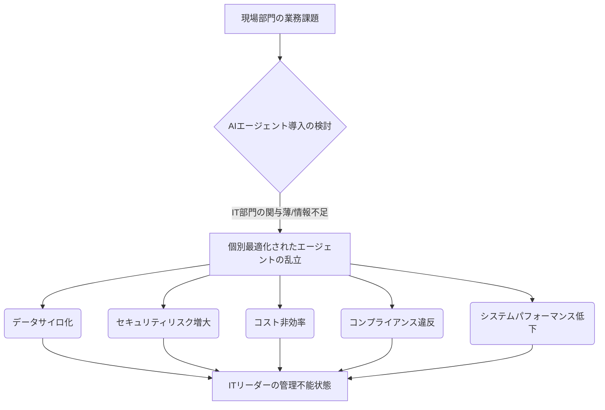

シリコンバレーから届く最新のAIトレンドを追う中で、私たちは常に技術の「光」に目を奪われがちです。しかし、その光の裏には必ず「影」が存在します。今日、私が最も注目しているのは、まさにその影の部分――企業内で野放図に増殖するAIエージェントが、IT部門に「管理の悪夢」をもたらしているという現実です。ChannelE2Eが指摘する**「AI Agent Sprawl（AIエージェント乱立）」**は、もはや無視できない、緊急性の高い課題として浮上しています。この問題は、単なる管理上の煩雑さを超え、企業のセキュリティ、コスト効率、そして未来の競争力そのものを揺るがしかねない深刻な事態へと発展する可能性を秘めているのです。

この現象は、組織の各部門が個別の業務効率化を目指し、IT部門の十分な関与なしにAIエージェントを導入した結果として起こります。

## 終わりのない「エージェント乱立」のサイクル

AIエージェントが企業の生産性を劇的に向上させる可能性を秘めていることは疑いようがありません。Metaがハイパースケールなパフォーマンス最適化に統一AIエージェントを導入し、Microsoftがコンタクトセンター業務の自動化に乗り出しているように、その導入は今や加速の一途を辿っています。しかし、その一方で、導入が容易になったがゆえに、各部門が独自の判断でエージェントを導入する**「シャドーIT」ならぬ「シャドーAI」**とでも呼ぶべき現象が頻発しています。

営業部門は顧客対応の自動化のために、マーケティング部門はコンテンツ生成やデータ分析のために、そして人事部門は採用プロセスの効率化のために、それぞれ異なるAIエージェントを導入する。これ自体は悪いことではありません。問題は、それらがIT部門の統制下になく、統一された戦略やガバナンスの下で運用されていない点にあります。結果として、企業内には多種多様なエージェントが混在し、それぞれが異なるデータソースにアクセスし、異なるセキュリティプロトコルで動作し、異なるコスト構造を持つという、まさに「乱立（Sprawl）」状態が生まれるのです。

かつて、クラウドサービスの乱立がIT部門の頭を悩ませたように、今、同じ問題がAIエージェントの世界で再燃しています。ChannelE2Eのレポートは、この現状を**「ITリーダーにとって次の大規模な課題」**と厳しく指摘しています。現場のニーズに応える形で導入された個々のエージェントが、全体として見れば企業の足かせとなり、将来的なスケールアップや統合作業を不可能にする可能性すらある。この悪循環を断ち切るには、抜本的なアプローチの見直しが不可欠です。

## 「見えないコスト」が企業を蝕む：セキュリティとコンプライアンスの闇

AIエージェント乱立が引き起こす最も深刻な問題の一つが、**セキュリティリスクの増大**です。各部門が個別に導入したエージェントは、往々にしてIT部門のセキュリティレビューやコンプライアンスチェックを十分に受けていません。これにより、以下のような危険が内在することになります。

*   **データ漏洩のリスク:** 適切に管理されていないエージェントが、機密性の高い顧客情報や企業秘密にアクセスし、外部に漏洩する可能性。特に、外部のLLM（大規模言語モデル）ベースのエージェントを利用する場合、入力データが学習に利用され、意図せず機密情報が流出するリスクも無視できません。
*   **シャドーAIの脆弱性:** 導入されたエージェントの多くは、最新のセキュリティパッチが適用されていなかったり、脆弱性診断が不十分であったりするケースが散見されます。これらはサイバー攻撃者にとって格好の侵入経路となり得ます。
*   **コンプライアンス違反:** GDPR（一般データ保護規則）やCCPA（カリフォルニア州消費者プライバシー法）といったデータプライバシー規制は、個人データの処理方法に厳格なルールを定めています。無数のエージェントがバラバラにデータを扱う状況では、これらの規制への準拠が困難になり、多額の罰金や企業の信用失墜につながる危険性があります。

編集部で特に注目したのは、クリスチャン・ファン・デル・ヘンスト氏が指摘する**「AIエージェントがビジネス所有権やKYC規制に法的疑問を投げかける」**という点です。エージェントが自律的に意思決定を行い、取引を実行するようになると、その結果に対する法的責任は誰が負うのか、個人認証（KYC）のプロセスはどのように適応すべきか、といった根本的な問題が浮上します。これらの法的・倫理的側面を無視した乱立は、まさに時限爆弾を抱えているようなものだと言えるでしょう。

## コスト、複雑性、そして統合の壁：IT部門の多重苦

AIエージェントの乱立は、セキュリティだけでなく、IT部門の運用コストと複雑性を劇的に押し上げます。

| 課題項目         | 詳細                                                     | 企業への影響                                               |
| :--------------- | :------------------------------------------------------- | :--------------------------------------------------------- |
| **運用コスト**   | 各エージェントのライセンス、インフラ、メンテナンス費用が重複 | 全体として無駄な支出が増大、ROIが見えにくい                 |
| **統合の複雑性** | 異なるAPI、データ形式、セキュリティ要件を持つエージェントの連携が困難 | システム間の連携不足、データサイロ化、自動化効果の限定化   |
| **ガバナンス欠如** | 導入基準、セキュリティポリシー、データ管理規則が部門ごとに異なる | セキュリティリスク増大、コンプライアンス違反、監査の困難さ |
| **スキルギャップ** | 多様なエージェントに対応できる専門知識を持つIT人材の不足     | 運用負荷増大、トラブル対応の遅延、IT部門の疲弊             |

Oracleが「成果駆動型AIエージェント」に賭けているように、本来AIエージェントは明確な成果と効率化をもたらすべきものです。しかし、乱立状態ではそのポテンシャルを最大限に引き出すことができません。複数のエージェントが同じタスクを重複して実行したり、逆に連携不足によりデータが分断されたりする「サイロ化」が進むことで、企業全体の効率性はむしろ低下する可能性があります。

さらに、これらのエージェントを将来的に統合しようとする場合、その作業は膨大かつ困難なものとなります。異なるベンダーのエージェント、異なる技術スタック、異なるデータフォーマットが混在する環境を整理し、一貫性のあるシステムを構築するには、途方もない時間とコスト、そして高度な技術力が必要とされるでしょう。これは、デジタル変革を加速させたい企業にとって、まさに逆行する状況と言わざるを得ません。

## ITリーダーがとるべき戦略：統一プラットフォームとガバナンス

この「AIエージェント乱立」の脅威に対処するため、ITリーダーは積極的かつ戦略的なアプローチを取る必要があります。SASが「ガバナンス組み込み型のAI対応データ管理基盤」を推進しているように、基盤からの見直しが急務です。

### 1. 統一プラットフォームの導入と標準化

各部門が個別にエージェントを導入するのではなく、企業全体で承認された統一されたプラットフォームやフレームワークを導入すべきです。これにより、エージェントの展開、管理、監視、セキュリティ設定を一元化できます。例えば、UiPathがDatabricksとのパートナーシップでAI駆動型オペレーションを進めるように、信頼できるパートナーとの連携も有効でしょう。

*   **集中管理:** 全エージェントの稼働状況、パフォーマンス、利用データなどを一元的に可視化・管理する。
*   **APIエコシステム:** エージェント間の連携を標準化するAPIゲートウェイを構築し、データ連携を円滑にする。
*   **バージョン管理と更新:** エージェントのバージョン管理を徹底し、セキュリティパッチや機能更新を計画的に実施する。

### 2. 強固なAIガバナンスフレームワークの構築

AIエージェントの導入と運用に関する明確なポリシーとガイドラインを策定し、企業全体に浸透させることが不可欠です。

*   **導入承認プロセス:** 新規エージェントの導入には、IT部門と法務部門による厳格な承認プロセスを設ける。
*   **データアクセス制御:** エージェントがアクセスできるデータ範囲を最小限に制限し、ロールベースのアクセス制御（RBAC）を徹底する。
*   **倫理ガイドライン:** エージェントの意思決定プロセスにおける公平性、透明性、説明責任に関するガイドラインを設ける。
*   **定期監査:** エージェントのセキュリティ、コンプライアンス、パフォーマンスについて定期的な監査を実施する。

### 3. スキルアップと組織体制の再編

AIエージェントの複雑な管理に対応できる専門知識を持つIT人材の育成が急務です。また、IT部門と現場部門が協力し、全社的なAI戦略を推進する組織体制を構築する必要があります。これは、単なる技術導入の問題ではなく、組織文化そのものの変革を意味します。

## 🧐 編集部の辛口オピニオン

「AIエージェント乱立」というこの問題、正直なところ、多くの日本企業にとって「またか」という既視感を覚えるのではないでしょうか。かつてのERP導入、SaaS利用、クラウド移行... 新しいテクノロジーが来るたびに、現場の「とりあえず導入」とIT部門の「統制の遅れ」という構図が繰り返されてきました。このAIエージェントのスプロール現象は、まさにその延長線上にあります。

しかし、AIエージェントのそれは、過去の教訓よりもはるかに深刻です。なぜなら、AIエージェントは単なるツールではなく、自律的に学習し、意思決定し、行動する**「擬似的な従業員」**だからです。無秩序なエージェントは、人間の従業員よりもはるかに速く、はるかに広範囲に、セキュリティホールを広げ、機密データを流出させ、コンプライアンス違反を引き起こす可能性があります。

日本の企業文化では、部門間の連携が弱く、個別の最適化が優先されがちです。「うちの部署だけ良ければいい」というマインドセットが、このAIエージェント乱立をさらに加速させるでしょう。トップダウンで明確なAI戦略とガバナンスを示し、IT部門に強力なリーダーシップと権限を与えなければ、数年後には収集がつかないほどの**「AI負債」**を抱え込むことになります。その時、企業はデジタル変革どころか、システムの維持すらままならない状況に陥るかもしれません。今すぐ、この「見えない脅威」に真正面から向き合う覚悟が必要です。

## 💡 よくある質問（FAQ）

### Q: AIエージェントの「乱立（Sprawl）」とは具体的にどういう状態を指しますか？
A: 企業内で、各部門が独自の判断で多様なAIエージェントを個別に導入し、それがIT部門の統一的な管理やガバナンスの下に置かれず、システム全体の整合性やセキュリティ、コスト効率が損なわれている状態を指します。

### Q: AIエージェント乱立が企業にもたらす最大のリスクは何ですか？
A: 最大のリスクは、セキュリティとコンプライアンス違反の増大です。管理されていないエージェントは、データ漏洩の温床となり、GDPRなどの規制に抵触する可能性が高まります。また、非効率なコスト構造や複雑性の増大も大きな課題です。

### Q: ITリーダーはAIエージェント乱立にどう対処すべきでしょうか？
A: まず、統一されたAIエージェントプラットフォームの導入を検討し、エージェントの展開・管理・監視を一元化することが重要です。同時に、厳格なAIガバナンスフレームワークを構築し、導入承認プロセス、データアクセス制御、倫理ガイドラインなどを明確にする必要があります。

## 🔗 関連ツール・サービス

**UiPath Business Automation Platform (https://www.uipath.com/ja/ja/)** — AIとRPAを統合し、企業業務の自動化とエージェント管理を支援します。
**Microsoft Azure AI (https://azure.microsoft.com/ja-jp/solutions/ai/)** — 多様なAIサービスと管理ツールを提供し、企業内でのAIエージェントの統制を可能にします。
**SAS Viya (https://www.sas.com/ja_jp/software/viya.html)** — AI対応データ管理基盤を提供し、データガバナンスを組み込んだエージェント運用の土台を築きます。
**Netskope (https://www.netskope.com/ja)** — シャドーITならぬシャドーAI対策として、クラウドサービスやエージェントの利用状況を可視化・制御します。