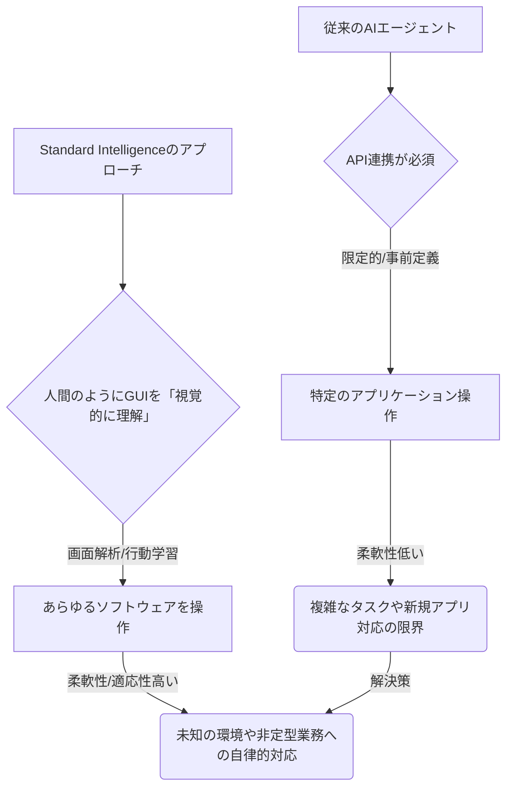

シリコンバレーのスタートアップ動向を15年追ってきた経験から断言できますが、いま最も注目すべき技術トレンドの一つは、間違いなく「AIエージェント」です。しかし、既存のエージェントの多くは、特定のAPI連携やスクリプトに依存しており、真の意味で人間のようにソフトウェアを使いこなすには限界がありました。そこに一石を投じるのが、今回7500万ドルの大型資金調達を発表したStandard Intelligenceです。彼らが目指すのは、AIエージェントに人間と同じようにソフトウェアの画面を「見て」、その意味を「理解し」、そして自律的に「操作させる」という、まさにSFのような世界です。

これは単なる業務自動化の延長ではありません。従来の自動化が「決められた手順」を「事前に準備されたインターフェース」で実行するものであったのに対し、Standard Intelligenceが切り開こうとしているのは、AIが「状況を判断」し「未知のアプリケーション」さえも「自ら学びながら使う」という、一段上の自律性です。この技術が実用化されれば、私たちの働き方はもちろん、ソフトウェア開発やビジネスプロセスそのものが根本から変わる可能性を秘めていると、編集部では見ています。

## AIエージェントの次なるフロンティア：「人間的ソフトウェア認識」

AIエージェントの進化は目覚ましいものがありますが、その多くは特定のアプリケーションのAPI（アプリケーション・プログラミング・インターフェース）を通じて機能するように設計されてきました。APIは、プログラム同士が効率的に情報をやり取りするための「裏口」のようなもので、高速かつ安定した自動化を実現します。しかし、すべてのソフトウェアがAPIを公開しているわけではありませんし、APIが存在しても、その機能は開発者が意図したものに限定されます。非定型的な操作や、複数の異なるソフトウェアをまたがる複雑なタスクを実行しようとすると、APIベースのエージェントは途端にその限界を露呈するのです。

ここでStandard Intelligenceが提唱するのは、まさにコロンブスの卵のような発想です。人間はソフトウェアを使うとき、APIを直接叩くわけではありません。画面に表示されるボタンやテキスト、画像といったGUI（グラフィカル・ユーザー・インターフェース）を「見て」、その意味を「理解し」、マウスやキーボードで「操作」しています。Standard Intelligenceは、この人間の認知プロセスをAIエージェントに再現させようとしているのです。

彼らは、最先端の視覚認識技術と大規模言語モデル（LLM）を組み合わせることで、AIエージェントがPC画面をリアルタイムで解析し、各要素（ボタン、入力フィールド、アイコンなど）が何を意味するのかを理解する能力を開発しています。例えば、新しいアプリケーションを起動した際、エージェントは「これはログイン画面だな」「ここにユーザー名を入力して、ここにパスワードを入力するのか」といった判断を、人間が行うのと同じように画面情報から導き出すことができるようになるでしょう。そして、その理解に基づいて、自律的に操作を実行するのです。これにより、APIが存在しないレガシーシステムから、最新のウェブアプリケーションまで、あらゆるソフトウェアがAIエージェントの「操作対象」となり得ます。

この技術は、AIエージェントの汎用性と適応性を飛躍的に高める可能性を秘めています。もはや特定用途に縛られることなく、まるで優秀なデジタルアシスタントのように、様々な業務を跨いで柔軟にタスクをこなす未来が視野に入ってくるわけです。

## 7500万ドルの資金調達が示す市場の期待値

Startup Fortuneの報道によれば、Standard IntelligenceはシリーズBラウンドで7500万ドルを調達し、評価額は5億ドルに達したとのことです。これは、単なる技術的なアイデアに過ぎないものではなく、市場がその潜在的価値と実現可能性を高く評価している明確な証左と言えるでしょう。投資家がこれほどの巨額を投じるのは、この「人間的ソフトウェア認識」の技術が、現在の業務自動化の課題を根本から解決し、企業に計り知れない経済的インパクトをもたらすと確信しているからです。

現在のRPA（ロボティック・プロセス・オートメーション）が抱える最大の課題の一つは、画面のUI（ユーザーインターフェース）が変更されると、すぐにシナリオが破綻し、メンテナンスコストが膨大になるという点です。人間であれば、ボタンの位置が変わったり、デザインが少し変わったりしても、文脈から判断して操作を継続できます。しかし、RPAは事前に設定された座標や要素の識別子に基づいて動作するため、UIが少しでも変われば「見失ってしまう」のです。

Standard IntelligenceのAIエージェントが目指すのは、この「見失う」という問題を解決することです。彼らのエージェントは、画面上の要素をピクセル情報だけでなく、その「意味」や「目的」を理解しようと試みます。例えば、「請求書を承認する」というタスクが与えられた場合、画面のどこに承認ボタンがあるかをAIが自律的に探し出し、それが多少レイアウト変更されても、意味を理解して操作を継続できる可能性を秘めています。これは、従来の自動化ツールが抱えていた「脆さ」を克服し、より堅牢で適応性の高い自動化を実現するための鍵となります。

この技術は、特に多種多様なSaaSやレガシーシステムが混在する大企業において、その真価を発揮するでしょう。個別のAPI連携やRPAシナリオ開発に膨大なリソースを割くことなく、より多くの業務プロセスをAIエージェントに任せられるようになれば、そのROI（投資収益率）は計り知れないものとなります。

## 自動化のパラダイムシフト：APIからGUIへ

AIエージェントによる自動化が今後進む方向性として、Standard Intelligenceのアプローチは一つの明確なパラダイムシフトを示唆しています。これまでは、システム連携や自動化の基本はAPIを介したものでした。APIは開発者にとって非常に強力なツールであり、プログラマブルな世界を構築する上で不可欠です。しかし、世の中の全てのソフトウェアがAPIを完全に開放しているわけではありませんし、APIの提供が遅い、あるいは提供されないケースも多々あります。

ここで、AIエージェントがGUIを通じてソフトウェアを操作できる能力を持つことは、自動化の可能性を文字通り無限に広げます。APIが存在しない、あるいは貧弱なレガシーシステムであっても、AIエージェントはまるで人間のオペレーターのように画面を操作し、データを入力し、情報を抽出することが可能になります。これは、これまで自動化が困難だった「非定型業務」や「複数のシステムをまたぐ複雑な業務」に、初めてAIのメスが入ることを意味します。

考えてみてください。新しいSaaSを導入するたびに、そのSaaSと既存システムとの連携のためにAPI開発やカスタマイズに時間とコストをかけていた企業は少なくありません。しかし、Standard Intelligenceのアプローチが普及すれば、AIエージェントが各SaaSの画面を学習し、人間が使うのと同じように操作することで、シームレスなデータ連携やワークフロー自動化を実現できるかもしれません。これは、IT部門の負担を劇的に軽減し、ビジネス部門がより迅速に新しいツールを導入・活用できる環境を創出します。

| 特徴           | 従来のAPIベース自動化           | Standard Intelligence型AIエージェント |
| :------------- | :------------------------------ | :---------------------------------- |
| **操作対象**   | APIが公開されたアプリケーション | 画面表示される全てのソフトウェア    |
| **柔軟性**     | 低い（事前定義された操作のみ）  | 高い（人間的判断で操作を学習・実行）|
| **導入コスト** | API連携の開発コストが発生       | 画面からの学習で開発負担軽減        |
| **保守性**     | API変更で再開発が必要           | GUI変更に自律的に適応する可能性     |
| **ユースケース** | 定型的なデータ連携、単純なタスク | 非定型業務、複雑なワークフロー、新規アプリ |
| **「認知」能力** | なし（命令実行のみ）            | あり（画面の意味を理解し判断）      |

## 日本企業が直面するAIエージェント時代の課題と機会

この「人間的ソフトウェア認識」を持つAIエージェントの登場は、日本企業にとって大きな課題と同時に、大きなチャンスをもたらします。日本企業は、依然として多くのレガシーシステムを抱え、紙ベースの業務や手作業に依存する部分も少なくありません。これらの環境下で、従来のAPIベースの自動化やRPAでは限界がありました。しかし、Standard Intelligenceのような技術が成熟すれば、これまで自動化の対象外とされてきた領域にもAIエージェントが踏み込むことが可能になります。

例えば、複雑な承認プロセスを要する稟議システム、複数の異なるツールから情報を集約してレポートを作成する業務、顧客からの問い合わせ内容に応じて複数の社内システムを横断して情報を探し出すコンタクトセンター業務など、これまで人手に頼っていた非定型かつ複雑な業務が、AIエージェントによって効率化される可能性が高まります。

しかし、同時に課題も山積しています。AIエージェントが自律的にソフトウェアを操作するようになるということは、セキュリティやガバナンスの観点から新たなリスクが生まれることを意味します。エージェントが誤った操作をしないか、機密情報に不適切にアクセスしないかなど、厳格な監視と制御のメカニズムが必要となるでしょう。また、AIエージェントに仕事を奪われるのではないかという雇用不安も、現実的な問題として浮上してきます。

日本企業は、これらの技術的・社会的課題を認識しつつ、戦略的にAIエージェントの導入を検討すべきです。まずはスモールスタートでパイロットプロジェクトを立ち上げ、AIエージェントがもたらす業務効率化の具体的な効果と、それに伴うリスクを詳細に検証する姿勢が求められます。そして、AIエージェントを「脅威」ではなく「協働者」と捉え、人間の働き方を再定義し、より創造的な業務にシフトするための機会と捉えるべき時期に来ていると考えます。

## 🧐 編集部の辛口オピニオン

Standard Intelligenceの動きは、現在のAIエージェント市場における「根本的な欠陥」を衝いていると言えるでしょう。多くのAIエージェントは、まるで訓練された犬のように、特定の芸（API）しか披露できない。しかし、本当に賢い「アシスタント」を求めるなら、人間のように「空気を読み」「状況を判断し」「未知の状況にも対応できる」能力が必要です。Standard Intelligenceが目指すのは、まさにその「空気読み」ができるAIエージェントです。

日本企業は、この動きを他人事だと思っていませんか？「うちのシステムはレガシーだからAIは無理」と諦めていませんか？それはもう通用しない言い訳です。この技術は、まさにそのレガシーシステムにこそ、AIの恩恵をもたらす可能性を秘めているのです。APIがないからと手作業を続けている、UI変更のたびにRPAが止まってメンテナンス地獄に陥っている、そんな状況にこそ、彼らの技術が光を放つ。

ただし、これを単なる「自動化の進化版」と捉えるだけでは甘いです。AIが画面を「見る」ということは、人間の仕事の多くの部分が代替される可能性を示唆しています。単純なデータ入力やチェック作業はもちろん、複数のアプリケーションをまたいだ情報収集や、定型的な報告書作成といった、これまで「人間でないと無理」とされてきた領域にまで、AIエージェントが踏み込んでくるでしょう。

これを脅威と捉え、従業員がAIに職を奪われると怯えるだけでは、国際競争力を失うだけです。むしろ、これを機に「人間しかできない仕事」とは何かを再定義し、人間の従業員をより高度で創造的な業務へとシフトさせる「大転換期」と捉えるべきです。もし、日本の経営層がこの流れを見誤り、「効率化」という言葉だけで導入を進め、本質的な「働き方改革」や「事業再構築」に結びつけられなければ、他国の企業に一歩も二歩も遅れを取ることになるでしょう。Standard Intelligenceの資金調達は、日本の企業にとって、もう猶予がないという警鐘と受け止めるべきです。

## 💡 よくある質問（FAQ）

### Q: Standard IntelligenceのAIエージェントは、既存のRPAツールとどう違うのですか？
A: 従来のRPAは、事前に設定された画面上の座標や特定の要素識別子に基づいて操作を「実行」するツールです。UIが少し変わるだけで動作が停止し、メンテナンスコストがかかります。一方、Standard IntelligenceのAIエージェントは、AIが画面を「見て」、その要素の「意味」や「目的」を理解し、自律的に判断して操作を実行します。これにより、UIの変更にも柔軟に対応し、より複雑な非定型業務も自動化できる可能性を秘めています。

### Q: この技術が普及すると、具体的にどのような業務が自動化されやすくなりますか？
A: API連携がないレガシーシステム上でのデータ入力や抽出、複数のSaaSを横断して情報を集約するタスク、顧客からの問い合わせ内容に応じた情報検索や返答の下書き作成、複雑な承認フローを含む社内システム操作などが挙げられます。これまで人間が手作業で行っていた、非定型で判断を伴う業務の自動化が進むと予想されます。

### Q: AIエージェントが人間のようにソフトウェアを操作することに対するセキュリティ上の懸念はありますか？
A: はい、重大な懸念があります。AIエージェントが機密情報にアクセスしたり、誤った操作を行ったりするリスクは常に存在します。そのため、エージェントのアクセス権限の厳格な管理、操作ログの徹底的な記録と監視、そして異常検知システムの導入が不可欠です。導入企業は、セキュリティとガバナンスに関する強固なポリシーを策定し、技術的対策と運用上のルールを両面から整備する必要があります。

## 🔗 関連ツール・サービス

**UiPath(ユーアイパス)公式URL** — 世界的に導入が進むRPAツールで、AI機能の統合も強化しています。
**Automation Anywhere(オートメーションエニウェア)公式URL** — Botを活用した業務自動化プラットフォームで、インテリジェントオートメーションを推進しています。
**Microsoft Power Automate(マイクロソフトパワーオートメイト)公式URL** — Microsoftのエコシステムと連携し、業務プロセスを自動化するクラウドベースのRPAサービスです。