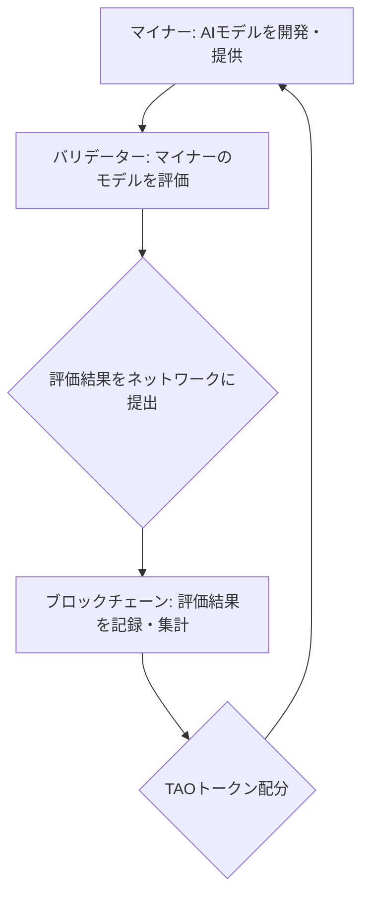

シリコンバレーでAIの動向を追い続けて15年になるが、最近ほど既存のパラダイムが揺さぶられている時期はない。特に今、静かに、しかし確実にその存在感を増しているのが、分散型AIネットワーク「**Bittensor**」だ。従来のAI開発といえば、NVIDIAのGPUを大量に購入し、OpenAIやGoogleのような巨大企業が中央集権的にモデルを訓練・提供する構図が常識だった。しかし、このBittensorは、その常識を根底から覆す可能性を秘めている。

「Proof-of-Intelligence（知性の証明）」という、耳慣れないが極めて重要なメカニズムを掲げ、AIの学習リソースやモデルそのものをブロックチェーン上で「市場化」しようとする試みは、単なる技術的な進歩ではない。これは、AIエコノミー全体の構造を変革し、AIの民主化を推進する壮大な実験だ。巨大テック企業の支配が強まるAI業界において、この分散型AIネットワークがなぜ今、これほどまでに注目を集めるのか。その本質を深く掘り下げていこう。

## Bittensorとは何か？「知性の証明」が拓く新時代

Bittensorは、一言で言えば「分散型AIの市場」を提供するネットワークだ。AIモデルの学習能力や推論能力といった「知性」を、ビットコインのマイニングのように分散されたネットワーク参加者（マイナー）が提供し、その貢献度に応じて報酬（TAOトークン）を受け取る仕組みが核となる。この報酬の配分を決定するのが、独自に開発された「Proof-of-Intelligence（PoI）」というコンセンサスアルゴリズムだ。

具体的には、ネットワーク内の「バリデーター」と呼ばれるノードが、マイナーが提供するAIモデルの出力や性能を評価する。この評価に基づき、より高品質で有用な知性を提供したマイナーに多くの報酬が与えられる。例えば、あるマイナーが優れた言語モデルを構築し、別のマイナーが画像認識で高い精度を出せば、それぞれの貢献が公平に評価され、ネットワーク全体のAI能力が自律的に向上していく。これは、AI版のクラウドソーシング、あるいはAI能力の共有経済と見なすこともできる。

このアプローチは、AI開発におけるリソース集中とそれに伴うコスト増大という既存の課題に対する、非常に興味深いカウンター提案となる。計算リソースが不足している小規模な研究機関やスタートアップでも、自身のAIモデルをネットワークに接続し、その価値を提供することで、エコシステムから利益を得ることが可能になる。これは、AI開発の門戸を大きく広げ、イノベーションを加速させる可能性を秘めている。

## 分散型AIの核心：なぜ今Bittensorが注目されるのか

Bittensorが急速に勢いを増している背景には、現在のAI業界が抱える複数の構造的問題がある。

一つは、**中央集権化の進行**だ。OpenAI、Google、Microsoftといった巨大テック企業が莫大な資金とリソースを投じ、最先端のLLMやAIモデルを開発している。これにより、AI技術へのアクセスはこれらの企業が握り、その利用には高額なAPI料金やクラウド利用料が発生する。Bittensorは、この中央集権的な構造に風穴を開け、AI開発の主導権を分散させようとしている。

二つ目は、**リソースの非効率性**だ。世界中で大量のGPUがAIモデルの訓練に費やされているが、その利用率は常に最適とは限らない。また、訓練済みモデルの共有や再利用も、企業間の壁やライセンス問題で制約が多い。Bittensorは、未利用のリソースや特定の分野に特化したAIモデルをネットワーク上で共有・取引可能にすることで、AIエコシステム全体のリソース効率を大幅に改善する。

そして三つ目は、**データ主権と透明性への要求**だ。中央集権型AIサービスでは、ユーザーデータが特定の企業に集約され、その利用方法やセキュリティに関して懸念が残る。分散型アプローチは、データやアルゴリズムの透明性を高め、ユーザー自身がデータ主権を保持できる可能性を提示する。ブロックチェーン技術を基盤とすることで、AIモデルの学習過程や性能評価がより透明になり、信頼性の高いAIシステム構築に貢献すると期待されている。

例えば、私が以前APIで試した大規模言語モデルでも、特定のクエリで不適切な回答が出ることがあった。その原因究明はブラックボックス化されており、利用者側からは介入できない。しかし、Bittensorのような分散型モデルであれば、ネットワーク内の多数のバリデーターによる評価を通じて、問題のあるモデルや偏ったデータセットが特定され、改善へと繋がりやすい構造があると言える。

従来のAI開発とBittensorのような分散型AIを比較すると、その違いは明らかだ。

| 特徴           | 中央集権型AI開発（例：OpenAI）                                    | 分散型AI（Bittensor）                                    |
| :------------- | :---------------------------------------------------------------- | :------------------------------------------------------- |
| **開発主体**   | 巨大テック企業、大学、一部の研究機関                              | 世界中の個人、研究者、小規模企業                         |
| **リソース調達** | 自社GPU、クラウドサービス（AWS, Azure, GCP）                     | ネットワーク参加者が提供（分散型）、市場で取引             |
| **モデル共有**   | API経由、特定のライセンスモデル、非公開が多い                    | オープンかつ透明な市場で共有・取引                       |
| **評価メカニズム** | 企業内部の基準、ユーザーフィードバック                           | Proof-of-Intelligenceに基づく多角的かつ自律的な評価      |
| **コスト構造**   | 高額なGPU投資、クラウド利用料、研究開発費                        | ネットワーク貢献に応じたトークン報酬、低コストでの利用も可 |
| **データ主権**   | 特定企業に集約される傾向                                         | ユーザーやマイナーがより高いデータ主権を保持できる可能性 |
| **透明性**     | 低い（モデルの詳細、学習データは非公開が多い）                    | 高い（ブロックチェーン上での評価、オープンソース化）     |

この比較表が示すように、BittensorはAI開発の民主化、効率化、そして透明性向上という、現代AIが直面する主要な課題に対する挑戦的な答えを提示している。

## 技術的深掘り：Proof-of-Intelligenceのメカニズム

Proof-of-Intelligence（PoI）は、ビットコインのPoW（Proof-of-Work）が計算量という物理的な仕事量を証明するのに対し、AIモデルが提供する「知性」の質と量を証明する独自のコンセンサスメカニズムだ。この知性とは、単に計算能力の高さだけではなく、問題解決能力、推論精度、学習効率など、AIモデルの本質的な価値を指す。

PoIの動作原理は以下のシンプルなステップで説明できる。

1.  **マイナー（Miner）**: 世界中のAI開発者や研究者が、特定のタスク（例えば、テキスト生成、画像認識、予測分析など）に特化したAIモデルを開発し、Bittensorネットワークに接続する。彼らは、自身の計算リソースを用いてモデルを実行し、外部からのクエリに応答する。
2.  **バリデーター（Validator）**: バリデーターは、マイナーが提供するAIモデルの性能を客観的に評価する役割を担う。彼らは独自の基準やテストセットを用いて、マイナーのモデルがどれだけ正確で効率的か、あるいは有用な知性を提供しているかを検証する。この評価は、複数または連合したバリデーターによって行われることが多く、評価の公平性を担保するためのメカニズムが組み込まれている。
3.  **ブロックチェーン（Blockchain）**: バリデーターによる評価結果は、Bittensorの基盤となるブロックチェーンに記録される。この分散型台帳は、すべての評価データと報酬の配分履歴を透明かつ改ざん不能な形で保持する。
4.  **TAOトークン配分（TAO Token Distribution）**: ブロックチェーンに記録された評価結果に基づき、最も貢献度の高かったマイナー（つまり、最も優れた知性を提供したモデル）に対して、ネイティブトークンであるTAOが報酬として配分される。これにより、マイナーはより良いモデルを開発するインセンティブを得る。

このメカニズムの肝は、**知性の「競争」と「協調」を促進する点**にある。マイナーはより高い報酬を目指してモデルの性能を競い合うが、同時にネットワーク全体が提供する知性の総和が高まることで、エコシステム全体の価値も向上する。そして、バリデーターは最適なモデルを選び出すことで、ネットワークの健全な発展を促す。これは、従来のAI開発が、それぞれの研究室や企業内で閉鎖的に行われがちだった状況とは一線を画す。

## 従来のAI開発モデルとの決定的な違い

Bittensorがもたらす変化は、単なる技術的な側面だけでなく、AI開発のエコノミーと倫理にまで及ぶ。

まず、**資本集約型モデルからの脱却**。従来のAI開発は、NVIDIAのような半導体メーカーからのGPU購入に莫大な初期投資を必要とし、その後もクラウドインフラや研究者の人件費で多大なランニングコストが発生した。これにより、資金力のある巨大企業しか大規模なAI開発に乗り出せないという「富める者がさらに富む」構造が生まれていた。Bittensorは、この構造を「知性」という無形資産を直接市場で評価・交換するモデルへと転換させる。小規模な開発者でも、限られたリソースで特定のニッチなAIモデルを開発し、その知性をネットワークに提供することで、報酬を得て資金を再投資できる。

次に、**AIモデルのオープン化と相互運用性**。Bittensorネットワークに接続されるAIモデルは、その評価プロセスが透明であり、他の参加者もその知性を利用できる（多くの場合、API経由）。これは、特定の企業が知的財産を囲い込む従来のビジネスモデルとは対照的だ。相互運用性が高まることで、異なるAIモデルやアルゴリズムが組み合わされ、より複雑で高度なAIシステムが構築される可能性が広がる。例えば、あるマイナーが優れた画像認識モデルを提供し、別のマイナーがテキスト生成モデルを提供すれば、それらが連携して「画像から物語を自動生成する」ような複合的なAIアプリケーションが生まれるかもしれない。

さらに、**AI倫理とバイアスの解消への貢献**。中央集権型AIでは、モデルのバイアスや公平性の問題が指摘されても、その内部構造が不透明なため、検証や改善が難しい場合が多い。BittensorのPoIメカニズムでは、多数のバリデーターによる評価を通じて、特定のモデルが持つバイアスや不公平性が浮き彫りになりやすい。ネットワーク全体で知性が評価されるため、より公平で倫理的なAIモデルが自然と優遇される構造が期待できる。これは、AIの「安全性」と「信頼性」を確保する上で、極めて重要な要素となるだろう。

もちろん、課題がないわけではない。バリデーターの評価基準の公平性確保、悪意のあるマイナーによる攻撃への対策、ネットワークのスケーラビリティ、そして何よりも、いかに多くの優秀なAI開発者を惹きつけ、エコシステムを拡大していくか、という点が今後の成長を左右する。しかし、これらの課題は、ブロックチェーン技術と分散型コミュニティの進化とともに、克服されていく可能性を秘めている。

## 🧐 エバンジェリストの辛口オピニオン

日本企業は、この**Bittensor**のような分散型AIネットワークの台頭を、他人事として傍観している場合ではない。これは、単なる「新しいブロックチェーンプロジェクト」ではない。これは、AI開発と活用におけるゲームのルールが変わりつつある、明確なシグナルだ。

私が危惧するのは、多くの日本企業が未だに「巨大テック企業の提供するクラウドAIサービスを使っていれば安全」という思考停止に陥っていることだ。中央集権型AIへの依存は、高コスト体質を生むだけでなく、将来的な技術の囲い込みや、予期せぬサービス変更、そして何よりも「自律的なAI競争力」を育む機会を奪う。GAFAならぬGOMA（Google, OpenAI, Microsoft, Anthropic）のような超巨大企業がAIの未来を支配するシナリオは、日本の産業にとって決して望ましいものではない。

Bittensorが示すのは、AI開発は一部の特権階級だけのものではなく、誰もが「知性」を提供し、その対価を得る新しい経済圏が成立する可能性だ。日本には、世界に誇る技術力を持つ中小企業や、特定の分野に特化した研究者が数多く存在する。彼らがこれまで、潤沢な資金を持つ巨大企業に太刀打ちできなかったのは、計算リソースとデータの壁があったからだ。Bittensorは、その壁を低くし、彼らの「知性」を直接市場に投入できるプラットフォームを提供する。

日本企業が取るべき戦略は明確だ。まずは、**この分散型AIネットワークを徹底的に理解すること**。そして、自社の技術資産や未利用の計算リソース、あるいは特定の産業分野で培った知見を「知性」としてBittensorネットワークに提供できる可能性を探るべきだ。
「うちにはAIの専門家がいないから無理」と嘆く前に、ブロックチェーン技術とAIの融合が何を意味するのかを真剣に考えるべきだ。

例えば、製造業であれば、工場で稼働するIoTデバイスから得られる膨大なデータを活用した異常検知モデルや、製品の品質予測モデルをBittensorネットワークに提供することで、新たな収益源を生み出すことも可能だろう。また、医療分野であれば、匿名化された大量の医療データを用いた診断支援モデルや、新薬開発のための予測モデルを貢献する道もある。

今すぐにでも、PoC（概念実証）として、少額のTAOトークンを購入し、ネットワークに参加してみるべきだ。マイナーとして自身のAIモデルを接続してみる、あるいはバリデーターとして他のモデルを評価してみることで、この新しいエコシステムの「呼吸」を肌で感じることが重要だ。
「乗り遅れるな」という月並みな言葉で済ませたくはないが、この分散型AIの波は、インターネットの黎明期やブロックチェーン技術の初期段階に匹敵する変革の可能性を秘めている。日本が再び、この技術潮流の傍観者となるのか、それとも主体的に関与し、新たな価値を創造する側に回るのか。その分かれ道が、まさに今、目の前にある。

## 🔗 関連ツール・サービス

**[Bittensor (TAO)](https://www.bittensor.com/)** — 分散型AIの「知性の市場」を提供する革新的なネットワーク。
**[Substrate Framework](https://www.substrate.io/)** — Bittensorの基盤技術であり、カスタムブロックチェーン開発を可能にするフレームワーク。
**[OpenAI API](https://platform.openai.com/docs/overview)** — 多くのAIアプリケーションで利用される、中央集権型AIサービスの代表。