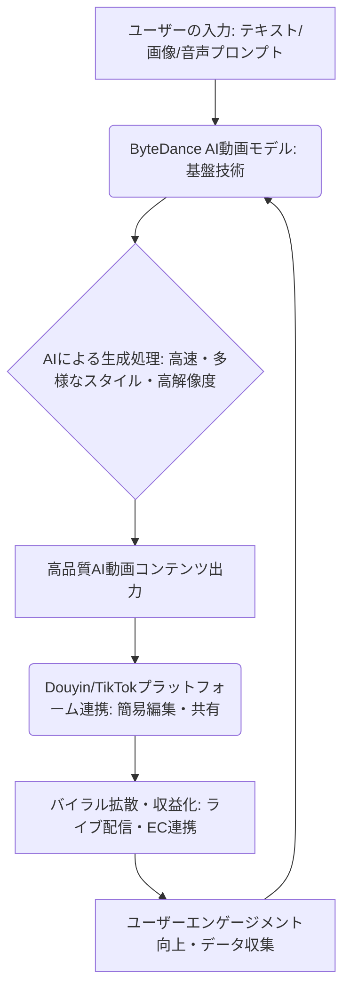

シリコンバレーのAI業界に身を置いて15年。これほどまでに市場の風景が劇的に変化する瞬間は、そう多くはありません。つい先日、OpenAIが突如として動画生成AI「Sora」のサービス終了を発表し、世界中が驚きと困惑に包まれました。半年足らずでの撤退という衝撃的なニュースは、まだ記憶に新しいでしょう。しかし、その「空席」を狙って、すでに次なる巨人が動き出しています。そう、中国のテクノロジー大手、**ByteDance**です。

彼らの新しいAI動画モデルが、いま中国国内で爆発的なバイラルヒットを記録し、「第二のDeepSeekモーメント」として世界中から注目を集めています。Soraが去った今、AI動画生成の覇権は一体誰の手に渡るのか。そして、その中でByteDanceがなぜ、これほどまでに存在感を放っているのか。今日の記事では、その深層に迫ります。

## ByteDance、AI動画市場の「空隙」を狙う戦略

OpenAIのSoraが短期間で市場から姿を消したことは、多くのクリエイターや企業にとって衝撃でした。その裏で、水面下で着実に力をつけていたのがByteDanceです。彼らが発表した新たなAI動画モデルは、リリース直後から中国のソーシャルメディアを席巻し、そのクオリティと手軽さで一気にユーザーの心を掴みました。まるでDeepSeekがかつてAI界に与えたような、既存勢力への強烈な一撃です。

Soraが示した技術的な可能性は確かに計り知れないものでしたが、そのサービス終了は、AI動画生成技術の実用化における課題、あるいはビジネスモデルの難しさを浮き彫りにしました。しかし、ByteDanceはそうした状況を冷静に見極め、自社の強みを最大限に活かす戦略で市場に切り込んできています。

彼らが特に優れているのは、既存の巨大なソーシャルメディアエコシステム、すなわちTikTok（中国ではDouyin）との連携です。動画生成と同時に、その動画が最も効果的に拡散され、収益化されるパスがすでに用意されている。これは、単に「すごい動画が作れる」という技術的な側面だけでなく、「作った動画がどう活用されるか」というユーザー体験全体をデザインしていることを意味します。この点において、ByteDanceは他の競合とは一線を画していると、編集部は見ています。

### ByteDanceのAI動画生成プロセスとエコシステム

ByteDanceのAI動画モデルがどのように機能し、なぜこれほどまでに効率的に市場に浸透しているのかを視覚的に理解するために、その高レベルなワークフローを図で示します。

この図が示すように、ByteDanceは単に「動画を作る」だけでなく、その動画がプラットフォーム上でいかにスムーズに消費され、コミュニティ内で価値を生み出すかまでを設計しています。この統合されたアプローチこそが、彼らの最大の武器なのです。

## なぜ今、ByteDanceのモデルが注目されるのか？技術的優位性と市場戦略

ByteDanceのAI動画モデルがなぜ「今」これほどまでに注目されるのか。その背景には、いくつかの明確な要因が存在します。

まず、**技術的な成熟度と安定性**です。Soraが「夢」を見せた一方で、ByteDanceのモデルは、より現実的な商用利用を意識した安定した生成能力を提供していると推測されます。具体的には、生成される動画の尺、一貫性、そして何よりも「バグの少なさ」が評価されている可能性があります。ユーザーが日常的に利用するSNS環境で、期待通りのアウトプットを安定して提供できることは、バイラル性を生む上で不可欠な要素です。

次に、**中国市場の特殊性とByteDanceの圧倒的な支配力**です。中国のインターネットユーザーは、新しい技術やサービスに対して非常に貪欲であり、特に動画コンテンツの消費量は世界でも群を抜いています。ByteDanceはDouyin（TikTokの中国版）を通じて、すでに膨大なユーザーベースと動画エコシステムを構築しており、この新たなAI動画モデルは、その既存のユーザーに対してシームレスに提供されました。結果として、学習コストを最小限に抑えつつ、すぐにバイラルコンテンツが生まれる土壌があったのです。この「最初から巨大なテストベッドがある」という環境は、欧米企業にはないByteDance独自の強みと言えるでしょう。

さらに、**「手軽さ」と「多様な表現力」のバランス**も重要です。単に複雑なプロンプト入力だけで動画を生成するのではなく、既存の素材（画像や短い動画クリップ）をAIが「解釈」し、よりリッチなコンテンツへと拡張するような機能も搭載されていると伝えられています。これにより、専門的なスキルを持たない一般ユーザーでも、AIの力を借りてクリエイティブな表現が可能になり、これがSNSでの拡散を加速させているのです。

## Sora撤退後の勢力図：誰が次の覇者となるのか？

Soraの撤退は、AI動画生成市場の競争環境を大きく変えました。これまでOpenAIが技術的な先頭ランナーと見なされていましたが、その不在が市場に大きな空白を生み出し、まさに「誰が次の覇者となるのか」という問いが現実味を帯びています。ByteDanceは、この空白に最も早く、そして最も効果的に手を差し伸べた企業の一つです。

しかし、もちろんByteDanceだけがこの市場を独占するわけではありません。他にも強力なプレイヤーが多数存在し、それぞれが独自の強みを持っています。例えば、長年にわたりクリエイター向けのAIツールを提供してきた**RunwayML**、Googleのエコシステムに組み込まれることで新たなユーザー層を開拓しようとする**Google**、そしてプロフェッショナルなクリエイティブワークフローにAIを統合する**Adobe Firefly**などが挙げられます。

編集部が注目するのは、各プレイヤーが「どのユーザー層」を狙い、「どのような価値」を提供するかに戦略の軸足を置いている点です。Soraは汎用的な「驚異的な技術デモ」でしたが、今後の市場では、より具体的な用途やユーザーニーズに特化したソリューションが求められるでしょう。

| 項目         | ByteDance (新モデル) | RunwayML              | Google (TV統合など) | Adobe Firefly          |
| :----------- | :------------------- | :---------------------- | :--------------------- | :--------------------- |
| **強み**     | 中国市場の浸透、既存SNSエコシステム、高速生成 | 先駆者、プロクリエイター向け、高度な編集機能 | エコシステム連携、手軽な利用、広範なユーザー基盤 | プロのワークフロー統合、商用利用、高品質 |
| **ターゲット** | 一般ユーザー、SNSクリエイター、インフルエンサー | プロ・セミプロクリエイター、映像制作会社 | 一般家庭ユーザー、デバイス連携 | プロのデザイナー・映像制作者、企業 |
| **特徴**     | SNS最適化、多様なスタイル、バイラル拡散性 | AIモーション、テキスト・画像からの動画生成、カスタマイズ性 | 直感的UI、家庭向け用途拡張、既存サービス連携 | 既存ツール（Premiere等）との連携、カスタムモデル |
| **懸念点**   | 国際展開における著作権・規制、データプライバシー | 学習コスト、大規模商用利用時のスケーラビリティ | 機能制限、生成品質の一貫性、GoogleのAI戦略の不透明さ | 費用、特化性、学習コスト |

この表を見ると、ByteDanceはまさに「SNSと一般ユーザー」という、これまでSoraが直接カバーしきれていなかった広大な市場を狙っていることが分かります。そして、その市場での成功は、コンテンツ作成から消費、拡散、そして収益化までを一貫してデザインする彼らの戦略に裏打ちされています。

## 日本企業が学ぶべきByteDanceの「スピードと市場嗅覚」

ByteDanceの事例は、日本の企業にとって非常に重要な教訓を含んでいます。それは、単に「優れた技術を開発する」だけでなく、「その技術をいかに市場に適合させ、迅速に展開し、ユーザーに価値を届けるか」という、ビジネス戦略全体の重要性です。

日本の企業はとかく、完璧なものを目指しすぎたり、国内外の規制対応に時間を要したりする傾向があります。しかし、ByteDanceは「まず市場に出し、ユーザーの反応を見ながら改善していく」という、シリコンバレー的なアジャイル開発の精神を、巨大企業としてのスケールで実践しています。彼らは、AI動画生成のような先端技術においても、このスピード感を一切失っていません。

また、ByteDanceは自社の強み、すなわちTikTok/Douyinという世界最大の動画プラットフォームを最大限に活用しました。技術開発とプラットフォーム戦略が不可分一体となっているのです。日本の企業がAI開発を行う際にも、自社の既存ビジネスや顧客基盤とAI技術をどのように結びつけ、シナジーを生み出すかを深く考える必要があります。単体で高性能なAIモデルを作るだけでなく、それを誰に、どのように、どんな形で提供すれば、最大のインパクトを生み出せるのか。この「市場嗅覚」が、まさにByteDanceの強みであり、日本企業が学ぶべき点です。

## 🧐 編集部の辛口オピニオン

Soraのサービス終了という衝撃的なニュースに、日本の多くの企業は「これでOpenAIの独走は止まる」とか「日本のAIにもチャンスが来る」といった淡い期待を抱いたかもしれません。しかし、現実は甘くありません。むしろ、中国のByteDanceが圧倒的なスピード感と市場理解度でAI動画生成の覇権を狙っていることに、私たちは戦慄すべきです。

彼らはSoraのように「すごいものを作って終わり」ではありません。自分たちの巨大なプラットフォームと連携させ、ユーザーが「いますぐ使いたくなる」形に落とし込み、瞬く間にバイラルコンテンツを生み出す仕組みを構築しています。日本の企業は、いつまで「高品質だが遅い」AI開発に終始するのでしょうか？「完璧なものを慎重に」という姿勢が、グローバル競争においては「周回遅れ」を意味することを、今こそ真剣に受け止めるべきです。

技術はあくまで手段であり、それをどうビジネスに繋げ、ユーザーに届けるかが勝負です。ByteDanceは、この鉄則をAI動画生成という最先端の領域で、世界に見せつけているのです。著作権や規制対応といった課題は確かに重要ですが、それらを盾にイノベーションのスピードを緩めていては、世界は待ってくれません。日本企業は、リスクを恐れず、迅速に市場へ投入し、ユーザーのフィードバックから学ぶ「アジャイルなAIビジネス開発」へと舵を切るべき時が来ています。でなければ、AI動画市場だけでなく、あらゆるAI活用の領域で、私たちは傍観者で終わってしまうでしょう。

## 💡 よくある質問（FAQ）

### Q: ByteDanceのAI動画モデルは、OpenAIのSoraと比較してどのような点で優れているのでしょうか？
A: Soraは技術デモとして驚異的なクオリティを示しましたが、ByteDanceのモデルは、既存のDouyin/TikTokエコシステムとのシームレスな連携と、そこでのバイラルコンテンツ生成、そして商用利用を強く意識した安定性、手軽さが最大の特徴です。技術的な「すごさ」だけでなく、「いかにユーザーが使いこなし、価値を生み出すか」という実用性と市場適合性で優位に立っていると言えます。

### Q: ByteDanceのモデルが国際市場、特に日本市場に参入する可能性はありますか？
A: ByteDanceは既にTikTokを通じて国際市場で強いプレゼンスを持っています。彼らのAI動画モデルがDouyinで成功を収めれば、その技術がTikTokを通じて国際市場に展開される可能性は十分にあります。その際、各国の著作権法やデータプライバシー規制への対応が鍵となりますが、そのインパクトは非常に大きいでしょう。

### Q: 日本企業がByteDanceのようなAI動画モデルに対抗するために、どのような戦略を採るべきでしょうか？
A: 単純な技術競争で ByteDance に勝つのは容易ではありません。日本企業は、特定のニッチなクリエイター層や業界に特化した高品質なAI動画ソリューションを提供するか、あるいは既存のコンテンツ産業やIP（知的財産）とAIを組み合わせることで、独自の価値を生み出す戦略を検討すべきです。また、市場への迅速な投入とユーザーからのフィードバックに基づいた改善サイクルを確立することが不可欠です。

## 🔗 関連ツール・サービス

*   **[RunwayML](https://runwayml.com/)** — テキストや画像から高品質な動画を生成できるプロ・セミプロ向けのAI動画生成プラットフォーム。
*   **[Adobe Firefly](https://www.adobe.com/sensei/generative-ai/firefly.html)** — Adobe製品群に統合され、既存のワークフローで画像や動画生成をAIで拡張する。
*   **[CapCut](https://www.capcut.com/)** — ByteDanceが提供する、AIを活用した手軽な動画編集アプリ。AI動画生成機能との連携も期待される。