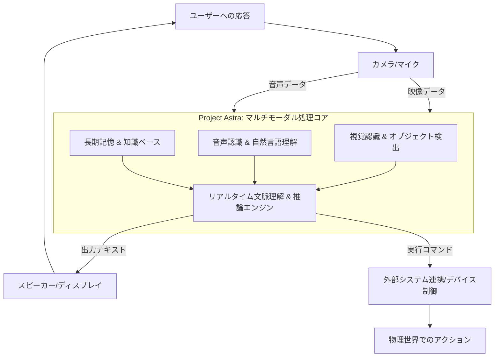

AIは、ついに「見る」「聞く」だけでなく、「理解し、行動する」領域へと踏み出しました。先日、Google DeepMindが公開した「Project Astra」は、まさにその宣言とも言えるでしょう。これは、単に高度な会話AIや画像生成AIの延長線上にあるものではありません。私たちの物理的な世界をリアルタイムで認識し、人間と自然に相互作用する能力を持つ、まったく新しいタイプのマルチモーダルAIエージェントの誕生を告げるものです。

この発表は、シリコンバレーのジャーナリストとして15年間、数多のAIの進化を見てきた私にとっても、その衝撃は大きいものがあります。私たちが夢見てきた「汎用人工知能（AGI）」への具体的なロードマップが、いま、Google DeepMindによって示されたと言っても過言ではありません。

## 「Project Astra」が変えるAIの概念

これまでのAIは、テキスト、画像、音声といった特定のモダリティ（形式）に特化し、それぞれの領域で驚異的な進歩を遂げてきました。例えば、ChatGPTのような大規模言語モデル（LLM）はテキスト生成と理解において、Soraのような生成AIは動画生成において、その能力をいかんなく発揮しています。しかし、これらのAIは、現実世界を「見て、聞いて、感じて」その文脈全体をリアルタイムで理解し、人間のように自然に対話する能力には限界がありました。

Project Astraは、この限界を打ち破るものです。カメラからの映像、マイクからの音声といった複数の入力源を同時に処理し、それらの情報を統合して「今、目の前で何が起きているか」をリアルタイムで把握します。その上で、人間からの指示や質問に対して、適切な推論を行い、行動へとつなげるのです。

### マルチモーダルAIの新たな地平

Astraが目指すのは、単なる情報の羅列ではありません。例えば、ユーザーがスマートフォンをかざし、「この機械の部品を交換したいんだけど、どれが必要かな？」と問いかけた場合、Astraは映像から機械のモデルを識別し、その場で必要となる部品の種類を特定し、さらにその交換手順を口頭で説明するといった一連の動作を、まるでベテランのエンジニアが隣にいるかのように実行します。

このような機能は、従来のAIのフレームワークでは実現が困難でした。視覚情報と音声情報を同期させ、その瞬間の文脈に基づいた推論を高速に行うには、根本的に異なるアーキテクチャと処理能力が求められます。Astraは、まさにこのギャップを埋める技術として登場したのです。

## 実世界理解AIの技術的ブレークスルー

Project Astraの最も驚異的な点は、そのリアルタイム処理能力と、複数の感覚モダリティを横断的に統合する深層学習アーキテクチャにあります。これは、単に「画像を見て、テキストを生成する」といった一方向的な処理とは一線を画します。

### リアルタイム処理と文脈理解の壁を破る

Astraは、カメラからの映像ストリームとマイクからの音声入力をほぼ同時に処理し、遅延なく応答します。このリアルタイム性は、人間が実世界でコミュニケーションを取る上で不可欠な要素です。例えば、人間同士の会話では、相手の表情や身振り手振り、周囲の環境音といった非言語情報が、言葉の意味を補強し、文脈を形成します。Astraは、この人間の認知プロセスに近い形で、デジタル情報を「文脈」として理解し、適切な反応を生成します。

これは、単に処理速度が速いというだけでなく、複数のモダリティから得られた情報を、脳内の異なる領域が連携して処理するのと同様に、一つの統合されたモデル内で意味のある関連付けを行う能力を意味します。この技術的進化は、AIが単なるツールから、より賢い「パートナー」へと昇格する転換点となるでしょう。

### 長期記憶と推論能力の融合

Astraのもう一つの重要な特徴は、単発の質問応答にとどまらず、過去のインタラクションや得られた知識を「記憶」し、それを現在の状況に適用する能力です。これは「エピソード記憶」と「長期記憶」を組み合わせたようなもので、AIエージェントがより複雑なタスクをこなしたり、時間の経過とともにユーザーの好みや行動パターンを学習したりする上で不可欠です。

例えば、ある日、Astraに「コーヒーの淹れ方を教えて」と尋ね、翌週には「この前のコーヒーの淹れ方で、今度はもう少し濃いめにしたい」と指示した場合、Astraは前回の情報と今回の要望を組み合わせ、具体的な調整方法を提案できるかもしれません。このような能力は、単なる知識データベースの検索とは異なり、深い推論と学習に基づいています。

| 特徴            | 従来のマルチモーダルAI                      | Project Astra                                      |
| :-------------- | :------------------------------------------ | :------------------------------------------------- |
| **処理速度**    | やや遅延、バッチ処理が主                    | リアルタイム処理、瞬時応答                         |
| **モダリティ統合** | 逐次的または部分的、限定的な連携              | 複数モダリティ（視覚・聴覚）の同時かつ密接な統合 |
| **文脈理解**    | 短期的、指示ベースの理解                      | 長期的記憶と状況に応じた深い文脈理解             |
| **推論能力**    | 事前学習モデルに依存、限定的                  | 複数の情報源からの複合的な推論、適応的             |
| **実世界インタラクション** | 限定的、特定のセンサーに特化                  | 汎用的な環境認識と自然な対話                       |
| **記憶能力**    | 短期記憶、セッション単位                      | 長期記憶、エピソード記憶の保持                     |

## Astraが拓く未来の応用可能性

Project Astraの登場は、様々な産業や私たちの日常生活に計り知れない影響をもたらす可能性を秘めています。

### 次世代パーソナルアシスタントの姿

まず、最も身近な変化として考えられるのは、パーソナルアシスタントの進化です。現在のAIアシスタントは、主に音声コマンドに基づいて動作し、限られた情報にアクセスします。しかし、AstraのようなAIエージェントは、私たちの周囲の環境を認識し、よりプロアクティブな支援を提供できるようになるでしょう。

例えば、料理中に手が離せない時、Astraを搭載したデバイスに「冷蔵庫にあるものとこのレシピで、次に何をするべきか教えて」と尋ねれば、Astraは冷蔵庫の中身を認識し、レシピの指示と照らし合わせ、適切な次のステップを映像と音声で指示してくれるかもしれません。また、外出先で迷子になった際も、周囲の景色を認識し、最適な道順を視覚的に示しながら案内するといった、SF映画のような体験が現実のものとなるでしょう。

### 産業界への波及効果

産業界においても、Astraの技術は大きな変革をもたらす可能性があります。
製造業では、熟練工の作業をAIがリアルタイムで学習し、新入社員へのOJT（On-the-Job Training）を支援したり、複雑な機器のメンテナンス手順をAIが視覚的にガイドしたりするシステムが実現するかもしれません。医療現場では、医師の診断をサポートするために、AIが患者の様子や検査画像をリアルタイムで分析し、追加の視点を提供する。教育分野では、生徒の学習状況を多角的に把握し、個別最適化された指導をAIが行うことも考えられます。

これらの応用は、単に効率化を進めるだけでなく、これまで人間が行っていた高度な専門知識を要する作業を、AIが補完、あるいは代替する可能性を示唆しています。

## 汎用人工知能（AGI）への道標か？

Google DeepMindは、Project Astraを「究極の汎用AIエージェントへの大きな一歩」と位置付けています。実世界からの多様な情報を統合し、文脈に基づいて理解し、推論し、行動するという一連のプロセスは、まさにAGIが目指す「人間のような知能」のコアとなる要素です。

しかし、AGIへの道は依然として長く、困難な道のりです。Astraは視覚と聴覚の統合に焦点を当てていますが、触覚や嗅覚といった他の感覚モダリティ、さらには感情認識や社会性といったより複雑な要素をAIがどのように獲得していくのか、という課題が残されています。また、AIが自己学習を通じて、人間が意図しない行動を取る可能性や、その判断の根拠が不透明になる「ブラックボックス問題」も、常に議論されるべき重要なテーマです。

### 倫理的課題とガバナンスの必要性

実世界に介入し、私たちの生活に深く入り込むAIエージェントの登場は、倫理的な課題とガバナンスの必要性を一層高めます。プライバシーの侵害、データセキュリティ、AIによる誤判断のリスク、そして人間とAIの関係性そのものが再定義される可能性もあります。

編集部で特に注目したのは、AstraのようなAIが普及するにつれて、私たちの「認知能力」や「意思決定プロセス」にどのような影響を与えるかという点です。あまりにも完璧なアシスタントが存在することで、人間自身の思考力や問題解決能力が低下する、あるいはAIに過度に依存してしまうといった「AI依存症」のような問題も懸念されます。技術の進歩と並行して、その社会的影響を深く考察し、適切なルール作りを進めることが急務となります。

## 🧐 編集部の辛口オピニオン

Project Astraの発表は、確かに技術的なブレークスルーであり、未来への期待感を掻き立てるものです。しかし、日本企業がこれを「SFの世界の話」と傍観しているようでは、手痛いしっぺ返しを食らうことになるでしょう。正直に言えば、現状の日本企業は、AIの「活用」フェーズでさえ、世界に遅れをとっているケースが散見されます。そこにきて、Google DeepMindはすでに「実世界理解AI」という、次の地平線をはっきりと示しているのです。

特に危機感を持つべきは、製造業やサービス業、そして高齢化が進む日本社会において、この種のAIが持つポテンシャルを全く見極められていない企業群です。単なる業務効率化に留まらず、顧客体験の根本的な変革、労働力不足への抜本的な解決策、そして新たなビジネスモデルの創出に、AstraのようなAIは直結します。

日本企業は、往々にして「完璧なソリューション」を待つ傾向があります。しかし、AIの進化は待ったなしであり、今すぐにでも**「Project AstraのようなAIが自社のビジネスにどのような破壊的影響をもたらすか」**、そして**「どのようにすればこの技術を自社独自の競争優位に変えられるか」**を真剣に議論し、具体的なPoC（概念実証）に着手すべきです。

「うちはまだ早い」とか「倫理的な問題が…」などと言い訳をしている間に、欧米や中国の企業は、この種のAIを武器に、さらにリードを広げていくでしょう。この「実世界AI」の波に乗り遅れることは、単なる機会損失ではなく、グローバル市場からの**“退場勧告”**に等しいと、私はあえて強く警告しておきます。現状維持は、もはや後退です。

## 💡 よくある質問（FAQ）

### Q: Project Astraはいつ頃、一般ユーザーが利用できるようになりますか？
A: Google DeepMindは具体的な提供時期を明言していませんが、デモンストレーション動画の完成度から見て、数年以内には何らかの形で開発者向け、あるいは特定のアプリケーションでの提供が始まる可能性が高いと考えられます。既存のGeminiモデルへの統合も示唆されており、段階的な展開が予想されます。

### Q: Astraのような実世界理解AIは、既存のAIアシスタント（例：Siri、Google Assistant）と何が違うのですか？
A: 既存のアシスタントは、主に音声コマンドとインターネット上の情報に基づいて応答しますが、Astraはカメラやマイクを通じて**物理的な環境をリアルタイムで認識し、その文脈を深く理解する**能力を持っています。これにより、目の前のオブジェクトについて質問したり、複雑な状況に基づいた指示をしたりすることが可能になり、より人間らしい対話と行動が期待できます。

### Q: Astraの技術は、どのような分野で最も大きな影響を与えると考えられますか？
A: 製造現場での作業支援、医療現場での診断サポート、教育分野での個別指導、さらには家庭でのパーソナルアシスタントやスマートホームデバイスの制御など、**物理的な環境でのインタラクションが求められるあらゆる分野**で大きな影響を与えると考えられます。特に、人間の視覚・聴覚・判断能力を高度に補完・拡張する形で利用が進むでしょう。

## 🔗 関連ツール・サービス

**Google Gemini (Google AI Studio)** — Googleが提供するマルチモーダルなAIモデルを試せる開発者向けプラットフォームです。
**NVIDIA Isaac Sim (NVIDIA)** — ロボティクスのシミュレーションとAI開発に特化したプラットフォームで、実世界でのAIエージェントの挙動を検証するのに役立ちます。
**Hugging Face (Hugging Face)** — 大規模言語モデルやマルチモーダルモデルを含む多様なAIモデルが公開されており、Astraのようなエージェント開発の基盤となる技術を探索できます。
**Unity (Unity Technologies)** — リアルタイム3D開発プラットフォームで、Astraのような実世界とインタラクトするAIエージェントの視覚的表現や環境構築に応用可能です。