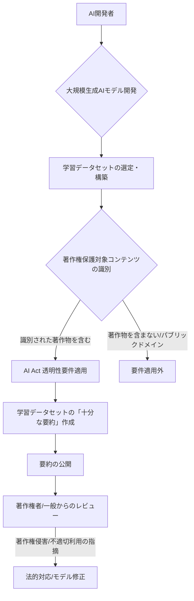

AIの進化が加速する現代において、その基盤となる「学習データ」の取り扱いは、単なる技術的な課題を超え、世界中の法制度と経済活動を揺るがす喫緊のテーマとなっています。特に、欧州連合（EU）が採択した「AI Act（AI法）」は、AIガバナンスの国際基準となり得るその包括性から、シリコンバレーのみならず、日本を含む世界のAI業界から熱い視線が注がれています。

その中でも、特に日本のAI開発企業にとって無視できないのが、**「テキスト・データマイニング（TDM）例外」と「透明性要件」**という、一見すると相反するように見える2つの重要な規定です。これらの規定は、AIの学習における著作物の利用を巡り、著作権者とAI開発者の間で新たな攻防の火蓋を切ったと言えるでしょう。このEUの「AI著作権のプレイブック」は、日本企業がグローバル市場で戦う上で、どのような戦略的意味合いを持つのでしょうか。

## EU AI Actが切り開く「著作権問題」の新局面

生成AIの爆発的な普及は、その学習に用いられる膨大なデータ、特にインターネット上にある著作物との関係を巡って、深刻な法的・倫理的議論を巻き起こしました。著作権者からは、許諾なしの学習利用は著作権侵害であるとの主張が相次ぎ、AI開発者からは、AI開発の自由とイノベーションの阻害を懸念する声が上がっています。この世界的なジレンマに対し、EU AI Actは、独自の、そして時に矛盾を孕むアプローチを示しました。

EU AI Actにおける**「TDM例外」**は、特定の条件下でAI開発者が著作権者の許諾なく著作物を学習に利用することを認めるものです。これは、EU著作権指令（Digital Single Market Directive）に既にあるTDM例外をAI開発に拡大適用したもので、研究目的だけでなく商業目的のAI学習にも適用されます。しかし、この例外には重要なただし書きがあります。それは、著作権者が**「オプトアウト（利用拒否）」**する権利を持つという点です。つまり、著作権者は自分のコンテンツがAIの学習に利用されることを明確に拒否できるのです。

この規定は、著作権者にとって一筋の光明となり得る一方で、AI開発者にとっては新たな法務上の負担となりかねません。コンテンツプロバイダーはウェブサイトやAPIを通じて、利用規約やメタデータにオプトアウトの意思を明示することで、自らのコンテンツをAI学習から保護することが可能です。これにより、例えばニュースメディアや出版社、アーティストなどのコンテンツホルダーは、AIによる無償利用の脅威から一定程度身を守る手段を得ることになります。しかし、その「オプトアウトの意思表示」がどこまで、どのように行われるべきか、その具体的なガイドラインはまだ発展途上にあり、法的解釈の余地を残しています。

AI開発者からすれば、オプトアウトされたコンテンツを避けながら学習データセットを構築することは、技術的にも管理上も複雑さを増すことを意味します。高品質な学習データを確保しつつ、膨大なウェブ上のコンテンツ一つ一つに対しオプトアウトの有無を確認し、対応する作業は、特に中小規模のAIスタートアップにとっては大きな足かせとなり得るでしょう。

## 学習データの「透明性」が問うAIの倫理

TDM例外と並び、EU AI Actが重視するのは**「透明性要件」**です。これは、特定の「ハイリスクAIシステム」（例えば、医療診断や採用活動など人間に重大な影響を与えるAI）や、特に「大規模生成AIモデル」の開発者に対し、そのAIモデルの学習に使用した著作権保護対象コンテンツの概要（**「十分な要約」**）を公開することを義務付けるものです。

この要件の意図は明確です。AIが何を学習し、どのようなデータに基づいて判断や生成を行っているのかを明らかにすることで、AIシステムの信頼性を高め、著作権侵害のリスクを軽減し、ひいてはAIの倫理的な利用を促進することにあります。著作権者にとっては、自分の作品がAIの学習に利用されたかどうかを確認し、もし不当な利用があれば異議を申し立てるための重要な手がかりとなります。

しかし、この「十分な要約」が具体的に何を指すのか、その曖昧さは業界内で大きな議論を呼んでいます。学習データセット全体を公開することは事実上不可能であり、また著作権保護の観点からも問題があります。一方で、あまりにも抽象的な要約では、透明性の目的を達成できません。例えば、特定の出版社から許可なく利用されたコンテンツのリストを詳細に開示するのか、それともジャンルやカテゴリレベルでの開示で十分なのか。この線引きは極めて難しく、AI開発者にとっては、どこまでの情報開示が「十分」とみなされるのか、常に法的リスクと隣り合わせで判断を迫られることになります。

編集部で特に注目したのは、この要件が**「著作権保護対象コンテンツ」**に限定されている点です。つまり、パブリックドメインのデータや、フリーライセンスのデータについては、この要件は適用されません。しかし、インターネット上のコンテンツは、著作権の有無が必ずしも明確でない場合が多く、この区別自体がAI開発者にとって大きな負担となり得ます。

### 学習データ透明性要件のワークフロー

## TDM例外と透明性要件：二律背反のジレンマ

TDM例外と透明性要件は、AIの著作権問題を巡るEUの複雑な姿勢を象徴しています。TDM例外がAI開発の自由をある程度担保する一方で、著作権者にはオプトアウト権という「逃げ道」を残し、さらに透明性要件でその学習データ利用の実態を明らかにさせる。これは、**イノベーションの促進と著作権保護の強化という、異なる価値観の板挟みになったEUの苦悩**そのものと言えるでしょう。

このEUのアプローチは、米国や日本など他国の動向と比較すると、より厳格かつ詳細な規制を目指していることが分かります。

| 国/地域 | AI学習データの著作権アプローチ | TDM例外の有無 | 透明性要件 | オプトアウト権 |
|---|---|---|---|---|
| **EU** | AI Actにより明確化。TDM例外と透明性要件を両立。 | あり（広範） | あり（要約公開） | あり |
| **米国** | フェアユース原則が中心。判例による解釈が主流。 | 判例による | 明確な規定なし | なし（フェアユース判断による） |
| **日本** | 著作権法30条の4で非享受目的利用を認める。 | あり（限定的） | 明確な規定なし | なし |
| **中国** | 草案でAI生成物の著作権保護、学習データの許諾要求。 | なし（原則許諾） | あり（学習データ源の明示） | なし（許諾が原則） |

上記の表から読み取れるように、EUはTDM例外を認めつつも、著作権者のオプトアウト権と透明性要件によって、AI開発者に対して強い説明責任と管理義務を課しています。これは、AI開発における著作権侵害のリスクを低減し、コンテンツクリエイターの権利を保護しようとする強い意志の表れです。

対照的に、米国ではフェアユース原則の適用範囲が広く、AI学習における著作物の利用が許容されるケースも多いと見られています。また、日本は著作権法30条の4により、著作物の享受を目的としない利用（TDMなど）を比較的広く認めており、現時点では学習データの透明性に関する明確な義務は存在しません。中国は、EUとは異なる形で許諾主義を強化し、学習データの出所明示を求めるなど、独自のアプローチを取っています。

このように、各国・地域でAI学習データの著作権に対するアプローチが大きく異なることは、**「AIのパスポート問題」**とも呼ばれる、グローバルなAIサービス展開における法的な複雑性を増幅させています。AI開発企業は、事業展開する地域ごとに異なる法規制に適応するための、きめ細やかな法務戦略が不可欠となります。

## 日本企業に突きつけられる国際法務戦略

EU AI Actが正式に施行されれば、その影響はEU域内に留まらず、EU市場にアクセスしようとする世界中のAI開発企業に及ぶことになります。特に、ハイリスクAIシステムや大規模生成AIモデルを開発・提供する日本企業は、このTDM例外と透明性要件に対し、早急に対応を迫られるでしょう。

まず、日本のAI開発企業は、自社のAIモデルがどのようなデータセットで学習されているのかを徹底的に精査し、その中にEU域内の著作権保護対象コンテンツが含まれていないかを確認する必要があります。もし含まれている場合、著作権者がオプトアウト権を行使しているかどうかを把握し、それらのコンテンツを学習から除外するか、あるいは別途許諾を得るなどの対応が求められます。これは、既存のAIモデルに対しても遡及的に適用される可能性があり、データガバナンスの体制強化は喫緊の課題です。

次に、透明性要件に対応するため、「十分な要約」をどのように作成し、公開するかの戦略を練る必要があります。これは単なる情報開示だけでなく、AIモデルの信頼性やブランドイメージにも直結する問題です。曖昧な開示は法的リスクを高めるだけでなく、ユーザーや著作権者からの不信感を招くことにもなりかねません。

### 日本企業が検討すべき対策

*   **データガバナンスの強化**:
    *   学習データセットに含まれるコンテンツの出所、ライセンス、著作権保護状況を詳細に記録するシステムの導入。
    *   TDM例外のオプトアウトリストを定期的にチェックし、学習データから該当コンテンツを除外するプロセスを確立。
*   **法務部門との連携**:
    *   EU AI Actの最新のガイドラインや判例を常に把握し、自社のAI開発プロセスが法規制に準拠しているかを確認。
    *   「十分な要約」の法的解釈について、専門家を交えた議論と基準設定。
*   **技術的対策の検討**:
    *   オプトアウトされたコンテンツを自動的に識別・除外する技術の開発や導入。
    *   学習データの来歴（データリネージ）を追跡可能なシステムの構築。
*   **国際的なパートナーシップ**:
    *   EU域内の法務専門家やコンプライアンス企業との連携を強化し、現地の法規制への適応を支援。
    *   業界団体を通じて、透明性要件に関する共通のベストプラクティス確立に貢献。

このEUの動向は、単に「手間が増える」というレベルの話ではありません。それは、AIを開発し、運用する企業にとっての**「新たなコストセンター」**を意味し、同時に**「倫理と信頼」という競争優位性**を生み出す可能性も秘めているのです。

## 🧐 編集部の辛口オピニオン

EU AI ActのTDM例外と透明性要件は、日本のAI業界に冷水を浴びせかねない。正直なところ、この複雑な規制の網の目を「他人事」と捉えている企業は少なくないのではないか。しかし、これは単なるEU圏内だけの問題ではない。**「AIは著作権者を泣き寝入りさせない」というEUの強いメッセージ**は、グローバルなAIガバナンスの潮流を決定づける可能性を秘めている。

日本の企業は、これまで比較的緩やかな著作権法30条の4の恩恵を受け、AI開発における学習データ調達に関して、ある種の「楽観主義」に浸ってきたフシがある。しかし、このEUの動きは、その甘えを許さない。**「自社のAIが何を学習したか、本当に説明できるのか？」**という問いに、多くの日本企業は明確な答えを出せないだろう。

特に危機感を覚えるのは、中堅・中小のAIスタートアップだ。大企業は潤沢な資金と法務部門で対応できるかもしれないが、リソースの限られたスタートアップにとって、この複雑なコンプライアンスは新たな「参入障壁」となる。最悪の場合、EU市場を諦めるか、あるいは知らず知らずのうちに法を犯し、重大なペナルティを課されるリスクに直面する。これは、日本のAIイノベーションの国際競争力を削ぎかねない。

今こそ、日本企業は**「攻めのコンプライアンス」**に転じるべきだ。単にEUの規制を遵守するだけでなく、それを逆手にとって「高い倫理基準を持つAI」として自社の競争優位性を確立するチャンスと捉えるべきだ。学習データの透明性を積極的に開示し、著作権者との共存モデルを模索する企業こそが、次世代のグローバルリーダーとなるだろう。そうでなければ、日本のAIは、国際社会の「周回遅れ」を永久に埋められないかもしれない。

## 💡 よくある質問（FAQ）

### Q: TDM例外が認められる場合でも、著作権者は何かできるのか？

A: はい。EU AI ActのTDM例外は、著作権者が自らのコンテンツのAI学習利用を「オプトアウト（利用拒否）」する権利を明確に認めています。著作権者は、ウェブサイトの利用規約やメタデータ、あるいはAPIを通じて、AIによるデータマイニングを拒否する意思を明示することができます。AI開発者は、このオプトアウトリストを確認し、該当コンテンツの学習利用を停止する義務を負います。

### Q: 「十分な要約」とは具体的に何を指すのか？

A: 「十分な要約」の具体的な範囲については、AI Actの施行規則や今後のガイドライン、判例によって詳細が定まっていくと考えられます。現時点では、学習データセットに含まれる著作権保護対象コンテンツのジャンル、種類、主要な出所などを網羅しつつも、著作権者の権利を侵害しない範囲での概要説明が求められると解釈されています。個々の著作物をリストアップするのではなく、例えば「〇〇社のニュース記事、〇〇出版社の書籍、〇〇アーティストの音楽コンテンツを含む」といった形が想定されますが、その粒度は今後の議論に委ねられます。

### Q: 日本のAI開発企業は、具体的にどのような対策を講じるべきか？

A: 日本のAI開発企業は、まず自社のAIモデルが学習しているデータセットの出所を徹底的に棚卸し、EU域内の著作権保護コンテンツが含まれていないかを確認すべきです。含まれる場合は、著作権者がオプトアウトしているかを確認し、除外または別途許諾取得のプロセスを構築します。また、将来的な透明性要件に備え、学習データの「十分な要約」を作成・公開するためのデータガバナンス体制と情報開示戦略を策定することが急務です。専門の法務コンサルタントやリーガルテックツールを活用し、国際的な法規制への対応力を高めることも重要です。

## 🔗 関連ツール・サービス

**[Copyleaks AI Content Detector](https://copyleaks.com/ai-content-detector)** — AIが生成したコンテンツか、あるいは著作権侵害の可能性を検出するツールです。
**[Fathom Analytics](https://usefathom.com/)** — プライバシーに配慮し、EUのGDPRにも対応したウェブ解析ツールで、オプトアウト設定にも役立つデータを提供します。
**[Termly](https://www.termly.io/)** — 各国のプライバシー規制（GDPR、CCPAなど）に対応したプライバシーポリシーや利用規約の生成・管理を支援するプラットフォームです。
**[BigID](https://bigid.com/)** — 企業内の膨大なデータの中から個人情報や機密データを特定し、規制遵守を支援するデータガバナンスプラットフォームです。