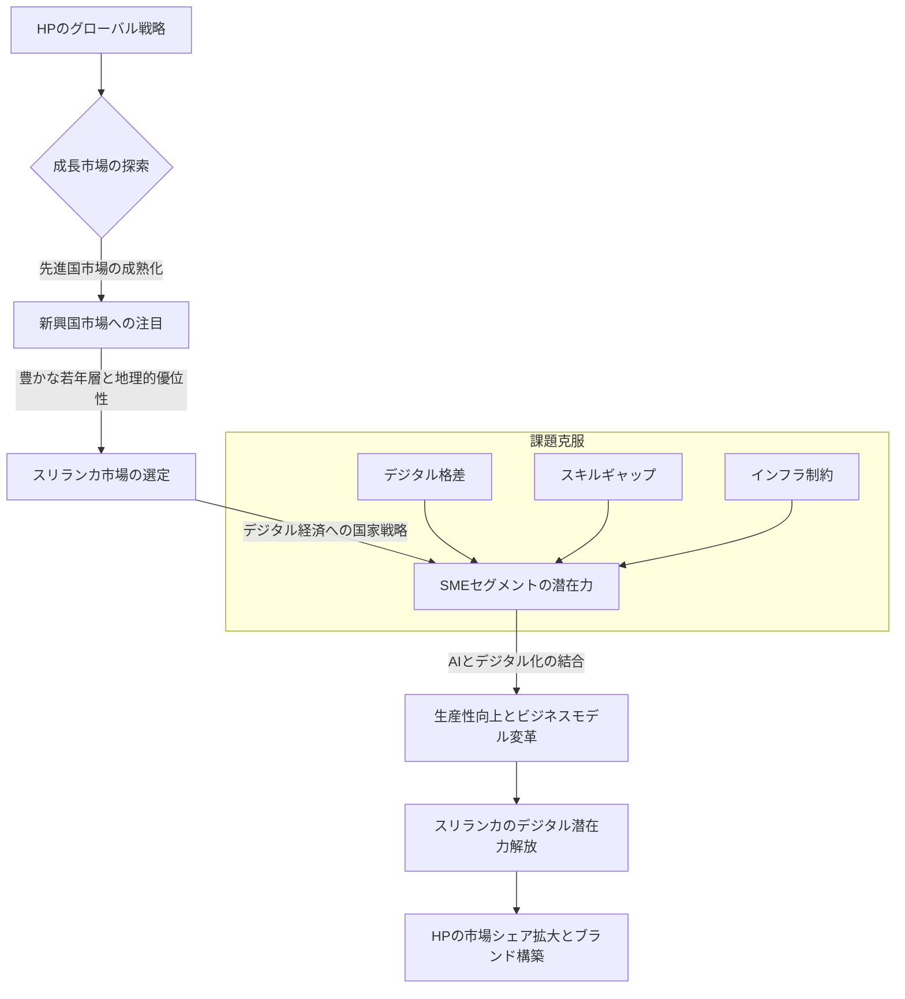

シリコンバレーの巨人が、新たな成長のフロンティアを求めて目を向ける先はどこか。多くの視線が先進国の成熟市場に集中する中、HPがスリランカの中小企業（SME）をターゲットに、AIとデジタル化で「潜在能力を解き放つ鍵」と見定めたというニュースは、まさに現在のグローバルAI戦略の地殻変動を示唆しています。この動きは単なる企業戦略を超え、新興国市場におけるAIの役割、そして日本企業が世界で戦う上での新たな視点を提供するものです。

### HPがスリランカに注ぐ視線：なぜ今、新興国SMEなのか

大手テクノロジー企業であるHPが、スリランカという特定の新興国市場、そしてその中でも特に中小企業（SME）層に焦点を当て、AIとデジタル化を推進するという報道は、多くの示唆を含んでいます。Daily Mirror Sri Lankaが2026年3月4日付で報じたこのニュースは、一見するとローカルな話題に見えるかもしれません。しかし、私が長年シリコンバレーの動向を追う中で培ってきた肌感覚からすれば、これはグローバルなAI戦略における重要なトレンドの一端を捉えたものです。

なぜ今、HPはスリランカのSMEなのでしょうか。その背景には、先進国市場の成長鈍化と、新興国市場が秘める爆発的なデジタル化の潜在能力があります。スリランカは、近年経済的な困難に直面しつつも、ITスキルを持つ若年層が豊富であり、地理的にも戦略的な位置にある島国です。政府もデジタル経済への移行を国家戦略として掲げており、まさにデジタル変革の「黎明期」にあると言えます。

シリコンバレーの企業は常に、次の「大きな波」を見極めようとしています。HPにとって、スリランカのSMEは、未開拓の巨大な市場であり、AIとデジタルソリューションを導入することで、一気に生産性を向上させ、経済全体を押し上げる可能性を秘めているのです。先進国ではすでに多くの企業がデジタル化を進め、AI導入も進んでいますが、新興国では「デジタル・リープフロッグ」、つまり既存の段階を飛び越えて最新技術を一気に導入する機会があります。HPは、この大きな可能性に賭けていると見ています。

また、AIが「コモディティ化」し、特定の先進技術だけでなく、日常的なビジネスツールとして普及する段階に入ったことも大きいでしょう。クラウドベースのAIサービスや、ローコストで導入できるSaaS型AIソリューションの登場により、これまで技術的・資金的にAI導入が困難だった中小企業にも、その恩恵が届き始めています。HPは、こうした汎用性の高いAIソリューションをハードウェアと組み合わせることで、スリランカのSMEのニーズに応えようとしているのではないでしょうか。

### デジタル格差とAI活用のリアリティ：スリランカの現状

スリランカにおけるHPのAI戦略を理解するには、現地のデジタル環境と中小企業が直面するリアリティを深く掘り下げることが不可欠です。確かに、スリランカはデジタル化への意欲が高い国ですが、その道のりには無視できない課題が山積しています。

まず、**インフラの課題**です。高速インターネットアクセスは都市部では普及しつつありますが、地方部ではまだまだ限定的であり、安定した電力供給も常に保証されているわけではありません。AIソリューション、特にクラウドベースのAIサービスを利用するには、堅牢な通信インフラが不可欠です。HPがどのような形でこのインフラ格差を乗り越えようとしているのか、あるいは現地企業との連携を通じて解決策を探るのかは、今後の注目点となるでしょう。

次に、**デジタルリテラシーとスキルギャップ**です。SMEの経営者や従業員の中には、最新のデジタルツールやAI技術に馴染みが薄い層が少なくありません。新しい技術を導入するだけでなく、それを使いこなし、ビジネス成果につなげるための教育やトレーニングが不可欠です。HPは、単に製品を販売するだけでなく、現地パートナーと協力してユーザー教育プログラムを提供することになるかもしれません。これは、単なる営業活動ではなく、まさに「市場を育成する」という長期的な視点での投資と言えます。

さらに、**資金制約**も大きな障壁です。新興国のSMEにとって、先進的なAIソリューションの導入費用は決して安価ではありません。HPが提供するソリューションが、初期投資を抑えつつ、すぐにビジネスの成果に結びつくような、コストパフォーマンスの高いものである必要があります。例えば、サブスクリプション型のクラウドAIサービスや、既存のHPハードウェアにバンドルされた形で提供することで、導入の敷居を下げる戦略が考えられます。

しかし、これらの課題を上回る**機会**も存在します。スリランカの若年層はテクノロジーに対する適応力が高く、SNSなどのデジタルツールを日常的に利用しています。彼らがビジネスの世界に入れば、AI活用の担い手となる可能性を秘めているのです。また、既存のレガシーシステムが少ない分、最新のクラウドネイティブなAIソリューションをゼロから導入しやすく、効率的なデジタル変革が期待できます。例えば、顧客サポートの自動化、在庫管理の最適化、マーケティングのパーソナライズなど、AIが即座に価値を提供できる領域は多岐にわたります。

この状況を理解することで、HPが単なる利益追求だけでなく、スリランカ社会全体のデジタル成熟度を高めるという、より大きなビジョンを持っている可能性が見えてきます。これは、サステナビリティと企業の社会貢献（CSR）の観点からも、非常に重要な取り組みと言えるでしょう。

### AIとSMEの可能性：HPの具体的なアプローチとは

HPがスリランカのSMEにAIを導入する際、どのような具体的なアプローチを取るのかは、成功の鍵を握る部分です。報道からはまだ詳細な戦略は明らかになっていませんが、これまでのシリコンバレー企業の動向や新興国市場の特性を踏まえると、いくつかの方向性が考えられます。

まず、**「AI対応型デバイス」の提供**が考えられます。HPはPCやプリンターなどのハードウェアメーカーとしての強みを持っています。AIを動かすには相応の処理能力が必要ですが、クラウドAIだけでなく、エッジAIやオンデバイスAIの活用も進んでいます。HPは、AIワークロードを効率的に処理できる高性能なPCやワークステーションをSME向けに提供し、そこにローカルで動作するAIアプリケーションや、クラウドAIサービスとの連携機能をプリインストールする可能性があります。これにより、インターネット接続が不安定な環境でも一部のAI機能を利用できるようにするでしょう。

次に、**「業種特化型SaaSソリューション」の展開**です。SMEのニーズは多岐にわたりますが、多くの場合、顧客管理（CRM）、会計、在庫管理、マーケティングといった共通の業務課題を抱えています。HPは、これらの業務をAIで効率化するSaaS（Software as a Service）型ソリューションを、スリランカのSME向けにカスタマイズして提供する可能性があります。例えば、AIを活用したチャットボットによる顧客サポートの自動化、売上予測の精度向上、パーソナライズされた広告配信などが考えられます。これらは初期投資を抑えつつ、サブスクリプションモデルで提供することで、SMEにとって導入しやすい形となるでしょう。

HPが提供するであろうソリューションの具体的な例として、以下のようなものが挙げられます。

*   **AI駆動型デザイン・マーケティングツール**: スリランカのSMEが自社の製品やサービスをより魅力的に見せるための、AIによるロゴ作成、広告文生成、ソーシャルメディアコンテンツ作成支援。
*   **サプライチェーン最適化AI**: 在庫レベルの予測、需要変動への対応、物流ルートの最適化など、SMEのサプライチェーン全体をAIで効率化。
*   **スマートなセキュリティソリューション**: AIを活用したサイバーセキュリティ対策で、SMEが直面するデータ侵害のリスクを低減。
*   **AIアシスタント搭載コラボレーションツール**: 会議の議事録自動作成、タスク管理支援、多言語コミュニケーション支援など、SME内の生産性向上。

これらのアプローチは、単に最新技術を導入するだけでなく、スリランカのSMEが直面する具体的な課題解決に直結し、彼らがビジネスを成長させるための実用的なツールとなることを目指しているはずです。HPが持つグローバルな知見と、現地のパートナーシップを組み合わせることで、地域に根ざした独自のAIエコシステムを構築しようとしているのかもしれません。

### 新興国市場におけるAI戦略のグローバルな潮流

HPのスリランカSME向けAI戦略は、実はより広範なグローバルな潮流の一部を形成しています。先進国のAI市場が成熟期に入りつつある一方で、新興国市場はAI普及の新たなフロンティアとして、世界中のテクノロジー企業の注目を集めているのです。このトレンドを理解することは、日本企業が国際市場で生き残る上でも極めて重要です。

いくつかのポイントが挙げられます。

1.  **「ローカライゼーション」の重要性**: 新興国市場では、技術の導入だけでなく、言語、文化、経済状況、法的枠組みに合わせた徹底したローカライゼーションが不可欠です。AIモデルの学習データも現地の言語や習慣を反映している必要があり、UI/UXも現地のユーザーが直感的に使えるデザインでなければなりません。HPも、スリランカのSMEの具体的なニーズを深く理解し、それに合わせたソリューションを提供しようとしているはずです。
2.  **インフラの制約下でのAI展開**: 先進国のような高速・安定したインターネット環境が常に利用できるわけではないため、オフラインでも一部機能が使えるエッジAIソリューションや、通信帯域を節約できる軽量なAIモデルが求められます。また、スマートフォンベースのAIソリューションも非常に有効です。
3.  **社会課題解決型AIの需要**: 新興国では、医療、教育、農業、災害対策といった分野でAIを活用した社会課題解決への期待が非常に高いです。HPのSME戦略も、間接的に雇用創出や経済成長に貢献することで、社会全体にポジティブな影響を与える可能性があります。
4.  **国際機関や政府との連携**: 新興国でのAI普及には、世界銀行、国連開発計画（UNDP）のような国際機関や、現地政府との連携が不可欠です。政策支援、資金援助、インフラ整備において、これらの組織は重要な役割を果たします。HPのような大企業が新興国に進出する際も、こうした連携を通じて、より大規模な影響力を生み出すことを目指すでしょう。

この潮流は、単に「物を売る」というビジネスモデルを超え、現地の経済や社会のデジタル変革を支援する「パートナーシップ」へと進化しています。シリコンバレーの企業は、新興国市場でのAI展開を通じて、新たなビジネス機会を創出すると同時に、自社の技術が持つ社会的インパクトを最大化しようとしているのです。これは、長期的なブランド価値の向上にも繋がります。

| 項目               | 先進国中小企業                                     | 新興国中小企業                                      |
| :----------------- | :------------------------------------------------- | :-------------------------------------------------- |
| **主な課題**       | レガシーシステム統合、データガバナンス、プライバシー規制 | インフラ不足、コスト、スキル不足、デジタルリテラシー |
| **AI導入の動機**   | 効率化、競争優位、顧客体験向上、イノベーション創出     | 生産性向上、市場アクセス拡大、コスト削減、社会課題解決 |
| **求められるAIソリューション** | 高度な分析、個別最適化、自動化、研究開発支援       | クラウドAI、簡易SaaS、オフライン対応、低コストツール、スマホアプリ連携 |
| **政府・産業支援** | 資金援助、研究開発補助、規制緩和、標準化              | デジタル化推進プログラム、国際協力、地域特化型教育支援 |
| **成長可能性**     | 着実な成長、既存市場の深掘り、ニッチ市場開拓         | 飛躍的成長、新たな市場創造、社会インフラとしてのAI普及 |

### 🧐 編集部の辛口オピニオン

HPがスリランカの中小企業（SME）にAIとデジタル化で攻勢をかけるというニュースを聞いて、正直なところ、日本の企業群には「一体何をしているのか」と強い焦りを感じざるを得ません。シリコンバレーの巨人は、既に成熟した市場での微細な改善に満足せず、デジタル格差が残る新興国市場にこそ、次なる成長のフロンティアを見出している。この動きは、日本企業、特にITサービスや製造業が取るべきグローバル戦略に対して、痛烈な問いを突きつけていると私は考えます。

日本の多くの企業は、未だに国内市場のパイの奪い合いに終始しているか、海外進出しても先進国市場での二番煎じ戦略に固執しがちです。しかし、本来日本が培ってきた技術力、そしてきめ細やかなサービス提供能力は、スリランカのような新興国市場でこそ、大きな価値を発揮できるはずです。AIとデジタル化は、ただの「最新技術」ではありません。それは、彼らのビジネスを根本から変え、国民生活を豊かにし、経済成長を加速させる「インフラ」なのです。HPが狙うのは、まさにそのインフラの初期段階への参入であり、後々の莫大な経済圏を支配する布石です。

「新興国は儲からない」「リスクが高い」といった短絡的な見方で機会損失を続けていれば、数年後にはグローバル市場における日本の存在感はますます希薄になるでしょう。AIがコモディティ化し、あらゆるビジネスの基盤となる今、先進国と同じ土俵で戦うのではなく、新興国のリアルな課題に寄り添い、AIを活用した「地域特化型ソリューション」を共創する視点こそが、日本企業に求められているのです。

このHPの動きは、単にパソコンを売る話ではありません。デジタル格差の是正、生産性向上、新たな雇用創出といった社会課題解決とビジネス成長を両立させる、まさに「インパクト投資」の最前線です。日本企業は、この動きを対岸の火事と捉えるのではなく、自社の技術とリソースを新興国のAI化にどう貢献させ、いかにして新たなビジネスモデルを構築するかを真剣に考えるべきです。そうでなければ、私たち日本の技術ジャーナリストは、いつまでも「なぜ日本企業は世界の潮流に乗り遅れるのか」という同じ論調の記事を書き続けることになってしまうでしょう。

## 💡 よくある質問（FAQ）

### Q: HPがスリランカSMEにAIを導入する主な目的は何ですか？
A: HPの主な目的は、スリランカの中小企業（SME）のデジタル潜在力を解放し、生産性向上、ビジネスモデルの変革、そして最終的には地域経済の活性化を支援することです。これにより、HP自身の新興国市場におけるシェア拡大とブランド構築を目指します。

### Q: スリランカのSMEがAI導入で直面する最大の課題は何でしょうか？
A: スリランカのSMEがAI導入で直面する主な課題は、地方部におけるインターネットインフラの不足、AIやデジタルツールに関するスキルギャップ、そして先進技術導入にかかる資金制約です。HPはこれらの課題を克服するための戦略を講じる必要があります。

### Q: この動きは日本企業にとってどのような示唆がありますか？
A: 日本企業にとっては、成長が鈍化する国内市場だけでなく、新興国市場の巨大な潜在力に目を向けるべきであるという強い示唆があります。AIを活用して新興国の具体的な社会課題やビジネスニーズに応える「地域特化型ソリューション」を開発し、市場育成とビジネス成長を両立させる戦略が求められます。

## 🔗 関連ツール・サービス

**Google Cloud AI Platform**(https://cloud.google.com/ai-platform/) — AIモデルの開発、デプロイ、管理を可能にする包括的なプラットフォーム。
**Microsoft Azure AI**(https://azure.microsoft.com/ja-jp/solutions/ai) — 幅広いAIサービスを提供し、ビジネス課題解決を支援するクラウドAIソリューション。
**Salesforce Einstein**(https://www.salesforce.com/jp/products/einstein/) — CRMにAIを統合し、営業、サービス、マーケティングの生産性を向上させるAIアシスタント。