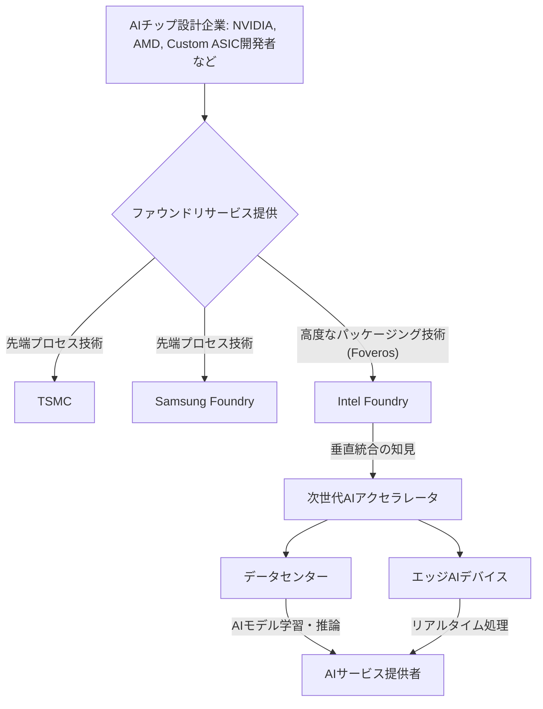

AI開発競争が加熱する今日、その「頭脳」となる半導体チップの重要性は語るまでもないでしょう。特に、高性能AIの学習・推論を支えるGPU市場ではNVIDIAが圧倒的な優位性を築いてきましたが、ここに風穴を開けようとする強烈な挑戦者が現れました。

シリコンバレーを駆け巡った衝撃的なニュースは、まさにこれです。長らく自社製品の製造を主軸としてきたIntelが、その高度な製造技術、特に**3Dスタッキングパッケージング技術「Foveros」**を前面に押し出し、外部顧客向けのAIチップ受託製造、すなわち「Intel Foundry」として本格参入するというのです。これはNVIDIA一強の時代に真っ向から挑む、Intelの背水の陣とも言える戦略であり、半導体業界のみならず、AIビジネス全体の未来を大きく左右する可能性を秘めています。

## NVIDIA一強時代へのカウンターパンチか？Intel FoundryのAI戦略

現在のAI業界において、NVIDIAの存在感は絶対的です。同社のGPUとCUDAプラットフォームは、AIモデルの学習から推論まで、あらゆるフェーズでデファクトスタンダードとなっています。多くの企業がAIインフラを構築する際、NVIDIAのハードウェアを選択せざるを得ない状況にあり、これが市場の供給を逼迫させ、高騰の一因ともなっています。

一方、長らく半導体業界の盟主として君臨してきたIntelは、近年、自社製CPUの伸び悩みに直面し、新たな成長戦略を模索してきました。その中で浮上したのが、自社の持つ世界最高峰の半導体製造技術を、外部顧客に提供する「ファウンドリ事業」への本格的なシフトです。これは、かつての垂直統合型ビジネスモデルからの大きな転換を意味します。

Intel FoundryのAIチップ製造への参入は、まさにこの戦略の中核を成します。AIの爆発的な普及に伴い、高性能で電力効率に優れた専用AIチップの需要は天井知らずです。既存の汎用GPUだけでは賄いきれないニーズが生まれ、特定用途に特化したカスタムAIアクセラレータの開発が加速しています。Intelは、この巨大な市場に自社の製造能力と技術で食い込み、NVIDIA一強の現状に風穴を開けようとしているのです。

編集部で特に注目したのは、この戦略が単なるキャパシティ提供に留まらない点です。Intelは、自社が長年培ってきた半導体設計、製造、そして高度なパッケージング技術を統合的に提供することで、顧客が真に求める次世代AIチップの実現を支援しようとしています。

## 「Foveros」が切り開くチップ設計の新地平

Intel FoundryのAI戦略の心臓部にあるのが、同社が誇る**3Dスタッキングパッケージング技術「Foveros（フォベロス）」**です。これは、異なる機能を持つ複数の半導体ダイ（チップレット）を垂直方向に積層し、一つのパッケージに統合する技術を指します。

従来の半導体製造では、一つの巨大なシリコンダイにすべての機能を詰め込む「モノリシック」な設計が主流でした。しかし、AIチップのように高性能化・多機能化が進むと、モノリシック設計では製造歩留まりの低下やコスト増大といった課題が顕在化します。そこで注目されるのが、複数の小さなチップレットを組み合わせて一つの高性能チップを構成する「チップレットアーキテクチャ」であり、Foverosはその最先端を行く技術なのです。

Foverosの技術的優位性は多岐にわたります。

*   **高密度集積:** CPU、GPU、メモリ、AIアクセラレータ、I/Oコントローラーなど、異なる種類のチップレットを一つのパッケージに高密度で統合できます。これにより、システムのフットプリントを大幅に削減し、より小型で高性能なデバイスの実現に貢献します。
*   **電力効率の向上:** チップレット間の配線距離が極めて短くなるため、データ転送に伴うエネルギー消費を大幅に削減できます。AIチップにおいて電力効率は性能と並ぶ重要指標であり、データセンターの運用コスト削減にも直結します。
*   **低レイテンシ:** 短い配線は、チップ間通信の遅延（レイテンシ）を劇的に減少させます。リアルタイム性が求められるAI推論や、大規模モデルの学習において、この低レイテンシは決定的なアドバンテージとなります。
*   **柔軟性とコスト効率:** 異なるプロセスノード（例えば、ある機能は最新の微細プロセス、別の機能は成熟したプロセス）で製造されたチップレットを組み合わせることが可能です。これにより、特定の機能ごとに最適な製造プロセスを選択でき、開発期間の短縮とコスト削減、そして歩留まりの向上に寄与します。

NVIDIAも次世代チップにおいてチップレット技術の導入を進めていますが、IntelはFoverosをはじめとする高度なパッケージング技術に長年の研究開発と投資を行ってきました。例えば、かつてのLakefieldプロセッサや、現在のMeteor Lakeプロセッサなど、既にFoveros技術は自社製品に活用され、実績を積んでいます。この経験が、外部顧客へのAIチップ製造においても大きな強みとなるでしょう。単なる「設計図通りに製造する」だけでなく、「最適なチップレットの組み合わせとパッケージング」という付加価値を提供できる点が、Intel Foundryの独自性と言えます。

## AIサプライチェーンの多様化と日本のチャンス

Intel FoundryのAIチップ製造への本格参入は、世界の半導体サプライチェーンに大きな波紋を投げかけます。これまで、最先端のロジック半導体製造は台湾のTSMCが圧倒的なシェアを誇り、地政学的なリスクが常に指摘されてきました。米国政府も半導体サプライチェーンの国内回帰や多様化を強力に推進しており、Intel Foundryの存在意義は単なる商業的なものに留まりません。

Intel Foundryは、米国国内での最先端チップ製造能力を強化し、サプライチェーンの安定化に貢献する重要な役割を担います。これは、AIのような戦略的な技術分野において、特定の地域や企業への過度な依存を避けるための国家戦略の一環とも言えるでしょう。

この動きは、日本の半導体産業にとっても無視できない、いや、むしろチャンスとなり得る要素を秘めています。

### 日本の半導体産業への影響：

*   **製造装置・材料サプライヤー:** 日本企業は、半導体製造装置や材料の分野で世界的に高いシェアを誇っています。Intel Foundryの台頭は、TSMC以外の新たな有力顧客の登場を意味し、装置や材料の需要構造が変化する可能性があります。Intelの技術ロードマップに合わせたR&D投資や、供給体制の最適化が求められるでしょう。
*   **設計・開発・ファブレス企業:** 米国発の多様なAIチップアーキテクチャ、特にIntel Foundryが提供するFoverosのような高度なパッケージング技術を活用したチップレットベースの設計へのアクセス機会が増えます。これは、日本のAI企業やファブレス（製造設備を持たない）設計企業が、より多様で、特定のニーズに最適化されたハードウェア基盤を選択できる可能性を示唆しています。既存の枠にとらわれない、新しいAIアクセラレータの開発に着手するチャンスも生まれるかもしれません。
*   **半導体産業全体の活性化:** 半導体製造の競争が激化することは、イノベーションを加速させ、技術全体の底上げに繋がります。日本が強みを持つ特定の領域（例: センサー、パワー半導体、高周波部品など）との連携も深まる可能性があり、新たなビジネスモデルやエコシステムが創出されるかもしれません。

しかしながら、懸念点もあります。Intelのプロセス技術は、微細化の点ではまだTSMCの後塵を拝している部分があり、顧客獲得競争は熾烈を極めるでしょう。また、垂直統合型の文化が根強いIntelが、いかに外部顧客のニーズに寄り添い、真のパートナーシップを構築できるか、その手腕が問われます。

## 性能とコストの最適解を追求するAI時代の選択

AIチップの選択は、単に「NVIDIAか、それ以外か」という二元論で語れる時代ではなくなりました。学習・推論モデルの多様化、エッジデバイスへのAI展開、そしてプライバシーやセキュリティへの配慮など、AIビジネスが直面する課題は複雑化しています。このような状況下で、ファウンドリの選択は、AIプロジェクトの性能、コスト、そしてサプライチェーンの安定性を左右する重要な経営判断となります。

Intel Foundryの参入は、この選択肢を劇的に広げます。特にFoverosのようなパッケージング技術は、単なるプロセス微細化競争では到達できない領域の性能と効率性を提供します。異なるIP（知的財産）を組み合わせ、特定のAIワークロードに最適化された「カスタムチップ」を、より迅速かつコスト効率良く開発できる可能性が出てきたのです。

| 特徴               | Intel Foundry (Foveros)                                | TSMC/Samsung (先端プロセス)                            |
| :----------------- | :----------------------------------------------------- | :----------------------------------------------------- |
| **強み**           | 高度な3Dパッケージング、米国拠点、垂直統合の知見       | 最先端ロジックプロセス、圧倒的な生産能力、成熟したエコシステム |
| **AIチップへの適合性** | 異なるIP統合、電力効率改善、特定のAIアクセラレータ向け | 汎用高性能GPU、大規模生産、既存AIエコシステムとの連携    |
| **主要顧客**       | 自社製品、米軍・政府、ファブレス新興企業               | NVIDIA、Apple、Qualcomm、MediaTekなど                  |
| **主要技術**       | Foveros (3Dパッケージング), Intel 18A (プロセス)       | CoWoS (パッケージング), 3nm/2nmプロセス                |
| **課題**           | プロセス技術の追いつき、顧客ベース拡大、コスト競争力   | 地政学的リスク、供給安定性、先端パッケージングの進化       |

この表からもわかるように、それぞれのファウンドリが持つ強みと弱みは異なります。Intel Foundryは、汎用的な高性能GPUの大量生産でNVIDIAと直接競合するだけでなく、Foverosを活用して「特定顧客向けに最適化されたAIチップ」というニッチだが成長著しい市場を狙っていると見るべきでしょう。

AI開発者は、これまでのNVIDIA GPU一辺倒から、Intel Foundryが提供する新たなハードウェアソリューションを検討することで、より柔軟で、自社のAIアプリケーションに真に合致した最適なプラットフォームを見つけ出すことができるかもしれません。これは、AI技術の民主化と、さらなるイノベーションを促進する起爆剤となる可能性を秘めています。

## 🧐 編集部の辛口オピニオン

「NVIDIAの牙城を崩す」という論調は、過去にもAMDや各国のスタートアップが登場するたびに聞かれてきました。しかし、蓋を開けてみればNVIDIAの独走は続き、むしろその差は開く一方です。だが、今回のIntel Foundryの動きは、これまでの単なる競争とは一線を画します。Intelは自社の将来をファウンドリ事業に賭けている。この本気度は、これまでとは全く次元が違うと見ています。

しかし、長年の自前主義と垂直統合のDNAが根付いた企業が、いかに外部顧客の多様なニーズに応え、真のパートナーシップを築けるか。ここには懐疑的な見方も少なくありません。「Intel inside」という強力なブランド力と引き換えに、顧客の自由度を制限してきた過去のイメージを払拭できるかが問われるでしょう。

特に日本の企業は、この半導体大戦を傍観している場合ではありません。半導体製造装置・材料で世界をリードする立場でありながら、AIチップ設計や先端プロセス開発、そしてファブレスビジネスモデルで欧米・アジア勢に遅れを取っている現状は、危機感すら覚えます。Intel Foundryの台頭は、単なる「選択肢の増加」以上の意味を持つと認識すべきです。米国におけるAIチップ製造の強化は、日本のサプライチェーン戦略に直接影響を与え、装置・材料サプライヤーは、顧客がTSMCだけでなくIntel Foundryも視野に入れるようになり、R&Dの方向性も分散化・複雑化するでしょう。

「どうせ日本の設計会社はIntel Foundryを使わないだろう」という悲観的な声も聞こえてきますが、それは違います。むしろ、オープン化された製造環境は、特定のベンダーに縛られず、真にコストと性能を最適化できる機会を生むのです。この変化を「チャンス」と捉え、Intel Foundryとの協業や、新たなエコシステムへの参画を積極的に模索すべきです。そうでなければ、気づけばまた「蚊帳の外」という事態になりかねないと、私は強く警告したい。この時代の潮流に乗るか、沈むか、岐路に立たされているのは、他でもない日本の企業なのです。

## 💡 よくある質問（FAQ）

### Q: Intel FoundryのAIチップ製造参入は、NVIDIAの市場独占を本当に崩せるのでしょうか？

A: 短期的にはNVIDIAの市場独占を覆すのは難しいでしょう。しかし、長期的にはNVIDIAの牙城を揺るがす可能性を秘めています。Intel Foundryは、高度なパッケージング技術（Foveros）と米国内での製造能力を強みに、特定用途向けAIチップや、サプライチェーンの多様化を求める企業からの需要を取り込むことで、AIチップ市場の競争を活性化させるでしょう。

### Q: 「Foveros」技術の最大のメリットは何ですか？

A: Foverosの最大のメリットは、複数の異なるチップレット（CPU、GPU、メモリ、特定機能アクセラレータなど）を3Dで高密度に積層できる点です。これにより、データ転送の高速化、電力効率の向上、そして異なるプロセスノードのチップを柔軟に組み合わせることで、特定のAIワークロードに最適化された高性能・低コストなチップ開発が可能になります。

### Q: 日本のAIスタートアップやファブレス企業にとって、Intel Foundryの参入はどのような意味を持ちますか？

A: 米国に拠点を置く最先端ファウンドリの選択肢が増えることで、地政学的なリスクを分散しつつ、より多様なAIチップ設計や製造のアプローチを検討できるようになります。特に、Foverosのような高度なパッケージング技術を活用することで、独自性のある高性能AIアクセラレータを開発し、既存のAIチップ市場に挑戦するチャンスが生まれる可能性があります。

## 🔗 関連ツール・サービス

**[Intel Foundry](https://www.intel.com/content/www/us/en/foundry/overview.html)** — Intelの最先端製造技術とファウンドリサービスを顧客に提供し、AIチップ開発を支援
**[NVIDIA Developer](https://developer.nvidia.com/)** — AI開発者向けにGPU、ソフトウェア（CUDA）、ツールを提供し、AIエコシステムを構築
**[Synopsys AI Solutions](https://www.synopsys.com/ai.html)** — AIチップ設計を加速するEDAツールとIPソリューションを提供し、複雑な設計を効率化
**[TSMC](https://www.tsmc.com/english/ourServices/overview)** — 世界最大の半導体ファウンドリとして、最先端プロセス技術でAIチップ製造を支える