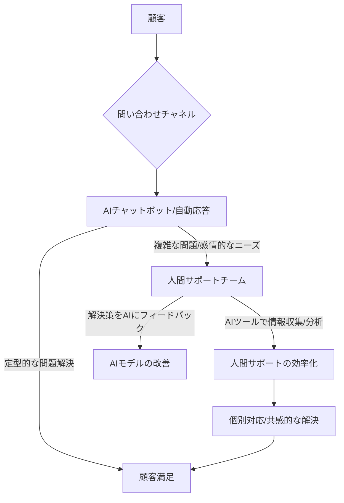

> **💡 この記事のポイント**
> - ガートナーは、AI導入のための顧客サポートチーム削減が企業の長期的な損失を招くと警告しています。
> - AIは人間による顧客体験を「代替」するのではなく「強化」すべきであり、その戦略が企業の真の価値を創出します。
> - 日本企業は、安易なコスト削減に走らず、顧客ロイヤルティとブランド価値向上に資するAI投資戦略を構築すべきです。

シリコンバレーで長年テクノロジーの動向を追いかけてきた私にとって、今日のニュースは非常に示唆に富むものでした。「Gartner Warns Enterprises Against Cutting Support Teams to Fund AI」――。つまり、ガートナーが企業に対し、AI投資の資金を捻出するために顧客サポートチームを削減する行為は危険だと警告したというのです。これは、AIブームに浮足立つ企業に冷や水を浴びせるような、非常に重要なメッセージだと感じています。

## ガートナーの警告：AI投資の「落とし穴」とは

多くの企業が、生成AIの波に乗ろうと躍起になっています。効率化、コスト削減、新たな顧客体験の創出――その可能性は計り知れません。しかし、ガートナーの今回の警鐘は、そうした熱狂の裏に潜む大きなリスクを浮き彫りにしています。AI導入は確かに重要ですが、そのための資金を、顧客と最前線で向き合うサポートチームの削減で賄うという発想は、短絡的であるばかりか、企業の存続そのものを危うくする可能性を秘めていると指摘しているのです。

この警告が意味するのは、AIを単なる「コストセンター」として捉え、人件費削減の手段としてのみ利用しようとする企業姿勢への疑問符です。特に、顧客体験（CX）が企業の競争力の源泉となりつつある現代において、人間によるきめ細やかなサポートを軽視することは、顧客ロイヤルティの低下、ひいてはブランド価値の毀損に直結します。AIはあくまでツールであり、その導入目的が企業の長期的な成長と顧客満足に資するかどうか、戦略的な視点から厳しく評価する必要があります。

## 顧客体験（CX）とAIの「共存」戦略

AIが進化すればするほど、顧客サポートの現場は大きく変わるでしょう。しかし、それが「人間が不要になる」という単純な方程式に帰結するわけではありません。むしろ、AIはより複雑で感情的な対応が求められる領域に、人間のオペレーターが集中できる環境を作るための強力なパートナーとして機能すべきです。

ガートナーの指摘はその点を強調しています。AIチャットボットが定型的な問い合わせに迅速に対応し、FAQ検索を効率化することは大いに結構です。しかし、顧客が抱える複雑な問題、感情的な不満、あるいは特別な配慮を要する状況では、やはり人間による共感的なコミュニケーションが不可欠です。AIが提供する情報はあくまで「データ」ですが、人間のサポートは「共感」と「信頼」を生み出します。

企業は、AIと人間のサポートチームがどのように協調し、相乗効果を生み出すかを熟考する必要があります。AIが瞬時に情報を収集し、過去の対応履歴を分析し、最適な解決策を提案する。そして、それを基に人間が顧客に寄り添い、パーソナライズされた解決策を提供する。これが、真の意味で顧客体験を向上させる「共存」戦略であり、AIがその本領を発揮する道筋です。安易な人員削減は、顧客の不満を増大させ、結果として企業にさらなるコスト（顧客離れによる売上減、ブランドイメージ悪化）を強いることになるでしょう。

### 理想的なAIとCXチームの連携モデル

以下は、AIと人間による顧客サポートチームがどのように連携すべきか、その理想的なモデルを図示したものです。AIが初期対応で効率化を図りつつ、人間のサポートが必要な場面ではスムーズに連携できる仕組みが重要です。

## AI導入における戦略的誤算とコスト

ガートナーの警告は、AI導入が単なる技術的な課題ではなく、経営戦略の中核をなすものであることを再認識させます。多くの企業がAIを導入する際、目先の効率化やコスト削減に目を奪われがちですが、その裏には見えないコストやリスクが潜んでいます。

### 短期的なコスト削減の誘惑と長期的な損失

| 項目               | 短期的な視点（誘惑）               | 長期的な視点（真の価値）                 |
| :----------------- | :--------------------------------- | :--------------------------------------- |
| **主な目標**       | コスト削減、即時効率化             | 顧客ロイヤルティ、ブランド価値向上、持続的成長 |
| **CXへのアプローチ** | サポート人員削減、AIへの完全移行   | AIによるサポート強化、人間との協調       |
| **リスク**         | 顧客不満、解約率増加、ブランド毀損 | 競合優位性維持、イノベーション促進       |
| **考慮すべき指標** | 短期的な数字の改善に目を奪われる   | 顧客生涯価値（LTV）の最大化、顧客満足度 |

表からもわかるように、短期的なコスト削減は魅力的に映るかもしれません。しかし、人間によるサポートを軽視しすぎると、顧客は企業に対して「冷たい」「人間味がない」と感じるようになり、信頼関係が損なわれます。結果として、顧客離れが加速し、LTV（顧客生涯価値）が低下。これは、AI導入で得られるであろう短期的な効率化メリットをはるかに上回る、甚大な損失につながりかねません。

また、AIシステム自体の導入コストだけでなく、継続的なメンテナンス、モデルの再学習、セキュリティ対策、そして万が一のAIの誤作動や偏見（バイアス）に対するリスク管理と対応コストも考慮に入れる必要があります。これらの隠れたコストを軽視し、目先の予算削減に走ることは、「安物買いの銭失い」となるでしょう。

## 🧐 エバンジェリストの辛口オピニオン

正直、ガートナーのこの警告は、特に日本の企業経営者層にこそ響いてほしいと心底思います。日本企業はとかく「効率化」や「コスト削減」という言葉に弱く、新しいテクノロジーが出現すると、それを人件費削減の手段として捉えがちです。AIも例外ではありません。「AIを導入すれば、人員を減らせる」――そう短絡的に考える向きが少なからずあるのだろう。

しかし、これは「顧客体験」という現代ビジネスの最も重要な資産を軽視する、極めて危険な思考回路です。シリコンバレーで見てきた限り、成功している企業はAIを「人間を置き換えるもの」ではなく、「人間の能力を拡張するもの」として捉えています。特に顧客との接点においては、AIがどれだけ高度化しても、人間が持つ共感力、状況判断能力、そして「おもてなし」の心に完全に取って代わることは不可能です。

日本企業は、とかく横並び意識が強く、「他社がAIを入れたからうちも」という発想になりがちですが、その導入戦略が「人」を軽視したものであれば、待っているのは顧客の離反とブランドイメージの低下です。目先のコスト削減ばかりに目を奪われ、顧客が去っていく姿を「デジタル化の痛み」などと安易に片付けてはなりません。それは単なる経営判断の誤りであり、顧客を裏切る行為です。

本当に考えるべきは、**AIによって「人間はより人間らしく、よりクリエイティブな仕事に集中できるか」**という点です。顧客サポートの現場であれば、AIがルーティンワークをこなし、人間はより複雑で、感情的なケアが必要な顧客に時間と労力を割く。その結果として顧客満足度が向上し、リピート率が上がり、ブランドに愛着が生まれる。これが、AI投資の真の目的であり、長期的なリターンを生む戦略です。

安易なAI導入と人員削減は、企業の自滅行為に他なりません。日本の「おもてなし」精神や顧客サービスに対する高い期待値を考えれば、人手を削減してAIに丸投げするような戦略は、日本市場では特に致命傷になり得ると私は断言します。ガートナーの警告を真摯に受け止め、目先ではなく、未来を見据えた賢明なAI投資戦略を構築すべき時なのです。

## 🔗 関連ツール・サービス

**[Salesforce Service Cloud](https://www.salesforce.com/jp/products/service-cloud/overview/)** — AIと自動化で顧客対応を強化し、サポートチームの生産性を向上させるCRMプラットフォーム。
**[Zendesk](https://www.zendesk.co.jp/)** — 顧客サポートとエンゲージメントを統合管理し、AIを活用した効率的な顧客体験を提供するサービス。
**[Microsoft Dynamics 365 Customer Service](https://dynamics.microsoft.com/ja-jp/customer-service/overview/)** — AIベースのインサイトと自動化で、パーソナライズされた顧客サービスを実現するソリューション。