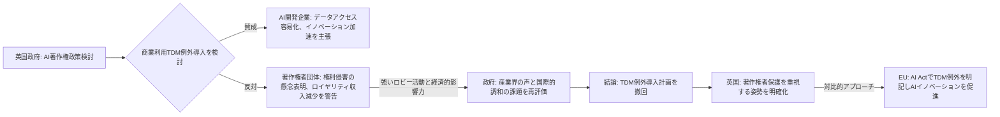

AIと著作権を巡るグローバルな綱引きは、もはや止まることを知らない。そんな中、**英国政府が生成AIの学習データに関するTDM（テキスト・データマイニング）例外の導入計画を撤回した**というニュースは、シリコンバレーで取材を続ける私にとっても非常に衝撃的でした。これは単なる一国の政策変更にとどまらず、国際的なAI開発の方向性、そして日本企業のグローバル戦略にも少なからぬ影響を及ぼす決定であると見ています。

### AI開発の生命線、TDM例外措置の深層

そもそも、なぜTDM例外措置がAI開発においてこれほどまでに重要視されてきたのでしょうか。TDMとは、大量のテキストやデータを機械的に分析し、新たな知識やパターンを抽出する技術のことです。AI、特に生成AIモデルの学習には、膨大な量のデータが必要です。既存の著作物をインターネット上から収集し、それを解析・学習することで、AIは人間のような文章生成や画像生成の能力を身につけていきます。

しかし、このプロセスが著作権法上の「複製」や「翻案」に該当するのではないかという懸念が、世界中で指摘されてきました。著作権で保護されたコンテンツを無許可でAI学習に利用することは、著作権侵害にあたる可能性があるため、AI開発企業は常に法的リスクに晒されています。

そこで、欧州連合（EU）をはじめとする一部の国々では、AI開発を促進するために、特定の条件下で著作物のTDM利用を著作権侵害の例外とする「TDM例外措置」を導入する動きが活発化していました。この例外があれば、AI開発企業はデータ収集のハードルが下がり、より自由に、迅速にモデルを開発できるようになります。英国も当初、この流れに乗ろうとしていたのです。

### 英国のTDM例外、なぜ撤回されたのか？

英国政府はブレグジット後、EUのデジタル単一市場から独立し、独自のAI政策を模索してきました。当初は、AI開発を強力に推進し、イノベーションハブとしての地位を確立するため、包括的なTDM例外措置の導入に前向きな姿勢を見せていました。これは、研究目的だけでなく、**商業利用においても著作物のTDMを広く認める**という、当時としてはかなり先進的な方針でした。

しかし、この計画は英国のクリエイティブ産業、特に音楽、出版、アート業界からの猛烈な反発に遭いました。彼らは、AIが著作物を無償で利用することで、自身の権利が侵害され、創作活動の経済的基盤が揺らぐことを強く懸念したのです。強力なロビー活動の結果、政府は「知的財産権の保護とAI技術の発展のバランスを取る」という名目で、TDM例外導入計画を撤回するに至りました。

この撤回は、単に技術推進か権利保護かという二項対立に留まらない、より複雑な背景があると私は見ています。一つには、**国際的な調和の難しさ**が挙げられます。EUが特定のTDM例外を設ける一方で、米国では著作物のAI学習に対するフェアユースの適用可能性が個別判断に委ねられており、明確な法整備が進んでいません。英国が独自に商業利用TDM例外を導入すれば、かえって国際的な法的環境が複雑化し、企業が対応に苦慮する可能性もありました。

また、**経済的な影響**も無視できません。英国のクリエイティブ産業はGDPに大きく貢献しており、その声を無視することはできませんでした。AIの未来に賭ける一方で、既存の強力な産業基盤を守るという、英国政府の現実的な選択がそこにはあったと言えるでしょう。

以下に、英国政府の決定プロセスを図で示します。

### EUとの対比：異なる道を歩む著作権戦略

英国の今回の決定を理解する上で、EUの動向との比較は不可欠です。EUは「AI Act」という包括的なAI規制法案を成立させる中で、著作権に関するTDM例外についても明確な方針を示しています。EUでは、**研究目的のTDM利用は広く許容され、商業目的のTDM利用も、権利者が「オプトアウト」（自分の著作物をAI学習に利用しないよう明示的に意思表示すること）しない限り、原則として可能**としています。

このEUのアプローチは、AI技術の発展とクリエイティブ産業の権利保護の間で、一定のバランスを取ろうとするものです。AI開発企業は、オプトアウトされた著作物を除けば、法的リスクを低減しつつデータを利用できます。一方で、権利者は自分の作品がAI学習に利用されることを望まない場合、その意思表示をする権利が保障されています。

**英国のアプローチはこれと真逆を行く**ものです。TDM例外の導入計画を撤回したことで、英国では著作権で保護されたコンテンツをAI学習に利用する場合、**原則として個別の許諾が必要**となる可能性が高まります。これは、AI開発企業にとって、データ収集のコストと手間を大幅に増加させることを意味します。特に、インターネット上の膨大なデータを自動的に収集・分析するスクレイピング行為は、著作権侵害のリスクを直接的に高めることになるでしょう。

このEUと英国の著作権戦略の違いは、グローバルに事業を展開するAI企業やコンテンツ企業にとって、無視できない大きな課題を突きつけます。どちらの市場でAIを開発し、サービスを展開するかによって、法的リスクとコンプライアンス要件が大きく変動するため、各社の戦略はより複雑にならざるを得ません。

| 項目                  | 英国（最新動向）                   | EU（AI Act含む）                    | 米国（現行法規・判例）            |
| :-------------------- | :--------------------------------- | :---------------------------------- | :---------------------------------- |
| **TDM例外の有無**     | **商業目的の導入計画を撤回**       | **原則として許容**（条件付き）       | **個別ケース判断**（フェアユース）   |
| **商業利用の可否**    | 明示的な例外なし、許諾が原則       | オプトアウト条項により許容         | フェアユースに依存、法的不確実性大 |
| **研究目的のTDM**     | 厳格な規定、明確な例外は限定的     | 幅広く許容                         | フェアユースに依存                   |
| **主な考慮事項**      | 著作権者保護、クリエイティブ産業の支援、国際的な調和の模索             | AIイノベーション推進、データ経済活性化、権利者保護のバランス  | 表現の自由、権利者利益のバランス、裁判所判断先行    |
| **AI開発企業への影響** | ライセンス交渉必須、データ収集コスト・リスク増大 | オプトアウト確認必須、比較的柔軟なデータ利用環境     | 法的リスクの評価困難、ケースバイケースの対応                   |

### AI開発者とクリエイターへの影響

英国の今回の決定は、AI開発コミュニティとクリエイティブ業界双方に大きな波紋を広げています。

**AI開発者や企業にとって**、この決定は明確な障壁となるでしょう。
まず、**データ収集のコストと複雑性が増します**。AIモデルをゼロから学習させるには、大量の高品質なデータが必要です。英国で著作権保護されたデータを合法的に利用するためには、個別のライセンス契約を著作権者と結ぶか、著作権フリーのデータを探すしかありません。これは中小のAIスタートアップにとっては特に重い負担となり、イノベーションの足かせとなる可能性も否定できません。
次に、**法的リスクの増大**です。適切な許諾なくデータを学習に用いた場合、著作権侵害で訴訟されるリスクが高まります。これは、新たなAIサービスやモデルの開発速度を鈍らせ、英国を拠点とするAI企業の競争力を低下させる恐れがあります。結果として、**AI開発の重心が、より規制の緩やかな地域（例えば、EUの一部やデータが豊富な国々）へと移っていく**可能性も考えられます。

一方で、**クリエイターや著作権者にとっては、朗報**と捉える向きも少なくありません。
彼らは自身の作品がAIによって無許可で利用され、その結果生み出されたAI生成物が市場で競合することを強く懸念していました。TDM例外の撤回は、著作物の価値が不当に希釈されることを防ぎ、**クリエイターがAI企業とライセンス交渉を行う上での交渉力を強化する**ことにつながります。これは、AIエコシステムにおける公正な対価の分配という、長年の議論に一石を投じるものです。
しかし、この厳格化が、AIによる新たな創作活動やコラボレーションの可能性を狭めるのではないかという懸念も存在します。例えば、AIツールを活用して新たな芸術作品を生み出すような試みも、データの利用許諾が厳しくなれば困難になるかもしれません。

全体として、英国のこの動きは、AIの急速な発展と、それを取り巻く既存の法的・経済的枠組みとの間の**摩擦が激化している**ことを浮き彫りにしています。どちらか一方に舵を切ることは、もう一方に大きな影響を与えるため、各国政府は極めて難しい判断を迫られている状況です。

### グローバルなAI著作権論争の縮図

英国の今回の決定は、世界中で繰り広げられているAI著作権論争の現状を象徴する出来事と言えるでしょう。各国が、自国の産業構造、文化的背景、そしてAIへの戦略的アプローチに基づいて、異なる道を歩み始めています。

*   **米国**：明確なTDM例外は存在せず、個々のAI学習データ利用が「フェアユース」に該当するかどうかが、裁判所で争われています。この不確実性が、AI企業と著作権者の双方にとって大きなリスクとなっていますが、一部では大手テック企業が著作権者とライセンス契約を結ぶ動きも出てきています。
*   **EU**：AI ActによりTDM例外を明確化し、研究目的の利用は広く許容し、商業目的の利用もオプトアウトメカニズムを通じて容認しています。これはAIイノベーションの促進と権利保護のバランスを取ろうとする試みです。
*   **日本**：日本では、著作権法30条の4「情報解析のための複製等」により、TDM目的での著作物利用が比較的広く認められています。これは、権利者の利益を不当に害しない限り、非享受目的での利用を許容するもので、欧米と比較してもAI開発にとって友好的な環境が整っていると言えます。しかし、これも完璧ではなく、AI学習における「非享受目的」の解釈を巡っては議論が続いています。
*   **韓国やその他のアジア諸国**：多くの国が、EUや日本の動向を注視しつつ、自国の法整備を進めている段階です。しかし、普遍的な合意形成には至っておらず、国際的な法制度の「断片化（fragmentation）」が進行しているのが現状です。

このような状況は、グローバルにAIサービスを展開しようとする企業にとって、大きな課題です。ある国で合法な行為が、別の国では違法となる可能性があるため、各国の法規制を詳細に把握し、それに合わせた戦略を構築する必要があるからです。英国の今回の撤回は、この「断片化」にさらに拍車をかけるものと認識すべきでしょう。

今後の国際社会では、AIの著作権に関する「国際標準」を形成する動きが加速するかもしれませんが、現時点では、各国がそれぞれの国益と産業保護を優先する傾向が強く、その道のりは険しいと予想されます。

## 🧐 編集部の辛口オピニオン

今回の英国政府のTDM例外撤回は、日本企業にとって「対岸の火事」では決してありません。むしろ、**グローバル展開を目指す日本企業は、この動きから非常に重要な教訓を得るべきです。**

正直なところ、英国政府のこの決定は、AIのイノベーションを鈍化させる、**極めて短期的な視点に基づいた政策判断**であると言わざるを得ません。既存のクリエイティブ産業からの圧力に屈した結果、AIという新興産業の成長の芽を摘むリスクを冒しているのです。ブレグジット後の英国は、デジタル経済のリーダーシップを確立しようとしていたはずですが、この一歩は明らかに逆行しています。

日本企業はどうか。日本の著作権法30条の4は、現状では比較的AI学習に友好的な環境を提供していると評価できます。しかし、これで「日本は安泰」と高を括るのは危険です。英国の事例が示すのは、AIと著作権のバランスは、**常に政治的圧力と経済的利害によって変動しうる**ということ。日本でも、クリエイター団体からのロビー活動が強まれば、いつ法改正の議論が再燃してもおかしくありません。

私が特に危惧するのは、**日本企業が「周回遅れ」に陥るリスク**です。欧州がAI Actで明確な規制と例外の枠組みを構築し、米国が訴訟を通じてある程度の方向性を示していく中で、英国は独自の道を歩み始めました。この法的な複雑性は、日本企業がグローバル市場で競争する上で、**新たな参入障壁**となりえます。特に、生成AIをコア技術とするスタートアップや、デジタルコンテンツを活用する企業は、英国内での展開を再考する必要に迫られるでしょう。

そして、最も重要なのは、**「ライセンス戦略」の重要性**がこれまで以上に高まるということです。コンテンツを扱う日本企業は、自社の著作物がAI学習に利用されることを前提に、積極的にAI企業とのライセンス交渉を進めるべきです。また、AI開発を行う日本企業は、合法的なデータソースの確保、あるいは著作権者との透明性のある関係構築に、これまで以上のリソースを割く必要があります。

この英国の決定は、AIと著作権の問題が、単なる法律論ではなく、**国家戦略と経済の未来を左右する重大な政策課題**であることを改めて我々に突きつけています。日本企業は、この変化の波を正確に読み解き、先手を打った戦略を構築しなければ、グローバルなAI競争で生き残ることはできないでしょう。ぬるま湯に浸かっている余裕など、どこにもないのです。

## 💡 よくある質問（FAQ）

### Q: 英国政府がTDM例外導入計画を撤回した主な理由は何ですか？

A: 主な理由は、英国のクリエイティブ産業（音楽、出版、アートなど）からの強い反発です。彼らは、AIが著作物を無償で利用することによる権利侵害や経済的損失を懸念し、政府にロビー活動を行いました。また、国際的な法制度の調和の難しさや、AIイノベーション促進と既存産業保護のバランスも考慮されたと見られます。

### Q: 英国の今回の決定は、EUのAI規制（AI Act）とどのように異なりますか？

A: EUのAI Actでは、研究目的のTDM利用は広く許容されており、商業目的のTDM利用も、権利者が「オプトアウト」（AI学習への利用を明示的に拒否）しない限り、原則として認められています。これに対し、英国は商業目的のTDM例外導入計画を撤回したため、著作物のAI学習には原則として個別の許諾が必要となる可能性が高く、EUとは対照的に著作権保護を厳格化する方向に向かっています。

### Q: 日本企業は英国の今回の決定からどのような教訓を得るべきでしょうか？

A: 日本企業は、AIと著作権の規制が国によって大きく異なることを再認識し、グローバル展開における法的リスク評価を強化する必要があります。特に、生成AIを活用する企業は、合法的なデータソースの確保や、著作権者との透明性のあるライセンス契約の重要性が増します。また、日本の比較的友好的な著作権環境も、国内外の圧力により変動しうるため、常に最新の動向を注視し、柔軟な戦略を持つことが不可欠です。

## 🔗 関連ツール・サービス

*   **[Copilot for Microsoft 365](https://www.microsoft.com/ja-jp/microsoft-365/microsoft-copilot)** — Microsoft製品群と連携し、ビジネス文書作成などをAIで支援。
*   **[Google Cloud Vertex AI](https://cloud.google.com/vertex-ai)** — カスタムAIモデル開発からデプロイまでを支援する包括的なプラットフォーム。
*   **[Adobe Firefly](https://www.adobe.com/jp/sensei/generative-ai/firefly.html)** — 著作権に配慮したデータで学習された、画像生成AIサービス。
*   **[LexisNexis AI](https://www.lexisnexis.com/en-us/products/lexisnexis-ai.page)** — 法律専門家向けのAIツールで、法的調査や文書作成を効率化。
---