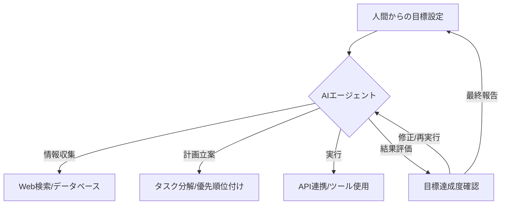

日本の芸能ニュースかと思いきや、実はこれ、我々シリコンバレーのジャーナリストが注目すべき「未来」の端緒を捉えた出来事かもしれない。2026年4月1日、東京タワーが映画『夏への扉 -キミのいる未来へ-』公開記念イベントで“純愛色”にライトアップされたというニュースを目にした時、正直、一瞬戸惑った。しかし、この作品の原典であるロバート・A・ハインラインのSF古典小説『夏への扉』が持つテーマを深く掘り下げれば、今日のAIが突きつける「未来」の議論と密接に結びついていることに気づかされる。単なるエンターテインメントに留まらない、示唆に富んだこの作品の世界観を、最先端のAI技術と重ね合わせて考察してみたい。

## 映画『夏への扉』とSFが描く「未来像」

1957年に発表されたハインラインの『夏への扉』は、タイムトラベル、冷凍睡眠、そして人間と共生するロボット「ピート」を描いた傑作だ。主人公ダン・デイビスは、信頼していたビジネスパートナーと婚約者に裏切られ、自身が開発した画期的なロボット技術を奪われた後、冷凍睡眠で未来へと逃れる。そこで彼は、失われた時間を取り戻し、愛する人との再会を果たすために、過去と未来を行き来する旅に出る。

この物語が描く未来は、当時の読者にとっては純粋な空想だっただろう。しかし、今や私たちは2020年代の半ばを過ぎ、AIはかつてのSF作家でさえ想像し得なかった領域へと踏み込んでいる。2026年という作中設定にも近い現在、AI技術は現実世界をSFの世界へと変貌させる可能性を秘めている。タイムトラベルこそ物理法則の壁があるが、物語が提示する「失われた時間を取り戻す」「未来を予測し、より良い選択をする」といったテーマは、AIの究極的な目標とも重なる。

この小説の魅力は、単なる技術的な驚きに留まらない。人間関係の複雑さ、信頼と裏切り、そして何よりも「過去の選択が未来にどう影響するか」という普遍的な問いかけだ。AIがビッグデータを解析し、未来のパターンを予測する時代において、私たちの選択が連鎖的に引き起こす結果について、より深く考える契機となる。

## AIが切り開く「夏への扉」：タイムトラベルは夢物語か？

『夏への扉』の中心テーマの一つは、文字通りのタイムトラベルだ。しかし、現代のAI技術において、物理的なタイムトラベルはまだ絵空事である。それでも、AIは異なる形で「時間」を扱い、私たちの未来の認識を変えつつある。

例えば、AIによる**超高精度な未来予測モデリング**は、企業戦略から気候変動、個人の健康管理に至るまで、あらゆる分野で活用され始めている。過去の膨大なデータを学習し、未来のシナリオをシミュレートすることで、私たちはまるで未来を覗き見るかのような体験を得ている。これは、ハインラインが描いたタイムトラベラーが未来の情報を持ち帰ることに近い機能を持つと言えるだろう。

### 時間軸を操るAIの力
AIは、以下の点で「時間」に介入している。

*   **予測分析（Predictive Analytics）**: 株価予測、疾病発生予測、需要予測など、未来の出来事の確率や傾向を算出。
*   **シミュレーション（Simulation）**: 複雑なシステム（都市計画、サプライチェーン、生態系など）の時間経過をモデル化し、異なる条件下での結果を仮想的に検証。
*   **パーソナライズされた時間管理**: 個人の行動パターンをAIが学習し、最適なタスクスケジュールや学習プランを提案することで、時間の有効活用を最大化。

| SFにおける時間操作 | AIにおける時間への介入 | 違いと共通点 |
| :----------------- | :--------------------- | :----------- |
| 物理的な過去/未来への移動 | データの過去/未来の分析・予測 | 物理的な移動は不可だが、情報的な未来予知は可能 |
| 個人の体験に基づく変更 | 集団データに基づくパターン把握 | 主観と客観の差はあれど、未来を「知る」試みは共通 |
| 技術的困難さが主眼 | アルゴリズムと計算能力が主眼 | 根本的なアプローチが異なる |

これらのAI技術は、私たちに「もしあの時別の選択をしていたら」というIFの世界を、ある程度データに基づいて提示することを可能にする。これは、主人公ダン・デイビスが過去の過ちを正そうと奮闘する姿と重なる、ある種の「時間への挑戦」と見なせるのではないだろうか。

## ロボット「ピート」の夢：AIエージェントと自律型システム

『夏への扉』に登場するロボット猫「ピート」は、単なる道具ではなく、主人公の良き相棒として描かれている。人間のような感情を持ち、自律的に行動し、困難な状況でダンを助ける。これは、現代のAIエージェントや高度なロボティクスが目指す究極の姿を先取りしていたと言える。

今日のシリコンバレーでは、単一機能のAIではなく、複数のツールやサービスを連携させ、複雑なタスクを自律的に遂行する**AIエージェント**の開発が加速している。OpenAIのGPTs、GoogleのGemini Assistants、さらには各種のオープンソースプロジェクトにおけるAgentフレームワークなどがその代表例だ。これらは、特定の目標を与えられれば、情報収集、計画立案、実行、結果の評価までを一貫して行うことができる。

例えば、出張の手配をするAIエージェントは、航空券の予約からホテルの手配、会議室の予約、移動手段の最適化まで、一連のプロセスをユーザーの指示に基づいて実行する。これは、ピートがダン・デイビスの生活を支え、時には彼の危機を救ったように、私たち人間の「相棒」となる可能性を秘めている。

ピートのような「心」を持つロボットはまだSFの世界だが、感情認識AIや生成AIによる自然な対話能力の向上は、ロボットがより人間らしいインタラクションを持つ未来を示唆している。そして、ボストン・ダイナミクスのような企業のヒューマノイドロボットが次々と高度な動作を見せる今、物理的なロボットとAIエージェントの融合は、SFが描いた「相棒」が現実となる日を予感させる。

## 未来への選択と倫理：AI時代の人間性

『夏への扉』の物語は、技術の進歩がもたらす希望だけでなく、人間社会の闇や倫理的なジレンマも深く描いている。裏切り、絶望、そして未来の技術を悪用しようとする者たち。これらは、AIが社会に深く浸透する現代において、私たちも直面する避けられない課題だ。

AIの進化は、雇用、プライバシー、セキュリティ、そして民主主義そのものに大きな影響を与えている。例えば、ディープフェイク技術は、現実と虚構の境界線を曖昧にし、社会の信頼を揺るがしかねない。また、高度なAIによる意思決定が、人間の介在なしに進む場合、その責任の所在や倫理的判断の基準はどこに置かれるべきかという問題が浮上する。

SF作品は、そうした未来の倫理的・社会的な課題を事前にシミュレートする場として機能してきた。『夏への扉』が私たちに問いかけるのは、どんなに技術が進歩しても、結局は人間の「選択」が未来を決定するということだ。AIは強力なツールであり、未来を形作るための無限の可能性を秘めているが、それをどのように使い、どのような未来を築くかは、私たち自身の倫理観と責任に委ねられている。

シリコンバレーでは、AIの安全性と倫理に関する研究が加速しており、"Responsible AI"や"AI Governance"といった概念が重要視されている。しかし、技術開発のスピードに倫理的な議論が追いついていないのが現状だ。私たちは、SFが提示してきた警鐘に耳を傾け、AIがもたらす「夏への扉」を、人間性の向上と社会の幸福のために開く責任がある。

## 🧐 エバンジェリストの辛口オピニオン

正直なところ、日本の企業、特に伝統的な製造業やサービス業は、このSF的想像力と未来への洞察力という点で、シリコンバレーとは大きな隔たりがあると感じざるを得ません。映画『夏への扉』が日本のコンテンツとして注目を集めるのは素晴らしいことですが、これを単なるエンタメとして消費するだけで終わらせては、せっかくの文化的資産がもったいない。

AIが私たちの未来を塗り替えようとしている今、日本の経営者や技術者は、もっとSFを「読む」べきです。SFは単なるファンタジーではなく、未来の技術が社会にもたらす影響、倫理的ジレンマ、そして人間の存在意義を深く考察する思考実験の宝庫なのです。

シリコンバレーの起業家や研究者たちは、幼少期からSFに親しみ、そこで描かれたビジョンを実現しようと奔走しています。彼らにとって、SFは技術ロードマップの一種であり、イノベーションのインスピレーション源です。日本の企業は、自社の技術がどのような「未来の扉」を開くのか、その扉の先に何が待っているのかを、もっと深く、大胆に想像する必要があります。

そして、その想像力は、AI倫理やガバナンスの議論においても不可欠です。AIが暴走する、あるいは意図せず社会に負の影響を与えるシナリオを、SFは散々描いてきました。それらを教訓として、**「自社のAIがどのような世界を作り出すか」を真剣に問い、責任ある開発と運用を追求する姿勢**こそが、2026年以降の日本企業に求められる喫緊の課題だと断言します。単に最新のAIツールを導入するだけでなく、その思想と哲学を深く理解し、未来を「デザインする」視点を持つこと。それができなければ、日本は永遠に「ユーザー」であり続けるでしょう。

## 🔗 関連ツール・サービス

**[OpenAI GPTs](https://chat.openai.com/gpts)** — カスタムAIエージェントを容易に構築・デプロイできるプラットフォーム。
**[Google Gemini Assistants](https://gemini.google.com/assistants)** — Googleの強力なAIモデルを基盤としたパーソナライズされたアシスタント機能。
**[Hugging Face Agents](https://huggingface.co/docs/transformers/main/en/agent)** — オープンソースでAIエージェント構築を支援するライブラリとツール群。
**[Boston Dynamics](https://www.bostondynamics.com/)** — 高度な移動能力を持つロボットを開発し、物理的なAIと人間の共生を模索。