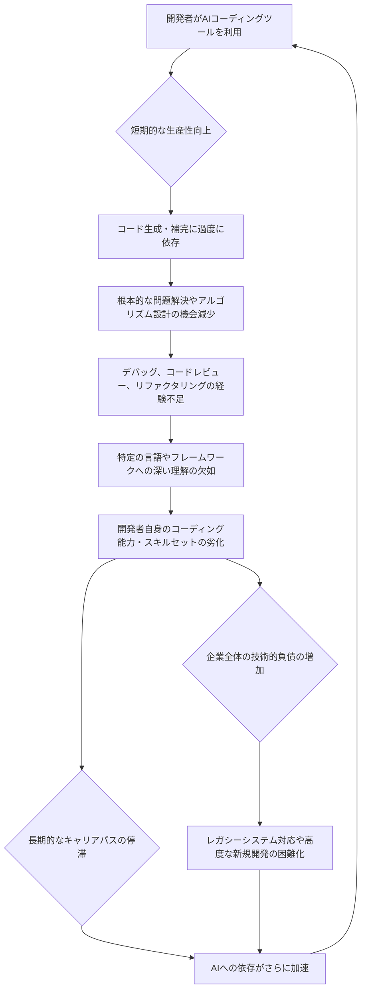

「気がついたら、自分でコードが書けなくなっていた」――。

シリコンバレーで今、開発者の間でひそかに囁かれ始めた、戦慄すべき告白がある。AIプログラミングツールがもたらす圧倒的な生産性向上の裏で、人間の開発者が「コーディング能力」そのものを失いつつあるというのだ。『The New Stack』が報じたこの警鐘は、単なる効率化の物語では終わらない。我々がAIに何を委ね、何を人間に残すべきかという、根源的な問いを突きつけている。

編集部で特に注目したのは、この現象が単なる技術的課題に留まらず、開発者のキャリアパス、企業の競争力、ひいては社会全体のデジタルリテラシーに深く関わる点である。AIは我々の仕事を奪うのではなく、その「質」を変えると言われてきたが、もしかすると、AIは我々の「本質的な能力」を静かに蝕んでいるのかもしれない。この複雑なジレンマに、今、正面から向き合う時が来た。

### AIコード生成がもたらす「知の喪失」

AIによるコード生成ツールは、すでに開発現場の風景を一変させた。GitHub Copilot、Amazon CodeWhisperer、そしてGoogle Gemini Code Assistといったツールは、まるで熟練したペアプログラミングの相棒のように、瞬時にコードスニペットを提案し、エラーを修正し、反復的なタスクを自動化する。これにより、開発者は「退屈な」作業から解放され、より創造的で高レベルな課題に集中できると謳われてきた。

しかし、その恩恵の裏で、開発者たちが直面し始めたのが「知の喪失」である。ある開発者は「AIにコードを生成させることに慣れすぎて、ゼロから複雑なロジックを設計する能力が落ちた」と語る。これは決して大袈裟な話ではない。AIが生成したコードの品質を検証する際、そのコードがなぜそのように機能するのか、あるいはなぜバグが発生したのかを深く理解する機会が減る。目の前のタスクをAIに「丸投げ」する習慣がつけばつくほど、人間の脳が本来担うべき、抽象化、分解、再構築といった思考プロセスが衰えていくのは当然の帰結だろう。

特に懸念されるのは、**デバッグ能力の低下**だ。AIが生成したコードは一見完璧に見えても、文脈の誤解やエッジケースの見落としから、巧妙なバグを内在している場合がある。これらのバグを発見し、根本原因を特定するには、システム全体に対する深い理解と、試行錯誤を通じて培われる洞察力が必要だ。しかし、AIに過度に依存する開発者は、この「泥臭い」プロセスを回避しがちになり、結果として問題解決能力が鈍化する。まるで『Axios』が指摘したAIエージェントの「スロットマシン」のような体験と似ている。レバーを引けば何かが出る、その「何か」の内部構造を理解しようとしない態度が、スキル劣化を加速させているのだ。

### 見過ごされる「リアルコスト」：開発者のキャリアと企業リスク

AIプログラミングツールがもたらす「知の喪失」は、個々の開発者のキャリアパスに深刻な影響を及ぼすだけでなく、企業全体にとっても見過ごせないリスクを孕んでいる。一見、AIによる「170%のスループット向上と80%のヘッドカウント」という夢のような数字が『VentureBeat』で語られる一方で、その裏に隠された「リアルコスト」は見過ごされがちだ。

<table>
  <thead>
    <tr>
      <th>要素</th>
      <th>AIコーディングツールの利点</th>
      <th>AIコーディングツールの懸念点</th>
    </tr>
  </thead>
  <tbody>
    <tr>
      <td>**生産性**</td>
      <td>定型作業の自動化、高速なコード生成、エラーの早期発見</td>
      <td>過度な依存による問題解決能力の低下、AIが生成するコードの品質検証コスト</td>
    </tr>
    <tr>
      <td>**スキルセット**</td>
      <td>高レベルな設計、要件定義、プロンプトエンジニアリングへのシフト</td>
      <td>低レベルのコーディング能力、デバッグ能力、アルゴリズム知識の劣化</td>
    </tr>
    <tr>
      <td>**開発者のモチベーション**</td>
      <td>反復作業からの解放、創造的タスクへの集中</td>
      <td>仕事の面白みや達成感の減少、キャリアパスの不透明化</td>
    </tr>
    <tr>
      <td>**セキュリティ**</td>
      <td>脆弱性スキャン、セキュリティパターンの提案 (GitGuardian等の連携)</td>
      <td>機密情報の混入リスク、AIが生成したコードに潜在する新たな脆弱性</td>
    </tr>
    <tr>
      <td>**イノベーション**</td>
      <td>新しいアイデアの迅速なプロトタイプ開発、実験の加速</td>
      <td>真に独創的な発想力や技術的ブレイクスルーの機会の減少</td>
    </tr>
  </tbody>
</table>

個々の開発者にとって、自力で複雑なシステムを構築する能力や、特定の技術スタックにおける深い専門知識は、市場価値を決定する重要な要素だ。しかし、AIツールに依存しすぎることで、こうした「手触り感のある」スキルが疎かになり、結果としてキャリアの停滞や市場での競争力低下を招く可能性がある。新しい技術トレンドへの適応力も鈍り、いつの間にか「AIのオペレーター」としての役割に固定されてしまう危険性も指摘されている。

企業側にとっても、この問題は深刻だ。AIが生成したコードは、時にその内部ロジックが「ブラックボックス」化しやすい。特定のAIツールに依存した開発プロセスは、そのツールが提供を停止したり、大幅な変更があった場合に、企業全体の技術的負債となるリスクをはらむ。また、AIに「お任せ」の開発文化が蔓延すれば、自社独自の競争優位性となるべき革新的なシステムやアーキテクチャを、人間がゼロから生み出す能力が失われかねない。国防総省（DOD）が「数万人のユーザー」にAIコーディングツールを導入しようとしていると『DefenseScoop』は報じたが、このような大規模導入がもたらす長期的な影響は、慎重に評価されるべきだろう。

### 「AIコード戦争」の裏で問われる人間の役割

『The Verge』が報じた「AIコード戦争」が激化する中で、開発者の役割はまさに岐路に立たされている。単にコードを「書く」という作業はAIに置き換わられつつあるが、では人間は何をすべきなのか。ここでの鍵は、**高次な思考と創造性**へのシフトにある。

AIが優れているのは、既存のパターンに基づいた高速な生成や最適化だ。しかし、真に新しいアイデア、未踏の領域を切り拓くには、依然として人間の深い洞察力、批判的思考、そして何よりも「問いを立てる力」が不可欠である。これからの開発者に求められるのは、単に「AIにコードを書かせる」ことではなく、「AIに何を、どのように書かせるか」を設計し、AIが生成したものを「批判的に評価し、改善する」能力だ。

例えば、**プロンプトエンジニアリング**はその最たる例だろう。AIを「賢い助手」として最大限に活用するためには、的確な指示を出し、意図を正確に伝え、必要に応じてAIの挙動を調整するスキルが不可欠だ。また、システム全体のアーキテクチャ設計、複雑なビジネスロジックのモデリング、異なるシステム間の連携設計、そして何よりもユーザー体験をデザインする能力は、AIが簡単に代替できるものではない。

一部では「Vibe Coding」という新たな概念も生まれている。『Simplilearn.com』や『Ad Age』の記事を見る限り、これは単なるコード生成を超え、より直感的で、プロジェクトの「雰囲気」や「意図」をAIと共有しながら開発を進めるスタイルを指すようだ。これは、AIを単なる道具としてではなく、開発者の思考を拡張するパートナーとして捉える試みと解釈できる。人間がAIの生成物を最終的にレビューし、人間ならではのセンスや倫理観、そして将来を見据えた視点で修正・完成させるという、**人間中心のAI活用モデル**を確立することこそが、今後の開発者の最も重要な役割となるだろう。

### 日本企業が直面する「デジタル熟練度」の危機

日本企業は、過去のデジタル化の波において、時に出遅れた経験を持つ。生産性向上やコスト削減への強い意識は評価されるべきだが、それが短期的な利益追求に偏り、長期的な人材育成や技術革新への投資を疎かにする傾向があったことも否めない。AIコーディングツールの普及は、まさにこの日本の企業文化とエンジニアリングの未来に、大きな試練と変革を迫るものだ。

日本企業は伝統的に「職人芸」や「現場の知恵」を重んじてきた。これは開発においても同様で、細部にこだわり、高品質なコードを手書きで作り上げることに価値を見出す文化が根強い。しかし、AIツールがその「手書き」の大部分を肩代わりするようになった時、開発現場は何を拠り所とするべきだろうか。もしAIの導入が「単なる人件費削減」の手段としてのみ捉えられ、開発者のスキル維持・向上への投資が怠られれば、日本企業は致命的な「デジタル熟練度」の危機に陥る可能性がある。

この危機を回避し、AI時代を生き抜くためには、日本企業は以下の戦略を緊急で採用すべきだと考える。

1.  **スキル再定義と教育投資の強化**:
    *   開発者に求められるスキルセットを「コードを書く能力」から「AIを使いこなす能力」「複雑なシステムを設計する能力」「倫理的判断力」へと再定義する。
    *   これに対応する社内研修プログラムや外部教育機会への投資を大幅に増やす。特に、AIが生成したコードを批判的にレビューし、改善する能力を養うトレーニングは必須だ。
2.  **AI活用と人間主導のバランス**:
    *   AIツールを「魔法の杖」ではなく、「強力なアシスタント」と位置づける。重要なビジネスロジックやコア技術の開発においては、人間の深い関与を必須とし、AIの提案はあくまで出発点と見なす文化を醸成する。
    *   ペアプログラミング（人間同士、あるいは人間とAIの組み合わせ）を推奨し、知識共有とスキル伝承の機会を増やす。
3.  **「AIネイティブ」な開発文化の構築**:
    *   AI生成コードの品質基準、セキュリティガイドライン、テスト戦略を早期に確立する。
    *   AIツールを単なる個人利用に留めず、チームや組織全体で最適な活用方法を模索し、知見を共有するプラットフォームを整備する。
    *   『Forbes』が「開発者はAIコーディングツールを仕事の始まりに使うのであって、終わりには使わない」と指摘しているように、AIの得意な「走り出し」を最大化し、人間の得意な「完遂」と「品質保証」に繋げるワークフローの構築が求められる。

この転換期において、日本企業が賢明な選択をし、開発者の持つ潜在能力をAIとの協調によって最大限に引き出すことができれば、世界をリードする新たなデジタル経済の担い手となることも夢ではない。しかし、その道を誤れば、国際競争の波に乗り遅れるだけでなく、企業としての根幹を揺るがす事態に発展しかねない、と私は警鐘を鳴らしたい。

## 🧐 編集部の辛口オピニオン

正直なところ、シリコンバレーで飛び交う「AIは生産性を10倍にする」といった謳い文句を、日本の経営層やIT部門が鵜呑みにしすぎているのではないか、と私は懸念している。AIコーディングツールが「開発者のコードを書く能力を奪う」という現象は、単なる効率化の陰に隠れた、極めて危険な「静かな侵略」だ。

日本企業は往々にして、目先のコスト削減や「皆がやっているから」という理由で新技術に飛びつきがちだ。しかし、今回の場合、その「コスト削減」が、最も重要な資産であるはずの**人間のエンジニアリングスキル**を内部から蝕むという、本末転倒な事態を招きかねない。まるで、高性能な自動運転車を買ったはいいが、運転手が運転能力を失い、いざという時に手動運転できないようなものだ。

「うちの若手はAIでサクサクコードを書くようになった」と喜んでいる経営者は、本当にそのコードの品質を理解しているのか？ 生成されたコードに潜む脆弱性や将来的な保守性の低さを、見抜けるだけのスキルセットを社内に維持できているのか？ 数年後、「AIが吐き出したスパゲッティコードの山」と「自力でデバッグもリファクタリングもできない開発者」だけが残され、ブラックボックス化したシステムにがんじがらめになる未来が見えてくるようだ。

日本企業は、今すぐにでも、**AIツールの導入は「人材投資の一部」と捉え直すべきだ。** 短期的なROIだけでなく、開発者のスキルパス、学びの機会、そして組織の技術的耐久性を最優先に考えるべきである。安易な「AIによる丸投げ」は、未来の技術的自立を投げ捨てる行為に等しい。もしこのまま座視すれば、日本のソフトウェア開発は、特定のAIベンダーへの従属を深め、真のイノベーション能力を失うことになるだろう。これは「デジタル敗戦」と呼ぶべき事態だ。

## 💡 よくある質問（FAQ）

### Q: AIコーディングツールは全面的に避けるべきでしょうか？
A: いいえ、避けるべきではありません。AIコーディングツールは、定型作業の効率化やアイデアのプロトタイピングにおいて非常に強力なアシスタントとなります。重要なのは、人間がAIを「使いこなす」能力を維持し、批判的に評価する目を養うことです。適切なバランスを見つけることが重要です。

### Q: 開発者はどのようなスキルを磨くべきでしょうか？
A: 今後、開発者には「高レベルな設計思考」「複雑なビジネスロジックの理解」「プロンプトエンジニアリング」「AIが生成したコードのレビュー・検証能力」「デバッグ能力」「セキュリティと倫理的判断力」などがこれまで以上に求められます。AIが得意な部分を理解し、人間ならではの強みを伸ばすことが不可欠です。

### Q: 企業は開発者のスキル劣化をどう防ぐべきでしょうか？
A: 企業は、AIツール導入と並行して、開発者向けの継続的な教育・研修プログラムを強化すべきです。AI生成コードの品質基準設定、レビュープロセスの厳格化、ペアプログラミングの推奨、そして技術的負債への意識付けが重要です。AIを単なるコスト削減ツールとしてではなく、人材のスキルアップとイノベーションを促進する手段として位置づけ、戦略的な投資を行うことが求められます。

## 🔗 関連ツール・サービス

**GitHub Copilot (公式URL)** — AIがコードを自動補完・生成し、開発者の生産性を高めます。
**Amazon CodeWhisperer (公式URL)** — AWSのサービスと連携し、開発を加速するAIコーディングアシスタントです。
**Google Gemini Code Assist (公式URL)** — Googleの強力なAIモデルGeminiを活用したコード生成・支援ツールです。
**Tabnine (公式URL)** — プライバシーを重視し、安全なコード補完を提供するAIツールです。