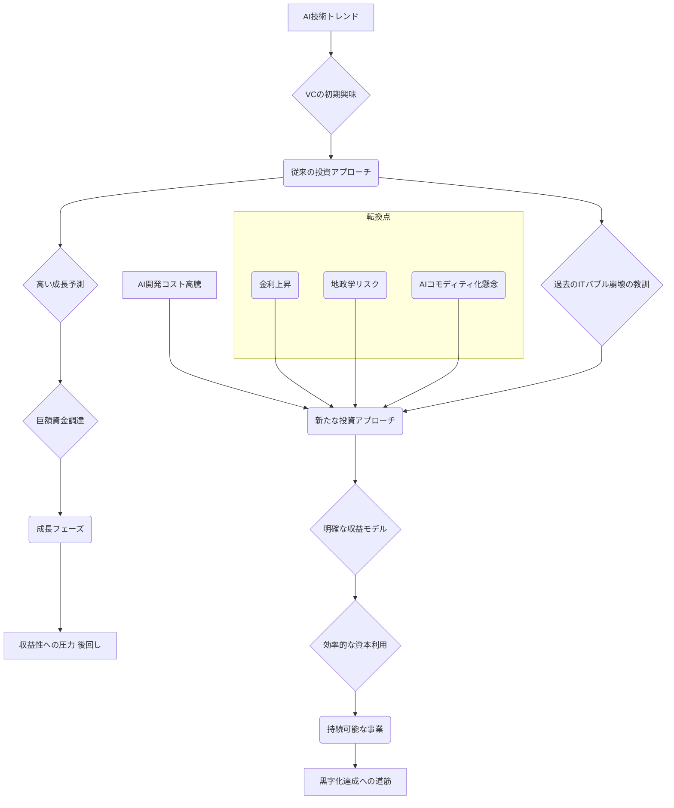

シリコンバレーで長年、数々のスタートアップの興隆と衰退を見つめてきた私だが、最近のAIスタートアップ界隈を覆う空気は、以前とは明らかに異質なものだ。かつての「成長あるのみ」「多少の赤字は未来への投資」といった楽観主義は影を潜め、今やベンチャーキャピタル（VC）の目線は、**「利益」と「持続可能性」**へと厳しくシフトしている。

まさに「AIスタートアップは、なぜ今、これほどまでに利益を問われるのか？」という問いが、資金調達の最前線で鳴り響いているのだ。この変化は、単に資金の出し渋りというレベルではない。シリコンバレーの投資思想そのものが、大きな転換点を迎えていることを意味している。この新しい常識を理解せずして、AI時代のビジネス戦略は語れない。

## かつての「成長至上主義」が終わりを告げるワケ

数年前まで、AIスタートアップの資金調達はまるで青天井のようだった。革新的な技術アイデア、ユーザー数の爆発的な成長予測、そして「次なるGoogleやAppleになり得る」という期待感が、巨額の投資を呼び込んでいた。特に生成AIの黎明期においては、その将来性こそが最大の評価軸であり、足元の収益性は二の次、三の次だったと言っても過言ではない。

しかし、ここにきて潮目が大きく変わった。複数の米テックメディアやVC筋からの情報では、2023年後半からAIスタートアップへの投資は鈍化し始め、特にアーリーステージ（初期段階）の企業にとっては厳しい冬の時代が到来している。背景にはいくつかの要因がある。

まず、**AIモデル開発と運用にかかる途方もないコスト**だ。LLM（大規模言語モデル）のトレーニングには、NVIDIAのような高性能GPUが数千枚から数万枚必要となり、そのコストは文字通り天文学的だ。運用フェーズに入っても、推論コストは高く、ユーザーが増えれば増えるほど赤字が膨らむ構造から抜け出せないスタートアップも少なくない。VCは、無限に続くと思われた「魔法のバケツ」が、実は底の抜けた高価なバケツであることに気づき始めたのだ。

次に、**金利上昇と市場の不確実性**が挙げられる。FRBの利上げは、VCが求めるリターン（投資回収）のハードルを押し上げた。低金利時代は「遠い未来の大きなリターン」に賭けやすかったが、高金利下では「短中期での確実なリターン」への要求が強まる。さらに、ウクライナ紛争やサプライチェーン問題、米中摩擦といった地政学的リスクは、未来予測の難易度を上げ、リスクヘッジとしての「手堅さ」をVCに求めさせている。

そして、**AI技術のコモディティ化の兆し**だ。特定のAIモデルや技術が、あっという間に競合他社にキャッチアップされ、差別化が難しくなるケースが増えている。これにより、技術そのものへの期待値が「持続的な競争優位」へと変換されにくくなり、結果として「その技術でどう稼ぐのか」という事業戦略がより重要視されるようになった。

こうした複合的な要因が絡み合い、AIスタートアップの資金調達環境は劇的な変化を遂げた。かつては夢を語れば資金が集まった時代から、今は**「夢の実現にどれだけのお金がかかり、いつ、どのようにしてそのお金を回収するのか」**という、極めて現実的な問いに答えられるスタートアップだけが生き残れる時代へと突入したと言えるだろう。

## 投資家の評価軸の変化：成長から利益、そして効率へ

この資金調達の潮目の変化は、VCがスタートアップを評価する際の「指標」にも如実に表れている。以前は「ユーザー数」「月間アクティブユーザー（MAU）」「年次経常収益（ARR）」といった、主に成長性を示す指標が重視された。しかし、今はこれに加え、あるいはこれ以上に**「ユニットエコノミクス」「粗利率（Gross Margin）」「黒字化への具体的な道筋」「資本効率（Capital Efficiency）」**といった、収益性と効率性を示す指標が厳しく見られている。

例えば、あるSaaS型AIサービスが急成長していても、顧客獲得コスト（CAC）が顧客生涯価値（LTV）を上回り、その差が広がる一方であれば、VCは「持続可能性がない」と判断する。AIスタートアップの場合、高性能なAIモデルを提供すればするほどコンピューティングコストがかさみ、ユニットエコノミクスが悪化しやすい構造を持つため、この点は特に厳しくチェックされる。

シリコンバレーの著名VC幹部の一人は「以前は『とりあえず市場を取りに行け、利益は後からついてくる』という考えだった。しかし、今は『市場を取りに行く前に、その市場でどうやって持続的に利益を上げるのか』という青写真がなければ、投資には踏み切れない」と語る。これは、AI技術の進化が目覚ましい一方で、それが必ずしも即座の収益化に直結しない現実を痛感した結果とも言える。

### 投資評価基準の比較：旧モデル vs 新モデル

| 評価項目             | 従来のVC評価基準（旧モデル）                 | 現在のVC評価基準（新モデル）                     |
| :------------------- | :------------------------------------------- | :----------------------------------------------- |
| **最重要指標**       | ユーザー数、成長率 (GMV, ARRなど)            | **ユニットエコノミクス、プロフィット**           |
| **投資判断の軸**     | 市場獲得、将来のポテンシャル                 | **短期〜中期での黒字化、持続可能性**             |
| **資金調達の頻度**   | 成長加速のための連続的な大型調達             | **必要最小限、効率的な資金利用**                 |
| **リスク許容度**     | 高い（高いリターンを期待）                   | 中程度、堅実な事業計画を重視                     |
| **コスト構造**       | コストよりも成長を優先、大規模投資を推奨     | **コスト効率、ROIを厳しく評価**                 |
| **注目技術**         | モデル開発、基盤技術の先進性                 | **アプリケーション、市場適合性（Product Market Fit）** |

この表を見れば一目瞭然だ。かつては「成長率」という数字の「大きさ」が評価されたが、今は「成長の**質**」が問われている。そして、その質の根幹にあるのが「利益を生み出す力」と「資本をいかに効率的に使うか」という点なのである。

この新たな投資環境で生き残るには、単に技術の優位性を謳うだけでは不十分だ。いかにその技術を費用対効果の高い形で顧客に届け、継続的な収益へと繋げるか、というビジネスモデルの構築が最優先される。

## AIスタートアップのサバイバル戦略：効率性とニッチ市場の開拓

では、この厳しい時代にAIスタートアップはどのように生き残れば良いのか。シリコンバレーの識者たちの間では、いくつかのサバイバル戦略が語られている。

### 1. コスト効率の徹底追求

前述の通り、AIは非常に高コストな技術だ。GPUの調達、モデルのトレーニング、推論、そして優秀なAIエンジニアの人件費。これらのコストをいかに最適化するかが、生存の鍵を握る。

例えば、自社でゼロから大規模モデルを開発するのではなく、既存のオープンソースモデルやAPIを活用し、自社のユースケースに特化したファインチューニングに注力することで、開発コストと時間を大幅に削減できる。また、クラウド利用においても、スポットインスタンスの活用や、より効率的なモデルアーキテクチャの採用など、徹底したコスト管理が求められる。

### 2. 明確なニッチ市場と収益モデルの確立

「全ての人に役立つAI」という壮大なビジョンも重要だが、まずは**「誰の、どのような具体的な課題を、AIで解決し、その対価としていくらもらうのか」**という、明確なニッチ市場と収益モデルを確立することが不可欠だ。

例えば、特定の業界（医療、金融、製造など）に特化し、その業界特有のデータと知見を深く学習させたAIソリューションは、汎用AIでは代替しにくい価値を生み出す。これにより、高付加価値なサービスを提供し、高い粗利率を確保することが可能になる。特定の法規制対応AI、専門家向けの高度なデータ分析AIなどが良い例だ。

### 3. 早い段階でのProduct Market Fit（PMF）達成

「Product Market Fit」（PMF）とは、市場が熱烈に求める製品やサービスを提供できている状態を指す。従来のVCは、PMF前のアイデア段階でも巨額を投じる傾向があったが、今はより早い段階でのPMF達成を求める。

そのためには、開発の早い段階から実際のユーザーと密接に連携し、プロトタイプを繰り返しテストし、フィードバックを素早く製品に反映させるアジャイルな開発プロセスが重要となる。不確実性の高いAI技術を扱うからこそ、市場のニーズと合致していることを早期に証明する必要があるのだ。

## シリコンバレーのAI投資、その変化を可視化する

投資家がAIスタートアップを評価する際のアプローチは、段階によって変化する。以前は技術先行型だったが、今は事業性先行型への移行が見られる。

この図が示すように、従来の投資アプローチは「高い成長予測」が最大のドライバーだった。しかし、高騰するAI開発コストや外部環境の変化が転換点となり、現在は「明確な収益モデル」と「効率的な資本利用」がより重視される、新たなアプローチへとシフトしている。過去のITバブル崩壊の経験が、VCに「地に足のついた」投資を促していることも忘れてはならない。

## 🧐 編集部の辛口オピニオン

このシリコンバレーにおけるAIスタートアップ投資の劇的な変化は、日本のAIエコシステムにとっても決して他人事ではない。いや、むしろ**日本の企業やスタートアップにとっては、この変化こそが「現実を直視し、生存戦略を再構築する」絶好の機会**と捉えるべきだ。

正直なところ、これまで日本の一部では「シリコンバレー流の巨額調達こそ正義」「赤字でも成長が全て」といった、少々幻想的な風潮が根強く残っていた感は否めない。しかし、その本家シリコンバレーが今、「利益」と「効率」という極めて手堅いビジネスの基本に立ち返っている。これは、「技術力は素晴らしいが、どうやって稼ぐのかが不明瞭」という、日本のスタートアップが古くから抱えてきた課題に対し、皮肉にもシリコンバレーが「答え」を示しているようなものだ。

日本のスタートアップは、最初から徹底したコスト意識と、地道だが確実に利益を生み出すビジネスモデルの構築に注力すべきだ。米国のように「まず市場を取りに行き、後から収益化を考える」という戦略は、もはやリスクが大きすぎる。逆に、日本が得意とする、特定の業界に深く入り込み、顧客の具体的な課題を地道に解決し、持続的な関係を築くようなアプローチこそが、この新しい時代には強みになり得る。

大企業も同様だ。安易に「AIだから」とスタートアップに投資するのではなく、その技術が自社の既存事業とどうシナジーを生み、いかに具体的な収益向上やコスト削減に繋がるのか、**「AI投資のROI（投資対効果）」**をこれまで以上に厳しく評価する必要がある。単なる「AI導入」という名の費用ではなく、「事業変革のための戦略的投資」として、そのリターンを明確に描けるかが問われる。

シリコンバレーの甘い蜜の時代は終わりを告げた。これからは、AIという強力なツールを、いかに「ビジネスとして成立させるか」という、地に足のついた視点が何よりも重要となる。夢物語だけではもう資金は集まらない。現実を見据え、収益性を追求する覚悟を持った企業だけが、真のAIエコノミーを築き上げることができるだろう。

## 💡 よくある質問（FAQ）

### Q: なぜ今、AIスタートアップの資金調達が厳しくなっているのですか？

A: 主な要因は三つあります。第一に、LLMなどのAIモデル開発・運用にかかる途方もないコスト。第二に、金利上昇や地政学的リスクによる市場の不確実性の高まり。第三に、AI技術の急速なコモディティ化により、技術優位性だけでは差別化が難しくなっていることです。これらが複合的に作用し、投資家はより「利益」と「持続可能性」を重視するようになりました。

### Q: この変化は日本のAIスタートアップにどのような影響を与えますか？

A: 日本のAIスタートアップにとっては、より厳しい資金調達環境となりますが、同時にビジネスモデルの堅実性を問われる良い機会でもあります。最初からコスト意識を高く持ち、特定のニッチ市場で明確な収益モデルを確立する戦略がより重要になります。グローバル市場で戦うには、この「利益優先」の潮流に適応し、効率的な事業運営を追求する覚悟が必要です。

### Q: 大手企業がAI技術を導入する際、どのような点に注意すべきですか？

A: 大手企業は、AI技術の導入において「ROI（投資対効果）」をこれまで以上に厳しく評価すべきです。単に「最先端技術だから」という理由で投資するのではなく、それが自社の既存事業の収益向上、コスト削減、あるいは新たな価値創造にどう具体的に貢献するのかを明確にする必要があります。AI投資を持続可能な事業戦略の一環として位置づけ、短期的な成果と長期的なビジョンを両立させることが求められます。

## 🔗 関連ツール・サービス

**[Crunchbase](https://www.crunchbase.com/)** — 世界中のスタートアップ資金調達、M&A、業界トレンドなどの包括的なデータベース。
**[PitchBook](https://pitchbook.com/)** — プライベート市場のデータ、リサーチ、ニュースを提供し、投資機会や動向を分析する。
**[Stripe Atlas](https://stripe.com/atlas)** — 世界中でスタートアップを設立し、法人登記から銀行口座開設、法務サポートまでを提供するサービス。