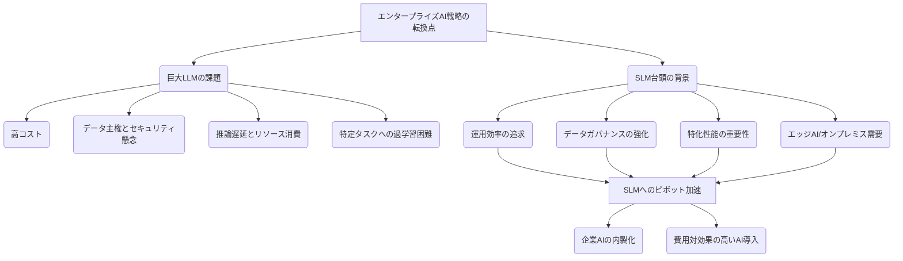

シリコンバレーのAI熱狂は、今や巨大な汎用モデル「LLM（大規模言語モデル）」一辺倒という見方に疑問符を突きつけ始めています。まるでAI市場の常識を覆すかのように、ここにきて「SLM（小規模言語モデル）」がにわかに注目を集め、エンタープライズ領域で存在感を増しているのです。

「また新たなバズワードか」と訝しがる方もいるかもしれません。しかし、これは単なる流行ではありません。高騰するLLMの運用コスト、データ主権とセキュリティへの懸念、そして何よりも「汎用性だけでは解決できない」ビジネス現場のリアルな課題が、企業をより小さく、より賢く、より特化されたAIへと向かわせているのです。このパラダイムシフトは、私たちのAI戦略を根本から見直すよう迫っています。

### LLMの限界が見えた日：なぜ企業は「小さく賢いAI」を求めるのか

昨年来、ChatGPTをはじめとするLLMが世界を席巻し、その汎用性の高さから「あらゆる問題はLLMで解決できる」という幻想が生まれました。しかし、熱狂の裏で、多くの企業がLLM導入後の現実的な課題に直面し始めたのがここ数ヶ月の動きです。最大の課題は、その**運用コスト**です。推論に膨大な計算リソースを必要とするLLMは、API利用料や専用インフラの構築費用が雪だるま式に増大し、予算を圧迫しています。

また、**データ主権とセキュリティ**も看過できない問題です。機密性の高い企業データを外部のLLMプロバイダーに預けることへの抵抗感は根強く、特に金融や医療といった規制の厳しい業界では、コンプライアンスの観点から慎重にならざるを得ません。さらに、LLMの**推論遅延**もビジネスのボトルネックになりかねません。リアルタイム性が求められるカスタマーサポートや現場での意思決定において、数秒の遅延が許容されないケースは少なくありません。

これらの課題が、企業を「より小さく、より制御しやすいAI」へと向かわせる原動力となっています。SLMは、特定のタスクやドメインに特化して学習されたモデルであり、LLMと比較してパラメータ数が大幅に少ないのが特徴です。その結果、必要な計算リソースが少なく、推論速度が速く、オンプレミスやエッジデバイスでの運用も現実的になります。これは、まるで汎用スーパーコンピューターから、特定の任務に特化した高速プロセッサへと回帰するような動きとも言えるでしょう。

LLMとSLMのこの対照的な関係は、企業のAI戦略において非常に重要です。LLMが広範な知識と柔軟な対話能力を持つ一方で、SLMは限られた領域で圧倒的な効率と精度を発揮します。

このトレンドは、AIを「購入して利用する」フェーズから「自社の業務に合わせて構築・運用する」フェーズへの移行を示唆しています。企業は、汎用的なLLMを広範なタスクに適用するのではなく、よりコスト効率が高く、セキュリティを確保しやすいSLMを、特定の業務プロセスに深く組み込むことで、AIの実用価値を最大化しようとしているのです。

### SLMが企業にもたらす3つの核心的メリット

企業がSLMにピボットする理由は多岐にわたりますが、特に重要視されるのは以下の3つのメリットです。これらは、単なるコスト削減に留まらない、事業変革の可能性を秘めています。

#### 1. 運用コストとパフォーマンスの最適化

LLMは、その巨大なモデルサイズゆえに、推論時には膨大な計算リソースを必要とします。クラウドAPIを利用する場合、利用量に応じた従量課金が高額になりがちですし、自社でホスティングするとなると、高性能なGPUサーバー群の導入と維持に莫大な初期投資と運用費用がかかります。

一方でSLMは、数百万から数十億程度のパラメータ数に抑えられており、比較的安価なCPUや低スペックのGPUでも高速な推論が可能です。これにより、APIコストの劇的な削減はもちろん、オンプレミス環境やエッジデバイスへのデプロイメントが現実的になります。特に、大量のクエリを処理する必要がある業務や、ネットワーク接続が不安定な環境での利用において、SLMは優れたパフォーマンスを発揮し、総所有コスト（TCO）を大幅に抑制できるのです。例えば、毎秒数百件のリクエストが来るようなシステムでLLMを使えばあっという間に費用が跳ね上がりますが、SLMであれば数分の1から数十分の1のコストで同等の、あるいはそれ以上の速度と精度で処理できる可能性があります。

#### 2. 強固なデータ主権とセキュリティ

企業にとって、機密性の高いビジネスデータは最重要資産です。外部のクラウドベンダーが提供するLLMのAPIを利用する場合、入力されたデータがどのように扱われ、学習に利用されるのか、その透明性が常に懸念事項として残ります。データが海外のサーバーに保存されることによる各国のデータ保護規制（GDPR、CCPA、日本の個人情報保護法など）への対応も複雑化します。

SLMを自社サーバー（オンプレミス）やプライベートクラウドに導入することで、企業はデータガバナンスを完全に掌握できます。データが企業の管理下から一歩も出ることなく処理されるため、情報漏洩のリスクを最小限に抑え、厳格なセキュリティ要件やコンプライアンス要件を満たすことが容易になります。これは特に、顧客の個人情報や企業の知的財産を扱う金融、医療、製造業などの分野で、SLMが決定的なアドバンテージとなる理由です。

#### 3. 特化された精度と迅速なデプロイメント

LLMは「なんでもできる」がゆえに、「特定のことはそこそこ」という側面も持ち合わせています。汎用的な知識は豊富でも、特定の業界用語、社内ルール、あるいは独特な業務フローに関する深い理解は、ファインチューニングを施しても限界があるのが実情です。

これに対し、SLMは最初から特定のタスクやドメインに焦点を絞り、関連性の高いデータセットで集中的に学習させることが可能です。これにより、汎用LLMでは達成が難しいレベルの専門性と精度を実現できます。例えば、特定の法律分野に特化したSLMは、その分野の弁護士を凌ぐ精度の法務相談を提供できる可能性があります。また、モデルサイズが小さいため、ファインチューニングのプロセスも迅速かつ効率的に行え、市場や業務要件の変化に合わせて柔軟にモデルを更新・デプロイできる点も大きな強みです。開発期間の短縮は、競合に対する優位性を確立する上で極めて重要です。

| 特徴 | 大規模言語モデル（LLM） | 小規模言語モデル（SLM） |
| :------- | :--------------------- | :--------------------- |
| **モデルサイズ** | 数百億～数兆パラメータ | 数百万～数十億パラメータ |
| **汎用性/特化性** | 高い汎用性、多様なタスク | 特定タスク・ドメインに特化 |
| **学習データ** | 膨大なウェブデータ | 厳選された特化データ |
| **運用コスト** | 高い（推論リソース大） | 低い（推論リソース小） |
| **推論速度** | 遅延が生じやすい | 高速 |
| **デプロイ場所** | クラウドAPI中心 | オンプレミス、エッジ、プライベートクラウド |
| **データ主権** | ベンダー依存のリスクあり | 自社で完全管理可能 |
| **セキュリティ** | クラウドベンダーのポリシーに依存 | 自社のセキュリティ基準を適用 |
| **ファインチューニング** | 難易度高、時間・コスト要 | 効率的、迅速 |
| **主な用途** | 広範な対話、コンテンツ生成、翻訳 | 社内ナレッジ検索、カスタマーサポート、特定データ分析、コード補完 |

### 成功事例に学ぶ：SLMはどのようにビジネスを変革しているか

SLMへのシフトは、単なる概念論ではなく、すでに多くの企業で具体的な成果を出し始めています。いくつか事例を挙げましょう。

ある大手製造業では、製品マニュアル、トラブルシューティングガイド、過去のメンテナンス記録といった膨大な社内ドキュメントを活用した「社内向けナレッジベース検索システム」にSLMを導入しました。以前は汎用LLMのAPIを利用していましたが、業界特有の専門用語の誤認識や、機密情報の外部流出リスクが懸念されていました。SLMを自社データでファインチューニングしオンプレミスで運用した結果、検索精度は飛躍的に向上し、かつデータは完全に社内に留まるため、セキュリティ担当者の承認もスムーズに得られました。これにより、技術者の問題解決時間が平均20%短縮され、顧客への対応スピードも向上したといいます。

また、ある金融機関では、特定の顧客セグメント向けのパーソナライズされた金融商品レコメンデーションシステムにSLMを採用しました。顧客の取引履歴、ポートフォリオ、ライフイベント情報といった機密性の高いデータを基に、市場の変動に合わせて最適な商品を提案するのですが、LLMではセキュリティ上の理由から実現が困難でした。SLMであれば、強固な閉域網内で学習・推論が行われ、かつ特定の金融商品の特性に最適化されているため、顧客一人ひとりに合致した精度の高い提案が可能になりました。これにより、顧客エンゲージメントの向上とクロスセル機会の増加に貢献しています。

さらに、ソフトウェア開発の現場でもSLMの活用が進んでいます。コード補完ツールや自動リファクタリングアシスタントとして、特定のプログラミング言語やフレームワークに特化したSLMが導入されています。汎用LLMよりもモデルが軽量であるため、開発者のローカルPC上でもスムーズに動作し、オフライン環境での利用も可能です。これにより、生産性向上だけでなく、機密性の高いソースコードを外部に送ることなくAIの恩恵を受けられるようになりました。

これらの事例が示すのは、SLMが単なる「LLMの劣化版」ではないという事実です。むしろ、特定の業務課題に対しては、LLMよりも効率的かつ安全に、そして費用対効果高くソリューションを提供できる「最適な選択肢」となり得るのです。企業は、AIを導入する際、まずその業務の性質、データの機密性、コスト制約などを総合的に判断し、SLMがより適切であれば、積極的にその活用を検討すべき段階に突入したと言えるでしょう。

### 日本企業が直面するSLM導入の課題と機会

米国でSLMへのピボットが加速する中、日本企業が直面する課題は少なくありません。まず、最も深刻なのが**AI人材の不足**です。LLMのAPIを利用するだけならば比較的容易ですが、SLMを自社データでファインチューニングし、オンプレミス環境で運用・保守するには、データサイエンティスト、機械学習エンジニア、インフラエンジニアなど、多岐にわたる専門知識を持った人材が不可欠です。多くの日本企業は、この専門人材の確保に苦慮しています。

次に、**既存システムとの連携**も大きな壁です。長年培ってきたレガシーシステムと、最新のSLMをどのように連携させるか。データのETL（抽出・変換・読み込み）プロセス、API連携、セキュリティプロトコルの適合など、技術的なハードルは決して低くありません。また、SLMを導入する前の**データ準備**も重要です。SLMの精度は、学習に用いるデータの質と量に大きく依存します。不適切なデータや不足したデータでは、SLMは期待通りの性能を発揮できません。しかし、多くの日本企業では、データが散在していたり、形式が不統一であったり、そもそも活用可能な状態にないケースが散見されます。

しかし、これらの課題は同時に、日本企業にとって大きな機会でもあります。日本は、製造業、医療、金融など、特定の分野で世界に誇る**高品質な専門データ**を豊富に保有しています。これらのデータは、汎用LLMが学習していない、あるいは学習しきれていない「宝の山」であり、これらを活用して独自のSLMを開発できれば、グローバルな競争優位性を確立できる可能性を秘めています。

また、**細やかな顧客対応や業務プロセスへの最適化**は、日本企業が伝統的に得意としてきた領域です。SLMは、まさにそうした細部にまでAIを浸透させるのに適したツールです。画一的なLLMでは対応しきれない、日本特有の商習慣や文化、言語のニュアンスを理解したSLMを開発することで、より顧客満足度の高いサービス提供や、従業員の生産性向上を実現できるでしょう。

重要なのは、LLMかSLMかという二元論ではなく、自社のビジネス課題とデータ特性に合わせた「最適なAI戦略」を策定することです。まずは、小さくても効果が見込める業務プロセスからSLMを導入し、成功体験を積み重ねながら、徐々に適用範囲を広げていくアプローチが現実的だと考えます。

## 🧐 編集部の辛口オピニオン

シリコンバレーで「SLMへのピボット」という声を聞くたび、私は日本のAI戦略に大きな危機感を覚えます。これまで日本企業は、ChatGPTのような汎用LLMの導入検討に多くの時間を費やし、そのコストとセキュリティ、そして「結局何に使うのか」という問いに逡巡してきました。その間に米国企業は、一歩早くLLMの限界を見定め、次の手「SLM」へと動き始めているのです。これは、まるでかつてのクラウド導入競争や、アジャイル開発への移行で遅れをとった状況と酷似しています。

はっきり言って、日本企業がこのSLMトレンドに乗り遅れれば、さらに深刻なAI格差が生まれるでしょう。米国企業が自社のデータと業務に最適化された「小さくても賢いAI」を内製し、運用コストを抑えながら機密性を保ち、圧倒的なスピードでサービスを展開する一方で、日本企業は高額なLLMのAPIを使い続け、データガバナンスに怯え、競合の後塵を拝することになる。これは絵空事ではありません。

私が日本企業に強く言いたいのは、「隣の芝生を見るのはもうやめろ」ということです。OpenAIやGoogleが次に何を出すかに一喜一憂するのではなく、今すぐ自社が持つ独自のデータ資産に目を向け、それをどうAIの力で価値に変えるかを真剣に考えるべきです。そのためには、まずは**「小さく始める勇気」**と**「自前でやりきる覚悟」**が求められます。

SLMは、LLMに比べてハードルが低いとはいえ、それでもAI専門人材の育成・確保、データの整備、そして既存システムとの泥臭い連携作業が不可欠です。これらを「外注任せ」にするのではなく、企業の中核戦略として位置づけ、トップダウンで推進する。そうでなければ、このSLMの波も、日本企業にとってはただの「見て見ぬふりをするべき新たな潮流」で終わってしまうでしょう。このままでは、日本が誇る高品質なデータも、ガラパゴス化したレガシーシステムの中に埋もれていくだけです。今こそ、痛みを伴う改革を断行する時なのです。

## 💡 よくある質問（FAQ）

### Q: SLMを導入する際、最初に考慮すべきポイントは何ですか？
A: まず最も重要なのは、具体的なビジネス課題とそれに紐づくデータセットの特定です。SLMは特化型であるため、解決したい問題が明確で、それに適した質の高い学習データが社内にあるかを確認することが成功の鍵となります。次に、運用環境（オンプレミスか、プライベートクラウドか）とセキュリティ要件を明確にし、それに合わせた技術スタックや人材を検討します。

### Q: LLMとSLMを組み合わせるハイブリッド戦略は有効ですか？
A: はい、非常に有効な戦略です。LLMを広範な知識や複雑な言語理解、初期のアイデア出しに活用し、SLMを特定の専門タスクやリアルタイム処理、機密性の高いデータ処理に用いることで、それぞれの長所を最大限に引き出せます。例えば、LLMでユーザーの意図を把握し、その後の専門的な回答生成やデータ参照はSLMに任せる、といった連携が考えられます。

### Q: 日本語に特化したSLMは存在しますか、またその精度はどうですか？
A: はい、日本語に特化して学習されたSLMは複数存在します。海外製の汎用LLMでは難しい、日本語特有の表現、文化、商習慣、そして業界専門用語のニュアンスをより正確に捉えることが可能です。日本の企業データで追加学習（ファインチューニング）を行うことで、その精度はさらに向上し、特定のタスクでは汎用LLMを凌駕する性能を発揮するケースも少なくありません。

## 🔗 関連ツール・サービス

**[Hugging Face Transformers](https://huggingface.co/transformers/)** — SLMの構築・ファインチューニングに必須のオープンソースライブラリです。
**[NVIDIA Triton Inference Server](https://developer.nvidia.com/triton-inference-server)** — SLMをはじめとするAIモデルの高性能推論を効率的にデプロイ・管理するプラットフォームです。
**[LangChain](https://www.langchain.com/)** — LLMとSLMを組み合わせた複雑なアプリケーションを構築するためのフレームワークです。
**[MLflow](https://mlflow.org/)** — SLMの開発ライフサイクル（実験管理、モデル追跡、デプロイ）を効率化するオープンソースプラットフォームです。