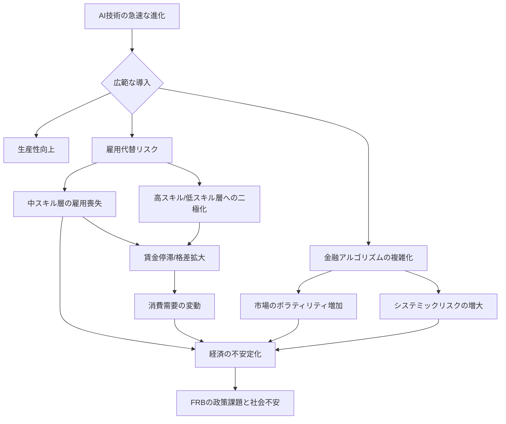

シリコンバレーのAI熱狂は、いまや金融界の中枢にまで届いている。テクノロジー企業が日夜、AIモデルの性能向上にしのぎを削る中、米国経済の舵取り役である**米連邦準備制度理事会（FRB）**が、その巨大な波がもたらすであろう「負の側面」に対し、明確な警鐘を鳴らしたのだ。これは、単なる失業問題や技術動向の議論ではない。FRBという、極めて保守的かつ慎重な機関が、AIの経済全体への**システミックリスク**を指摘したという事実に、我々は戦慄すべきだ。この警告は、米国の経済政策のみならず、世界中の企業、特に日本企業の経営戦略に大きな再考を迫るものとなるだろう。

### FRB、AIの「破壊的影響」に警鐘を鳴らす

FRBは、その政策決定や経済見通しにおいて、常に長期的な視点と広範な影響を考慮する。彼らが今回、AIについて発した警告は、単なる一時的なトレンドへの言及とは一線を画している。FRB議長をはじめとする幹部らは、ここ数ヶ月間の議会証言や公開討論で、AIがもたらす生産性向上の潜在力は認めつつも、その裏で進行する経済構造の破壊的変化への懸念を繰り返し表明している。

特に強調されているのは、**AIが雇用市場にもたらす変革の速度と規模**だ。過去の産業革命とは異なり、AIはホワイトカラー、特に中スキル層の職務を急速に代替する可能性を秘めている。これまでの技術革新が主に肉体労働や定型業務を置き換えてきたのに対し、AIは認知タスクや情報処理といった、これまで人間固有とされてきた領域にまで踏み込んでいる。FRBは、この変化が賃金格差を拡大させ、最終的には社会全体の消費行動や経済成長モデルに甚大な影響を与える可能性を指摘している。

FRBが警戒するのは、経済の根幹を揺るがす構造的な変化だ。AIの導入が一時的に効率を高める一方で、雇用喪失が広範囲に及べば、所得の偏在が進み、社会不安が増大する。また、金融市場におけるアルゴリズム取引の複雑化や、AIによるリスク評価モデルの同質性が、新たな金融危機のリスクを高める可能性も視野に入れている。この警告は、AIがもたらす恩恵とリスクのバランスを、政策当局がこれまで以上に真剣に考えるべき時期に来ていることを強く示唆している。

### AIがもたらす「5つの経済的脅威」を深掘り

FRBの警告は、AIが経済にもたらす脅威を具体的に列挙している。編集部で特に注目したのは、その指摘が短期的な課題にとどまらず、社会経済の構造そのものを変容させる可能性にまで及んでいる点だ。

1.  **大規模な雇用代替と構造的失業**: AIは特に定型的な認知タスクや情報処理業務において、人間を上回る効率と精度を発揮する。これにより、顧客サービス、データ入力、経理、一部の法務業務といった分野で大量の雇用が失われる可能性が高い。この失業は、一時的なものではなく、新たなスキルや職種への転換が困難な労働者にとって、恒久的な構造的失業となるリスクをはらんでいる。
2.  **賃金格差の拡大と労働参加率の低下**: AIを使いこなせる高スキル層と、AIに代替される低スキル層との間で、賃金格差がさらに拡大する。AIの恩恵は一部の専門家や企業に集中し、多くの中間層の所得は停滞あるいは減少する。これにより、労働市場から退出する人が増え、社会全体の労働参加率が低下する懸念がある。
3.  **金融システムの脆弱化**: 高度なAIモデルが金融市場の分析や取引に広く導入されることで、システムの複雑性が増大する。もし、多くの金融機関が類似のAIモデルを使用すれば、市場の異常な動きに対して一斉に同じ方向へ反応し、「フラッシュクラッシュ」のような瞬間的な市場暴落や、特定のアルゴリズムのバグが広範囲に連鎖的な影響を及ぼす「システミックリスク」が高まる。
4.  **プライバシーとデータ主権の問題**: AIの学習には膨大なデータが不可欠であり、個人のプライバシーや企業秘密の取り扱いに関する懸念が強まる。データが一部の巨大テック企業に集中することで、市場支配力が一層強化され、競争が阻害される可能性もある。経済活動の基盤であるデータが適切に管理されない場合、経済全体の信頼性が損なわれかねない。
5.  **政策対応の遅れと社会不安の増大**: AIの進化速度は極めて速く、政策当局がその影響を正確に予測し、適切な規制や支援策を講じるのが困難になる。経済構造の急激な変化に対応できない場合、国民の間で不満や不安が蓄積し、社会的な不安定化を招く恐れがある。

### 雇用市場の激変：ホワイトカラーと中スキル層の危機

FRBの警告の中でも特に切実なのが、雇用市場におけるAIの影響だ。これまで「安全」とされてきたホワイトカラー、特に中スキル層の職種が、AIによる自動化の最前線に立たされている。彼らの多くは、大学教育を受け、一定の専門スキルを持つが、その業務内容がAIの得意とするデータ分析、情報処理、パターン認識と重複する部分が多い。

例えば、コールセンターのオペレーターは、高度な会話AIやチャットボットによってその役割の多くが代替されつつある。法務分野では、AIが過去の判例や法律文書を瞬時に分析し、弁護士のアシスタント業務を効率化している。医療事務や経理処理、さらには一部のプログラミングやウェブデザインといったクリエイティブな分野でさえ、AIが生成するコードやデザインが初期ドラフトとして活用され、人間の介在を減らしている。

これは、単なる「機械が人間の仕事を奪う」という単純な話ではない。むしろ、AIは特定のタスクを効率化し、そのタスクのみを行っていた人材の必要性を減らす。その結果、残された人間には、AIでは代替できないような**複雑な問題解決能力、創造性、対人スキル、そしてAIを使いこなす能力**が求められるようになる。

日本においても、この傾向は深刻な課題となるだろう。少子高齢化による労働力不足という背景はあるものの、企業が競争力を維持するためにAI導入を加速すれば、その過程で既存の雇用構造は大きく揺らぐ。特に、長年培ってきた専門スキルがAIによって陳腐化する危機に直面する中高年層へのリスキリング（学び直し）投資は、企業の喫緊の課題だ。政府や教育機関も巻き込んだ、社会全体での大規模な人材再配置とスキルアッププログラムが不可欠となる。

| 職種カテゴリ | AIによる自動化リスク | 主な業務内容 | 日本企業への影響 |
|:---|:---|:---|:---|
| **定型データ処理職** (事務員、経理アシスタントなど) | **高** | データ入力、書類作成、帳簿記入、請求処理 | 大規模な効率化、人員再配置、コスト削減 |
| **顧客サービス職** (コールセンター、窓口業務など) | **中〜高** | 問い合わせ対応、FAQ応答、予約受付、トラブルシューティング | チャットボット・会話AI導入、品質管理の課題、顧客体験の変革 |
| **一部の専門職** (パラリーガル、リサーチアナリストなど) | **中** | 法務書類作成、市場調査、データ分析レポート作成 | 支援ツールとして活用、専門性の再定義、効率向上 |
| **現場作業・技能職** (製造ライン、建設作業員など) | **低〜中** | 製造ライン操作、建設作業、設備保守点検 | ロボットと協調、スキル高度化の必要性、安全性向上 |
| **創造的・戦略的職種** (研究者、経営戦略家、アーティストなど) | **低** | 新規事業開発、経営戦略策定、芸術作品創作 | AIは補助ツール、人間の役割はより重要に、協業の深化 |

### 金融システムの不安定化と「AIリスク」の不可視性

FRBが特に懸念するAIの経済的脅威の一つが、金融システムへの影響だ。金融業界は、データ処理と分析がビジネスの中核を占めるため、AIの導入が最も早く、そして深く進んでいる分野の一つである。しかし、この進化が新たな種類の不安定性を生み出す可能性をFRBは指摘する。

例えば、高度なAIを用いた**アルゴリズム取引**は、市場のわずかな変動を感知し、瞬時に大量の売買を行う。これが市場のボラティリティを増幅させ、予期せぬ「フラッシュクラッシュ」を引き起こすリスクがある。もし、多くの主要金融機関が類似のAIモデルやデータソースに依存していた場合、特定の市場イベントに対して一斉に同じ判断を下し、**連鎖的なシステム障害**や市場の機能不全を招く可能性があるのだ。

さらに、AIを用いた**信用リスク評価**や**詐欺検出**システムも、その「ブラックボックス」性が課題となる。AIモデルがなぜ特定の判断を下したのか、そのロジックが人間には理解しにくい場合が多い。これにより、もしAIモデルに**バイアス**が内在していたり、未知の脆弱性が存在したりしても、それに気づくのが遅れ、大規模な損失や差別的な信用供与につながる恐れがある。AIが作り出す複雑な金融商品は、そのリスク構造自体がAIでなければ理解できないレベルに達し、規制当局でさえその全体像を把握するのが困難になる。

FRBの役割は、金融システムの安定を維持することにある。彼らがAIのリスクをこれほど強調するのは、過去の金融危機がそうであったように、複雑で相互に関連したシステムにおける小さな脆弱性が、一瞬にして世界経済を揺るがす大問題に発展する可能性を熟知しているからだ。AI技術の進化が金融安定性にもたらす潜在的な脅威は、今後の金融規制のあり方、そしてAIガバナンスの国際的な協調において、極めて重要なテーマとなるだろう。

### 🧐 編集部の辛口オピニオン

FRBの警告は、日本企業にとって「対岸の火事」では決してない。むしろ、**AIがもたらす経済構造の激変は、少子高齢化と労働力不足という日本特有の課題と掛け合わされ、良くも悪くも米国以上に劇的な影響を及ぼすだろう。**

まず、ポジティブな側面として、AIは日本の深刻な労働力不足を補う強力なツールとなり得る。定型業務の自動化や生産性向上は、人手不足に喘ぐ中小企業にとって生命線となる可能性を秘めている。しかし、これは諸刃の剣だ。FRBが指摘するように、もし日本企業が漫然とAIを導入し、既存の雇用から安易にAIへの置き換えを進めれば、中高年層を中心とした大規模な「AI失業」が現実のものとなる。特に、年功序列や終身雇用といった日本型雇用慣行が残る企業では、リスキリングや再配置が遅れれば、社会全体でAIへの不満と格差が噴出しかねない。

現在の日本企業の多くは、AI導入をコスト削減や効率化の一環として捉えがちだ。しかし、FRBの警告が示唆するのは、AIは単なる「ツール」ではなく、経済のパラダイムそのものを変える「構造変革ドライバー」であるという認識の欠如だ。この認識不足こそが、日本経済の最大の脆弱性となるだろう。

日本企業に求められるのは、**場当たり的なAI導入ではなく、長期的な視点に立った「AI時代の雇用戦略」と「AIガバナンス」の策定だ。** 従業員への大規模なリスキリング投資はもはや企業の社会的責任であり、単なる福利厚生ではない。AIに代替される業務から、AIを使いこなし、AIと協調する新たな高付加価値業務への転換を、経営層がコミットして推進しなければ、日本は世界のAIエコシステムから取り残されるだけでなく、国内経済の安定性すら危うくする。

FRBが懸念する金融システムの脆弱化についても、日本は無関心ではいられない。複雑なアルゴリズム取引やAIによる信用評価が、国際的な金融市場全体に影響を及ぼす時代において、国内の金融機関が独自のAIリスク管理体制を確立することはもちろん、国際的な連携体制への貢献が不可欠だ。現状の日本のAI政策や企業戦略は、FRBが示す危機感とはまだ乖離があると感じざるを得ない。我々には、この「黒船AI」の到来を、単なる技術革新としてではなく、国家経済の存立をかけた一大変革として捉え直す勇気とスピードが求められている。

## 💡 よくある質問（FAQ）

### Q: FRBがAIに対して警鐘を鳴らす主要な理由はなんですか？
A: FRBは、AIがもたらす生産性向上の一方で、広範な雇用喪失、賃金格差の拡大、金融システムの不安定化、そして政策対応の遅れによる社会不安の増大といった、経済全体へのシステミックリスクを強く懸念しています。

### Q: AIによる雇用への影響は、これまでの産業革命とどう異なりますか？
A: 過去の産業革命が主に肉体労働や定型業務を代替してきたのに対し、AIはホワイトカラーの中スキル層が担う認知タスクや情報処理業務にまで影響を及ぼします。これにより、これまで安全とされてきた職種が自動化され、労働市場に構造的な変化をもたらす点が異なります。

### Q: 日本企業はFRBの警告にどのように対応すべきですか？
A: 日本企業は、AI導入を単なる効率化ツールとしてではなく、経済構造を変革するドライバーとして認識し、長期的な視点でAI時代の雇用戦略とガバナンスを策定すべきです。具体的には、従業員への大規模なリスキリング投資、AIと協調する新たな業務プロセスの構築、そして倫理的なAI利用とリスク管理の徹底が急務となります。

## 🔗 関連ツール・サービス

**[Coursera](https://www.coursera.org/)** — グローバルなオンライン学習プラットフォームで、AI時代に必要なスキルを習得できる多様なコースを提供。
**[PwC Japan](https://www.pwc.com/jp/ja/)** — AIガバナンス、倫理的AI、労働力変革に関するコンサルティングを提供し、企業がAIリスクに対応できるよう支援。
**[EY Japan](https://www.ey.com/ja_jp)** — AI戦略策定、AIの倫理的実装、そして変革期の労働力に関する助言を企業に提供するグローバルファーム。
**[OECD AI Policy Observatory](https://oecd.ai/)** — 経済協力開発機構（OECD）が提供する、AI政策に関する国際的なデータと分析のハブ。
---