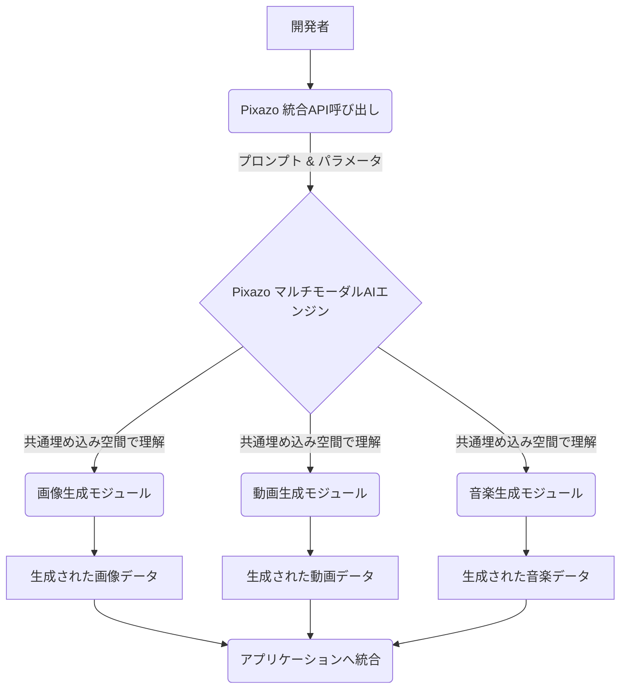

2026年4月17日、シリコンバレーからまた一つ、コンテンツ制作の未来を大きく変えかねないニュースが飛び込んできました。新進気鋭のAI企業Pixazoが、画像、動画、そして音楽の生成AI機能を統合したデベロッパーAPIを全世界に向けて公開したという報です。これは単なる新機能の発表ではありません。テキストから動画を生成するOpenAIのSoraがその半年後にサービス終了となるなど、激動の生成AI市場において、**マルチモーダルAIの「統合」と「開発者への開放」**という、明確な次なるステージを示唆する出来事として、編集部では極めて大きな注目を払っています。

これまでの生成AIは、画像なら画像、動画なら動画、音楽なら音楽と、それぞれのモダリティ（形式）で特化したツールが開発され、進化を遂げてきました。しかし、現実世界のコンテンツは、画像と音、動画と音楽のように、複数のモダリティが組み合わさって成立しています。Pixazoが今回打ち出したのは、まさにその「現実世界に近いコンテンツ生成」を、開発者が一つのAPIを通じて実現できるという画期的なアプローチです。この統合APIは、複雑なAIモデルの連携をPixazo側で吸収し、開発者にはシンプルなインターフェースを提供する点で、ゲーム開発者から広告クリエイター、さらには教育コンテンツ制作者に至るまで、あらゆる分野に計り知れないインパクトを与えるでしょう。

## マルチモーダルAIの統合が拓く「新たな創造の地平」

生成AIが急速に普及する中で、私たちが見てきたのは、単一のモダリティに特化した技術の進化でした。テキストからリアルな画像を生成するMidjourneyやStable Diffusion、あるいは短いテキストから驚くほど高品質な動画を作り出すSoraなどがその代表例です。しかし、これらのツールを使いこなして包括的なコンテンツを生み出すには、生成された各要素を別途組み合わせ、編集する手間が必要でした。この「編集の壁」が、クリエイティブなアイデアの実現を阻む要因となっていたのです。

Pixazoの登場は、この壁を根本から打ち破る可能性を秘めています。彼らが提供するAPIは、一つのプロンプトや一連の指示に対して、整合性の取れた画像、動画、そして音楽を一括して生成できる能力を持つとされています。例えば、「雨上がりの東京の街角で、ジャズを奏でるストリートミュージシャンの動画」という指示一つで、視覚情報だけでなく、背景音楽までが自動的に生成される世界を想像してみてください。これは、クリエイターがアイデアを具現化するまでの時間と労力を劇的に削減し、より多くの時間を創造的な思考に費やせることを意味します。

### 技術的挑戦とその克服：なぜ今、統合が可能に？

Pixazoがこのようなマルチモーダル統合を実現できた背景には、近年のAI研究における複数のブレークスルーが寄与していると見られます。一つは、異なるモダリティ間のセマンティック（意味論的）な関連性を学習する「共通埋め込み空間（Common Embedding Space）」の進化です。これにより、画像、動画、音楽といった異なるデータ形式であっても、AIは共通の概念理解に基づいた生成が可能になります。もう一つは、Transformerアーキテクチャの進化と、それを用いた大規模マルチモーダルモデルの登場です。大量の異なるデータセットを学習することで、それぞれのモダリティの特性を理解しつつ、全体としての整合性を保った出力を実現できるようになったのです。

編集部で特に注目したのは、この統合されたワークフローが、開発者にAIの複雑な内部構造を意識させることなく、直感的なコンテンツ生成を可能にする点です。上記のマーメイド図が示すように、開発者は単一の入り口から、三位一体のクリエイティブアウトプットを得られます。これは、AIの専門家ではない一般の開発者でも、高度な生成AIを自身のサービスに組み込むハードルを劇的に下げるものです。

## 開発者APIが変えるエコシステム：小規模から大規模まで

PixazoのデベロッパーAPI公開は、AIコンテンツ制作のエコシステムに新たな風を吹き込むでしょう。これまで、最先端の生成AIモデルへのアクセスは、大手企業や特定の研究機関に限定される傾向がありました。Soraのように高品質なモデルであっても、一般へのAPI提供が限定的であったり、そもそもサービス終了してしまうケースも散見されます。しかし、Pixazoは最初から「開発者への開放」を謳っており、これはあらゆる規模の企業や個人開発者が、その恩恵を享受できることを意味します。

中小企業やスタートアップにとっては、自社で高価なAIインフラを構築したり、専門性の高いAIエンジニアを雇用したりすることなく、最先端のマルチモーダルAI機能を活用できるチャンスです。例えば、マーケティング会社であれば、特定のキャンペーンに合わせた画像、動画広告、そしてBGMを一括生成し、瞬時にテストマーケティングを行うことが可能になります。ゲーム開発者であれば、ゲーム内のイベントシーンやキャラクターの感情表現に合わせた映像と音楽を、プログラムから動的に生成し、ユーザー体験をパーソナライズできます。

| 機能/サービス | Pixazo | OpenAI (Sora) | Adobe Firefly | RunwayML |
| :------------ | :----- | :------------ | :------------ | :------------ |
| **生成モダリティ** | 画像, 動画, 音楽 | 動画 (テキストベース) | 画像, テキスト効果, 動画 (一部) | 動画 (テキスト, 画像ベース) |
| **API提供** | あり | なし (一般公開終了) | あり | あり (限定的) |
| **ターゲット** | 開発者, クリエイター | 研究者, 大規模コンテンツスタジオ | プロクリエイター, 企業 | プロクリエイター, 映像制作者 |
| **特徴** | マルチモーダル統合, 開発者フレンドリー | 高品質な動画生成, 現実世界との整合性 | Adobeエコシステム連携, 著作権配慮 | 高度な動画編集機能, リアルタイム性 |

上記の比較表からもわかるように、Pixazoは「マルチモーダル統合」と「開発者への包括的なAPI提供」という点で、既存の主要サービスとは一線を画しています。OpenAIのSoraが短期間でサービスを終了したことからも、単一モダリティでの最高品質追求だけでなく、その汎用性や統合性、そしてアクセシビリティが市場における成功の鍵を握ることが示唆されます。Pixazoはこの教訓を踏まえ、より実用的なソリューションを提供しようとしていると分析できます。

## 日本市場への影響：クリエイティブ産業の変革と新たなビジネスチャンス

このPixazoの動きは、日本のクリエイティブ産業に大きな波紋を投じるでしょう。アニメ、ゲーム、広告、出版といったコンテンツ大国である日本において、マルチモーダル生成AIのAPIが一般に開放されることは、以下のような多角的な影響をもたらすと考えられます。

### コンテンツ制作の民主化と効率化
小規模なインディーゲーム開発者や個人クリエイターでも、大規模スタジオ並みのクオリティを持つ映像や音楽、画像を低コストかつ短期間で制作できるようになります。これにより、多様なアイデアが市場に出やすくなり、コンテンツの多様性が増す可能性があります。

### 新しい表現形式の探求
AIが生成する画像、動画、音楽を組み合わせることで、人間だけでは想像しえなかったような、全く新しい表現形式やアートが生まれるかもしれません。インタラクティブアート、パーソナライズされたストーリーテリング、AIと人間の共創による作品などがその一例です。

### 広告・マーケティングの高度化
ターゲット層に合わせた多様な広告素材（画像、動画、BGM）を自動生成し、A/Bテストを高速で回すことが可能になります。顧客の嗜好に合わせたパーソナライズド広告が、これまで以上に容易に、そして大規模に展開されるでしょう。

### 教育コンテンツの進化
教育分野では、テキストベースの教材だけでなく、解説動画やイメージ画像、理解を深めるためのBGMなどをAIがリアルタイムで生成し、学習者の理解度や興味に合わせてカスタマイズされた教材を提供できるようになります。

一方で、懸念事項がないわけではありません。生成されたコンテンツの著作権、倫理的な利用、そしてAIによるコンテンツの「均質化」といった問題は、依然として議論されるべき重要なテーマです。しかし、Pixazoのようなプラットフォームが提供する可能性は、これらの課題を上回るほどのビジネスチャンスとクリエイティブな潜在力を秘めていると編集部は見ています。

## 🧐 編集部の辛口オピニオン

PixazoのマルチモーダルAPI公開は、単なる技術的なニュースとして片付けてはならない。これは、シリコンバレーが日本のクリエイティブ産業に突きつけた、静かなる「挑戦状」だ。

正直に言わせてもらえば、日本の多くの企業は、AIの導入に関して依然として「様子見」の姿勢が強い。リスクを恐れ、既存のワークフローに固執し、他社の成功事例を待つばかりだ。しかし、今回のPixazoの動きは、そんな悠長な姿勢が致命的な遅れにつながることを明確に示唆している。

これまで、日本のコンテンツ産業は「職人の技」や「繊細な表現」を重視し、手作業による緻密な制作プロセスを誇りとしてきた。それは素晴らしい文化だ。だが、Pixazoが提供するのは、その「職人技」をAIの力で、圧倒的なスピードとスケールで「民主化」し、世界中の開発者に開放するという、全く異なるパラダイムだ。手作業で数週間かかっていた映像と音楽の制作が、APIを叩くだけで数分で完了する未来が、もうそこまで来ている。

日本の企業が今、やるべきことは何か。それは、職人技を捨てることではない。AIを「道具」として徹底的に使いこなし、人間のクリエイティビティを「拡張」する視点を持つことだ。自社の職人技とAIのスピードとスケールを融合させ、新たな価値を生み出すためのパイロットプロジェクトを立ち上げ、失敗を恐れずに試行錯誤する時期は、とっくの昔に過ぎている。今すぐ「攻め」の姿勢に転じなければ、世界中のアジャイルなスタートアップが、AIを武器に日本のクリエイティブ市場を席巻する日も遠くないだろう。Pixazoのような統合APIを「使わない」という選択肢は、もはやビジネスの自殺行為に等しいと断言しておきたい。

## 💡 よくある質問（FAQ）

### Q: PixazoのマルチモーダルAPIは、既存の単一モダリティAIとどう違うのか？
A: 複数のモダリティ（画像、動画、音楽）を一つのAPIでシームレスに生成できる点が最大の違いです。これにより、開発者は個別のAIモデルを統合する手間なく、複雑なコンテンツを効率的に制作できます。例えば、動画とそれに合うBGM、そしてサムネイル画像を同時に生成することが可能です。

### Q: Pixazo APIを利用する上での技術的な障壁は何か？
A: API利用の基本知識と、生成結果をアプリケーションに統合するスキルは必要ですが、高度なAIモデル開発知識は不要です。各モダリティの生成パラメータの調整や、生成されるコンテンツの倫理的・著作権的利用に関する理解が、開発者には求められます。

### Q: 日本企業がPixazoのようなAPIを導入するメリットは？
A: 開発リソースの節約、コンテンツ制作プロセスの高速化、多様なメディアを組み合わせた新しいユーザー体験の創出が可能です。特に、ゲーム、広告、教育分野でのパーソナライズされたコンテンツ生成や、多言語・多文化対応コンテンツの迅速な展開に威力を発揮します。

## 🔗 関連ツール・サービス

**[Pixazo API](https://api.pixazo.com)** — 画像、動画、音楽のマルチモーダル生成を統合したデベロッパー向けAPI。
**[RunwayML](https://runwayml.com)** — テキストから動画を生成し、高度な編集機能も備える主要なAI動画プラットフォーム。
**[ElevenLabs](https://elevenlabs.io)** — 高品質な音声合成と音声クローニングを提供する、AIを活用したオーディオ生成ツール。
**[Midjourney](https://www.midjourney.com)** — 卓越した品質の画像を生成する、世界的に人気の高いテキスト・トゥ・イメージAI。
---