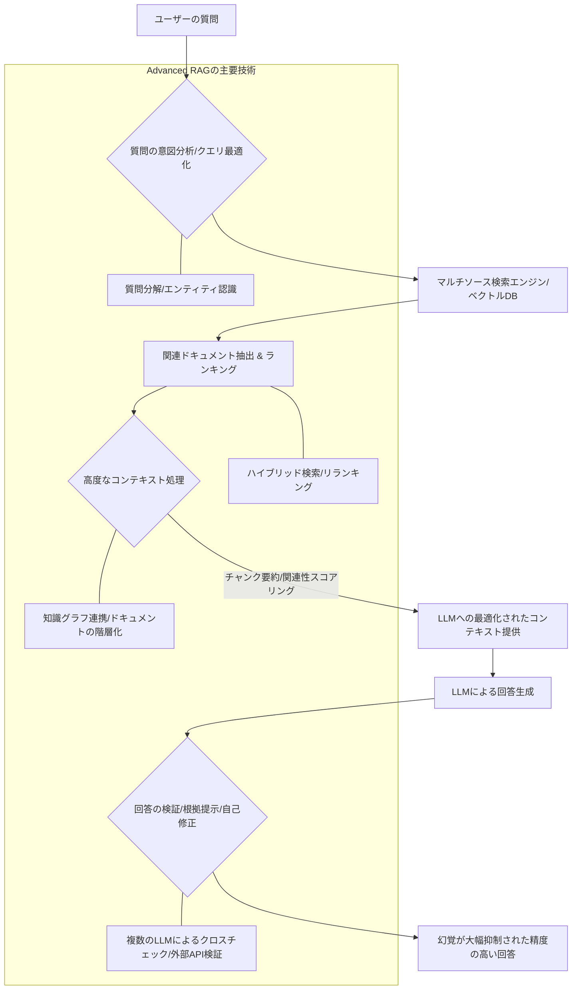

私たちのAIへの期待は常に高まる一方で、その「不完全さ」に悩まされてきたのもまた事実です。特に、大規模言語モデル（LLM）がまるで真実であるかのように誤った情報を生成する「幻覚（ハルシネーション）」は、多くの企業がAI導入に踏み切れない最大の障壁となってきました。しかし、シリコンバレーから飛び込んできた最新の研究結果は、その状況を一変させる可能性を秘めています。

AIの幻覚は、その致命的な欠陥として認識されてきましたが、ここにきて一筋の光が差し込んできたのです。最新の研究報告によると、**Retrieval Augmented Generation（RAG）技術の劇的な進化によって、AIが生成する幻覚を最大で40%も削減できる**ことが明らかになりました。これは単なる数字の改善にとどまらず、企業がAIを真に信頼し、実務に深く組み込むための扉を開く、まさにゲームチェンジャーとなり得るニュースです。我々が長年追い求めてきた「信頼できるAI」の実現が、いよいよ現実味を帯びてきたのです。

## AIの「幻覚」が招いた不信と停滞

「AIは嘘をつく」。このフレーズは、LLMの登場以来、その驚異的な能力の裏側で常に囁かれてきました。AIの「幻覚」とは、モデルが学習データに基づいてあたかも事実であるかのように、しかし実際には存在しない情報や誤った情報を生成してしまう現象を指します。例えば、架空の引用文献を提示したり、事実と異なる統計データを提示したり、さらには実在しない人物の言動を作り上げたりすることもあります。この問題は、特に企業がLLMを導入する上で深刻なリスクとなってきました。

多くの企業は、顧客対応の自動化、契約書のレビュー、R&Dにおける情報収集など、多岐にわたる業務でLLMの活用を検討しています。しかし、AIが生成した情報が誤っていた場合、顧客の信頼を損なうだけでなく、誤った経営判断につながったり、法的問題に発展したりする可能性も排除できません。実際に、過去にはAIが生成した誤情報が原因で、企業のイメージダウンや訴訟リスクに直面したケースも報告されています。編集部で特に注目したのは、法務分野での誤情報生成が、弁護士の業務効率化どころか、かえって手間とリスクを増大させているという指摘です。正確性が生命線となる領域で、AIの幻覚はまさに「毒」でしかありませんでした。

この「信頼できない」という側面が、多くの日本企業がAI導入に慎重な姿勢を崩さない大きな理由です。欧米企業が積極的にAIを業務に組み込む中、日本企業は常に品質と信頼性を重視する文化があり、AIの不確実性に対しては極めてデリケートに反応します。幻覚問題が解決されない限り、AIは「試してみる価値はあるが、重要な業務には使えないツール」という位置づけから脱却できず、結果として日本のAI活用は世界に遅れを取り続けるという悪循環に陥る可能性すら指摘されていました。この停滞感を打ち破るブレイクスルーが、まさに今、求められていたのです。

## RAG技術はなぜ幻覚を抑制できるのか？そのメカニズム

では、具体的にRAG技術がどのようにしてAIの幻覚を40%も削減できたのでしょうか。まず、RAGの基本原理を再確認しましょう。RAG（Retrieval Augmented Generation）は、大規模言語モデル（LLM）が回答を生成する際に、外部の信頼できる情報源から関連する情報を「検索（Retrieval）」し、その情報を参照しながら「生成（Generation）」を行うフレームワークです。これにより、LLMが学習データのみに依存して推論を行うことで発生する幻覚を抑制し、より事実に基づいた、正確な回答を生成することを目指します。

従来のRAGは、単純なキーワードマッチングやセマンティック検索を用いて、ユーザーの質問に関連するドキュメントの「チャンク（断片）」を抽出し、それをプロンプトの一部としてLLMに与えるのが一般的でした。しかし、この方法には限界がありました。検索精度が不十分な場合、関連性の低い情報がLLMに渡され、結果として幻覚につながる可能性があったのです。また、複雑な質問に対しては、一つのチャンクでは不十分であったり、逆に情報が多すぎてLLMが混乱したりするケースも散見されました。

最新の研究で幻覚を最大40%削減した「Advanced RAG」は、これらの課題を克服するために、検索から生成に至るまでのプロセス全体にわたって複数の革新的なアプローチを組み込んでいます。

上記のMermaid図で示したように、Advanced RAGは、以下のような要素によって構成されています。

### ### Advanced RAGの主要な技術革新

1.  **質問の意図分析とクエリ最適化**: ユーザーの質問を単なるキーワードとして捉えるのではなく、その背後にある真の意図や必要な情報を深く分析します。必要に応じて質問を複数のサブクエリに分解したり、質問に含まれるエンティティ（固有名詞など）を認識して検索に活用したりします。
2.  **マルチソース検索とハイブリッド検索**: 社内ドキュメントだけでなく、公開されている信頼性の高い情報源や、特定のデータベースなど、複数の情報源から横断的に検索を行います。キーワードベースの検索とベクトル埋め込みによる意味検索を組み合わせた「ハイブリッド検索」により、より高い精度で関連情報を取得します。
3.  **高度なドキュメント処理とランキング**: 検索で得られたドキュメントを、単に分割するのではなく、要約、重要な情報の抽出、情報間の関連性分析などを行い、LLMに渡すコンテキストを最適化します。また、リランキングモデルを導入し、LLMにとって最も有用な情報を優先的に提示します。
4.  **知識グラフとの連携**: 構造化された知識グラフと連携することで、情報間の関係性を明確にし、より論理的で正確な情報をLLMに提供します。これにより、抽象的な概念や複雑な因果関係に関する幻覚を抑制します。
5.  **回答の検証と自己修正**: LLMが生成した回答を、検索で得られた元の情報源と照らし合わせ、その根拠が明確であるか、矛盾がないかを検証します。必要に応じて、複数のLLMによるクロスチェックを行ったり、外部APIを利用して事実確認を行ったりすることで、最終的な回答の信頼性を高めます。

これらの技術要素が複合的に作用することで、LLMが「知ったかぶり」で情報を生成する余地を最小限に抑え、常に「根拠に基づいた」回答を生成することが可能になるのです。この40%という数字は、これらの徹底した幻覚抑制戦略の成果と言えるでしょう。

| 特徴       | 基本的なRAG                                      | Advanced RAG (最新研究で40%抑制に貢献)                       |
| :--------- | :----------------------------------------------- | :------------------------------------------------------------- |
| 検索手法   | キーワードマッチ、単純なセマンティック検索       | 意味的理解度向上、ハイブリッド検索、メタデータ活用、質問分解   |
| ドキュメント処理 | 単純なチャンク分割、固定サイズ                   | 階層的チャンキング、要約生成、ルーティング、知識グラフ連携、エンティティ抽出   |
| コンテキスト提供 | 検索結果をそのままLLMへ提供                      | LLMのタスクに合わせたコンテキスト再構築、プロンプト最適化、根拠の明示   |
| 回答生成   | LLMの出力そのまま、事実確認は人間                 | 出力検証 (根拠チェック)、自己修正、複数のLLMアンサンブル、外部API連携   |
| 幻覚抑制度 | 一定の効果あり、誤情報の可能性残る                 | 大幅な抑制 (最大40%減、研究により)、信頼性の大幅向上        |
| 導入難易度 | 中（ツールやフレームワークで比較的容易）           | 高（より専門的な知識とエンジニアリング、複雑なシステム連携が必要）   |

## 40%削減の衝撃：企業がAIを信頼できる時代へ

AIの幻覚が40%削減されたという研究結果は、企業のAI活用戦略に計り知れない影響を与えるでしょう。これまでのAIは、「面白いが、まだ実務には危険が伴う」という評価が付きまとっていました。特に、企業が最も求めていたのは、情報収集や意思決定をサポートするAIの「信頼性」でした。この40%の削減は、その信頼性のハードルを一気に引き上げるものです。

具体的に、この進歩はどのようなビジネスインパクトをもたらすのでしょうか。

まず、**顧客サポートの質的な向上**が挙げられます。正確な情報に基づくAIチャットボットは、顧客からの問い合わせに対して迅速かつ的確な回答を提供し、顧客満足度を大幅に向上させることが期待できます。誤情報による顧客からのクレームや不信感のリスクが大幅に減少すれば、企業はより安心してAIを活用できるようになるでしょう。

次に、**専門業務の効率化と品質担保**です。法務、財務、研究開発、医療といった高い専門性と正確性が求められる分野では、AIの幻覚は許されません。Advanced RAGによって幻覚が抑制されれば、AIは契約書レビュー、市場分析、臨床研究における情報整理、診断支援など、人間の専門家を補完する強力なツールとなり得ます。AIが生成したドラフトを人間が最終チェックする手間は依然として必要ですが、その労力は格段に減少し、業務全体のボトルネックが解消されるでしょう。

さらに、**社内ナレッジマネジメントの劇的な変革**も期待できます。膨大な社内ドキュメントやデータの中から、従業員が必要な情報を正確に、そして迅速に引き出すことが可能になります。これは、新入社員のオンボーディング期間の短縮や、ベテラン社員の知識継承、部門間の情報共有の円滑化に直結し、企業の生産性全体を底上げすることになります。編集部は、特に日本企業でよく見られる「属人化された知識」の解消に、RAGが強力な武器となると見ています。

この40%という数字は、単なるベンチマーク上の改善に留まりません。それは、AIが私たちのビジネスプロセスにおいて「信頼できるパートナー」としての地位を確立するための、重要な一歩となるのです。AIの「説明可能性（Explainability）」という観点からも、RAGは回答の根拠となった情報源を提示できるため、AIがなぜそのような回答を生成したのかを人間が理解しやすくなり、さらなる信頼構築に貢献します。企業は「AIに任せられる業務の範囲」を拡大し、より戦略的な人材配置や事業展開に注力できるようになるでしょう。

## 日本企業はRAG進化にどう向き合うべきか？

このAdvanced RAGの進化は、日本企業にとって「AI活用の転換点」となり得ます。長らくAIの信頼性という課題に直面し、慎重な姿勢を続けてきた日本企業にとって、この40%削減は具体的な行動を促す強力なシグナルです。では、日本企業はこのRAG進化にどのように向き合うべきでしょうか。

まず最も重要なのは、**「データ主権」を堅持したRAG戦略の構築**です。日本企業は、顧客情報や機密性の高い社内データをクラウド上のLLMプロバイダーに預けることに強い抵抗感を持っています。このため、オンプレミス環境やプライベートクラウド環境で動作するローカルLLMとRAGを組み合わせるアプローチが極めて重要となります。自社データが外部に流出するリスクを最小限に抑えつつ、Advanced RAGの恩恵を最大限に享受するためのアーキテクチャ設計が不可欠です。

次に、**社内知識ベースの整備とベクトルデータベース戦略の立案**です。RAGの性能は、参照する情報源の品質に大きく依存します。乱雑なファイルサーバに眠るドキュメントや、フォーマットが統一されていない資料では、どれだけRAG技術が進化してもその真価を発揮できません。社内のあらゆるドキュメント（報告書、マニュアル、FAQ、過去の議事録など）を体系的に整理し、適切なメタデータを付与して管理する「ナレッジエンジニアリング」への投資は、もはや待ったなしです。また、これらを効率的に検索・管理するためのベクトルデータベースの選定と導入も、RAG戦略の中核をなします。高性能なベクトル検索と効率的なインデックス管理が、Advanced RAGの性能を左右します。

さらに、**小規模なパイロット導入から全社展開へのロードマップの策定**が求められます。Advanced RAGは、従来のRAGよりも複雑な技術要素を内包しているため、一足飛びに全社導入を目指すのは現実的ではありません。まずは、特定の部門や業務に絞り、具体的な課題解決を目的としたパイロットプロジェクトを開始すべきです。そこで得られた知見や成功体験を基に、段階的に適用範囲を拡大していく「スモールスタート・アジャイル展開」のアプローチが有効でしょう。この際、技術部門とビジネス部門が密に連携し、AIの導入効果を定量的に評価する体制も構築しなければなりません。

最後に、**セキュリティとガバナンス体制の強化**です。幻覚が40%削減されたとはいえ、完全にゼロになるわけではありません。AIが生成した情報の最終確認プロセス、誤情報が発生した場合の対応プロトコル、データ利用に関する社内ポリシーの策定など、AIの利用に伴うリスクを管理するためのガバナンス体制は引き続き重要です。特に、倫理的な側面や公平性に関するガイドラインも、技術の進化と並行して議論し、整備していく必要があります。

このRAGの進化は、日本企業がAI後進国というレッテルを返上し、世界をリードするAI活用企業へと変貌を遂げるための絶好のチャンスです。今、行動を起こさなければ、この機会を逃し、さらに大きな遅れを取ることになりかねません。

## 🧐 編集部の辛口オピニオン

シリコンバレーでこのニュースを聞いたとき、正直言って「日本企業はまた様子見か？」という懸念が頭をよぎりました。RAGによる幻覚40%削減は、AI活用における「信頼性」という最大の壁を崩す、まさにブレイクスルーです。これまでの「AIはまだ危なっかしい」という言い訳は、もはや通用しません。にもかかわらず、「ウチの会社にはまだ早い」「もう少し枯れてから」などと言って、またしても周回遅れになるのではないかと危惧しています。

日本企業は、往々にして完璧なソリューションを待ちすぎる傾向があります。しかし、AIの世界は待ってくれません。このAdvanced RAGの技術は、導入難易度が低いわけではありませんが、そのリターンは計り知れません。情報漏洩リスクを理由にクラウドAIに二の足を踏んできたのであれば、オンプレミスRAG構築に本気で舵を切るべきです。社内データが散逸しているというなら、今すぐにでもデータ整備に莫大な予算と人員を投入すべきです。

「データがない」「エンジニアがいない」といった課題は、もはや言い訳にはなりません。これらはAIを導入する上で、避けて通れないインフラ投資です。Advanced RAGは、AIを「お試しツール」から「基幹業務を支えるインフラ」へと格上げする技術です。この波に乗れず、いつまでも手動プロセスや旧態依然とした情報管理に依存していれば、国際競争力は失われる一方でしょう。

もはや、AI導入は「オプション」ではありません。「生存戦略」です。このRAG進化を真摯に受け止め、リスクを恐れず、しかし慎重に、そして大胆にAI活用を推進する企業だけが、これからのビジネスを生き残れると断言しておきます。

## 💡 よくある質問（FAQ）

### Q: RAGはすべてのAI幻覚をなくせますか？
A: いいえ、RAG技術はAIの幻覚を大幅に削減しますが、完全にゼロにすることは現状では困難です。しかし、今回の研究で最大40%削減されたことで、その信頼性は飛躍的に向上し、多くの企業が許容できるレベルに近づいています。AIの生成物を最終確認する人間の役割は、引き続き重要です。

### Q: Advanced RAGを導入するために必要なものは？
A: Advanced RAGの導入には、高性能なベクトルデータベース、品質の高い社内知識ベース（ドキュメントの整理・構造化）、そして高度なAIエンジニアリングスキルが必要です。特に、質問の意図分析、ハイブリッド検索、回答検証などのプロセスを最適化するための専門知識が求められます。

### Q: オンプレミスRAGとクラウドRAG、どちらが良いですか？
A: 企業のセキュリティポリシーやデータ機密性によって異なります。機密性の高いデータを扱う場合は、データ主権を確保できるオンプレミスRAGが推奨されます。一方、導入の容易さやコストパフォーマンスを優先するなら、クラウド上で提供されるRAGサービスも選択肢となり得ます。両者のメリット・デメリットを比較検討し、自社に最適な戦略を立てることが重要です。

## 🔗 関連ツール・サービス

*   **[Pinecone](https://www.pinecone.io/)** — スケーラブルなベクトルデータベースで、RAGの検索基盤を強化します。
*   **[LangChain](https://www.langchain.com/)** — RAGシステム構築を効率化するオープンソースフレームワークです。
*   **[Weaviate](https://weaviate.io/)** — 知識グラフ機能も持つベクトルデータベースで、より高度なRAG実装を支援します。