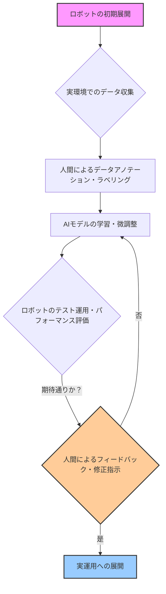

シリコンバレーの取材を始めて15年になりますが、技術の進化は常に私たちの想像を超えてきました。しかし、2026年の今、AIブームがもたらしている新たな潮流は、少々意外な方向へと進んでいるようです。それは、AIの究極の目標である「完全自動化」のその先に、**「人間による指導」**という、極めてアナログな役割が不可欠となっている現実です。

Business Insiderが報じた通り、「AIブームによってロボットを訓練する仕事が新たな高給職になっている」というニュースは、まさにその象徴と言えるでしょう。私たちはAIが人間の仕事を奪うと警戒してきましたが、実際にはAIの進化が、これまで存在しなかった新たな仕事を生み出しているのです。しかも、それが非常に専門的で、人間ならではの感覚を要求する職種だというから、話は一層興味深い。

## 🤖 「ロボットトレーナー」とは何か？AI進化の最前線で求められる新技能

「ロボットトレーナー」と聞いて、多くの方はSF映画に出てくるような、ロボットを操縦するパイロットのような姿を想像するかもしれません。しかし、現実に今、シリコンバレーで需要が爆発的に高まっているこの職種は、もっと地味で、それでいて極めてクリティカルな役割を担っています。彼らの仕事は、AIを搭載したロボットが現実世界で適切に機能するための**「教師役」**です。

具体的には、ロボットが周囲の環境を認識し、状況に応じて正しい判断を下せるよう、膨大な量のデータを収集し、アノテーション（意味付け）し、そしてロボットの誤った行動を修正するためのフィードバックを与えます。考えてみてください。工場で部品を掴むロボット、倉庫で荷物を運ぶロボット、配達で道を走るロボット。彼らは日々、予測不可能な環境変化、不規則な物体、そして稀に発生する異常事態に直面します。これらすべてをAIモデルが完璧に学習することは、現在の技術では不可能です。そこで人間の出番となるのです。

フィジカルAIと呼ばれる、現実世界で動作するAIロボットにとって、机上のシミュレーションだけでは限界があります。実際の多様な環境下で、人間が「これは良い行動」「これは間違った行動」と教え込むことで、初めてロボットは真に賢くなる。このプロセスは「ヒューマン・イン・ザ・ループ（Human-in-the-Loop）」とも呼ばれ、人間の介入なしには、AIロボットの進化は立ち行かない現実を示しています。

私がこのトレンドを追う中で注目したのは、特に**汎用性の高いロボット（General-Purpose Robots）**の分野です。特定のタスクに特化したロボットとは異なり、汎用ロボットは未知の環境や多様なタスクへの適応が求められます。ここにこそ、人間の教師役が不可欠となるのです。

上記は、ロボットトレーニングの典型的なワークフローを示しています。特にステップCとFは、人間が直接介入し、ロボットの知覚と意思決定能力を向上させる上で極めて重要です。このサイクルを何度も繰り返すことで、ロボットはより賢く、より自律的になっていきます。

## 🤔 なぜ今、人間による「教師」が必要なのか？データと倫理の狭間で

AI技術が飛躍的に進歩したとはいえ、物理世界における「常識」や「臨機応変な対応」は、まだ人間の専売特許です。例えば、工場で予想外の場所に落ちた部品をどう扱うか、配達中に突然現れた障害物をどう回避するか。これらはAIが膨大なデータからパターンを学習しても、**エッジケース（例外的な状況）**として処理が難しい場面が多々あります。

人間のロボットトレーナーは、こうしたエッジケースを特定し、ロボットに適切な行動を教え込む役割を担います。単にデータを与えれば良いというものではありません。どのような状況で、なぜロボットが間違った判断を下したのかを分析し、それに合わせて学習データやアルゴリズムの調整を指示する深い洞察力が求められます。これはまるで、子供に世界のルールや危険を教え込む親のようなものです。

また、**倫理的な側面**も無視できません。自動運転車が事故に遭遇した際、乗員の安全と歩行者の安全、どちらを優先すべきか。工場ロボットが作業員の安全と生産効率、どちらを優先すべきか。このような「価値判断」をAIに完全に委ねることはできません。トレーナーは、ロボットが倫理的なジレンマに直面した際に、人間社会の規範に基づいて行動できるよう、その判断基準を「学習」させる責任も負います。これは単なる技術的な課題ではなく、哲学的な問いかけでもあります。

AIが賢くなるほど、その行動が社会に与える影響は大きくなります。だからこそ、AIが「何を」「どのように」学ぶのかというプロセスに、人間の責任と知恵が深く関与する必要があるのです。

## 💰 『高給』の裏側：ロボットトレーナーに求められる専門性と市場価値

Business Insiderの記事が指摘するように、「ロボットトレーナー」は今や高給な職種の一つとして注目されています。なぜこれほどまでに市場価値が高いのでしょうか？

その理由は、この職種が単なる肉体労働や単純作業ではない、高度な専門性と多岐にわたるスキルを要求するからです。AIモデルの挙動を理解する**機械学習の基礎知識**、ロボットのハードウェアを操作し、その限界を知る**ロボティクス工学の理解**、収集したデータを分析し、改善点を特定する**データ分析能力**、そして何よりも、予測不可能な状況下で問題解決に導く**批判的思考力と柔軟性**が求められます。

さらに、ロボット開発チームのエンジニアと密に連携し、複雑な情報を正確に伝える**コミュニケーション能力**も不可欠です。これらのスキルセットは、一朝一夕で身につくものではありません。多くの場合、コンピューターサイエンス、ロボティクス、認知科学などの分野での学士号や修士号を持ち、さらに実践的な経験を積んだ人材がこのポジションに就いています。

シリコンバレーでは、経験豊富なロボットトレーナーが年間10万ドル（約1500万円）を超える給与を得ることも珍しくありません。これは、彼らの専門知識がAIロボットの商業的成功に直結する、極めて重要な要素であると認識されている証拠です。

| 項目              | ロボットトレーナー（新興職種）                                   | 従来の製造オペレーター（参考）                                 |
| :---------------- | :------------------------------------------------------- | :----------------------------------------------------- |
| **主要業務**      | ロボットの学習データ収集、AIモデル調整、動作指導、倫理的側面評価、エッジケース対応 | 機械操作、品質管理、保守、故障対応、ルーティン作業の実行     |
| **必要なスキル**  | AI/ML基礎、ロボット制御、データ分析、問題解決、批判的思考、コミュニケーション、倫理観 | 特定機械操作スキル、品質検査、安全性知識、物理的耐久性       |
| **求められる思考**| 柔軟性、適応性、未来志向、試行錯誤、人間中心設計               | 効率性、正確性、再現性、現状維持志向、安全第一               |
| **市場価値**      | 高い専門性、新興市場での需要大、供給不足感が顕著                 | 経験に依存、自動化による変化の可能性、スキル再構築の必要性     |

この表からもわかるように、ロボットトレーナーは単に既存のスキルを流用するだけでは務まらない、全く新しい職能を要求される専門職なのです。

## 🇯🇵 フィジカルAI時代の新たな人材像：日本企業への示唆

この「ロボットトレーナー」という職種の台頭は、日本企業、特に製造業や物流、医療といった分野に大きな示唆を与えます。日本は長らくロボット技術の先進国として知られていますが、それは主に「ティーチングプレイバック方式」に代表される、プログラミングされた動作を忠実に再現する産業用ロボットの領域でした。しかし、AIと融合した「フィジカルAI」、つまり自律的に学習し、適応するロボットが主流となる時代においては、アプローチの転換が不可欠です。

日本企業は、往々にして新しい技術の導入において「全てを自動化すること」をゴールとしがちです。しかし、シリコンバレーのトレンドは、完全な自動化の前に、人間の「教師」がロボットの知能を育むフェーズが極めて重要であることを示唆しています。

これは、単に欧米のトレンドを追従するという話ではありません。日本の強みである「現場の知恵」や「匠の技」を、AIロボットにどう伝承していくか、という新たな挑戦と捉えるべきです。熟練の職人やベテラン作業員が持つ暗黙知を、ロボットが学習可能なデータとして抽出し、それをロボットに「教え込む」役割こそ、日本がリードできる分野かもしれません。

教育システムも変革が求められます。AIやロボティクスに関する専門知識に加え、倫理観、問題解決能力、そして人間とAIロボットが協調して働くための「協調性」を育む教育プログラムが急務です。ロボットを「使う」側から「育てる」側へと、人材育成の視点をシフトする必要があります。

そうしなければ、日本の製造現場や物流倉庫が世界標準のAIロボットに置き去りにされかねません。2026年というこの時期に、私たちはこの「ロボットトレーナー」の存在から、未来の働き方と、AIとの共存のあり方を真剣に問い直す必要があるのです。

## 🧐 編集部の辛口オピニオン

正直なところ、多くの日本企業は、この「ロボットトレーナー」という概念にピンと来ていないのではないか、というのが私の懸念です。日本は「カイゼン」文化に代表されるように、既存のプロセスを極限まで効率化することには長けています。しかし、ゼロから新しい職種を定義し、それを育成するための投資を迅速に行うことには、依然として躊躇が見られます。

現状、多くの企業が考えるAI導入は「コスト削減」や「省人化」が主眼であり、そのために「完全自動化」を夢見ています。しかし、今回のトレンドが示すのは、完全自動化への道のりは、むしろ高度な人間的介入を必要とする、という逆説的な事実です。このパラドックスを理解せず、「AIは魔法の杖」とでも言うかのように、ただ導入すれば全てが解決すると考えている企業は、今後深刻な人材不足と技術的な壁に直面するでしょう。

私は敢えて言いたい。日本企業よ、もう「失われた30年」の轍を踏むな、と。AIロボットの導入は、単なる機械の置き換えではありません。それは、人間と機械の新しい協働関係を構築する「組織文化の変革」そのものです。ロボットトレーナーという新たな専門職に積極的に投資し、日本の強みである「現場の知恵」と組み合わせることで、初めて真の競争力を生み出せる。そうでなければ、私たち日本は、またしても世界のAIロボット革命の傍観者に甘んじることになるでしょう。未来は待ってくれません。今すぐ行動すべきです。

## 💡 よくある質問（FAQ）

### Q: ロボットトレーナーの仕事に学歴は必須ですか？
A: 必ずしも必須ではありませんが、コンピューターサイエンス、ロボティクス、機械学習、認知科学などの分野で学士号や修士号を持つ人材が多いのは事実です。これらの知識は、ロボットの動作原理やAIモデルの挙動を深く理解するために役立ちます。しかし、最も重要なのは、実務経験と、未知の問題に対する解決能力、そして人間ならではの洞察力です。

### Q: ロボットトレーナーの仕事はAIによって自動化される可能性がありますか？
A: 長期的には、ロボットトレーナーの業務の一部がAIによって支援される可能性は十分にあります。例えば、データのアノテーション作業の効率化や、ロボットの異常検知などはAIが得意とする分野です。しかし、人間のような複雑な判断、倫理的評価、そして予測不可能なエッジケースへの対応を完全に自動化することは、当面の間は非常に困難と考えられています。人間の役割は、より高度な「指導」や「戦略立案」へとシフトしていくでしょう。

### Q: 日本の教育機関は、この新しい職種に対応できていますか？
A: 残念ながら、現状では十分とは言えません。既存のロボット工学やAI教育は、主に技術開発者や研究者の育成に焦点を当てています。しかし、ロボットトレーナーに必要なのは、技術的知識に加え、現場での応用力、コミュニケーション能力、倫理観といった複合的なスキルです。教育カリキュラムの再構築や、産業界との連携強化を通じて、新しい時代に求められる人材を育成する取り組みが急務です。

## 🔗 関連ツール・サービス

**[NVIDIA Isaac Sim](https://developer.nvidia.com/isaac-sim)** — ロボット開発のためのシミュレーションプラットフォーム。AIモデルの学習やロボットのテストに活用。
**[Robotics Operating System (ROS)](https://www.ros.org/)** — ロボット開発のためのオープンソースフレームワーク。多様なロボットアプリケーションの基盤となる。
**[Google Cloud AI Platform](https://cloud.google.com/ai-platform)** — 機械学習モデルの開発、トレーニング、デプロイメントを支援するクラウドサービス。
**[OpenAI Gym](https://www.gymlibrary.dev/)** — 強化学習アルゴリズムを開発・比較するためのツールキット。ロボットの学習環境構築に役立つ。