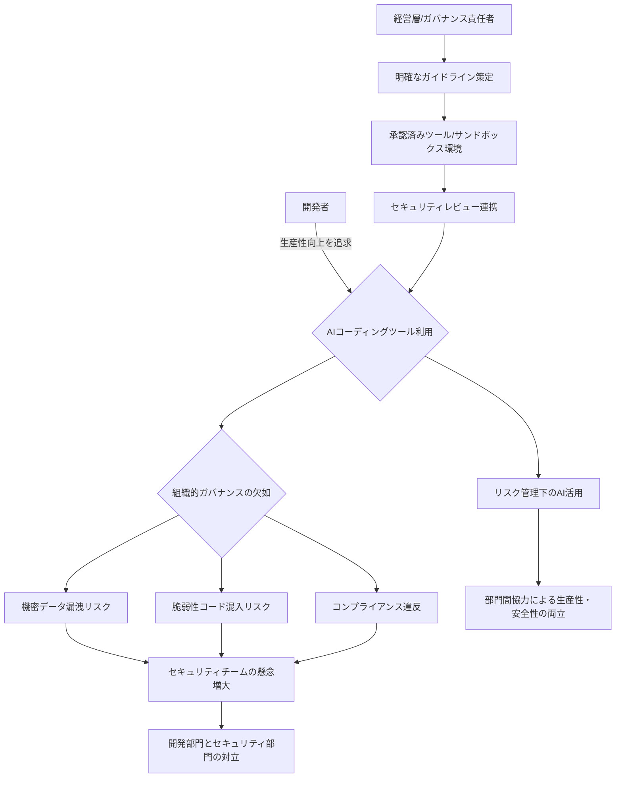

シリコンバレーの技術動向を15年以上にわたり追い続けているジャーナリストとして、私が今、最も注目しているのは、AIがもたらす技術革新そのものよりも、それが企業組織内部で引き起こしている「摩擦」です。特に、開発者の間で急速に普及するAIコーディング支援ツールを巡り、セキュリティ部門との間で激しい対立が表面化している現状は、日本の企業にとっても決して他人事ではありません。

「AIコーディングアシスタントを開発者たちに導入したところ、セキュリティチームが反乱寸前になった」——。米国の有力ITメディア「cio.com」が報じたこの衝撃的な見出しは、AI技術がもたらす潜在的なリスクと、それに対する企業のガバナンス体制の脆弱性を浮き彫りにしています。生産性向上を渇望する開発者と、企業資産を守る責務を負うセキュリティ担当者。この二つの正義がぶつかり合うとき、組織はどのような道筋を描くべきなのでしょうか。これは単なる技術的問題ではなく、経営層が喫緊で取り組むべき「組織変革の課題」そのものだと、私は強く警鐘を鳴らしたいのです。

## AIコーディング支援ツールの光と影：開発現場のリアル

米国の開発現場では、GitHub Copilot、Google Gemini Code Assist、IBM BobといったAIコーディング支援ツールが急速に浸透しています。これらのツールは、コードの自動補完、バグ修正提案、テストコード生成など、開発プロセスを飛躍的に加速させる可能性を秘めています。実際にAirbnbでは、新規コードの60%をAIが生成していると報じられており、その効果は数字として顕著に現れつつあるのです。

開発者にとって、これらのAIアシスタントはまさに「魔法の杖」です。反復作業から解放され、より創造的な問題解決に集中できる。学習コストが低く、手軽に導入できるため、現場主導での導入が進むのは当然の帰結と言えるでしょう。しかし、この「手軽さ」こそが、セキュリティ部門にとっての悪夢の始まりとなるのです。

セキュリティチームが最も恐れるのは、「シャドーIT」ならぬ「シャドーAI」です。開発者が個々の判断でAIコーディングツールを導入し、企業の機密コードを外部のLLMに送信したり、AIが生成した脆弱なコードをそのまま本番環境に組み込んだりするリスクは計り知れません。開発者は生産性向上という「光」に目を奪われがちですが、セキュリティチームは常にその裏に潜む「影」に目を光らせています。このギャップが、「反乱寸前」という過激な表現に繋がったのでしょう。

## 「反乱寸前」のセキュリティチームが懸念する真のリスク

セキュリティチームの「反乱寸前」という状況は、彼らが単に変化を嫌っているわけではありません。彼らは、企業の存続を脅かす具体的なリスクを現実のものとして捉えているからです。編集部で特に注目したのは、その懸念が多岐にわたる点です。

まず、**機密データの漏洩**です。AIコーディングツールの中には、ユーザーが入力したコードを学習データとして利用するものがあります。もし開発者が企業独自の知的財産や顧客情報を含むコードをAIに送信してしまえば、意図せず外部に流出する可能性があります。これは、AnthropicのClaudeにおけるコード実行リスク「TrustFall」のような、より巧妙な攻撃ベクターへの懸念も呼びます。

次に、**脆弱なコードの混入**です。AIが生成するコードは必ずしも完璧ではありません。セキュリティ上の脆弱性（SQLインジェクション、クロスサイトスクリプティングなど）を含むコードを生成したり、意図しないバックドアを組み込んだりする可能性も否定できません。Help Net Securityの報道が示唆するように、「ワンキープレス」で4つのAIコーディングツールが簡単に侵害されるような時代において、AIが生成したコードの品質保証は喫緊の課題です。開発者テックニュースが指摘する「AIコーディングツールはより多くのコードを書くが、開発者がリスクを負う」という現実は、まさにこの点を示しています。

さらに、**コンプライアンス違反**も深刻な問題です。データ保護規制（GDPR、CCPAなど）や業界固有の規制（金融、医療など）に準拠するためには、データがどこで処理され、どのように保護されているかを明確にする必要があります。しかし、AIツールの利用が野放しになれば、どのデータがどのAIプロバイダーのサーバーで処理されているのか、そのログはどこにあるのかといったトレーサビリティが失われ、コンプライアンス体制が崩壊する恐れがあります。

| 項目         | 開発者にとってのメリット                                  | セキュリティチームにとってのリスク                               |
| :----------- | :-------------------------------------------------------- | :--------------------------------------------------------------- |
| **生産性**   | コード記述の高速化、反復作業の自動化                      | 意図しないコード生成によるデバッグコスト増、インシデント対応負荷増 |
| **コード品質** | ベストプラクティスに基づいたコード提案、バグ修正の加速    | 脆弱性混入、セキュリティアンチパターン生成、検証不足             |
| **データ漏洩** | -                                                         | 機密コードや知的財産が学習データとして外部LLMに送信される        |
| **脆弱性混入** | -                                                         | AIが生成したコードに潜在的なセキュリティホールが含まれる可能性   |
| **コンプライアンス** | -                                                         | データ利用ポリシー違反、法規制への対応困難、監査証跡の欠如       |
| **視認性/制御** | 自由にツールを選択し、自身のワークフローを最適化          | AIツール利用状況の把握困難、セキュリティポリシー適用が不可能     |

## 企業が取るべき現実的な対応策：ガバナンスと共存の道

では、この開発者とセキュリティ部門の間の溝をどのように埋め、AIコーディング支援ツールの恩恵を安全に享受するべきでしょうか。重要なのは、一方を犠牲にするのではなく、「ガバナンスと共存」の道を探ることです。

まず、**明確なガイドラインの策定**が不可欠です。AIコーディングツールで何が許可され、何が禁止されるのかを具体的に示し、全ての開発者が理解し、遵守できるよう徹底する必要があります。例えば、「企業秘密や顧客の個人情報を含むコードは、いかなるAIツールにも入力してはならない」といった原則を明確にし、データマスキングや匿名化のプロセスを義務付けるといった対策が考えられます。

次に、**サンドボックス環境の提供**です。開発者がAIツールを試用し、その効果を検証できる安全な環境を用意することで、セキュリティリスクを最小限に抑えつつイノベーションを促進できます。ここでは、外部との通信が制限され、機密データへのアクセスが遮断された環境でAIを活用できるようにするのです。

さらに、**ツール評価・選定プロセスの透明化**が求められます。開発部門が独自にツールを導入するのではなく、セキュリティ部門を巻き込み、共同でAIコーディングツールのセキュリティ評価を行うべきです。ServiceNowが「全ての主要なAIコーディングツール内で機能し、デフォルトでガバナンスされる」Build Agentを提供しているのは、まさにこの現実に対応しようとする動きと言えるでしょう。開発者が「使いたいAIコーディングツールを何でも使う」という現実に直面し、それに対応する形でガバナンスの仕組みを提供するベンダーの戦略は、非常に示唆に富んでいます。

最後に、**トレーニングと意識向上**です。開発者に対してAI生成コードの潜在的なリスク（幻覚、脆弱性など）に関する教育を行い、セキュリティに対する意識を高めることが重要です。AIが提案したコードは「そのまま採用」するのではなく、「レビュー必須」であることを徹底する文化を醸成しなければなりません。静的コード解析（SAST）や動的コード解析（DAST）ツールをAI生成コードの検証プロセスに組み込み、セキュリティゲートを強化することも有効です。

これらの対策は、開発者の創造性や生産性を奪うものではありません。むしろ、安全な枠組みの中で、より安心してAIの恩恵を享受するための基盤となるはずです。

## 🧐 編集部の辛口オピニオン

「AIコードでセキュリティ部隊が反乱寸前」というニュースは、日本企業にとって「明日は我が身」と受け止めるべき喫緊の警告です。シリコンバレーで起こっていることは、タイムラグこそあれ、必ず日本にも波及します。そして、多くの場合、日本の組織文化が持つ特性が、この問題をさらに複雑化させる可能性があります。

日本企業は往々にして、新しい技術の導入において「様子見」の姿勢を取りがちです。しかし、AIコーディングツールは、開発者個々が手軽に利用開始できるため、企業の正式な承認プロセスを経ずに「水面下」で浸透していく可能性が高いのです。一度現場に定着してしまったツールを後から制限しようとすれば、それはまさに「反乱」にも繋がりかねない、開発者のモチベーションを著しく低下させる事態を招きます。

編集部が危惧するのは、日本の多くの企業において、開発部門とセキュリティ部門、あるいは情報システム部門の間の連携が依然として希薄であることです。サイロ化された組織構造の中で、開発者は「早く、効率的に」を追求し、セキュリティ部門は「安全に、確実に」を最優先する。この二つのベクトルがAIという新しい変数によって、より一層対立を深めることは容易に想像できます。

「うちはまだ大丈夫」「うちのセキュリティは厳しいから」といった安易な認識は非常に危険です。AIが生成するコードの潜在的な脆弱性は日々進化しており、従来のセキュリティ対策だけでは対応しきれない場面が増えています。経営層は、この問題を単なる技術的な課題と捉えるのではなく、企業文化、組織ガバナンス、そして人材戦略全体に関わる喫緊の経営課題として認識すべきです。

具体的なアクションとしては、まず、開発者とセキュリティ担当者が率直に意見を交わし、共通の理解を深める場を設けるべきです。そして、トップダウンで「AI活用における安全と効率の両立」という明確なビジョンを打ち出し、それを実現するためのガイドライン策定やツールの選定プロセスに、両部門を巻き込むべきです。何よりも、事後対応ではなく、**プロアクティブなガバナンス体制の構築**が、日本の企業がこのAI時代の荒波を乗り越えるための唯一の道であると、私は断言します。

## 💡 よくある質問（FAQ）

### Q: AIコーディング支援ツールを導入する際に、最も注意すべきセキュリティリスクは何ですか？
A: 最も注意すべきは「機密データの漏洩」と「脆弱性コードの混入」です。開発者が企業の知的財産や顧客データを含むコードを、外部のAIモデルに学習させる形で送信してしまうリスクや、AIが生成したコードに潜在的なセキュリティ上の欠陥が含まれるリスクが挙げられます。これらは企業の競争力低下や法的責任、ブランドイメージの毀損に直結しかねません。

### Q: 開発者の生産性を維持しつつ、セキュリティを確保するための具体的なアプローチはありますか？
A: 開発者の生産性を阻害しないためには、セキュリティチームが「ノー」と言うだけでなく、「安全なイエス」を提示することが重要です。具体的には、承認済みのAIコーディングツールリストを公開する、機密データを含まないコードでの利用を許可するサンドボックス環境を提供する、AI生成コードの自動スキャンやレビューを義務付けるなどのアプローチが有効です。これにより、開発者は安全な範囲で自由にツールを活用できます。

### Q: 日本企業がAIコーディング支援ツールの導入で直面しやすい固有の課題は何ですか？
A: 日本企業は、組織間のサイロ化が進んでいるケースが多く、開発部門とセキュリティ部門の連携不足が課題となりやすいです。また、新しい技術への慎重な姿勢が、結果として現場でのシャドーAI利用を助長したり、導入後のトラブル対応に追われる「後手」のガバナンス体制に陥りがちです。トップダウンでの明確な方針提示と部門横断的な対話が不可欠となります。

## 🔗 関連ツール・サービス

**GitHub Copilot (Business)** — 企業向けにセキュリティと管理機能を強化したAIペアプログラマー。
**Google Gemini Code Assist** — Google Cloudと連携し、IDE内でリアルタイムにAIによるコード支援を提供。
**ServiceNow Build Agent** — 複数のAIコーディングツールと連携し、エンタープライズレベルのガバナンスを提供。
**SonarQube** — 静的コード解析（SAST）ツールで、AI生成コードを含む潜在的な脆弱性を検出。