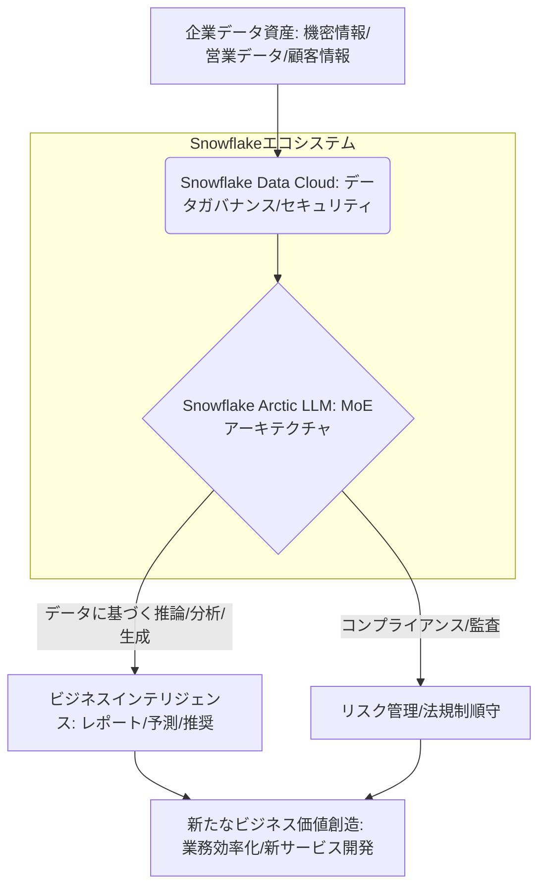

2026年2月12日、シリコンバレーから驚くべきニュースが飛び込んできました。データウェアハウスの巨人であるSnowflakeが、4800億パラメータを誇る大規模言語モデル（LLM）「**Arctic**」を発表したのです。これは単なる新製品の登場ではありません。エンタープライズデータの活用とAIの未来を根本から変えうる、戦略的な一歩だと私は見ています。多くの企業が散在するデータとAIの隔たりに悩み、セキュリティやガバナンスの壁に阻まれる中、Snowflakeはまさにその溝を埋めに来ました。

長年シリコンバレーを取材してきた私の目には、この動きが明確なゲームチェンジャーとして映ります。データプラットフォームのトップランナーが、その強みを活かし、LLMを「データに最も近い場所」で動かすことを可能にしたのです。これは、企業がAIを真にビジネスプロセスに組み込み、競争優位性を確立するための重要な鍵となるでしょう。

## Snowflake Arcticの全貌：480Bパラメータの真意

Snowflake Arcticは、その名の通り「極北」を思わせる、非常に大きな規模を持つLLMです。4800億というパラメータ数は、OpenAIのGPTシリーズやMetaのLlamaといった主要なモデルと比較しても遜色ない、あるいはそれらを凌駕する部分も持つ巨大さです。しかし、Snowflakeが単に巨大なモデルを開発したというだけでは、ここまで注目されません。重要なのは、その「開発の意図」と「アーキテクチャ」にあります。

Snowflakeはこれまで、企業の多様なデータを一元的に管理・分析するためのデータクラウドプラットフォームを提供してきました。多くの企業がデータレイクやデータウェアハウスを構築し、ビジネスインテリジェンス（BI）やデータ分析に活用していますが、そのデータの「理解」と「活用」には常に限界がありました。ここにLLMを直接統合することで、Snowflakeはデータの「文脈理解」を深化させ、より高度なインサイト抽出や自動化を可能にしようとしています。

現代の企業が抱える最大の課題の一つは、データがサイロ化し、その活用が限定的であることです。さらに、既存の汎用LLMを企業データでファインチューニングしようとすれば、データの外部転送に伴うセキュリティリスク、コンプライアンス問題、そして莫大なインフラコストがつきまといます。Snowflake Arcticは、これらの課題を一掃し、既存のデータクラウド顧客が別途LLMインフラを構築する手間なく、シームレスにAIを導入できる道を切り開いたのです。これは、企業がAI投資から真のROIを引き出すための、極めて現実的なアプローチだと評価できるでしょう。

## 革新的なMoEアーキテクチャ：性能と効率の両立

Arcticが4800億パラメータという巨大な規模を持ちながら、高い効率性と性能を両立させている秘密は、その**混合エキスパートモデル（Mixture of Experts: MoE）**アーキテクチャにあります。MoEは、入力データに応じて、モデル内部の特定のエキスパート（専門家ネットワーク）のみを活性化させることで、計算リソースを劇的に最適化する技術です。

従来のLLMが、どのような入力に対してもモデル全体を稼働させる「密なモデル」であったのに対し、MoEは「疎なモデル」と言えます。この疎結合性により、Arcticは以下のような画期的なメリットを提供します。

### MoEアーキテクチャの主要メリット
*   **計算効率の向上**: 4800億パラメータ全てを常時使用するわけではないため、推論時やファインチューニング時の計算コストを大幅に削減します。これは、特にエンタープライズ環境でLLMを継続的に運用する上で、極めて重要な要素です。
*   **推論速度の向上**: 必要なエキスパートのみがアクティブになるため、応答時間が短縮され、ユーザーエクスペリエンスが向上します。リアルタイム性が求められるビジネスアプリケーションにおいて、この速度は大きな武器となります。
*   **多様なタスクへの適応性**: 特定のタスクやドメインに特化したエキスパートが存在することで、汎用的な質問から専門的な分析まで、幅広い要求に対して高い精度で対応できます。例えば、財務分析、法務文書レビュー、顧客サポートといった、異なる業務ドメインのエキスパートを効率的に活用することが可能になります。
*   **スケーラビリティ**: 必要に応じてエキスパートを追加・更新することで、モデル全体の性能を向上させながら、柔軟なスケーリングを実現します。

このMoEアプローチは、超大規模モデルを企業が現実的に運用するための「解」の一つと言えるでしょう。Snowflakeは、ただ巨大なモデルを作ったのではなく、それを「使える」モデルにするための技術的な工夫を凝らしてきた点が、他のLLMベンダーとは一線を画しています。このアーキテクチャこそが、企業がカスタムモデルを運用する際の計算リソースとコストの劇的な削減に直結するのです。

## データクラウドとの融合：企業データの価値を最大化するSnowflakeの戦略

Snowflake Arcticの最も強力なアドバンテージは、その**Snowflake Data Cloud**とのシームレスな統合にあります。この統合は、単なる技術的な連携を超え、企業がAIを活用する上での根本的なパラダイムシフトを意味します。

### データクラウド統合がもたらす変革

1.  **データ主権とコンプライアンスの強化**: 企業データがSnowflakeプラットフォームから外に出ることなくLLMで処理されるため、機密性の高いデータを扱う金融機関、医療機関、政府機関にとって、データ主権の維持とコンプライアンス順守は極めて重要です。データ移動に伴うリスクや法規制への懸念が大幅に軽減されます。
2.  **データ準備とファインチューニングの簡素化**: 企業が持つ膨大な構造化・非構造化データは、既にSnowflake Data Cloudに蓄積されています。Arcticは、このデータに直接アクセスし、前処理からファインチューニング、そして推論までを一元的な環境で実行できます。これにより、データサイエンティストや開発者は、煩雑なデータパイプラインの構築やインフラ管理に時間を費やすことなく、ビジネスロジックの改善やモデルの最適化に集中できます。
3.  **コスト効率の最適化**: 従量課金モデルを採用するSnowflakeの特性は、Arcticの利用にも適用されます。企業は必要な時に必要なだけ計算リソースを利用でき、初期投資を抑えながら、データとAIの連携コストを最適化できます。これは、特にAI導入の障壁となっていた高額なインフラコストの問題を解消するものです。
4.  **エンドツーエンドのワークフロー**: データインジェスト、ETL/ELT、データガバナンス、セキュリティ、データ共有、そしてLLMによる分析と生成。これらすべてがSnowflakeエコシステム内で完結します。結果として、データに基づいたインサイトの抽出からビジネスアプリケーションへの組み込みまでが加速され、新たなビジネス価値創造までのリードタイムが短縮されます。

編集部で特に注目したのは、この「データにAIを近づける」というコンセプトです。多くの企業がデータ活用の重要性を叫びながらも、データとAIの間に横たわる「壁」を乗り越えられずにいました。Arcticは、その壁をSnowflake自身の堅牢なデータガバナンスとセキュリティの下で打ち破ることで、企業データが真に「インテリジェントな資産」へと昇華する道を提示したのです。

| 特徴                 | Snowflake Arctic LLMの強み           | 既存の汎用LLM（オープン/クローズド）との比較 |
| :------------------- | :--------------------------------- | :--------------------------------- |
| **データ統合**       | Snowflake Data Cloudとのシームレス連携で、データ前処理から推論までを一元化。データ移動不要。 | 多くの汎用LLMはデータ統合に追加のパイプラインやETLが必要。複雑でコスト高。 |
| **性能と効率**       | MoE（混合エキスパート）アーキテクチャにより、480Bながら高い推論効率とコスト効率を実現。 | 超大規模モデルは計算リソースを大量消費し、推論コストが高くなりがち。 |
| **セキュリティ**     | Snowflakeの堅牢なセキュリティ・ガバナンスモデルを継承し、企業データの安全なAI活用を保証。 | 汎用LLMはデータの扱いに関して追加のセキュリティ対策やポリシー検討が必要。 |
| **カスタマイズ性**   | 企業固有のデータで容易にファインチューニング可能。特定の業務ドメインに特化したAIを構築。 | ファインチューニングは可能だが、データ準備や環境構築に手間がかかる場合が多い。 |
| **運用コスト**       | 従量課金モデルで初期投資を抑え、データとAIの連携コストを最適化。 | モデルのホスティング、インフラ、データ管理など、個別最適化が必要でコストが読みにくい。 |

## 🧐 編集部の辛口オピニオン

Snowflake Arcticの登場は、日本企業にとって「警鐘」であり、同時に「千載一遇のチャンス」です。しかし、現状維持バイアスが強い多くの日本企業にとって、このチャンスを掴むのは容易ではないでしょう。

長らく日本企業はデータ活用において後塵を拝してきました。「データは宝だ」と唱えながらも、実際にはサイロ化されたまま放置され、AI導入もPoC（概念実証）止まりでスケールしないケースがあまりにも多い。その最大の言い訳が、「セキュリティとガバナンスの懸念」「データ連携の複雑さ」「AI導入コストの高さ」でした。しかし、Snowflake Arcticは、これらの言い訳を根底から覆すソリューションを提供しました。

データ基盤に直結したLLMというアプローチは、もはや「データを持っているだけでは価値がない」という現実を突きつけます。「自社データは特殊だから」と外部LLMの活用に二の足を踏んでいた企業は、Arcticのようなオンプレミスに近いセキュリティモデルとクラウドの柔軟性を両立した選択肢に対し、真剣に向き合わざるを得ません。経営層は、この変革に本気で向き合い、データ戦略とAI導入のロードマップを抜本的に見直す必要があります。

特に日本企業に求められるのは、**「スモールスタート＆クイックウィン」から「全社的データ駆動AI戦略」への転換**です。Arcticは、データガバナンスが効いた環境で、迅速かつ安全に企業固有のデータでLLMをファインチューニングし、業務プロセスに組み込むことを可能にします。これを活用しきれない企業は、海外勢との競争においてさらに劣勢に立たされるでしょう。

既存のSIerやITベンダーも、データとAIの統合という新たな価値提案ができないと、顧客離れを加速させる可能性が高いです。もはや、AIモデル単体の提供だけでは不十分で、いかに顧客の既存データ資産とシームレスに連携させ、ビジネス価値を創出するかが問われます。

日本の「おもてなし」精神やきめ細やかなサービスは世界に誇れるものですが、それを支えるデータとAIの活用において、時代遅れのままでは足元をすくわれます。Snowflake Arcticは、日本企業がデータ民主化とAIの融合を通じて、真の企業変革を遂げるための強力なツールとなるはずです。目を覚まし、行動を開始する時が来ました。

## 💡 よくある質問（FAQ）

### Q: Snowflake Arcticはオープンソースモデルですか、それともプロプライエタリモデルですか？
A: Snowflake Arcticは、**Apache 2.0ライセンス**の下で公開されたオープンソースモデルです。これにより、企業は透明性の高い環境でモデルを検証し、自社の要件に合わせて自由に利用・改変・再配布することが可能です。エンタープライズ領域における柔軟な活用を促進する戦略的な選択と言えるでしょう。

### Q: 4800億パラメータという数字は、具体的に何を示しているのでしょうか？
A: 4800億パラメータは、モデルが学習できるパターンの複雑さと容量の大きさを示します。この巨大なパラメータ数により、Arcticは非常に広範な知識を習得し、複雑な文脈理解、高度な推論、多岐にわたるタスク処理能力を実現します。特に企業が扱う専門的かつ複雑なデータセットに対しても、高い精度で対応できる可能性を秘めています。

### Q: Snowflakeの既存ユーザーは、Arcticをどのように利用できますか？
A: Snowflakeの既存ユーザーは、Snowflake Data Cloud環境内でArcticに直接アクセスし、利用できます。データはSnowflake上にそのまま残り、追加のデータ移動やインフラ構築なしに、自身の企業データを使ってモデルのファインチューニングや推論を実行することが可能です。これにより、セキュリティを維持しつつ、迅速かつ効率的にAI機能を既存のワークフローに統合できます。

## 🔗 関連ツール・サービス

**[Snowflake Data Cloud](https://www.snowflake.com/jp/)** — Snowflake Arcticの基盤となる、データ管理と分析のための統合クラウドプラットフォーム。
**[Hugging Face](https://huggingface.co/)** — オープンソースLLMやモデルハブを提供し、Snowflake Arcticのようなモデルのファインチューニングやデプロイをサポートします。
**[dbt Labs](https://www.getdbt.com/)** — Snowflake上でデータ変換とモデリングを効率化し、Arcticで活用するデータパイプラインを構築します。
**[DataRobot](https://www.datarobot.com/jp/)** — 自動機械学習プラットフォームで、Snowflake Arcticと連携し、ビジネスインサイトの発見とAIアプリケーション開発を加速します。