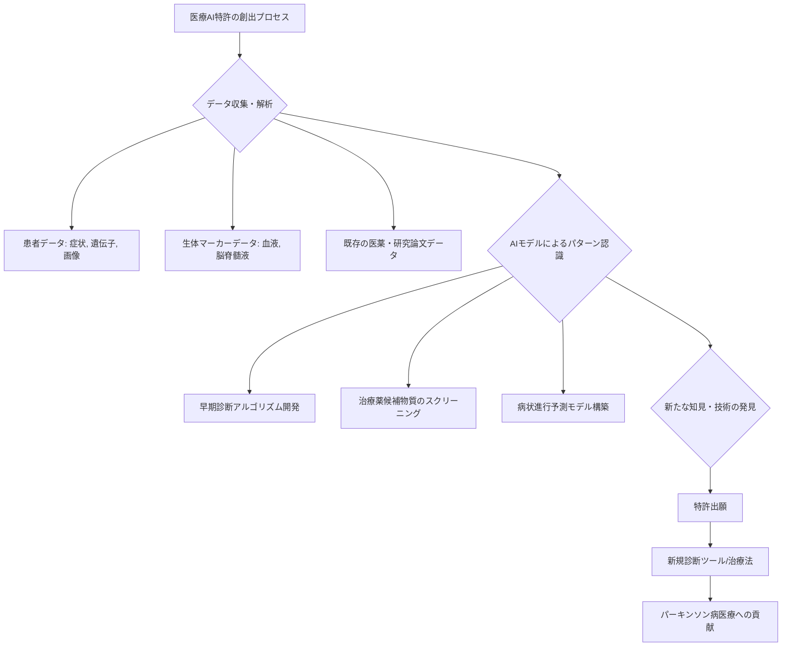

## 衝撃：AI特許が切り拓くパーキンソン病医療の最前線

シリコンバレーで15年間、最先端の技術動向を追ってきた私にとって、今回の米国AIニュースは、医療分野におけるAIの真のポテンシャルを改めて浮き彫りにするものでした。ポッドキャスト情報サイト「Podnews」が報じた「AI - new patents, and new Parkinson」という簡潔なヘッドライン。一見すると地味に映るかもしれませんが、この言葉の裏には、世界中で数百万人が苦しむパーキンソン病の診断、治療、さらには創薬プロセスそのものを根本から変える可能性を秘めた、壮大な知財戦略が隠されています。

長らくパーキンソン病の診断は、医師の経験と神経学的検査に大きく依存し、早期発見が極めて困難でした。病状が進行し、明確な症状が現れてから診断されることが多いため、効果的な介入の機会を逸してしまうケースが少なくありません。しかし、AI技術、特に機械学習と深層学習の進化は、この医療の難題に新たな光を当てています。そして、その革新の波は、米国で次々と生み出される「AI関連特許」という形で具現化されているのです。

今回のニュースが示唆するのは、AIが単なる研究ツールに留まらず、具体的な医療応用、そしてその知的財産権の獲得競争へと突入しているという事実です。これは、世界の製薬企業、医療機器メーカー、そしてAIスタートアップが、未来の医療市場における覇権をかけて、水面下で激しい競争を繰り広げていることを意味します。特に、知財戦略で出遅れることは、後発組が多大なロイヤリティを支払うか、市場から締め出されることを意味します。

編集部で特に注目したのは、AIがパーキンソン病という特定の疾患に深く切り込み、その成果が「特許」として保護され始めている点です。これは、研究開発の初期段階から、実用化を見据えた具体的なビジネスモデルと知財戦略が練られていることの証左に他なりません。日本の企業にとって、この米国の動きは、単なる対岸の火事では済まされない喫緊の課題であり、自社の研究開発戦略、投資戦略、そして知財戦略を見直す絶好の機会となるはずです。

### AIとパーキンソン病：なぜ今、知財競争が激化するのか

パーキンソン病は、脳内のドーパミン産生ニューロンの変性によって引き起こされる進行性の神経変性疾患です。振戦、動作緩慢、姿勢反射障害といった運動症状に加え、非運動症状（嗅覚障害、睡眠障害、うつ病など）も多様に現れます。その症状は多岐にわたり、個人差も大きいため、初期段階での診断は非常に難しいとされています。

しかし、AIは大量の生体データ、例えば患者の音声パターン、歩行速度、眼球運動、手書き文字、さらにはウェアラブルデバイスから得られる睡眠データや心拍変動などを解析することで、人間には検知しにくい微細な変化を捉えることが可能になります。これにより、従来の診断基準では見逃されがちだった病気の兆候を、より早期かつ客観的に発見する可能性が高まります。

この早期発見こそが、パーキンソン病医療におけるブレイクスルーの鍵です。病気の進行を遅らせるための治療介入は、早期であればあるほど効果が高まると考えられているからです。AIがこの早期診断を可能にし、さらには個々の患者に最適化された治療法を提案できるようになれば、患者のQOL（生活の質）は劇的に改善されるでしょう。

米国でAI関連特許が急増している背景には、こうしたAIによる診断・治療法の革新が、莫大な市場価値を生み出すという確信があります。特に、製薬企業はAIを使って新薬候補物質のスクリーニングを高速化し、臨床試験の成功確率を高めることで、開発コストと期間を大幅に削減できると見ています。これらのプロセス全体が知財として保護されることで、投資回収と競争優位性の確保を目指しているのです。

この知財競争は、単に技術的な優位性を競うだけでなく、未来の医療エコシステムにおける主導権争いでもあります。誰がこのゲームを制するかによって、世界の医療地図は大きく塗り替えられる可能性を秘めているのです。

## 最先端AI特許が示す診断・治療の未来像

現在、米国で出願・取得されているパーキンソン病関連のAI特許は、多岐にわたる技術領域をカバーしています。主要なカテゴリーとしては、以下の点が挙げられます。

### 音声・言語解析による早期診断AI

パーキンソン病患者の約90%が構音障害（ディスアースリア）などの音声変化を経験するとされています。AIは、患者の音声データを収集し、ピッチ、音量、発話速度、声の震えなどの微細な変化をリアルタイムで解析することで、病気の兆候を早期に検知するシステムに関する特許が出願されています。特に、スマートフォンやスマートスピーカーといった日常的に利用されるデバイスを活用し、非侵襲的にデータを収集する技術は、患者の負担を大幅に軽減し、スクリーニングの可能性を広げるものです。AIは、わずかな声の揺らぎや単語間の不自然な間隔といった、人間の耳では聞き分けられないレベルの変化を捉え、病気の進行度合いまで予測する精度を持つようになっています。

### ウェアラブルデバイス連携型AIによるモニタリング

歩行障害や振戦といった運動症状は、パーキンソン病の典型的な症状です。加速度センサーやジャイロセンサーを搭載したスマートウォッチやスマートリングなどのウェアラブルデバイスから得られるデータをAIが解析し、患者の活動パターン、歩行の安定性、特定の動作の異常などを検知する技術が特許の対象となっています。これにより、医師は診察室での短い観察時間では把握しきれない、患者の日常生活における病状の変動を長期的にモニタリングできるようになります。これらのAIは、病状の悪化を予測し、適切なタイミングでの治療介入を促すだけでなく、治療効果の客観的な評価にも寄与します。例えば、特定のリハビリテーションの効果を数値で示すことで、パーソナライズされた治療計画の立案に役立てることが可能です。

### AI創薬：新薬候補物質の高速スクリーニングと最適化

パーキンソン病の根本治療薬はいまだ確立されていません。現在の治療は症状緩和が主ですが、AIは新薬開発のプロセスを劇的に加速させる可能性を秘めています。特許の中には、AIが膨大な化合物データや遺伝子データを解析し、パーキンソン病に関連する疾患メカニズムに作用する可能性のある新規化合物候補を高速でスクリーニングする技術が含まれます。さらに、AIはこれらの候補物質の薬効、毒性、副作用プロファイルを予測し、開発の初期段階で最適な候補を絞り込むことで、時間とコストのかかる臨床試験のリスクを大幅に低減させます。これは、まさに創薬のゲームチェンジャーであり、AIが創薬プロセスそのものをデザインする時代が到来しつつあることを示しています。

### 画像診断支援AIとバイオマーカー発見

脳MRIやPETスキャンといった画像診断は、パーキンソン病の診断において重要な役割を果たしますが、初期の段階では微細な変化を捉えにくい場合があります。AIは、高精度の画像解析アルゴリズムを用いて、脳内のドーパミン神経細胞の変性パターンや特定の脳領域の容積変化などを客観的かつ定量的に評価することで、診断精度を向上させます。さらに、AIは遺伝子データや血液・脳脊髄液中のタンパク質データなど、多様なバイオマーカー候補を統合的に解析し、パーキンソン病の早期発症リスクや病態進行を予測する新たなバイオマーカーを発見する技術の特許も増えています。これらのバイオマーカーの発見は、より精密な診断と、個々の患者に合わせたテーラーメイド医療の実現に不可欠です。

これらの特許群は、パーキンソン病の診断から治療、そして創薬に至るまでの医療バリューチェーン全体をAIが変革していくロードマップを示しています。この技術革新は、単なる医療の効率化に留まらず、これまで不可能とされてきた医療課題への新たな解決策を提供し、患者とその家族に希望をもたらすものです。

| 項目         | 従来のパーキンソン病研究・開発                      | AI駆動型研究・開発                                    |
| :----------- | :------------------------------------------------ | :---------------------------------------------------- |
| **診断方法** | 医師による問診、神経学的検査、画像診断（MRIなど） | AIによる生体データ（音声、歩行、眼球運動など）解析、画像診断支援 |
| **診断精度** | 医師の経験に依存、早期発見が困難な場合が多い        | 大量データからの微細な変化を検知、早期かつ客観的な診断が可能 |
| **治療薬探索** | 膨大な化合物の中から手動スクリーニング、高コスト・時間 | AIが候補物質を高速予測・最適化、開発期間とコストを大幅削減 |
| **バイオマーカー発見** | 経験的・試行錯誤的、時間とリソースを要する      | AIが複雑なデータセットから潜在的なバイオマーカーを効率的に特定 |
| **知財創出** | 研究者の発見に基づく、個別の特許出願が主          | AIが生成した新規アルゴリズム、化合物、診断手法などが特許対象 |

## 日本企業への警鐘：知財競争と医療AIへの投資戦略

米国でのAI特許動向は、日本の企業にとって明確な警鐘と受け止めるべきです。特に、製薬、医療機器、ヘルスケアITの各分野において、この知財競争に乗り遅れることは、国際市場での競争力喪失に直結します。日本は高齢化が急速に進み、パーキンソン病をはじめとする神経変性疾患の患者数が増加する社会課題を抱えているにもかかわらず、医療AI領域における知財戦略は、米国や欧州、中国に比べてまだ手探りの段階にあると言わざるを得ません。

### 投資とアライアンスの積極化

日本の企業は、自社の強みである高品質な医療データや臨床研究のノウハウと、シリコンバレーをはじめとする世界のAI技術を組み合わせるための積極的な投資とアライアンス戦略を推進すべきです。自社単独でのAI開発には限界があり、AIスタートアップへの出資、共同研究開発契約の締結、さらにはM&Aも視野に入れる必要があります。特に、AIのアルゴリズム自体や、AIによって発見された診断マーカー、新薬候補物質、新たな治療プロトコルなどは、積極的に特許として保護していくべきです。これにより、将来的なライセンス収入の確保や、競合他社に対する優位性を確立できます。

### データ活用とガバナンスの強化

医療AIの開発には、質の高い大量の医療データが不可欠です。日本では、個人情報保護やデータ共有に関する規制が厳しく、データの収集・活用が海外に比べて難しい側面があります。しかし、匿名化されたデータや合成データの活用、医療機関との連携強化、さらにはデータ流通に関する新たな法整備の議論を加速させることで、この課題を克服する必要があります。データの質と量は、AI特許の価値を大きく左右するため、データガバナンスの強化は喫緊の課題です。同時に、医療AIが生成する知見の倫理的側面や、患者データのプライバシー保護に対する国際的な基準への準拠も不可欠となります。

### AI人材の育成と確保

医療AIの開発と知財戦略を推進するためには、AI技術と医療知識の両方を深く理解する「ハイブリッド人材」が不可欠です。日本国内でのこうした人材の育成は急務であり、大学や研究機関との連携を強化し、専門コースの設置や継続的な教育プログラムを提供する必要があります。また、海外からの優秀なAI研究者やエンジニアを積極的に誘致する施策も重要です。彼らの知見とスキルは、日本の医療AI開発を国際水準に引き上げる上で不可欠な要素となるでしょう。

これらの取り組みは、単なるビジネスチャンスに留まらず、日本の社会が直面する超高齢化社会の医療課題を解決し、世界に貢献するための重要な使命でもあります。シリコンバレーのAI知財戦略から学び、日本独自の強みを活かした戦略を早急に構築することが、今、求められています。

## 🧐 編集部の辛口オピニオン

「AIとパーキンソン病の特許」というニュースは、日本の医療・製薬業界が直面する現実を、あまりにも生々しく突きつけるものです。米国では、AIが具体的な疾患解決にコミットし、その成果を迅速に知財として囲い込んでいる。これに対し、日本は何をしているのか？

現状、日本の医療AI研究は基礎研究レベルでは素晴らしい成果を出しているものの、それが「特許」という形で戦略的に保護され、具体的なビジネスモデルへと昇華している事例は、米国のスピード感と比べるとあまりに少ないと言わざるを得ません。例えば、米国の製薬大手やバイオテック企業は、AIスタートアップとの提携やM&Aを通じて、AI創薬のパイプラインを急速に拡大しています。彼らは、AIが創出した知見を即座に特許化し、市場における独占的地位を確保しようと動いています。

日本の企業は、往々にして「データがない」「規制が厳しい」といったネガティブな側面に目を向けがちです。しかし、これらはもはや言い訳にはなりません。シリコンバレーのプレーヤーたちは、これらの障壁を乗り越えるための具体的な戦略を練り、実行に移しています。例えば、医療データの匿名化技術の進化や、規制当局との対話を通じた新しい枠組みの構築など、イノベーションを止めないための努力を続けているのです。

日本がこのまま手をこまねいていれば、将来的にパーキンソン病をはじめとする難病の診断・治療技術は、すべて海外のAI特許に支配されることになりかねません。そうなれば、高額なライセンス料を支払い続けるか、あるいは海外の技術なしでは十分な医療を提供できない「医療植民地」のような状態に陥るリスクすらあります。

今こそ、日本の製薬、医療機器メーカー、そして政府は、医療AIと知財戦略を国家レベルの最優先課題として認識すべきです。単なる研究開発の推進だけでなく、「いかにAIが生み出す知財を迅速に保護し、自社の競争力に変えるか」という視点が決定的に欠けています。大胆な投資、リスクを恐れないM&A、そして何よりも、AIが生み出す知見を「価値ある知的財産」として評価し、守り抜くという強い意思が求められています。でなければ、このグローバルなAI知財戦争で、日本は永遠の周回遅れとなるでしょう。

## 💡 よくある質問（FAQ）

### ### Q: AI特許がパーキンソン病に特化する理由は？
A: パーキンソン病は、その多様な症状と進行性という特性から、早期診断と個別化された治療が極めて困難な疾患です。AIは、音声、歩行、画像、遺伝子など多岐にわたる生体データを統合的に解析し、人間には識別しにくい微細な変化を捉える能力に優れています。このAIの特性が、パーキンソン病の難題解決に特に有効であると認識され、関連技術の特許化が進んでいます。早期発見や治療薬開発におけるAIの潜在的価値が、知財競争を加速させているのです。

### ### Q: 日本の医療機関はAI特許にどう関わるべきか？
A: 日本の医療機関は、AI特許の動向を注視し、AI開発企業や製薬企業との連携を強化すべきです。質の高い臨床データを提供し、共同研究を通じてAI診断支援システムや治療プロトコルの開発に貢献することで、自らも新たな知見や技術の創出に関わり、特許の共同出願といった形で知的財産権の一部を確保する道も考えられます。また、AI技術の倫理的側面や患者データ保護に関する議論に積極的に参加し、国際的な標準形成にも貢献していくことが重要です。

### ### Q: 患者データ保護とAI特許のバランスは？
A: AI医療特許の多くは、大量の患者データ解析に基づいています。そのため、患者データのプライバシー保護と倫理的なデータ利用は、特許戦略と並行して極めて重要な課題です。匿名化技術の高度化、差分プライバシーなどのプライバシー保護技術の導入、そして患者からの明確な同意の取得が不可欠です。また、特許出願の際には、アルゴリズムの透明性や公平性に関する説明責任も求められるでしょう。知財としての価値を追求しつつも、患者の権利を最大限に尊重するバランスの取れたアプローチが求められます。

## 🔗 関連ツール・サービス

**[Insilico Medicine](https://insilico.com/)** — AIを活用し、新薬候補物質の発見から前臨床試験までの時間を大幅に短縮する創薬プラットフォーム。
**[BenchSci](https://www.benchsci.com/)** — AI駆動型プラットフォームで、研究者が最適な試薬や実験プロトコルを迅速に特定し、研究の再現性と効率を向上。
**[Clarivate Analytics](https://clarivate.com/)** — 世界中の特許情報や科学文献を網羅的に提供し、企業の知財戦略や研究開発戦略を支援するデータ分析サービス。
**[PathAI](https://www.pathai.com/)** — 病理学画像解析に特化したAIソリューションを提供し、がん診断の精度向上や個別化医療の実現に貢献。