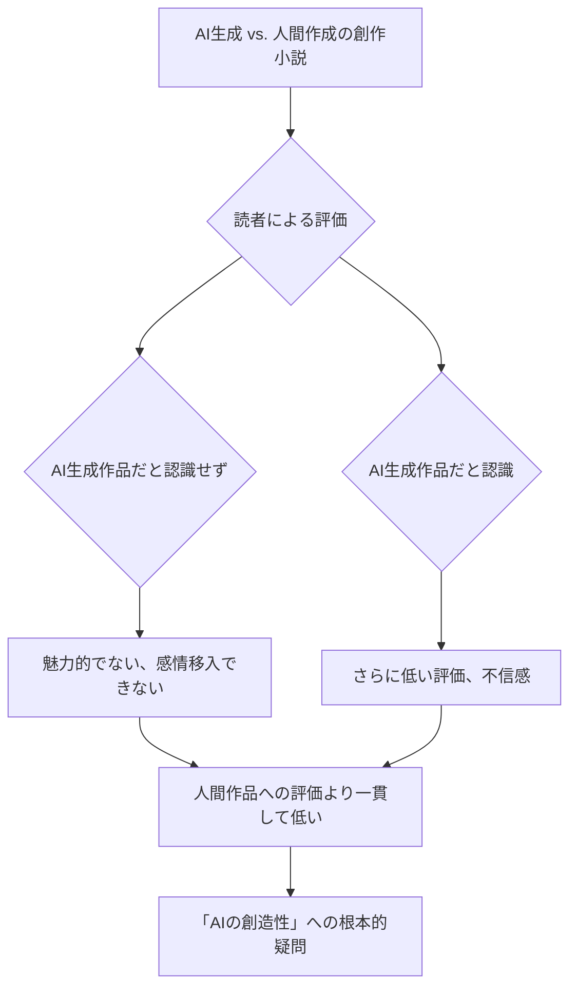

シリコンバレーからお届けする最新AIトレンド速報です。今日のニュースは、AIが進化するにつれて無視できなくなる「人間の感情」の壁についてです。ミシガン大学ロス・スクール・オブ・ビジネスのBerg Researchが2026年1月27日に発表した衝撃の調査結果は、クリエイティブ業界、特に小説や記事といった「物語」を扱う分野でAI活用を進める企業に冷水を浴びせかけるものでしょう。

読者は、AIが生成した創作物に対して、それがAI製だと知らなくても、人間が書いたものよりも明らかに低い評価を下すというのです。これは、単なる好みを超えた、AIの「創造性」そのものへの根本的な問いかけです。

## AIの「見えない壁」：Berg Researchが暴いた真実

AIの進化は目覚ましく、文章生成、画像生成、音楽生成と、その応用範囲は日々拡大しています。特にテキスト生成AIは、あたかも人間が書いたかのような自然な文章を生み出し、その精度は驚くほどです。しかし、ミシガン大学ロス・スクール・オブ・ビジネスのBerg Researchが実施した最新の調査は、この「人間らしい」AIが、実は人間が求める「創造性」の核心に迫れていない現実を浮き彫りにしました。

この調査は、読者がAI生成の創作物と人間が書いた創作物のどちらを好むかについて、詳細な実験を通じて明らかにしています。実験の設計は非常に巧妙で、参加者にはAIが生成した短編小説やエッセイ、人間が書いた同ジャンルの作品が混在して提示されました。重要なのは、読者はどの作品がAI製であるかを事前に知らされていなかった点です。

結果は一貫して、そして明確な傾向を示しました。AI生成の創作物は、人間が書いた作品と比較して、読者から「面白くない」「魅力的でない」「感情移入できない」といった、より低い評価を受けることが判明したのです。具体的には、物語の展開、キャラクターへの共感、文章表現の深み、全体的な読書体験の質といった主観的な評価軸において、AI作品は人間作品に大きく劣るという結果が出ました。

### 認識の有無がもたらす評価の差

調査では、読者が作品がAI生成であることを知らされた場合、その評価はさらに厳しくなることも示されました。これは、AIに対する先入観や偏見が影響している可能性を示唆しています。しかし、この調査の最も重要なポイントは、**読者がAI生成であることを知らされなかった状態でも、AI作品への評価が有意に低かった**という点です。これは、単なる「AI嫌悪」や「AI作品への拒否感」という表層的な問題ではなく、AIが生成するクリエイティブが、人間の深層心理に響く「何か」を本質的に欠いている可能性を示唆しています。

## 読者の「無意識の拒絶反応」が意味するもの

なぜ、私たちはAIが書いた創作物に、無意識のうちに低い評価を下してしまうのでしょうか。Berg Researchの調査結果は、この問いに対し、いくつかの重要な示唆を与えています。読者のフィードバックからは、「魂がない」「共感できない」「深みがない」といった表現が散見されました。これは、AIがどれほど巧みに人間の文章を模倣しても、その根底にある「人間固有の経験」「感情の機微」「意図的な曖昧さ」といった要素を完全に再現できていないことを示唆しているかもしれません。

AIは、膨大なデータを学習し、パターンを認識し、統計的に最も「人間らしい」と思われる文章を生成することに長けています。しかし、人間が物語に求めるのは、単なる情報の羅列や論理的な展開だけではありません。そこには、作者の人生経験、独特の視点、そして読者自身の過去や感情と共鳴するような、複雑で多層的な意味合いが求められます。AIはこれらを模倣することはできても、自ら「経験」し、「感じる」ことはできません。

### AIの「人間模倣」の限界

編集部で特に注目したのは、「AI製だと知らされない状態でも評価が低い」という点です。これはAIが「人間に寄せて書く」努力をしても、その本質的な違いを人間が無意識のうちに見抜いていることを示唆しています。例えるならば、精巧なアンドロイドが完璧な表情を浮かべても、どこか「不気味の谷」を感じてしまう感覚に近いのかもしれません。AIは、文章の表面的な構造やスタイルを模倣することはできても、人間の複雑な心理描写や社会文化的文脈の理解、そしてそれらを感情に訴えかける形で表現する能力には、依然として限界があると考えられます。

これは、文学や芸術における「創造性」の定義そのものを再考させるものです。単に新しいものを生み出すだけでなく、それが人間の心にどのように響くか、どのような感情を引き起こすかという「質」が、真の創造性には不可欠である、という古くて新しい真実をAIが私たちに突きつけていると言えるでしょう。

## 「効率」と「品質」のトレードオフ：日本のコンテンツ産業への警鐘

日本のコンテンツ産業は、アニメ、漫画、ゲーム、文学、音楽といった多岐にわたる分野で世界的に高く評価され、強いブランド力を持っています。近年、生成AIの急速な発展に伴い、これらの産業においても生産性向上やコスト削減を目的としたAI導入の動きが加速しています。しかし、Berg Researchの調査結果は、このような安易なAI導入が、日本のコンテンツ産業がこれまで築き上げてきた「ブランド価値」や「読者・視聴者の信頼」を根底から損なうリスクを明確に指摘しています。

もし、日本のコンテンツ企業が、人間の手による創造をAIに置き換え、効率化だけを追求するならば、何が起こるでしょうか。市場には「量産型AIコンテンツ」が溢れかえるかもしれません。しかし、今回の調査が示す通り、読者はそうしたコンテンツに対し、無意識のうちに「品質の低さ」や「魅力のなさ」を感じ取るでしょう。その結果、熱心なファンは離れ、長期的にはブランドイメージの低下、ひいては市場全体の活性度低下を招くことになりかねません。

### AIを「補助ツール」と捉える賢明な戦略

この状況下で、日本のコンテンツ産業が取るべき道は明らかです。AIを「クリエイターを完全に代替する存在」としてではなく、「人間の創造性を拡張する強力な補助ツール」として捉える賢明な戦略が不可欠です。例えば、AIにアイデアのブレインストーミングをさせたり、物語の初期プロットを生成させたり、あるいは文章校正や情報整理をさせたりするなどの活用方法は、人間のクリエイターの負担を軽減し、より深い創造活動に集中できる時間をもたらすでしょう。

重要なのは、最終的な「魂」や「物語の核心」は、あくまで人間のクリエイターが注入するということです。AIが生成した要素を人間の手で磨き上げ、感情や経験に基づいた独自の視点を加えることで、初めて読者の心に深く響く作品が生まれるはずです。この調査結果は、高品質な人間作品の価値が相対的に高まる可能性を示唆しており、安易なAI活用による品質低下の道を避けることが、日本のコンテンツ産業が今後も世界で輝き続けるための鍵となるでしょう。

| 比較項目       | 人間が書いた創作小説の評価 | AIが書いた創作小説の評価 (非認識時) | AIが書いた創作小説の評価 (認識時) |
| :------------- | :------------------------- | :---------------------------------- | :-------------------------------- |
| **物語の魅力度** | 高い                       | 低い                                | 非常に低い                          |
| **感情移入度**   | 高い                       | 低い                                | 非常に低い                          |
| **独創性/創造性**| 高い                       | 低い                                | 非常に低い                          |
| **読書体験の質** | 満足                       | 不満                                | 強い不満                            |
| **信頼性**       | 高い                       | 低い                                | 非常に低い (不信感)                 |

## 人間固有の「物語る力」は代替不可能なのか？

AIが、人間の感情や経験を完全に理解し、再現する日は来るのでしょうか。今回のBerg Researchの調査は、少なくとも創作物の分野においては、その道のりがまだ遠いことを示唆しています。AIの得意分野は、膨大な情報からのパターン認識、定型文の生成、特定のスタイルへの模倣です。これらは効率化や情報処理において絶大な威力を発揮します。

しかし、人間が「物語」を通して求めるのは、単なる情報の受け渡しではありません。そこには、作者の人生経験からくる洞察、複雑な感情の機微、時には意図的に残された曖昧さ、そして特定の文化的コードの織り込みなど、多岐にわたる要素が複合的に絡み合っています。これらが読者の心に「驚き」「感動」「共感」といった深い読書体験を生み出し、記憶に残る作品となるのです。

### クリエイターの役割の再定義

この調査結果は、これからのクリエイターの役割を再定義するものでもあります。AIの進歩は、定型的な作業やアイデア出しの一部を自動化し、クリエイターがより本質的な「人間でなければ生み出せない核心」に集中できる環境をもたらすでしょう。それは、単に効率的に作品を生み出すことではなく、人間の経験に基づいた深遠なテーマを探求し、感情豊かなキャラクターを創造し、読者の心に強く訴えかける「語り口」を磨き上げることです。

AIとの共存ではなく、「AIとの差別化」の時代へと突入したと言えます。クリエイターは、AIが提供する補助機能を最大限に活用しつつも、自らの人間性、個性、そして固有の物語る力をどこまでも追求し続ける必要があるでしょう。AIがどれだけ進化しても、人間の心から心へ伝わる「物語」の力は、その代替不かない価値を保ち続けるはずです。

## 🧐 編集部の辛口オピニオン

日本のコンテンツ業界は、このBerg Researchの調査結果を「喉元のナイフ」と捉えるべきです。AIによるコスト削減や量産効果に安易に飛びつくのは愚策。目先の効率化が、長年培ってきた「物語の品質」という最大の競争優位性を毀損するリスクは計り知れません。特に日本のクリエイティブは、繊細な感情表現や文化的な深みが生命線。AIの無感情な文章が、私たちの心を揺さぶることはありません。

もし、出版社やアニメ制作会社が「AIで下書き」「AIでキャラクター設定」などと安易に導入し、それを「効率化」と称するならば、消費者は瞬時にその「偽物」を見抜き、離れていくでしょう。この結果は、コンテンツの「魂」は人間固有のものであり、それをAIに委ねることは「創造性の自殺」に等しいと警告しています。目先の利益に囚われず、品質と人間性を死守する覚悟が今、日本のコンテンツ産業に強く問われています。手垢のついたAI臭いコンテンツで、日本の世界的なクリエイティブ産業が潰えるなど、悪夢としか言いようがありません。

## 💡 よくある質問（FAQ）

### Q: Berg Researchの調査は、どのような創作物について行われましたか？
A: 主に短編小説やエッセイといったクリエイティブライティングの領域で実施されました。情報伝達を目的とする一般的な記事やレポートとは異なり、感情や物語性が重視されるジャンルです。

### Q: AIが生成したことを知らずに低い評価を下すのはなぜでしょうか？
A: 調査結果は、読者が無意識のうちにAI作品に「人間的な深み」や「共感性」の欠如を感じ取っている可能性を示唆しています。AIの文章が完璧な文法や論理構造を持っていても、人間の経験に基づいた微妙な感情の機微や、意図的な「不完全さ」が欠けているため、読者の心に響きにくいと考えられます。

### Q: 日本のコンテンツ業界は、この結果をどのように受け止めるべきでしょうか？
A: 日本のコンテンツは世界的に高い評価を得ていますが、それは「人間が持つ独特の感性」に支えられています。AIを安易に創作の核に据えることは、その品質とブランド価値を損なうリスクがあります。AIはあくまで補助ツールとして、人間のクリエイターが「人間らしい物語」を創造することに注力すべきだという強い示唆として受け止めるべきでしょう。

## 🔗 関連ツール・サービス

**[Jasper](https://www.jasper.ai/)** — AIによるマーケティングコンテンツやブログ記事の生成を支援するツール。
**[Copilot (旧Microsoft 365 Copilot)](https://www.microsoft.com/ja-jp/microsoft-copilot)** — Microsoft製品に統合されたAIアシスタントで、文書作成や要約をサポート。
**[NovelAI](https://novelai.net/)** — スタイル指定やプロンプトで小説の生成を支援する、クリエイティブライター向けのAIツール。
---