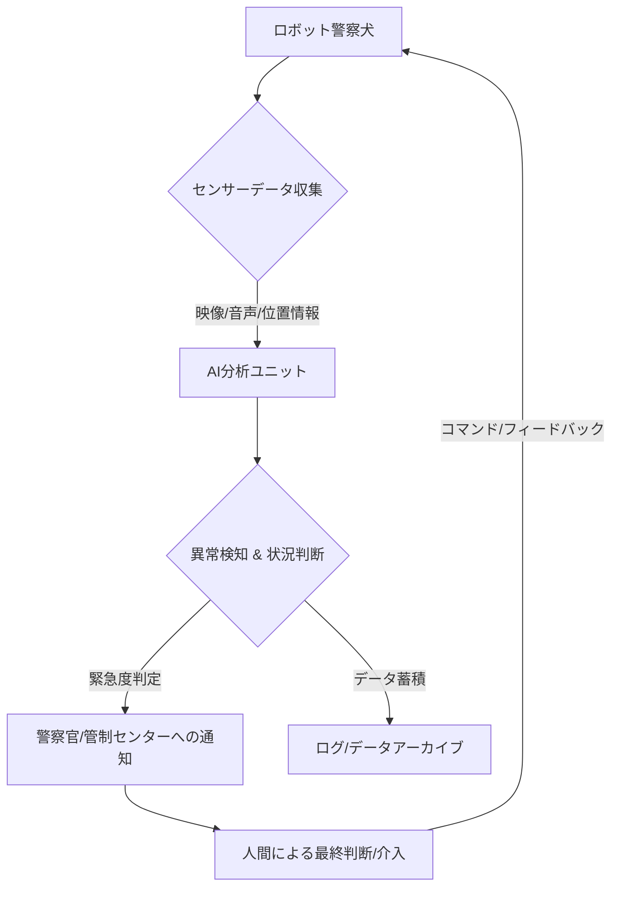

アメリカ・アトランタの街角に、近未来を予感させる異質な「警察官」が姿を現しました。AIを搭載したロボット警察犬が、実際のパトロール業務に投入されたというNewsweekの報道は、SFの世界が現実のものとなった瞬間に立ち会ったかのような衝撃を私たちに与えました。これは単なる技術デモンストレーションではありません。公共の安全、個人のプライバシー、そして監視社会のあり方を根本から問い直す、極めて重要な社会実験が始まったと言えるでしょう。

### アトランタに現れた「番犬」：AI警察犬の実態

アトランタ市警が導入した**AI警察犬**は、外見こそ「Boston Dynamics」の有名な四足歩行ロボット「Spot」を彷彿とさせますが、その中身は最先端のAI技術で武装されています。主要な目的は、特定のエリアでの巡回監視、不審物の発見、そして潜在的な犯罪行為の抑止です。

ロボットは内蔵された高解像度カメラとセンサーアレイを通じて周囲の環境をリアルタイムで分析。AIによる画像認識アルゴリズムが、人間の目では見逃しがちな異常を検知します。例えば、特定の行動パターン（長時間立ち止まっている人物、不自然な荷物）、あるいは顔認識技術を用いた犯罪者データベースとの照合などが可能とされています。さらに、音声認識機能も搭載されており、銃声や悲鳴といった緊急事態を示す音を識別し、即座に警察官に警報を送る能力も持つと報じられています。

これまでの防犯カメラやドローンと異なるのは、その自律性と物理的な行動能力にあります。特定のルートをプログラムされた通りに巡回するだけでなく、状況に応じて経路を変更したり、障害物を回避したりする適応性も備えています。アトランタ市警は、これにより警察官が危険に晒されるリスクを減らし、より効率的なパトロール体制を確立したい考えです。しかし、この「AIを搭載した番犬」が本当に私たちを安全な社会へと導くのか、それとも新たな脅威となるのか、議論は既に白熱しています。

### 技術が約束する「安心」と、潜む「監視」の影

AI警察犬の導入がもたらす便益は明確です。特に以下のような点が挙げられます。

*   **人件費の削減と効率化**: 24時間365日、疲労や感情に左右されずにパトロールが可能。
*   **危険な状況での活用**: 爆弾処理現場や人質事件など、警察官が直接踏み込みにくい危険な場所での情報収集。
*   **犯罪抑止効果**: ロボットの存在自体が視覚的な抑止力となり、犯罪発生率の低下に寄与する可能性。
*   **データに基づいた迅速な対応**: AIが収集した膨大なデータを分析し、異常事態を即座に特定、関係部署への情報共有を可能にします。

一方で、市民の間には深い懸念と不安も広がっています。最も大きな問題は、個人の**プライバシー侵害**です。高解像度カメラによる継続的な映像記録、顔認識機能、そして行動パターンの分析は、市民が意識しないうちに膨大な個人情報が収集・蓄積されることを意味します。これが政府や企業によって悪用される可能性は否定できません。

また、AIの判断の透明性も問われます。ロボットが「不審」と判断する基準は何なのか、その判断に誤りは含まれないのか。仮に誤作動や誤認識があった場合、誰が責任を負うのかという倫理的、法的な課題も浮上します。

以下に、AI警察犬の主なメリットとデメリットをまとめました。

| 特徴       | メリット                               | デメリット                                   |
| :--------- | :------------------------------------- | :------------------------------------------- |
| **効率性** | 24時間無休、人件費削減、広範囲カバー   | 高コストな初期導入とメンテナンス             |
| **安全性** | 危険区域への派遣、警察官の安全確保     | ロボットの誤作作動、暴走、サイバー攻撃リスク |
| **抑止力** | 視覚的な犯罪抑止効果                   | 監視社会化への懸念、市民の不安増大             |
| **情報収集** | リアルタイムデータ収集、精密な状況把握 | プライバシー侵害、個人情報流出のリスク       |
| **公平性** | 感情に左右されない客観的な判断         | AIバイアス、差別的な判断の可能性             |

このような多角的な議論が、アトランタの街で、そして世界中で巻き起こっているのです。

### 日本企業への示唆：公共セクターAI市場の光と闇

アトランタの事例は、公共安全分野におけるAIの可能性と、それに伴う社会的な課題を浮き彫りにしています。日本はこれまで、その治安の良さから、こうした極端な監視技術の導入には慎重な姿勢を見せてきました。しかし、少子高齢化による警察官不足や、災害対策、テロ対策の強化といった背景を考慮すれば、日本においても公共安全分野へのAI・ロボティクス技術の導入は避けて通れないテーマとなるでしょう。

日本の企業がこの新たな市場に参入する上で重要なのは、単に技術的な優位性を追求するだけでは不十分だという点です。**倫理ガイドライン**の策定、透明性の確保、そして何よりも市民の信頼と合意形成が不可欠となります。欧米で先行する技術導入の動向を注視しつつ、日本の文化や社会制度に適合した形で、どのようにAI警察犬のようなソリューションを提案・開発していくか、その手腕が問われることになります。

例えば、以下のようなシステムアーキテクチャが考えられます。

このシステムにおいて、AI分析ユニットの透明性、データ蓄積のガバナンス、そして人間による最終判断のプロセスが、社会的受容性を左右する鍵となります。技術と社会の対話なくして、真のソリューションは生まれません。

### 🧐 エバンジェリストの辛口オピニオン

アトランタのAI警察犬のニュースを聞いて、私は日本の現状を憂慮せずにはいられませんでした。私たちが「治安が良い」という幻想に安住している間に、世界ではAIが社会の根幹を揺るがすような形で浸透し始めています。日本の企業は、この動きを「海外の話」として傍観するだけで良いのでしょうか？

私から言わせれば、アトランタの試みは、人類が未来を賭けた**壮大な実験**です。技術の力で治安を維持する究極の効率化か、それとも個人の自由を犠牲にした**監視社会の序章**か。その両極の間で、市民とテクノロジー企業、政府が本気で議論し、妥協点を探っています。

一方、日本の公共分野向けAIソリューションは、とかく「前例踏襲」や「調整文化」に囚われがちです。海外の事例をただ横展開するだけでは、日本の社会には到底受け入れられないでしょう。日本特有の地域コミュニティ、高齢化社会、防災といった文脈で、AIロボットが真に「市民に寄り添う」存在となるためには、開発段階から市民参加型のデザインプロセスを導入し、透明性と説明責任を徹底すべきです。

「感情を持たない機械が、人々の安全を守れるのか？」という根源的な問いに、私たちは答えを出す必要があります。データとエビデンスに基づいた冷静な議論を避け、感情論や漠然とした不安だけでAIの導入を否定する姿勢は、世界の進化から取り残されることを意味します。しかし、逆に技術への盲信もまた危険です。日本企業は、この繊細なバランスの上で、世界に誇れる「**人間中心の公共AIモデル**」を構築する気概を持つべきです。それは、単なる技術開発を超えた、哲学と社会設計の挑戦に他なりません。

## 🔗 関連ツール・サービス

**[Boston Dynamics](https://www.bostondynamics.com/)** — 世界をリードする四足歩行ロボット（Spot）などの開発企業です。
**[NVIDIA](https://www.nvidia.com/ja-jp/)** — AI処理に不可欠な高性能GPUやAIプラットフォームを提供しています。
**[Clearview AI](https://www.clearview.ai/)** — 顔認識技術を警察機関に提供し、倫理的な議論を巻き起こしている企業です。
**[Palantir](https://www.palantir.com/)** — データ分析プラットフォームで、公共安全や諜報活動などでの活用事例があります。