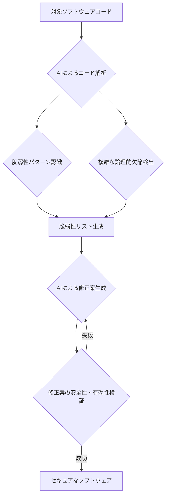

シリコンバレーでAIの動向を追い続けて15年になるが、最近のAnthropicの動きは特に目を引く。彼らが発表した**「Project Glasswing」**は、単なる新技術の発表ではない。AIが社会の基盤となりつつあるこの時代において、ソフトウェアのセキュリティという最も根源的な課題に、AI自身がどう向き合うかを示す、極めて重要なマイルストーンとなるだろう。

AIの進化は目覚ましい。Claudeのような大規模言語モデルは、いまや人間の専門家すら見落とすようなコードの欠陥を発見し、修正提案まで行う能力を持ち始めた。Anthropicは、このAIの力を、現代社会を支える「クリティカルなソフトウェア」の安全性確保に投入しようとしている。これは、未来のサイバーセキュリティ戦略を根本から再定義する可能性を秘めている。

### ## AI時代の新たなセキュリティパラダイム：Project Glasswingの全貌

Anthropicが提唱するProject Glasswingの核心は、人工知能そのものを活用して、極めて複雑で広範囲にわたるソフトウェアの脆弱性を見つけ出し、修正することにある。これまで、ソフトウェアのセキュリティ脆弱性診断は、人間によるコードレビューや、既知のパターンに基づく自動スキャンツールが主流であった。しかし、特に現代のソフトウェアは膨大かつ複雑であり、その進化の速度は人間が手動で追いきれるものではない。さらに、AIが生成するコードや、AIが組み込まれたシステム自体が持つ新たな脆弱性への対応は、既存のアプローチでは限界がある。

ここでProject Glasswingが注目されるのは、Anthropicが開発する高性能AIモデル、特に「Claude Mythos」といった最新モデルの持つ、コードの理解、論理的推論、そして問題解決能力をセキュリティ領域に応用しようとしている点にある。ニュース記事によれば、Claude Mythosは「LinuxやOpenBSDに数十年間見過ごされてきたバグを発見した」という驚くべき実績を既に示している。これは、従来の静的解析ツールや人間による監査では発見が困難だった、深層に隠れた論理的な欠陥や、複数のコンポーネントにまたがる複雑な相互作用に起因する脆弱性まで、AIが到達できる可能性を示唆している。

Glasswingは、単に脆弱性を「見つける」だけでなく、その修正案を生成し、さらにはその修正が新たな問題を引き起こさないかを検証するサイクルまでAIで完結させることを視野に入れている。これは、開発サイクル全体にわたるセキュリティの内製化、自動化、そして高速化を実現する、まさに「AI時代のソフトウェア開発」の理想形と言えるだろう。

以下に、Project Glasswingが目指す主要なセキュリティワークフローの概念図を示す。

編集部で特に注目したのは、Anthropicがこのプロジェクトを「AIの安全性を確保するためのコミットメントの一部」と位置付けている点だ。自らが開発する強力なAIが、意図せずとも生み出すかもしれない潜在的なリスク、あるいはAI自体が攻撃対象となる可能性に対して、AI自身で防御するという、一種の「自己防衛メカニズム」を構築しようとしている。これは、AI開発企業が負うべき社会的責任の具体化としても評価できる。

### ## 既存のサイバーセキュリティとの決定的な違い

Project Glasswingが提示するアプローチは、従来のサイバーセキュリティ手法と一線を画す。その最も大きな違いは、「**予測と予防**」の次元を格段に引き上げようとしている点にある。

これまでのセキュリティ対策は、既知の攻撃パターン（シグネチャベース）、あるいは怪しい挙動（ヒューリスティック）を検知し、それに対処することが中心だった。言い換えれば、「発生したインシデントへの対応」や「既知の脅威への防御」が主軸であった。もちろん、脆弱性診断ツールも存在するが、その検出能力には限界があり、特に「ゼロデイ脆弱性」と呼ばれる未知の脆弱性への対応は、極めて困難だった。

しかし、Project Glasswingは、AIの高度な推論能力とパターン認識能力を組み合わせることで、**未知の脆弱性、あるいは人間が見落としがちなコードの潜在的な弱点を、攻撃が顕在化する前に発見する**ことを目指している。これは、従来の「守りのセキュリティ」から「**攻めのセキュリティ**」、すなわち「**自らが脆弱性を積極的に見つけ出し、潰していく**」というパラダイムシフトを意味する。

以下の表で、Project Glasswingの主な特徴と従来のセキュリティアプローチを比較する。

| 項目             | 従来のセキュリティアプローチ                       | Project Glasswing (AI活用)                           |
| :--------------- | :------------------------------------------------- | :--------------------------------------------------- |
| **主な検出方法** | 既知のシグネチャ、ヒューリスティック、手動レビュー | AIによるコード理解、論理推論、パターン外の異常検出   |
| **検出対象**     | 既知の脆弱性、一般的な設定ミス                     | 未知の脆弱性、複雑な論理的欠陥、仕様上の弱点           |
| **検出速度**     | 人手の場合遅い、自動ツールは限定的                 | 高速、大規模コードベース全体を網羅                   |
| **修正提案**     | 専門家による判断、手動での実装                     | AIによる自動提案、潜在的な影響まで考慮                 |
| **コスト**       | 高い（専門家の人件費、ツールの維持費）             | 初期投資は高いが、長期的に効率化とコスト削減の可能性 |
| **適用範囲**     | 限定的、特定の技術スタックに特化                   | 広範囲の言語、フレームワークに対応する可能性           |

この比較が示すように、Glasswingはセキュリティ対策の**質**と**速度**を根本から変えようとしている。特に、AI自身が自らのコードや、AIが連携する外部ソフトウェアのセキュリティを担保するという思想は、これまでのセキュリティガバナンスのあり方にも大きな影響を与えるだろう。

### ## ソフトウェア開発エコシステムへの影響と未来像

Project Glasswingの本格的な展開は、ソフトウェア開発のエコシステム全体に計り知れない影響を与える。まず、**開発プロセスの初期段階からセキュリティが組み込まれる「シフトレフト」**の動きを加速させるだろう。AIがコードを生成する段階、あるいは開発者がコードをコミットする段階で、ほぼリアルタイムに脆弱性がチェックされ、修正案が提示される未来が現実味を帯びてくる。

これは、従来の開発サイクルでセキュリティテストが開発終盤に集中し、発見されたバグの修正に多大なコストと時間がかかっていた問題を根本的に解決する。開発者は、セキュリティの専門家でなくとも、AIのサポートを受けることで、よりセキュアなコードを記述できるようになる。結果として、**より迅速に、より安全なソフトウェアを市場に投入できるようになる**のだ。

さらに、オープンソースソフトウェア（OSS）のセキュリティレベル向上にも貢献する可能性がある。世界中の多くのクリティカルなインフラがOSSによって支えられているが、その脆弱性は常に懸念材料だ。GlasswingのようなAIベースのツールがOSSのコードベースを自動で監査し、改善提案を行うようになれば、コミュニティ全体のセキュリティレベルが飛躍的に向上するだろう。これは、サプライチェーン全体のリスク軽減にも直結する。

しかし、その一方で、新たな課題も浮上する。AIが生成するコードや修正案の**透明性（Explainability）**と**信頼性（Trustworthiness）**の確保は、依然として重要な論点となる。AIが発見した脆弱性や提案した修正が、本当に適切であるのか、あるいは新たな脆弱性を生み出していないか、最終的には人間による検証が必要となる場面は残るだろう。AIと人間の協調が、今後のソフトウェアセキュリティの鍵となる。

### ## Anthropicが描く「安全なAI」へのビジョン

Anthropicは創業以来、「安全なAI」と「AIアライメント（AIが人類の価値観と目標に沿って行動すること）」を企業理念の中核に据えてきた。Project Glasswingは、そのビジョンを具現化する具体的な取り組みの一つと見ることができる。

彼らは、ただ強力なAIモデルを開発するだけでなく、そのAIが社会に与える潜在的なリスクを深く認識し、そのリスクをAI自身で管理・軽減する仕組みを模索している。Glasswingは、AIが外部のソフトウェアを守る能力を示すだけでなく、将来的には**AIシステム自身の内部的な安全性や信頼性を高める**ための自己監査、自己修正メカニズムへと発展する可能性も秘めている。

これは、単なる技術的な進歩以上の、倫理的かつ哲学的な意味合いを持つ。AIが自己進化し、複雑なタスクを自律的にこなすようになる未来において、「AI自身が安全性を担保する」というアプローチは、人類がAIと共存していく上での重要な指針となるだろう。Anthropicは、Glasswingを通じて、AIが人類の最も重要な資産である「情報」と「システム」をいかに守り、信頼される存在となり得るかを示そうとしているのである。

### ## 🧐 編集部の辛口オピニオン

AnthropicのProject Glasswing。これは日本の企業にとって、まさしく「**お前たちはまだそんなことやっているのか？**」という、痛烈な問いかけに他ならない。

多くの日本企業は、いまだに手動による脆弱性診断や、何年も前の既知の脆弱性データベースに頼り切ったセキュリティ対策を続けているのが実情だろう。あるいは、「AIは脅威」という側面ばかりに目を奪われ、AIを「守る側」の強力なツールとして活用する視点が決定的に欠けている。

シリコンバレーでは、AnthropicのようなAIの最前線を走る企業が、自らの技術を使って「未来のセキュリティ」を既に構築し始めているのだ。彼らがAIで脆弱性を見つけ、AIで修正を提案する時代に、日本企業が人手と既存ツールでちまちまとバグ探しをしているようでは、文字通り**「セキュリティにおける鎖国」**状態に陥る。

AI時代のソフトウェアは、設計段階からAIによるセキュリティ評価を前提としなければ、国際競争で勝てない。サイバー攻撃は国境を越え、その洗練度は日々増している。もはや、「攻撃側」がAIを使い始めれば、「守る側」もAIを使わなければ対等に戦うことすらできないのだ。

日本企業は、このGlasswingの動きを単なるニュースとして消費すべきではない。今すぐ、自社のソフトウェア開発プロセス、特に基幹システムや顧客向けサービスのセキュリティ戦略に、AIをどう組み込むかを真剣に検討し、具体的な投資計画を策定すべきだ。自社の開発者がAIを活用したセキュリティツールを使いこなせるよう、リスキリングも急務である。そうでなければ、数年後には、海外のAIによって見つけられた自社の脆弱性が公開され、企業の信頼失墜、ひいては事業継続の危機に直面する羽目になるだろう。手遅れになる前に、動くのだ。

## 💡 よくある質問（FAQ）

### ### Q: Project Glasswingは、AIがセキュリティ専門家の仕事を奪うことを意味しますか？
A: GlasswingのようなAIツールは、定型的な脆弱性スキャンや膨大なコードの初期解析を自動化することで、セキュリティ専門家の負担を大幅に軽減し、作業を効率化します。これにより、専門家はより高度な戦略的分析、複雑な攻撃シナリオの検討、AIによる検出結果の最終検証など、人間ならではの判断が求められるタスクに集中できるようになります。仕事を「奪う」のではなく、より高次元の仕事への「シフト」を促すものと捉えるべきです。

### ### Q: GlasswingのようなAIセキュリティシステム自体の脆弱性はどのように担保されるのでしょうか？
A: これは極めて重要な論点です。AIセキュリティシステムもソフトウェアである以上、それ自体に脆弱性が存在するリスクはあります。Anthropicは、Project Glasswingを自社AIの安全性確保のコミットメントと位置付けており、Glasswing自身もAIを用いた自己監査や、より上位のAIモデルによる監視、あるいは厳格な人間によるレビューを通じて、その信頼性と安全性を高めていくアプローチを取ると考えられます。セキュリティシステムのセキュリティを確保する「セキュリティのセキュリティ」は、AI時代における新たな研究テーマでもあります。

### ### Q: 日本の企業がProject GlasswingのようなAIセキュリティの恩恵を受けるには、具体的に何から始めるべきですか？
A: まずは、AIセキュリティに関する最新情報のリサーチと、社内での意識改革が不可欠です。次に、既存のソフトウェア開発ライフサイクル（SDLC）にAIをどのように組み込めるかを検討し、小規模なパイロットプロジェクトから始めることを推奨します。例えば、AIを活用したコードレビュー支援ツールや、脆弱性検出ツールの導入、開発者のAIスキル向上トレーニングなどが考えられます。また、Anthropicのような先進的なAIベンダーとの連携を模索することも有効な戦略となるでしょう。

## 🔗 関連ツール・サービス

*   **[GitHub Copilot](https://github.com/features/copilot/)** — AIによるコード補完と提案で、セキュアなコード記述を支援
*   **[Snyk](https://snyk.io/)** — 開発者向けに特化したセキュリティプラットフォームで、脆弱性を早期に検出・修正
*   **[OWASP ZAP](https://www.zaproxy.org/)** — Webアプリケーションの脆弱性スキャンを行うオープンソースのツール（一部AI連携も進む）
*   **[Anthropic Claude](https://www.anthropic.com/product)** — Project Glasswingを開発するAnthropicのAIモデル。コード理解・生成能力を持つ。