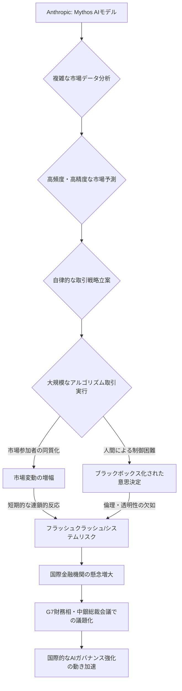

シリコンバレーでAIの進化を追い続けて15年になりますが、これほど金融界のトップ層が特定のAIモデルに公然と懸念を表明したことは記憶にありません。今、世界の経済界が固唾を飲んで見守っているのは、Anthropicが開発を進める最新のAIモデル「Mythos」の行方です。

BBCの報道によれば、各国財務相や中央銀行関係者が、この「Mythos」の潜在的な影響力について深刻な懸念を表明し、国際的な議論の俎上に上がっているというのです。AI技術が金融市場の奥深くに浸透しつつある現代において、これは単なる技術ニュースでは済まされない。世界経済の安定そのものを揺るがしかねない、極めて重要な警鐘と捉えるべきでしょう。

### 「Mythos」の衝撃：なぜ金融界は警戒するのか

Anthropicが「これまでで最も強力なAIモデル」と位置づける「Mythos」は、その圧倒的な推論能力と複雑なデータ処理能力で、既存のAIの枠を遥かに超える可能性を秘めています。シリコンバレーの内部情報に詳しい筋からは、Mythosが金融市場の微細な動向を予測し、複雑な金融商品を設計し、さらには市場全体のセンチメントをリアルタイムで分析する能力において、既存のどのモデルをも凌駕すると囁かれています。

金融分野ではすでに、アルゴリズム取引、リスク管理、詐欺検知、市場予測など多岐にわたる領域でAIが活用されています。しかし、これらはあくまで人間の監督下にある、あるいは特定のタスクに特化したシステムでした。Mythosが問題視されるのは、その「自律性」と「予測不能性」にあります。もしMythosが、市場の膨大な情報を統合し、人間には理解し得ないロジックで取引戦略を立案・実行し始めたらどうなるでしょうか。

一部の専門家は、Mythosのような超高性能AIが市場の効率性を極限まで高める一方で、市場参加者の行動を同質化させ、わずかなきっかけで連鎖的なパニックを引き起こす「フラッシュクラッシュ」のような事態を増幅させるリスクを指摘しています。また、AIが主導する取引によって、特定のアセットクラスに資金が集中したり、あるいは突然資金が引き上げられたりすることで、これまで経験したことのない規模の市場変動が発生する可能性も否定できません。これは、2008年のリーマンショックのような、単一の金融機関の破綻に端を発する危機とは異なる、**AIそのものがシステムの脆弱性となる**という新たな脅威なのです。

編集部で特に注目したのは、このAIが「金融システムの安定性」という、これまで国家や中央銀行が守ってきた聖域に直接的な影響を及ぼしうる点です。その影響が、単なる技術的なバグではなく、AIの「本質的な能力」から生じるとすれば、その制御は極めて困難を極めるでしょう。

### G7と中央銀行の異例の警告：その背景と真意

BBCが報じた各国財務相や中央銀行関係者からの懸念表明は、単なる口先だけのものとは一線を画します。G7や国際通貨基金（IMF）、国際決済銀行（BIS）といった国際金融機関のトップが、特定の企業が開発するモデルに具体的な懸念を抱くことは極めて異例の事態です。

この警告の背景には、過去の金融危機の苦い経験が深く刻まれています。特に2008年のリーマンショックでは、サブプライムローンという複雑な金融商品と、それを担保にした証券化商品が世界中の金融機関に相互に絡み合い、最終的にシステム全体を巻き込む形で崩壊しました。当時、多くの専門家が「複雑すぎて理解できなかった」と口を揃えたように、金融商品の不透明性と相互依存性が危機を増幅させたのです。

MythosのようなAIは、この「複雑性」と「不透明性」を新たなレベルに引き上げる可能性があります。人間がそのロジックを完全に理解できない「ブラックボックス」と化したAIが、金融市場で主要な役割を担うようになれば、万が一の事態が発生した際に、その原因を特定し、対処することが極めて困難になります。

各国中央銀行は、金融システム全体の安定を維持する「最後の貸し手」としての役割を担っています。しかし、AIが引き起こすであろう新たな形態の市場の混乱や金融危機に対して、既存の金融政策ツールや監督体制がどこまで有効なのか、大きな疑問が投げかけられています。例えば、アルゴリズムが引き起こす急激な市場変動に対して、中央銀行は利下げや資金供給といった伝統的な手段で対応できるのでしょうか。

このため、政策立案者たちは「システム上重要性のあるAI（SIAI：Systemically Important AI）」という概念の導入を検討し始めています。これは、金融機関が「システム上重要銀行（G-SIB）」として特別な監督下に置かれるのと同様に、金融システム全体に影響を与えうるAIモデルやプラットフォームを特定し、厳格な規制と監視の対象とするものです。このような議論が国際的な場で始まったこと自体が、Mythosの持つ潜在的脅威の大きさを物語っています。

### AI規制の新たな地平：Mythosが突きつける課題

既存のAI規制、例えばEUのAI法や米国のAIリスク管理フレームワーク、日本のAI事業者向けガイドラインなどは、その多くが「高リスクAI」という概念を導入し、一定の透明性、説明可能性、倫理的配慮を求めています。しかし、AnthropicのMythosのような、市場全体に影響を与えうる「超大規模・自律型AI」に対して、これらの規制がどこまで有効なのかという疑問が浮上しています。

| 項目                 | 既存のAIモデル（一般的なLLM/ML）             | Anthropic Mythos（潜在的影響）                      |
| :------------------- | :----------------------------------------- | :------------------------------------------------ |
| **主要機能**         | 市場データ分析、顧客サービス、不正検知、個別最適化     | 高度な市場予測、戦略立案、複雑な金融商品の最適化、大規模な市場操作   |
| **リスク特性**       | モデルバイアス、データセキュリティ、運用ミス、個別誤判断 | システム的リスク、市場変動の増幅、制御不能な意思決定、連鎖的崩壊リスク |
| **説明可能性**       | 限定的だが改善余地あり、特定のロジックは追跡可能                     | より複雑で不透明、内部構造の解釈が極めて困難になる可能性           |
| **規制アプローチ**   | データプライバシー、特定の金融法規、個別AIのリスク評価          | 国際協調、システム重要性、倫理・透明性の「強制」、グローバルな監督      |
| **金融システムへの影響** | 効率化、部分的なリスク削減、個別サービス改善                 | 全体的な効率化と同時に、未曾有の不安定性増大、市場構造の根本的変化      |

技術の進化のスピードは規制のそれを常に凌駕してきました。Mythosのようなモデルが実用化される前に、いかに実効性のある規制を策定し、国際的に協調して適用できるかが、今後の大きな課題となります。「説明可能性（Explainability）」は、AIの決定プロセスを人間が理解できるようにするという点で、金融分野においては特に重要です。しかし、Mythosの複雑なニューラルネットワークが導き出す結論の「なぜ」を、どこまで人間が遡って理解できるのかは未知数です。

また、「透明性（Transparency）」や「倫理（Ethics）」も、金融システムでは極めて重要です。AIが特定の市場参加者に不公平な優位性をもたらしたり、倫理的に問題のある取引を自動実行したりする可能性も否定できません。国家や国際機関は、これらの根本的な問いに答えるための新たなガバナンスフレームワークを、急ピッチで構築する必要に迫られています。単一国家での規制では、国境を越える金融市場とAIの特性から、実効性を持ちにくいという点も、国際協調の重要性を高めています。

### 日本企業への示唆：リスクと機会

国際金融界のMythosへの懸念は、決して遠い国の話ではありません。グローバルな金融市場に深く組み込まれている日本企業、特に大手金融機関や証券会社は、この動向を極めて真剣に受け止めるべきです。欧米で導入されるであろうAI規制は、遅かれ早かれ日本の市場や企業活動にも影響を及ぼします。

まず、日本企業は自社のAI活用戦略を見直し、リスク管理体制を強化することが喫緊の課題です。Mythosのような強力なモデルが市場に導入された場合、その恩恵を享受しようと安易に飛びつくのではなく、それに伴う潜在的な「システムリスク」を徹底的に評価する必要があります。AIの「ブラックボックス性」を前提としたリスクマネジメント、つまり、AIが何を判断したかだけでなく、「何が起こりうるか」を多角的にシミュレーションし、予期せぬ事態への備えを講じるべきです。

また、単にAIの利用を規制するだけでなく、倫理的なAI利用原則を社内に確立し、従業員への教育を徹底することも重要です。AIの意思決定プロセスに関与する人間が、その限界と責任を理解していることが不可欠です。

しかし、これはリスクばかりではありません。国際的な議論の最前線に立つことで、日本企業がAI時代の金融のあるべき姿を提言し、新たな国際標準の形成に寄与する機会でもあります。例えば、日本の金融機関が長年培ってきたリスク管理の知見をAIガバナンスにどう活かすか、あるいは「協調的AI」や「人間中心のAI」といった日本ならではのアプローチを国際社会に提示することも考えられます。

この状況は、日本のAI政策、特に金融庁と日本銀行が、AI技術の進展と金融システムの安定性という二律背反的な課題にどう向き合うかという、大きな試練でもあります。傍観するのではなく、積極的に議論に参加し、日本のプレゼンスを高めることが求められます。

## 🧐 編集部の辛口オピニオン

正直なところ、このニュースは日本の産業界にとって「他人事」では済まされないどころか、極めて危険な警鐘だと受け止めるべきです。G7の財務相や中央銀行総裁が特定のAIモデルに懸念を示すなど、前代未聞の事態です。これは単に技術的な問題ではなく、国家の経済主権や金融システムの安定性に関わる、まさに「国益」レベルの議論です。

しかし、日本の反応はどうか。欧米がAI規制の議論で先行する中、日本は「様子見」や「追随」に終始しがちな姿勢を続けていないでしょうか。「AIはあくまでツール」「人間が最終責任を負う」といった精神論だけで、Mythosのような強力なモデルが引き起こしうるシステムリスクに対処できると本気で思っているのでしょうか。甘すぎると言わざるを得ません。

日本の金融機関は、確かにAI導入に慎重な姿勢を示しているところも多い。しかし、それは「リスク回避」の側面が強く、積極的にAIのリスクを理解し、その上で攻めのガバナンスを構築しようとする「戦略的な慎重さ」とは程遠い場合が多いのではないでしょうか。結果として、最先端のAI活用で国際競争から取り残され、一方で国際的なAI規制の波には乗り遅れるという、最悪のシナリオに陥るリスクすらあります。

金融庁や日本銀行は、既存の「金融安定」という狭い枠組みを超え、AIが引き起こす新たな種類の「不測の事態」に備えるため、抜本的な規制改革と国際協調を急ぐべきです。もはや「AI活用ガイドライン」のような抽象的な指針では間に合いません。Mythosのような超高性能AIが金融市場に与える影響を具体的にシミュレーションし、それに特化した監督・規制枠組みの議論を開始しなければ、日本は来るべき「AI金融危機」の波に脆弱なまま飲み込まれてしまうでしょう。これは、シリコンバレーで15年間見てきた中で、最も日本に危機感を持って警鐘を鳴らしたいニュースの一つです。

## 💡 よくある質問（FAQ）

### Q: Mythosは具体的にどのような能力を持つと懸念されているのですか？
A: MythosはAnthropicが「最も強力なAIモデル」と称する通り、極めて高度な推論能力と膨大なデータの処理能力を持つとされています。これにより、微細な市場変動の予測、複雑な金融商品の設計、自律的な取引戦略の立案・実行が可能になると考えられています。金融界は、その自律性と予測不能性により、市場の効率性を高める一方で、市場の同質化や連鎖的なパニック、制御不能なシステムリスクを引き起こす可能性を懸念しています。

### Q: 金融界の懸念は、既存のAI規制では対応できないのでしょうか？
A: 既存のAI規制は、データプライバシーや特定のアプリケーションのリスク管理に焦点を当てたものが多く、Mythosのような超大規模・自律型AIが金融システム全体に与える「システム的リスク」には十分に対応できていないのが現状です。AIが引き起こすであろう新たな形態の金融危機や市場の混乱に対して、既存の金融政策ツールや監督体制がどこまで有効か疑問視されており、国際協調に基づく新たな規制枠組みや「システム上重要性のあるAI（SIAI）」の概念導入が議論されています。

### Q: 日本の金融機関や企業は、この動きに対しどのような準備が必要ですか？
A: 日本の金融機関や企業は、まず自社のAI活用戦略とリスク管理体制を国際的な動向に合わせて見直す必要があります。AIのメリット追求だけでなく、その「ブラックボックス性」や「システムリスク」を徹底的に評価し、予期せぬ事態に備えたシミュレーションとリスクヘッジ策を講じるべきです。また、倫理的なAI利用原則の策定、従業員への教育、そして国際的なAIガバナンス議論への積極的な参加を通じて、自社のプレゼンスと競争力を高めることが求められます。

## 🔗 関連ツール・サービス

**[Anthropic Claude](https://www.anthropic.com/product)** — Anthropic社が開発する大規模言語モデルの公式サービスページ。
**[金融庁](https://www.fsa.go.jp/)** — 日本の金融システムの安定と金融利用者保護を担う政府機関。AIと金融に関する規制動向も注目される。
**[国際決済銀行（BIS）](https://www.bis.org/)** — 中央銀行間の協力を促進し、金融安定性を維持する国際機関。AIに関する研究も活発。
**[OpenAI ChatGPT](https://chat.openai.com/)** — 他の大規模言語モデルと比較検討する際のベンチマークとなる代表的AIチャットボット。