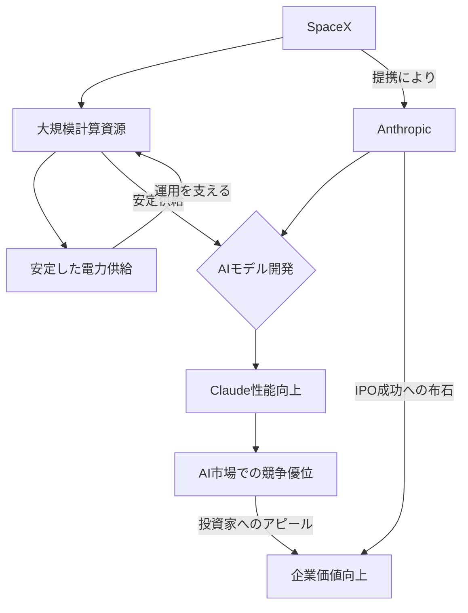

シリコンバレーのAI戦線に、またしても衝撃的なニュースが駆け巡った。生成AIのトップランナーであるAnthropicが、イーロン・マスク率いるSpaceXと大規模な計算資源供給契約を結んだというのだ。これは単なるビジネス上の提携ではない。AI開発の未来を左右するインフラ競争の激化、そしてAnthropicが間近に控えるであろう「ブロックバスターIPO」に向けた、極めて戦略的な一手と見るべきだろう。

今回の報道は、米国内の複数の有力メディアが報じており、特にNew York Postは「Elon Musk’s SpaceX joins forces with Anthropic in AI deal ahead of blockbuster IPO」と見出しを打ち、その戦略的意義を強調している。AIモデルの性能が計算資源の量に直結する現代において、この提携が持つ意味は計り知れない。

## AnthropicとSpaceX：電撃提携の衝撃

AnthropicとSpaceXの提携は、一見すると異業種間の組み合わせに見えるかもしれない。しかし、その背景には、最先端AIモデル「Claude」シリーズを開発するAnthropicの飽くなき計算資源への渇望と、SpaceXが持つ膨大なインフラと技術的ケイパビリティがある。具体的にどの程度の規模の計算資源が供給されるのか、契約の詳細はまだベールに包まれているものの、Anthropicが求めるのは、言うまでもなく膨大な量のGPUクラスタとその安定稼働環境だろう。

SpaceXは衛星インターネットサービス「Starlink」や宇宙輸送事業を展開しており、その運用には独自の高性能データセンターや、電力、冷却技術が不可欠だ。さらに、マスク氏のAIへの深い関心（彼自身もxAIを立ち上げている）を考慮すると、SpaceXがAIワークロードに最適化された計算インフラを水面下で整備していた可能性も十分に考えられる。この提携は、Anthropicが既存のクラウドプロバイダー（AWS、GCPなど）だけでなく、新たな供給源を確保することで、計算資源の安定性と多様性を高める狙いがあると考えられる。

AnthropicのClaudeは、その倫理的なAI開発アプローチ「Constitutional AI」と、OpenAIのGPTシリーズと肩を並べる高性能で知られている。特にClaude 3 Opusは、多モーダル能力や推論能力において高い評価を得てきた。しかし、これらのモデルをさらに進化させ、より大規模なデータセットで訓練するには、文字通り「桁違い」の計算資源が必要となる。今回のSpaceXとの提携は、そのボトルネックを解消し、次世代モデル開発を加速させるための起爆剤となるだろう。

## AI開発のボトルネック「計算資源」の争奪戦

近年、生成AIの開発競争は、まさに「計算資源の戦争」の様相を呈している。高性能なGPUチップは供給が限られ、データセンターの建設・運用には莫大な初期投資とランニングコストがかかる。NVIDIAのH100やH200といった最先端GPUは文字通り「飛ぶように売れ」、クラウドプロバイダーのGPUインスタンスは常に高稼働状態だ。

AIモデルのパラメータ数が数兆規模に達し、訓練データもペタバイト級となる中で、この計算資源の確保は、AI企業の死活問題となっている。OpenAIがマイクロソフトとの強力な提携を通じてAzureのスーパーコンピューティングインフラを利用していることはよく知られているが、AnthropicもAWSとの関係を深めつつ、Googleからも多額の投資を受けるなど、複数の大手クラウドベンダーとの連携を模索してきた。

今回のSpaceXとの提携は、Anthropicが特定のクラウドベンダーに依存しすぎるリスクを分散し、より柔軟かつ安定的な計算資源の確保を目指す動きと解釈できる。特にSpaceXのような、特定の事業のために最適化された独自のインフラを持つ企業との連携は、従来のクラウドサービスとは異なるメリットをもたらす可能性がある。例えば、よりカスタム性の高いハードウェアや、データ主権に関する厳格な要件への対応など、Anthropicが追求するAI倫理と安全性に対するコミットメントとも合致するかもしれない。

| 戦略タイプ             | 特徴                                     | メリット                            | デメリット                              |
|:-----------------------|:-----------------------------------------|:------------------------------------|:----------------------------------------|
| **大手クラウド利用**     | AWS, Azure, GCPなどのGPUインスタンス利用 | 迅速な導入、柔軟なスケーリング        | ベンダーロックイン、コスト予測難度、データ転送コスト |
| **自社データセンター構築** | 大規模な設備投資と自社運用                 | 高度なカスタマイズ、完全な制御        | 初期費用、運用コスト、スケーラビリティ課題、人材不足 |
| **戦略的パートナーシップ** | 特定企業との長期的な協定、専用資源           | 安定供給、専用資源、コスト効率、カスタマイズ | 選択肢の限定、相手依存度、交渉の複雑さ   |
| **新興プロバイダー利用** | AI特化型クラウド、GPUホスティング          | 専門性、コストメリット（ケースによる） | 規模、信頼性、安定性に課題がある場合も |

AnthropicがSpaceXを選んだことは、計算資源の確保における「戦略的パートナーシップ」モデルの新たな可能性を示唆している。これは、従来のクラウド利用や自社構築とは一線を画す、より踏み込んだ連携であり、AI時代の新たなインフラ戦略の萌芽と捉えることができるだろう。

## IPO前の戦略的布石か？Anthropicの野望

New York Postが指摘するように、今回のSpaceXとの提携は、AnthropicのIPO（新規株式公開）を前にした極めて重要な戦略的布石である可能性が高い。AI企業にとって、IPO成功の鍵は、将来的な成長性と技術的優位性をいかに投資家に示せるかにある。そして、その成長性を支える上で、計算資源の安定的な確保は、最も説得力のある材料の一つだ。

投資家は、AI企業が将来的にモデルをどこまでスケールアップさせられるか、そのために必要なインフラはどの程度確保されているかを厳しく評価する。SpaceXのような異色のパートナーシップは、単なる資金力だけでなく、独自の技術的アドバンテージや、サプライチェーンの多様化という点で、Anthropicの企業価値を大きく高める要因となる。イーロン・マスク氏の名前が加わることで、市場の注目度が一気に跳ね上がる効果も無視できない。

Anthropicは、これまでもGoogleやAWS、そして韓国のSKテレコムなどから巨額の資金調達を行ってきた。しかし、IPOはさらに大きな資金を市場から調達し、研究開発、人材獲得、そしてもちろん計算資源への投資を加速させるための大舞台となる。このタイミングでのSpaceXとの提携は、IPOを控え、技術的リーダーシップと事業の持続可能性を印象づけるための、計算し尽くされた一手と考えるのが自然だ。

この動きは、OpenAIとMicrosoftの提携がOpenAIの成長を強力に後押ししたように、Anthropicにとっての「ゲームチェンジャー」となるかもしれない。独自の倫理的フレームワークを持ちながら、商業的な成功も追求するAnthropicの野望が、SpaceXという新たな翼を得て、いよいよ本格的に羽ばたき始める予兆なのだ。

## 日本企業への示唆：異業種連携とインフラ投資の重要性

今回のAnthropicとSpaceXの提携は、日本のAI産業、そして広く日本のテクノロジー企業に、いくつかの重要な示唆を与える。

第一に、**「計算資源は次世代の基幹インフラである」**という認識の徹底だ。電力や通信網と同様に、高性能な計算資源はAI時代の経済活動を支える血液となる。日本企業は、クラウドサービスを「借りる」だけでなく、自社でどのように計算資源を確保し、あるいは戦略的なパートナーシップを通じて手に入れるか、中長期的な視点でのインフラ戦略を構築する必要がある。国内でのGPUサプライチェーンの強化、データセンターの整備、そしてAI特化型チップの開発支援なども視野に入れるべきだろう。

第二に、**「異業種連携によるインフラ戦略の可能性」**だ。AnthropicとSpaceXの提携は、一見関連性の低い業界のトップランナー同士が、共通の課題（AIインフラ）解決のために手を組むという、非常に先進的なモデルを示している。日本の企業も、自社の持つユニークなアセット（広大な土地、余剰電力、特定の技術など）が、AIインフラの新たなピースとなり得ることを認識し、業界の垣根を越えた連携を模索すべきだ。例えば、電力会社とデータセンター事業者、あるいは製造業の持つ遊休施設をAIインフラに転用する、といった発想も必要になるかもしれない。

第三に、**「グローバルなAIインフラ競争への意識」**だ。シリコンバレーでは、国家レベルのリソースがAI開発に投じられ、巨大企業が莫大な資金と技術力を背景にインフラ競争を繰り広げている。日本企業がこのグローバルな競争で存在感を示すには、国内市場だけにとどまらず、世界的な視点で最適なパートナーシップや投資先を見極める能力が求められる。単にAIサービスを利用するだけでなく、その基盤を支えるインフラ層において、いかに戦略的に関与していくかが問われる時代なのだ。

## 🧐 編集部の辛口オピニオン

今回のAnthropicとSpaceXの提携報道を見て、正直なところ「日本は、このレベルのインフラ競争に全く参加できていない」という焦燥感を抱かずにはいられない。シリコンバレーのトップ企業は、AIモデルの性能がハードウェアに依存することを骨の髄まで理解し、億単位、兆単位の投資を計算資源に投じている。既存のクラウドに依存するだけでなく、SpaceXのような「異端児」と組んででも、他社にはない供給ルートを確保しようとする執念は、日本の現状から見れば驚くべきものだ。

日本の大手企業は、まだAIを「業務効率化のためのツール」としか見ていない節がある。自社で大規模なAIモデルを開発・運用し、世界のゲームチェンジャーとなるための「インフラ投資」という概念が、圧倒的に欠けている。政府も「AI戦略」を掲げるが、その実態はアプリケーション層やデータ利活用に偏りがちで、最も根本である計算資源の確保、国産AIチップの開発、データセンターの強化といった「土台」への投資が遅れに遅れている。

このままでは、日本企業は常に世界のAIモデルの「利用者」にしかなれず、モデルのブラックボックス性やセキュリティリスクに晒され続けるだろう。自前でインフラをコントロールし、独自のAIエコシステムを構築する気概がなければ、真のデジタル主権など夢物語だ。AnthropicとSpaceXの提携は、単なるニュースではない。日本のAI戦略の甘さを突きつけ、目を覚ますよう警告する「警鐘」なのだ。

## 💡 よくある質問（FAQ）

### Q: AnthropicとSpaceXの提携が、AnthropicのIPOに具体的にどのような影響を与えると考えられますか？

A: この提携は、AnthropicがIPOに際して投資家に対し、AI開発の生命線である計算資源の安定的な確保能力と、既存のクラウドプロバイダーに依存しない多様なサプライチェーンを持っていることを強力にアピールする材料となります。特にSpaceXのようなイノベーティブな企業との連携は、技術的な先進性や将来的な成長ポテンシャルを印象付け、企業評価の向上に寄与する可能性が高いです。

### Q: SpaceXがAnthropicに提供する計算資源は、一般的なクラウドサービスと何が違う可能性がありますか？

A: SpaceXは自社の衛星通信網「Starlink」や宇宙輸送事業のために、独自の高度なデータセンターインフラや電力供給システムを運用している可能性があります。このため、Anthropicは汎用クラウドサービスでは得られないような、特定のAIワークロードに最適化されたカスタムハードウェアの利用、または地理的に分散された、あるいは独自のセキュリティ要件を満たす環境での計算資源を利用できる可能性があります。

### Q: 日本のAI企業が、今回のAnthropicとSpaceXの提携から学ぶべき最も重要な教訓は何ですか？

A: 最も重要な教訓は、AI開発における計算資源の確保が、国家レベル、企業レベルでの最優先課題であるという認識を持つことです。そして、その確保のためには、既存の枠にとらわれず、異業種連携や、自社での大胆なインフラ投資といった、多角的な戦略が必要であるということです。技術的優位性を維持するには、土台となるインフラへの戦略的なコミットメントが不可欠です。

## 🔗 関連ツール・サービス

*   **[Anthropic Claude](https://www.anthropic.com/index/claude)** — Anthropicが開発する、大規模言語モデル「Claude」の公式サイトです。
*   **[SpaceX](https://www.spacex.com/)** — イーロン・マスク率いる宇宙開発企業SpaceXの公式ウェブサイトです。
*   **[NVIDIA DGX Systems](https://www.nvidia.com/ja-jp/data-center/dgx-systems/)** — 大規模AIワークロード向けに設計されたNVIDIAのスーパーコンピューティングプラットフォーム。
*   **[AWS EC2インスタンス（GPU搭載）](https://aws.amazon.com/jp/ec2/instance-types/p/)** — Amazon Web Servicesが提供するGPUを搭載した高性能仮想サーバーです。