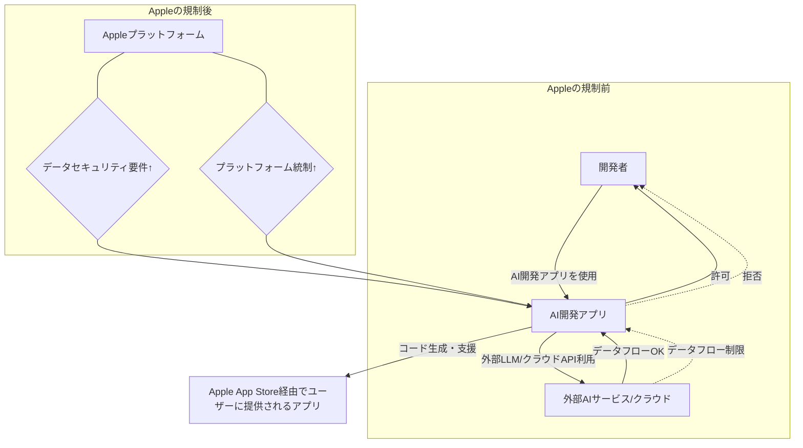

> **💡 この記事のポイント**
> - AppleがAIを活用するコーディングアプリへの規制を強化し、開発者コミュニティから大規模な反発を招いている。
> - 規制の背景には、セキュリティ・プライバシー保護の原則と、自社エコシステムへの強固な囲い込み戦略が見え隠れする。
> - この動きは、プラットフォーム提供者とAI時代のイノベーションの自由との間で生じる避けられない摩擦の象徴であり、日本のIT企業も他人事ではない。

「沈黙の巨人」Appleが、今度はAI分野で大きな波紋を呼んでいます。AIを活用した開発者向けアプリに対し、突如として厳しい規制を課し始めたのです。この決定は、瞬く間に開発者コミュニティに広がり、怒りにも似た激しい反発の声を巻き起こしています。多くのデベロッパーが「これはイノベーションの妨げになる」と口々に非難し、未来の**AI開発アプリ**のあり方そのものに疑問を投げかけています。

## 突如として始まったAppleの「AI開発アプリ」規制

現地時間3月31日、複数のテクノロジーメディアが、AppleがApp Storeの審査ガイドラインを更新し、AIを活用したコーディング支援ツールや開発環境アプリに対し、新たな規制を適用し始めたと報じました。The Tech Buzzは「Apple Cracks Down on AI Coding Apps, Sparking Developer Revolt」と見出しを打ち、この事態が開発者コミュニティに与える衝撃の大きさを伝えています。

具体的に規制の対象となっているのは、コード補完、デバッグ支援、あるいは自動生成など、AIが開発プロセスに深く関与するアプリです。例えば、Cursor AIのようにエージェントベースのコーディングワークフローを提供するような新進気鋭のツールも影響を受けている模様です。情報筋によると、Appleは特に、外部のLLM（大規模言語モデル）を利用し、クラウド上でコードを処理するアプリや、ユーザーのローカル環境から大量のコードデータを収集・分析するアプリに対して神経質になっているようです。

具体的な規制内容はまだ不明瞭な点が多いですが、既存のアプリがアップデート申請を拒否されたり、新規アプリの審査が極端に厳しくなったりするケースが報告されています。App Storeのポリシー違反として挙げられるのは、「ユーザーデータの不適切な収集・利用」「セキュリティリスクの増大」「知的所有権の侵害の可能性」といったものが主ですが、開発者側からすれば、「AIの進化に適応しようとする正当な試み」であり、Appleの対応は時代錯誤であるという反発が強く出ています。

## 規制の背景にあるAppleの思惑とは？

なぜAppleはこのタイミングで、AI開発アプリへの規制に乗り出したのでしょうか。その背景には、Appleが長年培ってきた企業文化と、AI時代における新たな戦略が見え隠れしています。

### セキュリティとプライバシー保護：Appleの譲れない原則

最も表面的な理由として挙げられるのは、Appleが常に最優先事項としてきた**セキュリティとプライバシー保護**でしょう。AIを活用したコーディングツールは、ユーザーのソースコードという極めて機密性の高い情報を扱います。これが外部のサーバーで処理されたり、意図せず第三者に漏洩したりするリスクは否定できません。特に生成AIが持つ「幻覚」（Hallucination）の問題は、生成されたコードに潜在的な脆弱性が含まれる可能性も示唆しており、最終的なアプリケーションの品質やセキュリティに悪影響を及ぼす恐れがあります。

Appleは、ユーザーが自分のデータに対し完全なコントロールを持つべきだという思想を徹底しています。AI開発アプリがどのようなデータを収集し、どのように利用・保存しているのか、そしてその透明性が確保されているのか、Appleが納得できるレベルに達していないと判断した可能性は高いです。

### エコシステムコントロールと収益化：自社AI戦略への布石か

もう一つの大きな要因は、Appleの**エコシステムコントロール**への強いこだわりです。AppleはApp Storeを通じて、デジタルコンテンツとサービスの巨大な経済圏を築き上げました。AIがソフトウェア開発の根幹を揺るがし始めている今、開発プロセス自体が外部のAIツールに依存するようになれば、自社プラットフォーム上でのコントロールが弱まることを懸念しているのかもしれません。

また、AI分野におけるAppleの自社戦略も無視できません。GoogleのGemma 4のようなオープンモデルの発表や、OpenAIの目覚ましい進化を見るにつけ、Appleも独自のAI技術、特にデバイス上でのAI処理に力を入れています。外部のAI開発アプリを規制することで、将来的に自社が提供するであろうAI開発ツールやフレームワークへの誘導を狙っている可能性も考えられます。これは、競争上の優位性を確保し、新たな収益源を確保するための布石とも解釈できます。

### AIエージェントへの警戒か？

最近のトレンドとして、**AIエージェント**の進化が目覚ましいものがあります。Cursorが発表したエージェントベースのコーディングワークフローのように、AIが自律的にタスクを分解し、コードを記述し、デバッグまで行う未来はすぐそこまで来ています。Fortune誌は「The supervisor class: how AI agents are remaking the developer’s career」と報じていますが、これらのAIエージェントが、App Storeの枠組みや既存のAPIの制約を超えて、Appleのエコシステム内で「勝手に」振る舞い始めることに対し、Appleが強い警戒感を抱いていると見ることもできます。プラットフォーム側からすれば、予測不能な自律型AIの行動は、コントロールの喪失を意味しかねないからです。

## デベロッパーコミュニティの「反発」と未来への懸念

Appleの今回の措置に対し、開発者コミュニティからは激しい反発の声が上がっています。彼らの主な懸念点は以下の通りです。

| 開発者コミュニティの懸念事項 | Apple側の潜在的意図 |
| :--------------------------- | :------------------- |
| **イノベーションの阻害**     | 自社AI技術の保護、競合排除 |
| **開発効率の低下**           | セキュリティ・プライバシー確保 |
| **オープンエコシステムの破壊** | プラットフォームの統制強化 |
| **選択の自由の制限**         | ユーザー体験の一貫性維持 |
| **不透明な審査基準**         | 未成熟なAI技術への慎重姿勢 |

CNBCのコラム「Apple's crackdown on AI apps puts it on the wrong side of history」が指摘するように、多くの開発者はAppleが歴史の流れに逆行していると見ています。AIはすでにソフトウェア開発に不可欠な要素となりつつあり、MicrosoftやGoogleなどは、積極的に開発者向けAIツールを統合し、生産性向上をアピールしています。

例えば、MicrosoftはGitHub Copilotを通じて、Googleは新たなオープンモデルGemma 4で開発者を引きつけようとしています。このような中でAppleだけが逆行する姿勢を見せれば、優秀な開発者がAppleのエコシステムから離れていく可能性も否定できません。これは、長期的にはAppleプラットフォームの魅力低下につながりかねないリスクをはらんでいます。

上記の簡易図が示すように、これまでは自由に行われていたAI開発アプリと外部サービス間の連携や、それを利用したアプリ開発が、Appleの新たな要件によって大きく制限される可能性があります。

## 🧐 エバンジェリストの辛口オピニオン

今回のAppleの**AI開発アプリ**規制の動きは、私からすれば「何を今さら」という感想を抱かざるを得ません。Appleは常に囲い込み戦略の達人であり、自社エコシステムのコントロールを誰よりも重視してきた企業です。AIが新しいインフラとなり、ソフトウェア開発の核心に食い込もうとしている現在、彼らが「自分たちの庭」を守ろうとするのは、ある意味で必然的だったと言えるでしょう。

しかし、この必然性こそが、日本の企業にとって最も警戒すべき点です。多くの日本企業、特に開発を外部プラットフォームに依存している中小・ベンチャー企業は、「特定のプラットフォームに依存しすぎると、ある日突然、梯子を外される可能性がある」という教訓を改めて肝に銘じるべきです。Appleの今回の動きは、その典型的な事例です。

もし貴社がAppleのプラットフォーム上でAIを活用した開発ツールやサービスを展開しているのであれば、今すぐ「マルチプラットフォーム戦略」の再考を始めるべきです。そして、**自社のAI戦略**を「他社プラットフォームのポリシー変更に左右されない」レベルで自立させる覚悟が必要です。オープンソースAIの活用や、ローカル環境でのLLM構築、自社データ基盤の強化など、脱プラットフォーム依存の道を真剣に模索しなければ、あっという間に「ガラパゴス化」の道を辿ることになるでしょう。

AIは確かに効率を高めます。しかし、「AI coding hangover」という言葉が示すように、その急速な導入は開発者のスキル喪失や燃え尽き症候群といった新たな問題も生み出しています。Appleは「ユーザー体験」を盾にこの規制を正当化するでしょうが、本質は「主導権争い」です。日本の企業は、このシリコンバレーで繰り広げられる覇権争いを傍観するだけでなく、自社の未来をかけた戦略的な意思決定を迫られているのです。

## プラットフォームとAIの共存は可能か？

Appleの今回の規制は、プラットフォーム提供者とAI時代のイノベーションがどのように共存していくべきか、という根源的な問いを突きつけています。一方で、プラットフォームの健全な維持とユーザー保護は不可欠です。しかし他方で、AI技術の爆発的な進化を阻害することも、長期的には誰の利益にもなりません。

今後、Appleが開発者コミュニティの声にどのように耳を傾け、規制を緩和するのか、あるいはさらに厳格化するのかはまだ不透明です。しかし、この一連の動きは、**AI開発アプリ**を取り巻くエコシステムがまだ発展途上であり、ルールメイキングが活発に行われている段階にあることを示しています。日本の企業や開発者は、この動向を注視しつつ、変化に対応できる柔軟なAI戦略を構築することが、未来の競争力を左右する鍵となるでしょう。

## 🔗 関連ツール・サービス

*   **[Cursor AI](https://cursor.sh/)** — AIによるコード補完、チャット、デバッグ機能を統合した次世代開発環境。
*   **[GitHub Copilot](https://github.com/features/copilot)** — OpenAI Codexを活用し、IDE上でリアルタイムのコード補完を提供するAIペアプログラマー。
*   **[Google Gemma](https://ai.google.dev/gemma)** — Googleが開発し、オープンな提供を始めた軽量で高性能な大規模言語モデルファミリー。