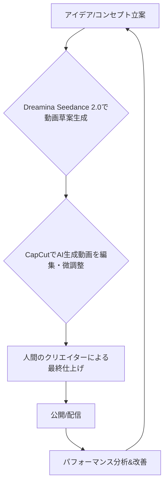

シリコンバレーから、またしても動画生成AIの驚くべきニュースが舞い込んできた。OpenAIのSoraがその衝撃的なクオリティで世界を席巻したかと思えば、わずか半年でのサービス終了という波乱の展開。その影で、着実に牙を研ぎ、満を持して巨大な一歩を踏み出したのが、中国のテクノロジー大手ByteDanceだ。彼らが開発した最新のAI動画生成モデル「**Dreamina Seedance 2.0**」が、世界中で広く利用されている動画編集アプリ「**CapCut**」に統合されたという報は、動画コンテンツ制作の未来図を大きく塗り替える可能性を秘めている。これは単なる機能追加ではない。既存のクリエイティブワークフローにAIが深く食い込み、誰もがプロレベルの動画を生成できる時代の幕開けを告げているのだ。

## ByteDance、CapCutで動画生成AIの覇権を狙う

ご存知の通り、ByteDanceはTikTokで世界中の人々のエンターテイメントと表現の形を変えてきた。そのTikTokの成功を支える強力なエンジンの一つが、親しみやすいUIと豊富な機能で人気の動画編集アプリ「**CapCut**」だ。月間アクティブユーザー数で数億規模に達すると言われるこのプラットフォームに、最新のAI動画生成技術「**Dreamina Seedance 2.0**」が搭載されたという事実は、動画生成AI市場における彼らの並々ならぬ野心を物語っている。

Soraが一部の限られたクリエイターや研究者向けに展開されていたのに対し、CapCutへの統合は「大規模な一般ユーザーへの開放」を意味する。これまで高度なAI動画生成は、複雑なプロンプト入力や、専門知識を要するツールが必要だった。しかしCapCutに統合されることで、ユーザーは日頃使い慣れたインターフェース上で、テキストプロンプトや画像、音声などから直接動画を生成できるようになる。これは、AI技術の民主化を象徴する出来事であり、動画制作の敷居を劇的に下げるだろう。

TechCrunchの報道によると、**Dreamina Seedance 2.0**は、従来のバージョンに比べ、動画の解像度、一貫性、そして動きの自然さにおいて顕著な改善を遂げているという。特に注目すべきは、短いプロンプトからでも意図を正確に汲み取り、より高品質で詳細な動画を生成する能力だ。この進化は、特に短尺動画コンテンツが主流のSNSプラットフォームにおいて、ユーザーの表現の幅を飛躍的に広げるだろう。

### Dreamina Seedance 2.0 主要機能の推測

CapCutへの統合により、以下の機能が強化されると見込まれる。

*   **テキストからの動画生成**: 記述したテキストプロンプトから、数秒で動画クリップを生成する。
*   **画像からの動画生成**: 静止画をアップロードし、動きのある動画へと変換。写真の一部をアニメーション化することも可能となる。
*   **オーディオ同期**: 音声に合わせてリップシンクやアクションを生成する機能がさらに進化。
*   **スタイル変換**: 既存の動画や画像に異なるアートスタイルを適用し、全く新しいルック＆フィールを作成できる。
*   **オブジェクトの追加・削除**: 生成された動画内のオブジェクトをAIで追加、または不必要な要素を削除する機能が利用可能になる。

これらの機能が、CapCutの直感的な編集ツールとシームレスに連携することで、これまで数時間かかっていた作業が数分で完了する可能性が出てくる。

## 「Sora」の終焉と「Dreamina」の台頭：市場の動向

OpenAIのSoraは、その発表当初から動画生成AIの新たな基準を打ち立てた。しかし、ニューヨーク・タイムズやNBCニュースの報道によると、Soraはわずか半年でサービスを終了したという。詳細な理由は不明だが、技術的な課題、倫理的な問題、あるいは商業化への道のりの困難さなど、様々な憶測が飛び交っている。

一方で、このSoraの突然の退場は、市場に大きな空白を生んだ。そこに、Google Vids、Adobe Firefly、そして今回のByteDanceの**Dreamina Seedance 2.0**といった競合が次々と参入し、激しい競争を繰り広げている。特にCapCutへの統合は、まるで一般市場への「号砲」のように響く。

| サービス名 | 提供元 | 主な特徴 | ターゲットユーザー | 状況 (2026年4月時点) |
| :--------- | :----- | :------- | :----------- | :----------- |
| **Dreamina Seedance 2.0** | ByteDance | CapCut統合で高品位動画生成、高度な制御 | 一般クリエイター、SNSユーザー | 急成長、市場参入 |
| Sora | OpenAI | 極めて高精度なリアル動画生成 | 限定クリエイター、研究者 | サービス終了 |
| Google Vids | Google | プレゼンテーション動画特化、AI編集 | ビジネスユーザー、教育関係 | 新機能追加、拡大中 |
| Firefly | Adobe | 画像・動画生成、カスタムモデル対応 | プロクリエイター、企業 | 機能拡張、エコシステム連携 |
| X (動画生成) | X (旧Twitter) | 静止画からの簡易動画生成 | SNSユーザー | 新機能として展開 |

この表を見れば一目瞭然だが、Soraの撤退は「技術の優位性」と「市場への普及」が必ずしもイコールではないことを示した。ByteDanceはCapCutという強力なユーザー基盤を持つことで、この「普及」の課題を一気にクリアしようとしている。これは、技術の革新性だけでなく、いかに多くのユーザーに届けるか、という視点がAIサービス成功の鍵を握ることを示唆している。

## 日本のコンテンツクリエイター、企業へのインパクト

この「**Dreamina Seedance 2.0**」とCapCutの統合は、日本のクリエイターや企業にとって、極めて重要な意味を持つ。

まず、個人クリエイターやインフルエンサーにとっては、コンテンツ制作の民主化がさらに加速する。これまで専門的なスキルや高価なソフトウェアが必要だった動画制作が、スマートフォン一つで、かつてないほど簡単に、高品質なレベルで可能になるのだ。TikTokやYouTubeショート、Instagramリールといったプラットフォームでの競争は、一層激化するだろう。アイデアとセンスさえあれば、技術的な障壁なしに誰もが「動画クリエイター」になれる時代が現実味を帯びる。

企業にとっては、マーケティングコンテンツやプロモーション動画の制作コストと時間の削減に直結する。特に中小企業やスタートアップにとって、動画広告やSNSコンテンツの制作は大きな負担だった。AIが下書きを作成し、編集者が最終調整を行う「AI駆動型コンテンツ制作」のワークフローが一般化することで、より多くの企業が動画マーケティングに参入しやすくなる。これにより、動画を通じたブランド構築や顧客エンゲージメントの機会が飛躍的に増大するだろう。

### AIと人間クリエイターの新たな協業モデル

これは決して人間のクリエイターが不要になる、という話ではない。むしろ、AIが雑務をこなし、人間はより創造的で戦略的なタスクに集中できるようになることを意味する。

このようなワークフローが標準化されることで、クリエイターは「何を表現するか」という本質的な部分に、より多くの時間とエネルギーを注ぐことができるようになる。例えば、動画のトーン＆マナーの設計、ストーリーテリングの深掘り、視聴者の感情に訴えかける演出など、AIが苦手とする分野で人間の創造性が光る場面が増えるだろう。AIは強力な「道具」であり、その道具をいかに使いこなすかが問われる時代となる。

## 🧐 エバンジェリストの辛口オピニオン

ByteDanceがCapCutに「**Dreamina Seedance 2.0**」をぶち込んできた件、個人的には「待ってました」の一言に尽きる。Soraが幻想を見せてくれた一方で、結局のところ、本当に市場を変えるのは「誰でも使えるプロダクト」だ。ByteDanceはそこを完璧に突いてきた。

Soraが消えた今、動画生成AI市場の王座は文字通り空席だ。Google Vidsはビジネス用途に傾倒し、Adobe Fireflyはプロフェッショナルなエコシステムに深く根を下ろしている。しかし、数億人規模のユーザーを抱えるCapCutに、高性能なAI動画生成機能を組み込むというのは、まさにゲームチェンジャーの一手だ。これにより、TikTokの動画コンテンツは爆発的に進化するだろうし、それを模倣する形で、他のSNSプラットフォームも**AI動画生成**機能を急ピッチで導入せざるを得なくなる。

日本の企業やクリエイター諸君、この動きを「遠い国の話」と高を括っている暇はない。CapCutはすでに日本でも絶大な人気を誇っている。これまで動画制作に二の足を踏んでいた企業は、この機会にAI活用を真剣に検討すべきだ。高品質な動画コンテンツが、低コストかつ短時間で制作できる環境が整うのだから、もう言い訳は通用しない。

しかし、同時に警告もしておきたい。AIが生成する「それっぽい」動画は今後、あっという間にコモディティ化する。差別化の鍵は、AIでは生み出せない「人間の感性」と「深い洞察に基づいたストーリーテリング」だ。ただAIに任せるだけでなく、AIを使いこなし、いかに独自の世界観を表現できるか。そのスキルセットこそが、これからのクリエイターに求められる真の価値となる。

そして、最も重要なのは「速度」だ。シリコンバレーでは一瞬たりとも立ち止まれない。市場のトレンドは目まぐるしく変化し、競合は常に次の一手を考えている。Dreamina Seedance 2.0の登場は、日本のコンテンツ制作業界に「変わるか、取り残されるか」という、非常に厳しい問いを突きつけていると、私は見ている。既存のワークフローに安住している場合ではない。今すぐCapCutをダウンロードし、その可能性を肌で感じてみてほしい。

## 🔗 関連ツール・サービス

*   **[CapCut (公式)](https://www.capcut.com/)** — ByteDanceが提供する、AI動画生成機能搭載の人気の動画編集アプリ。
*   **[TikTok (公式)](https://www.tiktok.com/)** — ByteDanceが運営する、CapCutとの連携も強い世界的なショート動画プラットフォーム。
*   **[Adobe Firefly (公式)](https://www.adobe.com/sensei/generative-ai/firefly.html)** — Adobeの生成AIファミリーで、プロフェッショナルな画像・動画生成を支援。
*   **[Google Vids (公式)](https://vids.google/)** — Google Workspaceに統合された、AIによるプレゼンテーション動画作成ツール。