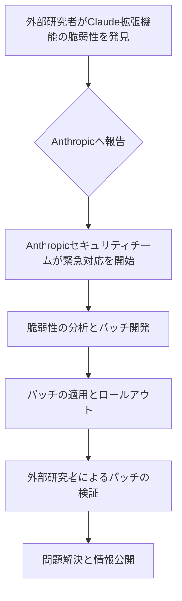

シリコンバレーのAI戦線は、常に驚きと興奮に満ちています。しかし、その一方で、光の速さで進化するテクノロジーには、常に影がつきものです。今回、編集部が特に注目したのは、AIチャットボット「Claude」を提供するAnthropicが直面した、まさに「緊急事態」でした。同社のChrome拡張機能に深刻な脆弱性が発見され、それが外部研究者の手によってわずか**3時間**でパッチ適用にまで至ったという報は、AI時代のセキュリティに対する我々の認識を大きく揺さぶります。

まるでSF映画のワンシーンのように、危機が発覚し、超高速で解決される。このスピード感こそが、現代のAIビジネスにおける生命線であり、同時に最も難しい課題でもあります。今日のニュースは、単なる一つのセキュリティインシデントではありません。それは、AIサービスを開発・運用する企業、そしてそれを活用する全てのユーザーにとって、避けられない現実と、それに対峙するための新しいモデルを突きつけるものです。

## Anthropicを襲った「Claude Chrome拡張機能」の衝撃

2026年5月8日未明（GMT）、米サイバーニュースが報じたのは、Anthropicの提供する人気AIチャットボット「Claude」のChromeブラウザ拡張機能に、ユーザーの機密情報を危険に晒す可能性のある**深刻な脆弱性**が存在するという事実でした。この種のブラウザ拡張機能は、ユーザーが日常的に利用するウェブサービスとAIモデルを連携させ、生産性を向上させる上で不可欠な存在となっています。それだけに、そのセキュリティ欠陥は、ユーザーのプライバシーとデータ保護に直接的な脅威を与えるものです。

詳細によると、この脆弱性は、拡張機能がウェブサイトとの間でデータをやり取りするメカニズムに起因するものでした。悪意のある第三者が特定のコードを注入することで、ユーザーの認証情報や、Claudeとの会話内容、ひいては閲覧履歴といった機微な情報を窃取できる可能性があったと指摘されています。想像してみてください。あなたがClaudeを使って財務分析をしたり、個人的なメールのドラフトを作成したりしている最中に、その情報が悪意あるハッカーの手に渡るかもしれないのです。これは、個人のみならず、企業にとっても非常に大きなリスクとなります。

従来のソフトウェア開発サイクルでは、このような重大な脆弱性が発見された場合、分析、パッチ開発、テスト、そしてリリースまでに数日から数週間、場合によっては数ヶ月を要することも珍しくありませんでした。しかし、Anthropicの対応は、そうした常識を打ち破るものでした。

ここで、今回のセキュリティ事象における一般的なフローを視覚的に整理してみましょう。

この流れの中で、DからE、そしてFまでが驚異的なスピードで行われた点が、今回の事例の核となります。わずか3時間でのパッチ適用は、AIサービスが持つ情報の機微性と、それに対する迅速な対応能力がいかに重要であるかを如実に示しています。これは、AI技術の進化が加速する現代において、セキュリティ対策もまた、光速で進化しなければならないという厳しい現実を突きつけるものです。

## なぜAnthropicは「3時間」という驚異的なスピードで対応できたのか

Anthropicがこの深刻な脆弱性に対して、わずか3時間という驚異的な短時間でパッチを適用できた背景には、いくつかの要因が複合的に絡み合っていると編集部は分析しています。これは、単なる偶然ではなく、AI時代のセキュリティ対応における先進的なアプローチの証と言えるでしょう。

まず第一に、**「バグバウンティプログラム」を含む外部研究者との強固な連携**が挙げられます。今回の脆弱性も、外部のセキュリティ研究者によって発見され、Anthropicに直接報告されました。Anthropicは、以前からセキュリティ研究コミュニティとの協調を重視し、積極的に脆弱性報告を受け入れる体制を構築していたと見られています。これにより、問題発生の「早期検知」と「正確な情報共有」が実現しました。企業が内部の監査体制だけでなく、外部の専門家の目を活用することは、AIのような複雑なシステムにおいては特に重要です。

第二に、**「アジャイルな開発体制」と「CI/CD（継続的インテグレーション/継続的デリバリー）パイプラインの成熟」**です。最新のソフトウェア開発では、コードの変更が頻繁に行われ、テストとデプロイメントが自動化されています。Anthropicも例外ではなく、高度に自動化されたCI/CDパイプラインを運用していたからこそ、緊急パッチの開発からテスト、そして全ユーザーへのロールアウトまでを数時間で完了させることができたのでしょう。もし手作業によるプロセスが多ければ、これほどのスピードは不可能だったはずです。

第三に、**「セキュリティ専任チームの即応体制」**と**「問題解決への優先順位付け」**です。Anthropicは、AIの安全性と倫理に重点を置く企業として知られています。その理念は、セキュリティ対策にも色濃く反映されており、セキュリティインシデント発生時には、組織全体で最優先課題としてリソースを集中できる体制が整っていたと推測されます。経営層から現場のエンジニアまで、全員が問題の深刻性を認識し、迅速な対応の必要性を共有していたからこそ、このスピードが実現したのです。

最後に、**「ブラウザ拡張機能の特性」**も一因として挙げられます。ブラウザ拡張機能は、ウェブサイトやサーバーサイドのシステム全体を修正するよりも、比較的小規模なコードベースで動作します。そのため、問題の特定と修正が迅速に行える場合があります。また、Chromeウェブストアを通じた更新プロセスも、大手ベンダーであれば比較的スムーズに進められる点も寄与したかもしれません。

今回のAnthropicの対応は、AIサービスのセキュリティにおいて、いかに「スピード」と「外部連携」、そして「組織のレジリエンス」が重要であるかを雄弁に物語っています。

## AIサービスにおけるセキュリティリスクの新たな側面

Anthropicの事例は、AIサービスが従来のソフトウェア製品とは異なる、あるいは新たな層のセキュリティリスクを抱えていることを示唆しています。

まず、**「高速な進化サイクルが生む脆弱性」**です。AIモデルや関連サービスは、非常に速いペースで新機能が追加され、アップデートが繰り返されます。この高速なイテレーションはイノベーションの源ですが、同時に新しいコードが導入されるたびに、予期せぬ脆弱性が生まれるリスクも増大させます。十分なテスト期間を確保することが難しい状況で、セキュリティの網の目を潜り抜けるバグが混入する可能性は常にあります。

次に、**「ユーザーデータの集中と高価値性」**です。AIチャットボットは、ユーザーの問い合わせ内容、思考プロセス、さらには個人的な情報や企業の機密データに直接触れる機会が多くなります。これらは、従来のウェブサービスが収集するデータと比較しても、非常に高価値な情報であり、悪意のある攻撃者にとって魅力的なターゲットとなります。今回のChrome拡張機能の脆弱性は、まさにこの「高価値データ」へのアクセスを許してしまう危険性がありました。

さらに、**「AIモデル自体のセキュリティ」**も考慮すべき点です。今回の脆弱性は拡張機能にありましたが、AIモデル自体が誤情報を生成する（ハルシネーション）、特定のプロンプトによって悪意のある出力を引き出される（プロンプトインジェクション）、あるいは訓練データにバックドアが仕込まれる（データポイズニング）といったリスクも存在します。これらのリスクは、従来のソフトウェアセキュリティとは異なる、AIに特化した知識と対策を必要とします。

| 項目         | 今回のAnthropicの対応 (AI時代の迅速性)     | 従来のソフトウェア脆弱性対応 (一般的なケース)        |
|:-------------|:-------------------------------------------|:---------------------------------------------------|
| **発見から報告** | 外部研究者による即時報告（バグバウンティ活用） | 内部監査または外部からの報告（時間差発生の可能性） |
| **分析・パッチ開発** | 数時間以内での緊急対応                     | 数日〜数週間、場合によっては数ヶ月                 |
| **パッチ適用**   | わずか3時間で迅速なロールアウト              | 次のメジャーアップデートまたは定期的な更新に含む     |
| **主な目的**   | リアルタイムのリスク軽減とユーザー信頼の維持 | システムの安定性と長期的なセキュリティ強化       |
| **影響範囲**   | ユーザーの機密データへの即時リスク           | 広範囲なシステム侵害やサービス停止の可能性         |
| **対応の前提**   | 高度なCI/CD、専任チーム、経営層の理解       | 組織文化、リソース配分、リスク管理体制           |

この比較表が示す通り、AIサービスにおけるセキュリティ対応は、従来のソフトウェア開発とは異なるレベルのスピード感と、リスクに対する認識の変革を要求します。企業は、開発初期段階からセキュリティを組み込む「セキュリティ・バイ・デザイン」の徹底、そして万が一の際に迅速に対応できる体制の構築が喫緊の課題となるでしょう。

## 日本企業がAnthropicの事例から学ぶべき教訓

Anthropicの迅速な対応は、日本の企業、特にAIサービスの導入を検討している、あるいは既に利用している企業にとって、多くの教訓を与えてくれます。シリコンバレーのスピード感は、日本のビジネス慣習とは大きく異なることが多いですが、AIセキュリティにおいては、もはや猶予はありません。

### 1. 「性善説」ではない、攻めのセキュリティ投資を

日本の多くの企業は、システムの安定稼働やコンプライアンス順守に重点を置くあまり、セキュリティ投資が「守りの姿勢」に傾きがちです。しかし、AI時代においては、予測不能なリスクが常につきまとうため、Anthropicのように外部研究者との連携やバグバウンティプログラムの積極的な導入など、**「攻めのセキュリティ投資」**への転換が不可欠です。発見されてから慌てるのではなく、発見を促し、迅速な解決へと導く体制が求められます。

### 2. 「スピード」と「アジリティ」を組織文化に

3時間でのパッチ適用は、Anthropicが単に技術的に優れているだけでなく、組織全体に「スピード」と「アジリティ（俊敏性）」が深く根付いている証拠です。日本の企業では、リスク回避を優先するあまり、意思決定や承認プロセスに時間を要することが少なくありません。しかし、AIセキュリティにおいては、数時間の遅れが甚大な被害に繋がる可能性があります。緊急時には、現場が迅速に判断し、経営層がそれを後押しする文化の醸成が急務です。

### 3. AI製品のリスク評価とベンダー選定の厳格化

AIサービスを導入する企業は、ベンダーがどのようなセキュリティ体制を持っているのか、脆弱性対応のSLA（サービスレベルアグリーメント）はどうなっているのかを、これまで以上に厳しく評価する必要があります。単に機能やコストだけでなく、**「セキュリティ対応のスピードと実績」**が、ベンダー選定の重要な基準となるべきです。また、自社で利用するAIツールがどのようなデータを取り扱い、どのようなリスクを内包しているのかを常に把握し、適切なリスク管理策を講じることが求められます。

AIは、確かにビジネスに革新をもたらす強力なツールです。しかし、その力を最大限に活用するためには、同時にその「影」の部分、すなわちセキュリティリスクに対する徹底した備えが不可欠となります。Anthropicの事例は、そのための青写真を我々に提示してくれたと言えるでしょう。

## 🧐 編集部の辛口オピニオン

今回のAnthropicの事例は、日本のビジネスリーダーたちにとって、警鐘以上の意味を持つはずだ。3時間でのパッチ適用という報を聞いて、「すごいな」で終わらせているようでは、正直言って周回遅れもいいところだろう。シリコンバレーでは、このスピード感とリスクへの認識が「当たり前」になりつつある。

日本の企業は、「うちはまだAI導入の初期段階だから」「大手が使うような高度なAIは関係ない」などと安易に考えていないか？ それは大きな間違いだ。Claudeのような汎用AIサービスは、知らぬ間に社内の隅々まで浸透している可能性がある。特に、Chrome拡張機能のような形で利用される場合、シャドーIT化しやすい。情シス部門が把握しないまま、社員が勝手に機密情報をAIに投入し、セキュリティホールに繋がるリスクは想像以上に高いのだ。

さらに言えば、日本のソフトウェア開発やセキュリティ対策の現場は、未だに「ウォーターフォール型」思考から抜け出せていない部分が多い。計画に時間をかけ、承認プロセスを何重にも踏み、万全を期してからリリース、というプロセスでは、AIのスピードには到底追いつかない。脆弱性が発覚してから「担当部署はどこだ」「責任者は誰だ」とたらい回しにしている間に、データは流出し、企業の信頼は地に落ちるだろう。

「顧客第一」を掲げるなら、その顧客のデータを守ることが最優先のはずだ。そのためには、セキュリティを「コスト」ではなく「競争力」と捉え、外部研究者との連携、バグバウンティの導入、アジャイルな開発・運用体制、そして何より「緊急時には全社一丸となって即座に対応する」という組織文化を、今すぐにでも構築しなければならない。そうでなければ、AI時代のセキュリティリスクの波に飲み込まれ、手遅れになるのは目に見えている。この3時間は、日本の企業にとって、文字通り「命運を分ける時間」となりうるのだ。

## 💡 よくある質問（FAQ）

### ### Q: どのような種類の脆弱性だったのか、具体的に教えてください。
A: 今回の脆弱性は、AnthropicのClaude Chrome拡張機能におけるデータ処理メカニズムに関連するものでした。具体的には、拡張機能がウェブサイトと情報をやり取りする際に、悪意のあるコードが注入されることで、ユーザーの閲覧履歴、Claudeとの会話内容、さらには認証情報などの機密情報が外部に漏洩する可能性があったと報告されています。

### ### Q: Anthropicはなぜこれほど迅速に対応できたのでしょうか？
A: 主に以下の要因が考えられます。第一に、外部のセキュリティ研究者からの迅速かつ正確な報告があったこと。第二に、Anthropicがバグバウンティプログラムを通じて常日頃から外部連携を重視し、緊急時に対応できる体制を構築していたこと。第三に、高度に自動化されたCI/CDパイプラインと、セキュリティインシデントに最優先でリソースを投入できるアジャイルな開発・運用体制が整っていたことが挙げられます。

### ### Q: AI関連サービスを利用する企業がセキュリティに関して注意すべき点は何ですか？
A: AI関連サービスを利用する企業は、以下の点に注意すべきです。まず、利用するAIサービスのセキュリティ体制、脆弱性対応の方針、そしてデータプライバシーポリシーを厳格に評価すること。次に、社員が利用するAIツールがシャドーIT化しないよう、適切なガバナンスと教育を徹底すること。最後に、万が一のセキュリティインシデントに備え、迅速な検知、対応、復旧のためのプランを策定し、定期的に訓練を行うことが不可欠です。

## 🔗 関連ツール・サービス

**[Anthropic Claude (公式ウェブサイト)](https://www.anthropic.com/claude)** — 最新のAIモデルClaudeの機能やAPI情報を確認できます。
**[Snyk (公式サイト)](https://snyk.io/)** — オープンソースやサードパーティライブラリの脆弱性を自動で検出・修正するツールです。
**[HackerOne (公式サイト)](https://www.hackerone.com/)** — 企業がセキュリティ研究者と連携し、脆弱性報奨金プログラムを運営するプラットフォームです。
**[Chrome ウェブストア (公式サイト)](https://chrome.google.com/webstore)** — Google Chromeの拡張機能の公式ストアで、セキュリティ対策状況も確認できます。
---