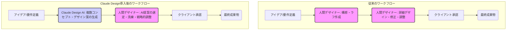

シリコンバレーで15年間、テクノロジーの最前線を取材してきた私にとって、近年のAIの進化はまさに驚愕の一言に尽きます。そして今週、その驚きは新たなレベルに達しました。Anthropicが発表した「**Claude Design**」。この新サービスは、デザイン業界に「**デザイナーは本当に不要になるのか？**」という、かつてないほど直球で、そして残酷な問いを突きつけています。

「**Anthropic debuts Claude Design, because who needs designers?**」――米テックメディアtheregister.comの見出しは、その本質を端的に表しています。単なる画像生成AIの進化ではありません。Claude Designは、デザイン思考そのものをAIに学習させ、複雑なデザインプロセスを自動化することで、クリエイティブ職の存在意義を根底から揺るがしかねない力を持っているのです。これは、もはや見過ごせない、業界全体を巻き込む「激変」の号砲と捉えるべきでしょう。

## 「デザイナー不要論」を煽るClaude Designの衝撃

Anthropicが新たに投入した「Claude Design」は、デザイン業界に衝撃を与えています。その真価は、単に美しい画像を生成する能力に留まりません。ユーザーが与えるテキストプロンプトやコンセプトに基づき、**Claude Design**はまるで人間のデザイナーのように、一連のデザインプロセス全体をアシストし、時には自律的に完結させる能力を標榜しているのです。

具体的には、以下のような機能が期待されています。

*   **コンセプト生成とブレインストーミングの自動化**: 新しいプロジェクトの初期段階で、多様なデザインコンセプトやレイアウト案を瞬時に複数提案します。色使い、フォント、全体的な雰囲気なども指示に基づき生成可能です。
*   **UI/UXデザインの自動生成**: Webサイトやモバイルアプリのワイヤーフレームから、具体的なUIコンポーネント、インタラクションデザインに至るまで、ユーザー体験を最適化するデザインを提案し、実際に生成できます。アクセシビリティやユーザビリティの原則も学習済みであるため、初期段階で高い完成度を実現します。
*   **グラフィック素材の作成と最適化**: ロゴ、アイコン、イラストレーション、写真加工など、必要なグラフィック要素をプロンプトから生成し、様々なメディアやプラットフォーム向けに最適化します。
*   **デザインシステムの構築と運用**: ブランドガイドラインやデザイン原則に基づいて、一貫性のあるデザインシステムを自動で構築し、そのシステムに沿ったデザインアセットを生成、管理することが可能です。
*   **リアルタイムなフィードバックと修正**: 生成されたデザインに対して、プロンプトでさらに細かな修正指示を出すことで、瞬時に調整が可能です。A/Bテストの準備や、ターゲットオーディエンスに合わせたバリエーション作成も容易に行えます。

これまでの画像生成AIは「描画の自動化」が主眼でしたが、Claude Designは「**デザイン思考の自動化**」へと踏み込んでいます。これは、AIが単なるツールではなく、共同作業者、あるいは一部のプロジェクトにおいては主導者となる可能性を示唆しています。そこには、コンセプト理解から、ターゲットユーザーの分析、機能要件の反映、さらには美的センスの表現まで、人間のデザイナーが培ってきた複雑な思考プロセスが組み込まれているというのです。

inc.comが「**Anthropic’s Claude Opus 4.7 Is Here, and It’s Already Outperforming Gemini 3.1 Pro and GPT-5**」と報じたように、基盤モデルの推論能力そのものが飛躍的に向上している今、デザインのような高度なタスクをAIが担うのも自然な流れかもしれません。問題は、その進化のスピードと、それが人間のデザイナーに与えるインパクトです。この技術が本当に「デザイナー不要」の時代を招くのか、私たちは真剣に考える時期に来ています。

## AIがデザインプロセスをどう変革するか

Claude DesignのようなAIツールの登場は、デザインのワークフローに根本的な変革を促します。従来のプロセスでは、アイデアの具現化から最終調整まで、多くの工程を人間が手作業で行ってきました。しかし、AIが介入することで、その構造は大きく変化するでしょう。

### 従来のワークフローとAI導入後の変遷

従来のデザインワークフローは、多くの場合、以下のような段階を経ていました。

1.  **要件定義**: クライアントとの綿密なヒアリングに基づき、コンセプトやターゲット、機能などを文書化。
2.  **情報収集・分析**: 参考資料の収集、市場調査、ユーザーリサーチなどを実施。
3.  **アイデア出し・ブレインストーミング**: ラフスケッチやマインドマップ作成などを通じ、多様なアイデアを生成。
4.  **ワイヤーフレーム・プロトタイプ作成**: アイデアを具体的な形にし、構造やレイアウトを検討。
5.  **詳細デザイン**: 色彩、タイポグラフィ、グラフィック要素などを盛り込み、ビジュアルを洗練。
6.  **レビュー・修正**: クライアントやチームからのフィードバックに基づき、デザインを繰り返し修正。
7.  **最終調整・納品**: 成果物を完成させ、引き渡し。

この中で、特に時間と労力がかかっていたのが、アイデア出しから詳細デザイン、そしてレビュー後の修正といった、創造的かつ反復的なプロセスです。Claude Designは、まさにこの中核部分にメスを入れようとしています。

この図が示すように、AIが導入されることで、人間デザイナーの役割は**「ゼロから生み出す」ことから、「AIの膨大な提案から最適なものを選び、洗練させ、戦略的な価値を加える」**へとシフトします。AIは複数のデザイン案を瞬時に生成し、人間はその中から最も目的に合致するものを選び、プロンプトを通じて細部を調整し、最終的な美的な判断や感情的な訴求力を高める役割を担うようになるのです。

### プロンプトエンジニアリングの重要性

AIを用いたデザインにおいては、「**プロンプトエンジニアリング**」が極めて重要になります。どれだけ具体的に、かつ創造的な指示をAIに与えられるかによって、アウトプットの質は劇的に変化します。単に「クールなロゴ」と指示するのではなく、「日本の伝統的な美意識とモダンなテクノロジーを融合させた、スタートアップ向けのロゴ。色は青と銀を基調とし、クリーンで信頼感を表現。視認性を重視し、シンプルな形状を希望。」といった具体的な指示出しが求められます。

デザイナーは、もはやマウスやペンを操るだけでなく、言葉でAIを導く「**AI指揮者**」としてのスキルが不可欠になるでしょう。そして、このスキルは、今後のクリエイティブ業界における最も価値のある能力の一つとなるはずです。

## クリエイティブ業界に突きつけられる「残酷な現実」と「新たな機会」

Claude Designのような強力なAIツールの登場は、クリエイティブ業界に二つの側面をもたらします。一つは、従来の職務が奪われるかもしれないという「残酷な現実」。もう一つは、これまで不可能だった新たな価値創造の「機会」です。

### デザインコストの劇的削減とスピードアップ

AIによるデザイン自動化の最大の恩恵は、**デザインプロセスにかかる時間とコストの劇的な削減**でしょう。人間デザイナーが数日、あるいは数週間かけて行っていた作業が、AIを使えば数時間、あるいは数分で完了する可能性を秘めています。

*   **人件費の削減**: 特にテンプレートベースの作業、バナー広告、SNS投稿用画像、ECサイトの商品画像加工といった定型的なデザイン業務においては、AIが人間の数倍の速度で、しかも人件費をかけずにこなせるようになります。
*   **納期の短縮**: スピーディな市場投入が求められる現代において、デザインのリードタイム短縮は大きな競争優位性となります。AIを活用すれば、短期間で多数のデザイン案を生成し、迅速に試行錯誤を繰り返すことが可能になるでしょう。
*   **品質の均一化**: AIは学習データに基づき、一貫した品質とブランドガイドラインに沿ったデザインを提供します。これにより、複数のデザイナーが関わるプロジェクトにおける品質のばらつきを抑えることができます。

中小企業やスタートアップにとって、これは大きな福音です。これまで高額なデザイン費用がネックとなり、プロフェッショナルなデザインを諦めていた企業でも、AIの力を借りて高品質なビジュアルコンテンツを制作できるようになるでしょう。これは、市場全体のデザインレベルの底上げに貢献する可能性を秘めています。

### 人間が担うべき領域と新たなデザイナー像

一方で、この技術革新は熟練デザイナーの仕事が奪われる可能性をはらんでいます。特に、前述したようなルーティンワークや、既存のスタイルをアレンジするようなデザインは、AIに代替されるリスクが高いと言えます。しかし、だからといってデザイナーという職種が完全に消滅するわけではありません。

編集部で特に注目したのは、AIが苦手とする、あるいは人間の感性が不可欠な以下の領域の重要性が増す点です。

*   **戦略的思考とコンセプト設計**: ブランドの核となる哲学や、事業目標達成のためのデザイン戦略を立案する能力は、依然として人間の専売特許です。AIはツールであり、そのツールをどう活用し、どのような方向性でデザインを「プロンプト」するかは人間の役割です。
*   **感情的な訴求と文化理解**: ターゲットオーディエンスの文化背景、感情の機微を捉え、共感を呼ぶデザインを生み出す能力は、AIにはまだ難しい領域です。日本の「侘び寂び」や「可愛い」文化のような、言語化しにくい美意識をデザインに落とし込むのは、人間の感性があってこそです。
*   **美的判断と倫理的視点**: AIが生成した複数のデザイン案の中から、最終的な美しさやバランス、そして社会的な倫理に合致するかどうかを判断する「目」は、人間が持ち続けるべきでしょう。
*   **イノベーションと未踏領域の開拓**: 既存のデータやパターンから学習するAIに対し、人間は全く新しい発想や、これまでにない表現方法を創造することができます。ルールを破り、常識を打ち破る「真の創造性」は、人間にしか生み出せません。

つまり、デザイナーは「オペレーター」から「**ディレクター**」や「**ストラテジスト**」へと役割をシフトさせる必要があるのです。AIを使いこなし、AIではできない高次のクリエイティブを追求する「**AIコンダクターデザイナー**」こそが、これからの時代に求められる新たなデザイナー像となるでしょう。

## 主要AIデザインツールの進化とAnthropicの独自性

AIデザインツールの分野では、AnthropicのClaude Design以外にも、様々なプレイヤーがしのぎを削っています。それぞれのツールが異なる強みとターゲットを持ち、市場を活性化させています。

### AIデザインツールの群雄割拠

現在、主なAIデザインツールとしては、以下のようなものが挙げられます。

*   **Adobe Firefly**: Adobe製品との連携を強みとし、既存のクリエイティブワークフローにAI機能をシームレスに組み込むことを目指しています。画像生成、テキスト効果、ベクターグラフィック生成など幅広い機能を提供し、特にAdobeユーザーにとっては利便性が高いです。
*   **Midjourney**: 高度な芸術性と独特のビジュアルスタイルを持つ画像を生成する点で際立っています。写真のようなリアルな表現から、幻想的なアートまで、プロンプト一つで多様な表現が可能です。クリエイティブな探求やアート制作に特化したユーザーに人気があります。
*   **Stable Diffusion**: オープンソースであるため、カスタマイズ性が高く、研究者や開発者コミュニティで広く利用されています。ローカル環境での実行も可能で、多様なファインチューニングモデルが存在します。
*   **Figma AI Plugin**: UI/UXデザインの現場で広く使われるFigmaに、AIによる機能を追加するプラグイン群も登場しています。例えば、テキストからUIコンポーネントを生成したり、既存のデザインに合わせたアイコンを提案したりする機能があります。

### Claude Designの独自性と市場における位置付け

AnthropicのClaude Designは、これら既存のツールとは一線を画す独自性を持っています。それは、汎用LLMであるClaudeの**高度な推論能力と倫理的AIへのコミットメント**に基づいています。

1.  **高度な推論と会話型デザインアシスタント**: Claude Designは、単なるキーワードやスタイル指定だけでなく、より抽象的なデザインコンセプトや意図を理解し、多角的に推論する能力に優れているとされます。まるで人間のアシスタントと会話するように、デザインに関する深い議論を交わし、より複雑な要求にも対応できる可能性があります。
2.  **倫理的AIと安全性**: Anthropicは、安全で倫理的なAI開発を強く掲げています。Claude Designも、不適切なコンテンツの生成を避け、バイアスを最小限に抑えるよう設計されていると推測されます。企業がブランドイメージを損なわずにAIを活用する上で、この倫理性は重要な選択基準となるでしょう。
3.  **デザインシステムと一貫性の重視**: 「**Project Glasswing: Securing critical software for the AI era**」という別のニュースが示すように、Anthropicはシステムの整合性や堅牢性を重視する傾向があります。Claude Designも、単発のデザイン生成だけでなく、企業のデザインシステム全体を理解し、その中で一貫性のあるデザインを生成・管理する能力が高い可能性があります。これは大規模な企業にとって大きな利点です。

つまり、Adobe Fireflyが「Adobeエコシステム内での機能強化」、Midjourneyが「芸術性の追求」であるのに対し、Claude Designは「**より複雑なデザイン思考と、企業のブランド・倫理に配慮したビジネス志向のAIデザインパートナー**」という立ち位置を目指していると言えるでしょう。

以下に主要AIデザインツールの比較表を示します。

| ツール名              | 主な機能                                         | 強み                                                                | ターゲットユーザー                                       |
| :-------------------- | :----------------------------------------------- | :------------------------------------------------------------------ | :------------------------------------------------------- |
| **Claude Design**     | コンセプト生成、UI/UX、グラフィック、デザインシステム | 高度な推論、会話型アシスタント、倫理的AI、企業向けの一貫性          | 企業のデザイン部門、高度な要件を持つデザイナー、スタートアップ |
| **Adobe Firefly**     | 画像生成、テキスト効果、ベクターグラフィック、編集 | Adobe製品とのシームレスな連携、幅広いクリエイティブ機能           | Adobe製品ユーザー、マーケター、グラフィックデザイナー  |
| **Midjourney**        | 芸術的画像生成、ユニークなビジュアルスタイル     | 圧倒的な画質と創造性、アート志向の表現力                            | アーティスト、コンセプトアーティスト、クリエイター     |
| **Stable Diffusion**  | 画像生成、Inpainting/Outpainting                 | オープンソース、高いカスタマイズ性、多様なコミュニティモデル        | 開発者、研究者、高度な技術志向のクリエイター           |
| **Figma AI Plugin**   | UI/UXコンポーネント生成、アイコン提案、レイアウト補助 | Figma環境での直接作業、UI/UXワークフローの効率化                 | UI/UXデザイナー、プロダクトデザイナー                  |

## 🧐 編集部の辛口オピニオン

AnthropicのClaude Designの登場は、正直言って、日本のクリエイティブ業界にとって**「否応なしの現実」**を突きつけるものです。私から見れば、現在の日本のデザイン業界には、この激変に対する明確な危機感と戦略が決定的に不足していると感じざるを得ません。

「職人技」や「アナログ的な感性」を尊ぶ文化は確かに美しい。しかし、ビジネスの世界で生き残るためには、それだけでは通用しません。AIがコストとスピードで圧倒的な優位性を示す中、いつまでも手作業の工程にこだわり、「うちのデザイナーはAIには出せない"味"がある」などと言い訳をしている暇はないのです。**そんな"味"が、数ヶ月後には市場価値を持たなくなる可能性を真剣に考えるべきです。**

特に、デザイン制作会社や企業のインハウスデザイン部門は、甘い認識を改めるべきです。簡単なバナー制作やWebサイトのテンプレートデザインなど、定型的な業務は**確実にAIに奪われます。**そして、そこに投入していた人件費が削減されれば、外注先としての日本のデザイン会社の存在意義は薄れる一方です。

日本企業は、この技術を脅威と見て及び腰になるのではなく、むしろ**最速で導入し、使いこなす戦略を立てるべきです。**AIを単なる「ツール」ではなく、「強力な共同経営者」と捉えるくらいの覚悟が必要です。

*   **デザインプロセスの徹底的な見直し**: どの工程をAIに任せ、どの工程で人間が付加価値を出すのか。この線引きを早期に行い、AIと人間が協調する新しいワークフローを構築する必要があります。
*   **デザイナーのスキルセット再定義**: プロンプトエンジニアリングは必須スキルとなり、AIの出力を評価し、洗練させる「キュレーション能力」や「ディレクション能力」がこれまで以上に求められます。感情、文化、戦略といったAIが苦手な領域で、いかに深い洞察と独自性を提供できるかが問われます。
*   **日本独自の強みとの融合**: 形式的な美しさだけでなく、日本の文化や物語性、繊細な美意識をAIに学習させ、世界に通用する「AI×日本」のデザインを生み出すチャンスでもあります。これは、他国のAIデザインツールが容易には模倣できない、日本企業ならではの差別化戦略となり得ます。

現状維持は「死」を意味します。**今すぐ動かなければ、数年後には国際競争力の低下に直面し、国内市場すら海外のAI駆動型デザイン企業に席巻されるでしょう。**これは警告ではなく、すでに始まっている現実なのです。

## 💡 よくある質問（FAQ）

### Q: Claude Designは具体的にどのようなデザイン業務を自動化できますか？
A: Claude Designは、コンセプト生成、UI/UXデザイン、グラフィック素材の作成、デザインシステムの構築、リアルタイムなフィードバックと修正といった広範なデザイン業務を自動化できます。特に、テキストプロンプトに基づいて多様なデザイン案を瞬時に生成し、迅速なイテレーションを可能にする点が強みです。

### Q: 人間デザイナーの仕事は今後どうなりますか？
A: ルーティンワークや定型的なデザイン業務はAIに代替される可能性が高いですが、人間デザイナーの役割が完全に消滅することはありません。今後は、AIの生成物を評価・洗練するキュレーション能力、AIに的確な指示を出すプロンプトエンジニアリング能力、そして感情や文化、戦略といったAIが苦手とする高次のクリエイティブ思考がより一層重要になります。デザイナーは「AIを使いこなすディレクター」へと進化が求められるでしょう。

### Q: 日本のクリエイティブ企業が導入を検討する際の注意点は？
A: 日本の企業は、AI導入を遅らせることで国際競争力を失うリスクを認識し、早期にAIとの協調ワークフローを構築すべきです。特に、日本特有の美意識や文化をAIに学習させ、独自のデザイン価値を生み出す戦略が有効です。また、デザイナーのスキルセット再構築への投資と、AIが生成するデザインの倫理的・法的側面（著作権、バイアスなど）への十分な配慮が必要です。

## 🔗 関連ツール・サービス

**[Anthropic Claude](https://www.anthropic.com/product/claude)** — Anthropicが開発する、高度な推論能力を持つ汎用AIアシスタント。
**[Adobe Firefly](https://www.adobe.com/jp/sensei/generative-ai/firefly.html)** — Adobe製品群と連携し、画像生成やテキスト効果など多彩なAI機能を提供するクリエイティブAI。
**[Midjourney](https://www.midjourney.com/)** — プロンプトから芸術性の高い画像を生成することに特化した、革新的な画像生成AIサービス。
**[Figma](https://www.figma.com/ja-jp/)** — UI/UXデザインのプロフェッショナルに広く利用される、クラウドベースのデザインコラボレーションツール。