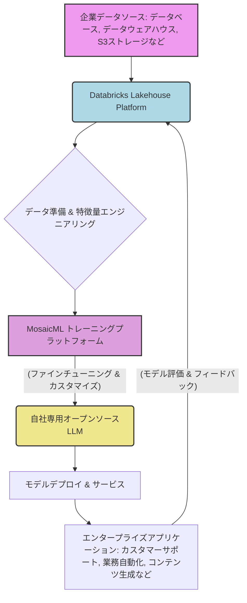

シリコンバレーで15年間、AIの潮目を追い続けてきましたが、このニュースには唸らされました。データプラットフォームの巨人である**Databricksが、オープンソースAIモデルの開発とデプロイを専門とする新鋭MosaicMLを、なんと13億ドル（約2000億円）という巨額で買収した**のです。一見するとデータとAIの融合は自然な流れに見えますが、この買収は単なる技術統合以上の、エンタープライズAI市場における大きな戦略転換を示唆しています。企業がAIを真に活用する上で避けられない「データ主権」と「コスト最適化」という二大課題に対し、Databricksが放った明確なアンサーであり、多くの日本企業にとって未来のAI戦略を再考するきっかけとなるはずです。

### なぜ今、DatabricksはMosaicMLを買収したのか？

Databricksは長年、データレイクとデータウェアハウスの利点を統合した「レイクハウス・アーキテクチャ」を提唱し、データ分析と機械学習の分野で確固たる地位を築いてきました。企業が持つ膨大な生データを効率的に蓄積、処理、分析し、そこから価値を引き出すための基盤を提供しています。しかし、生成AIが爆発的に普及した今、データプラットフォームだけでは不十分です。データから直接、カスタマイズされた強力なAIモデルを効率的に生み出す能力が、企業の競争力を左右する時代へと突入しました。

そこで注目されたのがMosaicMLです。同社は、オープンソースの基盤モデルを企業向けに効率的にトレーニングし、デプロイするためのプラットフォームを提供していました。特にその強みは、GPUを最大限に活用し、**コストと時間を劇的に削減しながら大規模言語モデル（LLM）を構築できる技術**にありました。例えば、彼らが開発したMPTシリーズのモデルは、商用利用可能なオープンソースLLMとして大きな注目を集め、OpenAIのようなプロプライエタリモデルに対する有力な選択肢となりつつありました。

DatabricksがMosaicMLを買収した最大の理由は、この二つの領域のシナジーにあります。Databricksは、企業が持つ多種多様なデータを一元的に管理する「器」を提供します。一方、MosaicMLはその「器」の中のデータを使って、企業固有のニーズに合わせた「知性（AIモデル）」を効率的に「作り出す」方法を提供します。これにより、**データ収集からモデル開発、デプロイ、そして運用までの一貫した「AIファクトリー」を企業自身が構築できる**ようになるのです。これは、これまでのAI導入がAPI利用や特定ツールへの依存に傾きがちだった状況に対し、自社データに基づくAI能力を内製化する新たな道筋を示すものです。

### エンタープライズAIの「データ主権」と「コスト最適化」

今日の企業AI活用における最大の懸念の一つは、間違いなく**データプライバシーと主権**です。機密性の高い企業データを外部のプロプライエタリAIサービスに送ることに躊躇する企業は少なくありません。また、モデルがどのように学習され、どのような推論を行うのか、その「ブラックボックス性」も大きな課題です。このような背景から、自社のデータガバナンス下で、より透明性の高いAIモデルを運用したいというニーズが高まっています。

オープンソースモデルは、まさにこの課題に応えるものです。モデルのアーキテクチャや重みが公開されているため、企業はセキュリティ監査をより容易に行い、自社の倫理規定に沿った運用が可能です。そして、DatabricksとMosaicMLの統合は、このオープンソースモデルのメリットを最大限に引き出す環境を企業に提供します。企業は自社のDatabricksレイクハウスにあるデータを離れることなく、MosaicMLの技術を用いて、**自社専用のファインチューニングされたLLMを構築できる**ようになります。これにより、データは常に自社の管理下に置かれ、外部への流出リスクを最小限に抑えられます。

さらに、**コスト最適化**も重要な要因です。プロプライエタリなAPIサービスは、利用量に応じたトークン課金が一般的で、大規模な利用や高頻度のアクセスが必要な場合、運用コストが膨大になる可能性があります。一方、オープンソースモデルを自社でトレーニング・運用する場合、初期のインフラ投資は必要ですが、スケールするにつれて単位あたりのコストが劇的に低下する可能性があります。MosaicMLの技術は、トレーニング時間を短縮し、GPU利用効率を向上させることで、この運用コストをさらに最適化します。編集部で特に注目したのは、MosaicMLが提示する「クラウド利用料を最大80%削減可能」というデータです。これは、AIの本格的な社会実装を阻む高コストの壁を打ち破る可能性を秘めています。

この買収は、企業がAIモデルを「購入する」時代から、「自社で育成する」時代への転換を加速させる強力なメッセージなのです。

### Databricks Lakehouse + MosaicML = 新時代のAIプラットフォーム

DatabricksとMosaicMLの統合が実現するのは、まさに次世代のエンタープライズAIプラットフォームです。このプラットフォームは、データの収集・管理からAIモデルのトレーニング、デプロイ、そして継続的な改善まで、AIライフサイクル全体をシームレスにカバーします。

#### 統合プラットフォームのワークフロー

この図が示すように、企業は自身のあらゆるデータをDatabricks Lakehouseに取り込み、高度なデータ準備を経て、MosaicMLのトレーニング基盤でモデルを構築・最適化します。最終的には、自社環境内でデプロイされたカスタムLLMが、ビジネスアプリケーションを直接強化するのです。

#### 統合プラットフォームの主要な利点

*   **統一されたデータとAI基盤**: データサイエンティストもデータエンジニアも、同じDatabricks環境上でデータとAIモデルを扱うことができます。これにより、データの準備からモデル開発までのリードタイムが劇的に短縮されます。
*   **フルライフサイクル管理**: データ取り込み、変換、管理、特徴量エンジニアリング、モデルトレーニング、実験追跡、モデルレジストリ、デプロイ、監視といったAIモデル開発の全工程を、単一のプラットフォームで実現します。
*   **強化されたガバナンスとセキュリティ**: すべてのデータとモデルは企業の管理下にあるため、データ漏洩のリスクを軽減し、厳格なコンプライアンス要件を満たしやすくなります。
*   **柔軟なモデル選択**: OpenAIのGPTシリーズのようなプロプライエタリモデルだけでなく、Llama 2やFalcon、MPTシリーズといったオープンソースモデルの中から、ビジネスニーズとコストに合わせて最適なものを選択し、さらに自社データでファインチューニングできる柔軟性を持ちます。

この統合により、企業はもはや汎用的なAIモデルの恩恵を「受ける」だけでなく、**自社の競争優位性の源泉となる独自の「AI知性」を「作り出す」ことが可能**になります。これは、特定の業界や企業文化に深く根ざした知識を持つAIモデルの誕生を意味し、これまで解決が困難だったニッチな課題への適用が期待されます。

| 特徴 | プロプライエタリAPI利用 (例: OpenAI GPT) | オープンソースカスタムモデル (Databricks/MosaicML統合) |
|---|---|---|
| **データプライバシー** | 外部ベンダーへのデータ共有リスクが存在 | 自社環境内でデータ・モデルを完全管理 |
| **コスト構造** | トークン課金、利用量増加で費用増大。予測困難な場合も | 初期構築費＋インフラ運用費。大規模利用で単位コスト効率向上 |
| **カスタマイズ性** | プロンプトエンジニアリングやファインチューニングAPIに限定 | 自社データでモデル全体をファインチューニング、アーキテクチャ調整も可能 |
| **モデルの透明性** | ブラックボックス。動作原理や学習データは非公開 | モデルアーキテクチャ、重み、学習データセットの一部が公開され透明性が高い |
| **ベンダーロックイン** | 高い。API変更や料金体系変更に依存 | 低い。モデルやインフラの選択肢が広く、柔軟な移行が可能 |
| **性能最適化** | 提供元依存。特定のタスクでの最適化は難しい | 自社データとタスクに特化したパフォーマンスチューニングが可能 |
| **デプロイ環境** | クラウドベンダーのAPI経由でのみ利用可能 | クラウド、オンプレミス、エッジデバイスなど柔軟なデプロイが可能 |

この表からも明らかなように、DatabricksとMosaicMLの統合は、企業がAIを活用する上で、単なる利便性だけでなく、より深いレベルでの戦略的優位性を追求するための強力な選択肢を提供します。特にデータプライバシーやコスト効率、そして柔軟なカスタマイズを重視する企業にとっては、これまでのAI戦略を大きく見直す契機となるでしょう。

### 🧐 編集部の辛口オピニオン

DatabricksによるMosaicML買収のニュースは、日本企業にとって「警鐘」と受け止めるべきです。シリコンバレーでは、もはや汎用AIのAPIを叩くだけでは差別化できないという認識が広まりつつあります。次の競争軸は、**いかに自社の保有する「データ」を活かして、唯一無二の「カスタムAI知性」を内製化できるか**という点に完全にシフトしています。

しかし、多くの日本企業は、データ基盤の構築自体でつまずき、いまだにPoC（概念実証）の段階を抜け出せていません。データレイクやレイクハウスの導入は遅々として進まず、データサイエンティストは「データ準備」に忙殺されているのが実情ではないでしょうか。そんな状況で、「自分たちでLLMをファインチューニングする」など夢のまた夢、と切り捨ててしまう企業がほとんどかもしれません。

だが、甘い。それが致命傷になりかねない。

この買収が示しているのは、**「オープンソースAIを、エンタープライズレベルで、自社データで、低コストかつ高効率で運用する」という未来が、もはやSFではなく、今そこにある現実である**ということです。もし日本企業がこの流れに乗り遅れれば、データガバナンスの課題を抱えながら高額なプロプライエタリAPIに依存し続け、結局は競合他社にデータ主権もコスト優位性も奪われる結果となるでしょう。

「うちはクラウドへのデータ移行が進んでいないから」「人材がいないから」といった言い訳はもはや通用しません。データインフラへの投資を最優先し、MLOps（機械学習オペレーション）を体系的に導入し、オープンソースAIモデルを積極的に検証する体制を今すぐ構築しなければ、国際競争の荒波で淘汰されるリスクが急速に高まります。

この動きは、日本企業が「AIを使う側」から「AIを作り、育てる側」へと意識を転換する最後のチャンスかもしれません。目を覚まし、手を動かせ。でなければ、AI時代の主役は常に外部のベンダーであり、日本企業は永遠に「利用料を払い続ける側」でしかないでしょう。

## 💡 よくある質問（FAQ）

### ### Q: DatabricksはなぜオープンソースAIに注力するのでしょうか？
A: Databricksは、企業がデータ主権を維持し、コストを最適化しながら、独自のニーズに合わせたAIモデルを構築できる環境を提供するため、オープンソースAIに注力しています。プロプライエタリモデルへの依存から脱却し、より柔軟で透明性の高いAI活用を推進する狙いがあります。

### ### Q: MosaicMLの技術的強みは、この買収後どのように活かされますか？
A: MosaicMLの強みは、オープンソースLLMを効率的かつ低コストでトレーニング・デプロイする技術です。買収後、この技術はDatabricksのレイクハウス・プラットフォームに深く統合され、企業は自社のデータを使って、より迅速にカスタムAIモデルを構築・運用できるようになります。特に、GPU利用効率の向上によるコスト削減が期待されます。

### ### Q: 日本企業にとって、この買収がもたらす最大の意味合いは何でしょうか？
A: 日本企業にとっての最大の意味合いは、自社のデータとオープンソースAIモデルを組み合わせることで、データプライバシーを確保しつつ、競争優位性を生み出す独自のAI能力を内製化する重要性が増したことです。データ基盤の整備とMLOps体制の構築を急ぎ、AIを「使う」だけでなく「育てる」視点を持つことが不可欠となります。

## 🔗 関連ツール・サービス

**[Databricks Lakehouse Platform](https://www.databricks.com/jp/product/data-lakehouse)** — データ管理、分析、AI/MLワークロードを統合するプラットフォームです。
**[Hugging Face](https://huggingface.co/)** — 大規模なオープンソースAIモデル、データセット、デモが集まるハブです。
**[MLflow](https://mlflow.org/)** — 機械学習のライフサイクル（実験管理、再現性、デプロイ）を管理するオープンソースプラットフォームです。