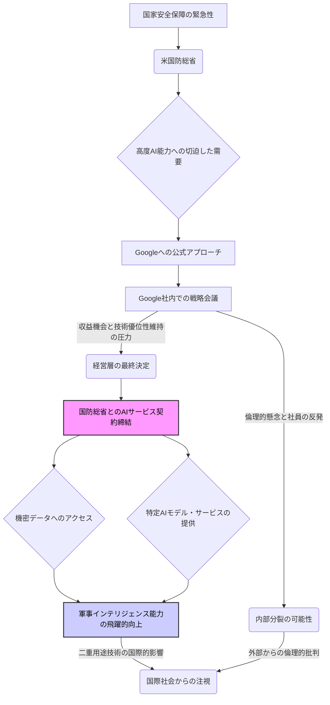

シリコンバレーでは常に技術革新が起こっていますが、時にその裏側で、企業が自社の理想と厳しい現実の板挟みになる瞬間を目撃します。まさに今、Googleが直面しているのがその状況です。米国防総省とのAIサービス契約締結というニュースは、単なるビジネスの拡大に留まらず、AI技術の「二重用途」問題、企業の倫理的責任、そして国家安全保障という、重く複雑なテーマを私たちに突きつけています。

かつて「Don't be evil（邪悪になるな）」を掲げたGoogleが、なぜ再び国防総省のAIプロジェクトに深く関与する道を選んだのか。そして、この決定が世界の軍事技術、さらには国際社会にどのような影響を与えるのか。長年シリコンバレーの動向を追ってきたジャーナリストとして、今回の動きには大きな転換点としての意義を感じずにはいられません。

## Googleと国防総省：AI協力の歴史的転換点

今回報じられたGoogleと米国防総省とのAIサービス契約は、決して単発的な出来事ではありません。2018年の「Project Maven（メイヴン計画）」における論争とGoogleの撤退を記憶している読者も多いでしょう。当時、GoogleのAIがドローン映像分析に利用されることに対し、社内外から「AIの軍事利用は倫理に反する」という強い抗議が巻き起こり、Googleは最終的に契約更新を辞退しました。

あれから数年、世界情勢は激変しました。米中間の技術覇権争いは激しさを増し、AIは国家安全保障の要として位置づけられています。この新たな地政学的リアリティの中で、Googleが再び国防総省との連携を選んだことは、同社が「AI倫理」と「国家的な要請」の間で、明確な優先順位をつけたことを示唆しています。

具体的な契約内容の詳細は機密に包まれていますが、報道からは、Googleの高度なAIがデータ分析、情報処理、意思決定支援といった幅広い分野で活用されると読み取れます。これは単に既存システムの効率化に留まらず、戦略立案からロジスティクス、脅威予測に至るまで、国防総省のあらゆる意思決定プロセスにAIの知見が深く組み込まれることを意味します。Googleが持つ世界最高峰のAI能力が、かつてない規模で軍事領域へと流れ込むわけです。

今回の契約がどのような意思決定プロセスを経て実現したのか、以下に一般的なフローと、そこに伴う葛藤を視覚化してみました。

この複雑な流れは、テック企業がいかにして倫理的ジレンマと国家の要求の間に挟まれ、最終的にどこへ着地するのかを浮き彫りにします。

## 「AI倫理」と「国家安全保障」の板挟み

Googleの今回の決定は、シリコンバレー全体が抱える「AI倫理」と「国家安全保障」という根源的な対立を象徴しています。AI技術は、教育、医療、災害救助など、人類に多大な恩恵をもたらす一方で、その破壊的な応用も容易であるという「二重用途（Dual-use）」の性質を強く持ちます。

Project Mavenの時代、Googleは「兵器の開発には協力しない」「監視技術の濫用を避ける」といった明確なAI倫理原則を打ち出しました。しかし、今回の契約は、その原則の一部、あるいは解釈に大きな変化があったことを示唆します。もちろん、Googleは「AIの直接的な兵器化」には関与しないと主張するでしょう。しかし、データ分析や意思決定支援といった「バックエンド」のAIが、最終的に軍事作戦の効率化や、より精密な攻撃に繋がる可能性は否定できません。

大手テック企業の内部には、常に理想主義と現実主義が混在しています。才能あるエンジニアたちは、AIが世界をより良くすると信じていますが、同時に企業は株主価値の最大化と国家からの要請に応える責任も負っています。このジレンマは、MicrosoftやAmazonといった他のテック大手も同様に経験しています。彼らはすでにクラウドサービスやAI技術を国防総省に提供しており、Googleもこの「軍事AIエコシステム」に本格的に参入せざるを得ない状況だったとも考えられます。

社内の反発が表面化していないのは、AIの軍事利用に対する社員の意識が変化したのか、あるいは契約内容がより慎重に設計されたためなのか、現時点では判断できません。しかし、倫理的規範と国家の安全保障という、極めて重い天秤の上で、テクノロジー企業がどのような決断を下すのかは、今後のAI開発の方向性を決定づける重要な要素となるでしょう。

| 項目         | 2018年（Project Maven時）                                 | 2026年（国防総省契約時）                               |
| :----------- | :--------------------------------------------------------- | :------------------------------------------------------- |
| **主要なスタンス** | AIの軍事転用・武器化への反対。AI倫理原則の重視。         | 特定のAI倫理原則を維持しつつ、国家安全保障への貢献を重視。 |
| **国防総省との関係** | 社員の強い反対により、契約更新を辞退。                  | AIサービスの提供契約を締結。                             |
| **背景となる環境** | 米中対立はまだ現在ほど深刻でなく、倫理的側面が重視された。 | 軍事分野でのAI覇権争いが激化、国家的な要請が強まる。     |
| **焦点となるAI** | 画像認識AIによるドローン映像分析。                       | 広範なAIサービス（データ分析、意思決定支援、シミュレーションなど）。     |
| **社内からの反応** | 倫理原則違反として大規模な抗議活動が発生。             | 報道はされるものの、2018年ほどの大きな反発は表面化せず。 |

この比較表は、Googleが過去8年間で戦略を大きく転換したことを明確に示しています。世界情勢の変化が、いかに大手テック企業の「倫理」の定義に影響を与えているかが見て取れます。

## 新時代の軍事技術とデータ主権

GoogleのAIが国防総省に提供されることは、単に「兵器が賢くなる」という単純な話ではありません。これは、軍事における意思決定、情報収集、そして戦略立案のあり方そのものを根本から変える可能性を秘めています。

まず、**意思決定の速度と精度**が格段に向上するでしょう。膨大な情報を瞬時に分析し、複雑な状況下での最善の選択肢をAIが提示することで、人間では数時間、数日かかっていた判断が数分、数秒で可能になるかもしれません。これは、現代戦における「意思決定のループ（OODAループ）」を圧倒的に高速化し、戦術的な優位性を確立する上で決定的な要素となります。

次に、**予測インテリジェンス**です。GoogleのAIは、オープンソースの情報から機密データまでを横断的に分析し、潜在的な脅威や紛争の兆候を早期に検知する能力を持つでしょう。これにより、予防的な外交努力や、有事の際の迅速な対応が可能になります。しかし、その一方で、「AIが下した予測」に基づく行動が、人間には見えなかった誤解やエスカレーションを生むリスクも常に伴います。

さらに、この契約は**データ主権**という新たな課題も提起します。国防総省の機密データがGoogleのAIプラットフォーム上で処理されるということは、データのセキュリティ、アクセス権限、そして国家間の情報共有のルールに極めて厳格な管理が求められることを意味します。Googleが最高レベルのセキュリティ対策を講じることは間違いありませんが、サイバー攻撃のリスク、あるいは技術提供元であるアメリカ以外の国々からのデータアクセス要求など、潜在的な問題は山積しています。

今回の件は、**AIがもはや特定のアプリケーションに留まらず、国家の基盤インフラとして組み込まれていく**時代の到来を告げるものです。これは、サイバー空間だけでなく、陸海空、そして宇宙といったあらゆる領域における軍事バランスに、長期的な影響を与えることでしょう。

## 日本が学ぶべき教訓：AIガバナンスと戦略

Googleと国防総省の契約は、遠いアメリカだけの話ではありません。私たち日本にとって、このニュースから学ぶべき教訓は非常に多いはずです。

第一に、**AI技術の二重用途性に対する明確な認識と政策**の必要性です。日本もAI技術の研究開発を推進していますが、それが最終的にどのような形で利用されるのか、その倫理的・社会的な影響まで踏み込んだ議論が不可欠です。民生技術と軍事技術の境界線が曖昧になる中で、研究者や企業がどこまで関与を許されるのか、具体的なガイドラインが求められます。

第二に、**国家安全保障におけるAI戦略の再構築**です。米中などのAI大国が軍事分野でのAI導入を加速させる中で、日本が傍観しているわけにはいきません。防衛省・自衛隊におけるAI活用の可能性、そしてそのための国産技術開発や国際協力のあり方を、喫緊の課題として議論すべきでしょう。ただし、その際にも「どのようなAIを、何のために使うのか」という倫理的な問いを忘れてはなりません。

第三に、**国内テック企業への影響**です。もし日本政府がAIの軍事利用に踏み込む場合、日本のテック企業はGoogleと同様の倫理的ジレンマに直面する可能性があります。その際、企業はどのような判断基準を持つべきか、政府は企業に対してどのような支援や規制を行うべきか、今から議論を深める必要があります。特に、海外からの投資を受けるスタートアップなどは、より複雑な国際的圧力に晒されるかもしれません。

編集部で特に注目したのは、今回の契約が「機密情報」を扱うことの重さです。高度なAIモデルは、学習データの質と量に大きく依存します。国防総省の機密データをGoogleのAIが学習することは、そのAIモデル自体が国家の戦略的資産となることを意味します。日本も、自国の重要インフラや機密情報を扱うAIモデルの開発・運用において、他国への依存度をどこまで許容できるのか、という問いに答えを出す時期に来ています。データ主権の確保は、今や経済安全保障の最重要課題の一つなのです。

## 🧐 編集部の辛口オピニオン

今回のGoogleと国防総省の契約は、もはや「Don't be evil」などというお花畑のような理想論は、シリコンバレーの現実には存在しないことを明確に突きつけています。これはビジネスであり、国家戦略そのものです。かつてProject Mavenで従業員の倫理的抗議に屈したGoogleが、数年で手のひらを返したと見るのは酷でしょうか？いや、これは純粋なリアルポリティクス（現実政治）です。米中間のAI覇権争いが激化する中、米国政府からの要請を大手テック企業が断る選択肢は、もはや存在しないに等しい。

日本の企業や政府は、この現実を直視すべきです。世界は「AIで何ができるか」から「AIで何をすべきか、何をしてはならないか」という、より深刻な議論へとシフトしています。しかし、その「すべきか否か」の判断基準は、国家の安全保障という、ある意味最も強力な論理の前には脆くも崩れ去る。

日本はこれまで、AIの平和利用や倫理的側面を強調してきました。それは素晴らしい理想ですが、国際社会の厳しい現実から目を背けてはなりません。国防分野でのAI活用は、もはや避けて通れない流れです。我々が今すぐ問われるべきは、**「日本の安全保障のために、どのようなAIを、どのように開発し、どのように管理・運用するのか」**という具体的かつ現実的な戦略です。

「AIは兵器ではない」という綺麗事を並べている間に、他国はAIを国家戦略の核として組み込み、圧倒的な差をつけつつあります。日本の企業は、自社の技術が二重用途に転用される可能性を想定し、いざという時の対応を今のうちから検討すべきです。政府は、倫理と安全保障のバランスを取りながら、この難題に真正面から向き合う、覚悟とスピード感ある政策立案が急務です。このままでは、AI後進国として、国際社会での発言力を失うだけでなく、自国の安全すら危うくなるでしょう。

## 💡 よくある質問（FAQ）

### Q: Googleが国防総省に提供するAIサービスは、具体的にどのようなものですか？
A: 契約の詳細は機密情報ですが、報道によれば、データ分析、情報処理、戦略立案支援、ロジスティクス最適化、脅威検知・対応といった広範な分野でのAI活用が想定されています。直接的な兵器開発ではなく、意思決定支援や情報優位性の確立に焦点を当てていると考えられます。

### Q: Project Mavenの時と比べて、GoogleのAI倫理原則に変更はあったのでしょうか？
A: Googleは引き続き、AIを直接的な兵器に組み込まない、広範な監視に利用しないといった原則を掲げています。しかし、国家安全保障上の必要性や、他国とのAI技術競争の激化といった外部要因が強まり、特定の条件下での軍事部門への技術提供を容認する方向に解釈が広がったと考えられます。

### Q: 今回の契約は、今後のAI技術開発や他のテック企業にどのような影響を与えますか？
A: 今回の契約は、大手テック企業が国家安全保障分野への関与を深める流れを加速させるでしょう。AI研究開発は、より軍事転用の可能性を考慮した設計が求められるようになり、企業は倫理原則と収益・国家貢献のバランスを一層厳しく問われることになります。また、各国政府も自国のテック企業との連携を強化する動きを加速させる可能性があります。

## 🔗 関連ツール・サービス

**Google Cloud AI Platform (Google)** — GoogleのAI・機械学習サービス群。カスタムモデル開発からデプロイまでをサポートします。
**Microsoft Azure Government (Microsoft)** — 米国政府機関向けの専用クラウドプラットフォーム。高度なセキュリティとコンプライアンスを提供します。
**AWS GovCloud (Amazon Web Services)** — 米国政府機関および国防総省向けの、規制に準拠したクラウドサービスを提供します。