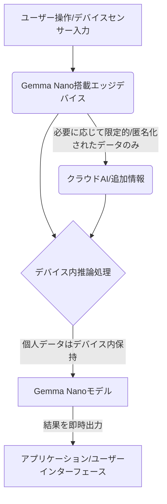

スマートフォンやPCが「ただの箱」ではなく、ユーザーの意図を汲み取り、先回りして行動する「知的な相棒」へと変貌する未来が、ついに現実味を帯びてきました。その鍵を握るのは、大規模言語モデル（LLM）の小型化、特にGoogleが先日発表した**「Gemma Nano」**の存在です。

これは単なる新製品の発表ではありません。AIの主戦場がクラウドから「デバイスのその先」へと大きくシフトする、戦略的な転換点を示唆しています。この動きは、私たちが日常でAIとどう向き合うかを根本から変え、新たなビジネスチャンスと同時に、既存の産業構造に大きな波紋を投じるでしょう。

## オンデバイスAIの夜明け：Gemma Nanoがもたらす新時代

これまで、高度な生成AIモデルは莫大な計算リソースを必要とし、その処理は主にクラウド上の巨大データセンターで行われてきました。しかし、このクラウド集中型アプローチには、データ転送に伴うレイテンシー（遅延）、通信コスト、そして何よりも**データプライバシー**という根深い課題が常に付きまとっていました。特に、個人の機微な情報や企業の秘匿性の高いデータを扱う場合、クラウドへの送信は常にセキュリティ上の懸念となる要因だったのです。

そこに一石を投じたのが、Googleの「Gemma Nano」です。Gemma Nanoは、わずか数億から数十億のパラメータ数で構成される「小型言語モデル（SLM）」の一種であり、その設計思想は、**スマートフォン、スマートウォッチ、スマートホームデバイス、IoTセンサーといったエッジデバイス上で直接、高速かつ効率的に動作させること**にあります。これは、AIの能力をユーザーの手元に物理的に引き寄せることを意味し、クラウドへの依存を劇的に低減させます。

編集部で特に注目したのは、Gemma Nanoが従来のクラウド型LLMの限界を打破し、AIの活用領域を爆発的に広げる可能性を秘めている点です。例えば、ネットワーク環境に左右されずにAIが機能する「オフラインAI」は、災害時や通信インフラが未整備な地域での活用はもちろん、航空機内や地下といった特殊な環境での利用価値も計り知れません。また、個人データがデバイス外に出ないため、プライバシー保護の観点からも大きな進化と言えるでしょう。

## クラウド依存からの脱却：Gemma Nanoの技術的優位性

Gemma Nanoの最大の魅力は、その**効率性**と**汎用性**にあります。大規模LLMが数千億から1兆ものパラメータを持つ一方で、Gemma Nanoは大幅にパラメータを削減しながらも、推論性能において驚くべきバランスを実現しています。これは、高度な量子化技術や構造化されたスパース性、効率的な推論エンジンなど、Googleが長年培ってきた機械学習最適化技術の粋を集めた結果に他なりません。

### 技術的側面から見たGemma Nanoの優位性

1.  **低レイテンシー**: デバイス上で直接処理するため、クラウドとの往復が不要になり、応答速度が飛躍的に向上します。これにより、リアルタイム性が求められるアプリケーション（例えば、音声アシスタントの即時応答やAR/VR体験の強化）での活用が現実的になります。
2.  **プライバシー保護**: 個人情報や機密データがデバイスから外部サーバーに送信されるリスクが低減されます。医療、金融、防衛といった高セキュリティ要件を持つ分野でのAI導入障壁を大きく下げる可能性があります。
3.  **コスト削減**: 大規模なクラウドインフラの維持コストや、データ転送に伴う通信コストを削減できます。特に、エンタープライズ分野でのAI導入において、運用コストの予測可能性と効率性を高めるでしょう。
4.  **オフライン性能**: インターネット接続がない環境でもAI機能が利用可能となり、アプリケーションの信頼性とアクセシビリティが向上します。

Gemma Nanoがエッジデバイスでどのように機能するかを概念図で示します。

この技術的な背景は、単に「小さいAI」というだけでなく、AIの**デセントラリゼーション（分散化）**という大きな潮流を象徴していると見るべきです。AIがユーザーの手に、そしてそのデバイスに宿ることで、これまでアクセスできなかった情報や環境で、新たな価値創造の扉が開かれるのです。

## Gemma Nanoが切り拓く市場とユースケース

Gemma NanoのようなオンデバイスAIは、これまでクラウドAIでは実現が難しかった、あるいはコストが見合わなかった多様な市場とユースケースを創造します。その影響は、コンシューマー向け製品から産業用途まで多岐にわたります。

### Gemma Nanoによる新たな可能性

| 分野           | 具体的なユースケース（例）                               | 既存技術（クラウドAI）との差別化点                                                                                                 |
| :------------- | :------------------------------------------------------- | :--------------------------------------------------------------------------------------------------------------------------------- |
| **コンシューマーエレクトロニクス** | スマートフォンの高精度リアルタイム翻訳、パーソナルアシスタントのオフライン対応、スマートホーム機器の状況判断                      | 通信遅延なし、プライバシー強化、オフライン利用可能                                                                               |
| **自動車・交通**     | 車載インフォテインメントシステムの音声操作、ドライバーの疲労検知、自動運転補助システムのリアルタイム判断                          | ネットワーク障害に影響されない安定性、即時応答性、個人データの車内完結                                                            |
| **医療・ヘルスケア**   | ウェアラブルデバイスでの異常検知、患者モニタリングデータのデバイス内分析、遠隔医療のオフラインサポート                                | 個人医療データのプライバシー確保、緊急時の即時分析、データ転送コストの削減                                                        |
| **産業・製造**       | 工場設備異常のリアルタイム検知、作業員の安全監視、エッジデバイスでの品質検査、ロボット制御の自律性向上                          | ネットワーク遅延による影響の排除、現場データの即時活用、セキュリティ強化                                                          |
| **教育**           | オフライン環境でのパーソナライズ学習、スマートデバイスによる個別指導AI、言語学習アプリのリアルタイムフィードバック              | 場所を選ばない学習機会の提供、個人学習履歴のプライバシー保護、低コストでの高品質な教育提供                                        |

この表が示すように、Gemma Nanoは単一の機能強化に留まらず、AIが「当たり前の存在」として社会インフラに深く溶け込むための触媒となりえます。特に、インターネット接続が不安定な地域や、厳格なデータガバナンスが求められる分野での導入が進むでしょう。これまでAIの導入を躊躇していた中小企業やスタートアップにとっても、より手軽で低コストな選択肢として魅力的に映るはずです。

## 普及への課題とGoogleの次なる一手

Gemma Nanoが持つポテンシャルは計り知れませんが、その本格的な普及にはいくつかの課題が存在します。最も大きな課題の一つは、**エッジデバイスの計算能力とメモリ容量の限界**です。いくらモデルが小さくなったとはいえ、依然として一定のリソースを必要とするため、既存の廉価なデバイス全てに即座に搭載できるわけではありません。Googleは、半導体メーカーやデバイスメーカーとの連携を強化し、Gemma Nanoを効率的に動作させるための最適化されたチップセットやフレームワークの提供を進めることになるでしょう。

また、**開発者エコシステムの構築**も重要な鍵となります。Gemma Nanoを活用したアプリケーションが次々と生まれるためには、開発者が容易にモデルを組み込み、カスタマイズできるようなツールやライブラリ、ドキュメントの提供が不可欠です。GoogleはすでにGemmaシリーズをオープンモデルとして提供しており、その哲学はNanoバージョンにも引き継がれると考えられますが、エッジAI特有の開発課題（例：モデルのオンデバイス最適化、低消費電力化）に対するサポートが手厚くなるかが注目されます。

さらに、**セキュリティとモデルの頑健性**も重要です。デバイス上で動作するAIは、悪意ある攻撃に対して脆弱になる可能性もあります。モデルの改ざんや誤動作を防ぐための強固なセキュリティ対策、そして様々な入力データに対して安定した性能を発揮する頑健性の確保が求められます。

Googleの次なる一手としては、Gemma Nanoのさらなる小型化と効率化はもちろん、特定の用途に特化した「Gemma Nano Vertical」のような派生モデルの展開が考えられます。例えば、医療画像解析に特化したGemma Nanoや、産業用ロボット制御に最適化されたバージョンなどです。これにより、各産業におけるAI導入のハードルを一層下げ、より深く、より広範な領域へのAIの浸透を目指すことになるでしょう。

## 🧐 編集部の辛口オピニオン

Googleの「Gemma Nano」がオンデバイスAIの新時代を切り開くという見方は、まさにその通りです。しかし、日本企業、特に伝統的な製造業やサービス業にとって、この波に乗り遅れることは、まさに「自滅行為」と言わざるを得ません。

多くの日本企業は、いまだにAIを「一部の先進企業がクラウドで使うもの」「複雑でコストがかかるもの」と誤解しています。Gemma Nanoは、この認識を根底から覆す、まさに**ゲームチェンジャー**です。プライバシー、レイテンシー、コストという従来の障壁が劇的に下がる今、AIを組み込まない製品やサービスは、数年後には市場から淘汰される「負の遺産」となるでしょう。

特に危機感を覚えるのは、日本企業の意思決定の遅さです。シリコンバレーでは、Gemma Nanoのような発表があれば、即座にPoC（概念実証）が始まり、半年後にはβ版サービスが立ち上がるスピード感で動きます。一方、日本では「まずは調査」「委員会を立ち上げ」「ベンダー選定に半年」といった具合で、貴重な時間を浪費しがちです。その間に、海外企業はオンデバイスAIを組み込んだ新製品で市場を席巻し、日本企業の競争力を奪っていくでしょう。

「うちの製品にはAIは関係ない」という経営者は、市場の現実から目を背けているだけです。家電、自動車、工作機械、ヘルスケアデバイス、店舗運営システムに至るまで、あらゆるエッジデバイスがGemma Nanoのような小型AIによって劇的に進化します。顧客データがデバイス内で安全に処理されることで、これまでデータ利用に慎重だった企業も、パーソナライズされたサービスを臆することなく提供できるようになるはずです。

今こそ、日本の経営層は危機意識を持ち、部門横断でオンデバイスAIの戦略的活用を検討すべきです。既存の製品ラインナップにどうAIを組み込むか、Gemma Nanoのような技術を活用してどのような新規事業を創出するか。ただ「様子を見る」のではなく、失敗を恐れずに実験し、市場投入のスピードを上げることが、日本企業が生き残るための唯一の道だと断言します。でなければ、このGemma Nanoが、日本企業が築き上げてきた「ものづくり」の牙城を内部から崩壊させるトリガーとなりかねません。

## 💡 よくある質問（FAQ）

### Q: Gemma Nanoはどのようなデバイスに搭載されることが期待されますか？
A: 主にスマートフォン、スマートウォッチ、タブレット、スマートホームデバイス、IoTセンサー、産業用エッジゲートウェイ、さらには車載システムやロボットなどの計算リソースが限られたデバイスへの搭載が期待されています。これらのデバイス上でAIが直接動作することで、リアルタイム性、プライバシー保護、オフライン利用のメリットを享受できます。

### Q: Gemma Nanoと大規模言語モデル（LLM）の主な違いは何ですか？
A: 主な違いはモデルのサイズ（パラメータ数）と設計目的です。LLMは数千億から1兆のパラメータを持ち、クラウド上の高性能なGPUクラスターで動作し、極めて汎用的な高度なタスクを処理します。一方、Gemma Nanoは数億から数十億のパラメータ数で設計された小型言語モデル（SLM）であり、エッジデバイス上での効率的な実行を最優先しています。これにより、低コスト、低レイテンシー、プライバシー保護を実現しますが、LLMほど多様で複雑なタスクを高い精度でこなすわけではありません。

### Q: 日本企業はGemma Nanoをどのように活用すべきでしょうか？
A: 日本企業は、Gemma NanoのようなオンデバイスAIを活用し、既存製品・サービスの付加価値向上と新規事業創出を目指すべきです。具体的には、自社製品（家電、自動車、製造機械など）へのAI機能の内製化、顧客データのプライバシーを保ちつつパーソナライズされた体験の提供、オフライン環境で動作するソリューションの開発などが挙げられます。早期にPoCを開始し、具体的なユースケースを特定して市場投入のスピードを上げることが重要です。

## 🔗 関連ツール・サービス

**[Google AI Studio](https://ai.google.dev/)** — Gemmaシリーズを含むGoogleのAIモデルを試すためのWebベースの開発環境です。
**[TensorFlow Lite](https://www.tensorflow.org/lite)** — エッジデバイス向けに機械学習モデルを最適化・デプロイするためのオープンソースライブラリです。
**[MediaPipe](https://developers.google.com/mediapipe)** — モバイル、Web、IoTなどのデバイス上でMLソリューションを構築するためのオープンソースフレームワークです。
**[Qualcomm AI Hub](https://www.qualcomm.com/developer/ai-hub)** — Snapdragonプロセッサ搭載デバイス向けにAIモデルを最適化・デプロイするためのプラットフォームです。