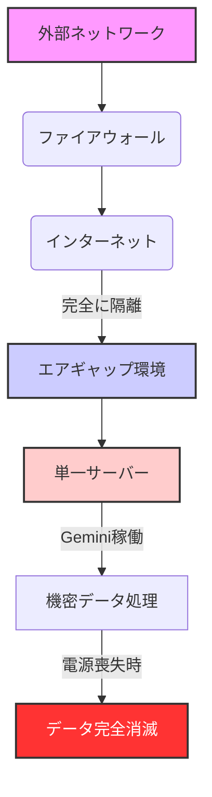

長年シリコンバレーの動向を追い続けてきた私だが、最近のGoogleの発表には唸らされるばかりだ。特に、VentureBeatが報じた「**GoogleのGeminiが単一のエアギャップサーバーで稼働可能となり、電源を抜けばデータが跡形もなく消え去る**」というニュースは、AIの新たな地平を切り開くものとして、非常に高い関心を持って見ている。

これまで、強力な大規模言語モデル（LLM）といえば、膨大な計算資源とデータセンターが必須であり、そのほとんどはクラウド上で提供されてきた。しかし、このクラウドへの依存が、国家の機密情報、企業の秘匿性の高いデータ、あるいは医療記録といった**センシティブな情報**を扱う上での最大の障壁となっていたのも事実だ。データ主権、セキュリティ、プライバシーといった観点から、多くの組織が最先端のAI導入に二の足を踏んできた。

Googleが今回提示したのは、この長年の課題に対する一つの究極的な回答である。インターネットから物理的に隔離され、万が一の際にはデータが完全に消滅する――まるでSF映画のようなこの技術は、AIの適用範囲を根本から広げ、これまで想像もできなかった領域での活用を可能にするだろう。これは単なる技術的な進歩ではない。AIが社会に深く浸透する上で避けて通れない**信頼と制御**という根源的な問いに、Googleが真正面から挑んだ証なのである。

## Google Geminiが切り開く「究極の隔離」とは

「エアギャップ」という言葉を聞き慣れない読者もいるかもしれない。これは、**外部ネットワークから物理的に隔離された環境**を指す。インターネットやその他のネットワークに一切接続されないため、理論上、外部からのサイバー攻撃や情報漏洩のリスクを極限まで低減できる。これまでも国防、原子力発電所、あるいは金融機関の基幹システムなど、絶対的なセキュリティが求められる領域で採用されてきた手法だ。

このエアギャップ環境でGoogleの最先端AIモデルであるGeminiが稼働できるようになったという事実は、まさにパラダイムシフトと言える。従来のLLMは、その学習データも推論環境もクラウド上に存在し、サービス利用者はAPIを通じてアクセスするのが一般的だった。しかし、今回の発表は、GoogleがGeminiを、ユーザーが完全に制御できる閉鎖環境に持ち込めるレベルまで最適化し、提供するという意思表明に他ならない。

さらに驚くべきは、「**電源を抜けばデータが跡形もなく消え去る**」という点だ。これは、サーバー上のデータが揮発性メモリ（RAM）上で処理され、永続的なストレージに書き込まれないか、あるいは暗号化されたデータが、復号鍵が失われることでアクセス不能になるような仕組みが組み込まれていることを示唆する。これにより、物理的なサーバーの鹵獲や不正アクセスといった、従来のサイバーセキュリティの枠を超えたリスクシナリオにも対応できるようになる。

この技術は、特に以下のような環境でその真価を発揮するだろう。

*   **政府機関・軍事:** 国家機密や防衛戦略に関わる情報の分析、意思決定支援。
*   **金融機関:** 未公開のM&A情報、顧客のセンシティブな金融データを用いたリスク分析や不正検知。
*   **医療機関:** 患者の個人情報を含む電子カルテデータの解析、個別化医療の推進。
*   **重要インフラ:** 電力網、水道、交通システムなどの運用最適化と異常検知。

これらの分野では、情報漏洩が壊滅的な影響をもたらすため、これまでAIの活用が慎重に行われてきた。Geminiのエアギャップ稼働は、これらの規制の厳しい産業にAIの恩恵をもたらす、まさに「究極のセキュリティソリューション」となる可能性を秘めている。

## データ主権とセキュリティの新たな地平

データ主権という概念は、近年、EUのGDPR（一般データ保護規則）や各国のデータローカライゼーション規制の台頭により、その重要性が増している。自国のデータは自国内で管理・処理されるべきであり、外国の法制度の影響下に置かれることを避けるべきだという考え方だ。従来のクラウドベースのAIモデルでは、データがどの国のサーバーで処理されるか、あるいは多国籍企業のデータポリシーにどう準拠するかが常に懸念材料だった。

GoogleのエアギャップGeminiは、このデータ主権の問題に**物理的な解決策**を提供する。サーバーが完全に隔離された環境に設置され、しかも電源オフでデータが消滅するという特性は、特定の管轄区域内でのデータ処理を保証し、外部からのデータアクセスを物理的に不可能にする。これは、情報管理の責任を負う組織にとって、まさに福音とも言える進化ではないだろうか。

従来のオンプレミスLLMと比較しても、このGoogleのソリューションは一線を画す。一般的なオンプレミスLLMは、導入・運用に多大なコストと専門知識を要し、モデルの更新やメンテナンスも容易ではない。また、セキュリティ対策も自社で行う必要があるため、完全な隔離状態を維持するのは非常に困難だった。Googleは、大規模なLLMを単一サーバーで効率的に稼働させる技術と、データ消滅メカニズムをパッケージとして提供することで、これらの課題に対する新しいアプローチを提案している。

これは、単なる「AIのオンプレミス化」ではない。「**エフェメラルAI（Ephemeral AI）**」、すなわち一時的で揮発性の高いAI処理環境を、最高峰のLLMで実現したという意味で、AIセキュリティの新たな標準を打ち立てる可能性を秘めている。機密データをAIで分析する際、そのデータが一時的にメモリ上に展開され、分析が完了したり、危機的状況に陥ったりした際には瞬時に消滅するというシナリオは、これまでのAI活用では実現不可能だった夢のような話である。

## 「単一サーバー稼働」がもたらす革新と課題

Google Geminiのような大規模なAIモデルを、単一のサーバー上で効率的に稼働させるという技術的偉業も、今回の発表の大きな注目点だ。これは、モデルの軽量化、推論エンジンの最適化、そして専用ハードウェア（Google独自のTPUなど）との緊密な連携によって実現されたものと推測される。

この「単一サーバー稼働」は、**エッジAI**の可能性を大きく広げる。たとえば、遠隔地の監視施設、災害現場、あるいは戦地のような、安定したネットワーク接続や大規模なデータセンターインフラが期待できない環境でも、高度なAI分析能力を展開できるようになる。これにより、リアルタイムでの状況認識、意思決定支援、自律システムの強化などが現実味を帯びてくる。

しかし、同時に課題も存在する。

*   **性能とモデルサイズ:** 単一サーバーで稼働できるGeminiのバージョンは、クラウド版のフルスペックモデルと比較して性能や対応できるタスクに制約がある可能性がある。軽量化されたモデルであるならば、その汎用性や推論能力の限界をどこに見出すのか。
*   **更新とメンテナンス:** エアギャップ環境であるがゆえに、モデルのアップデートやセキュリティパッチの適用は、通常のクラウドサービスのように自動では行えない。物理的な手段による更新が必要となり、運用コストや手間がかかる可能性がある。
*   **ハードウェア要件:** Googleがどのような専用ハードウェアを推奨または提供するのかも重要だ。高性能なTPUやGPUが必要となる場合、導入コストは無視できない。
*   **スケーラビリティ:** 単一サーバーであるため、複数のユーザーが同時に高度な処理を要求するような大規模な利用には向かない。あくまで、**特定のミッションクリティカルな用途**に特化したソリューションと捉えるべきだろう。

以下の表で、エアギャップGeminiと従来のクラウドベースGeminiの主な特徴を比較してみる。

| 特徴            | エアギャップGemini                                 | クラウドベースGemini                               |
| :-------------- | :------------------------------------------------- | :------------------------------------------------- |
| **セキュリティ**  | 究極の物理的隔離、電源喪失でデータ消滅             | Googleの堅牢なクラウドセキュリティに依存           |
| **データ主権**    | 完全な地域内制御、外部影響なし                     | クラウドプロバイダーのデータポリシーと法規制に依存 |
| **デプロイメント**| 単一サーバーでのオンプレミス（物理的設置）         | クラウド上での容易なアクセス                       |
| **ネットワーク**  | 外部ネットワークから完全隔離                       | インターネット経由でのアクセス必須                 |
| **性能**        | モデルサイズやタスクに制約がある可能性             | フルスペックモデルの高性能、スケーラブル           |
| **運用コスト**    | 初期導入コスト高、更新・メンテナンス手動           | API利用に応じた従量課金、運用負荷低               |
| **主要用途**      | 国家機密、防衛、金融、医療など最高機密を扱う分野   | 一般企業、開発者、広範なユースケース               |

## 🧐 編集部の辛口オピニオン

今回のGoogleの発表は、一見するとクラウド事業で覇権を握るGoogleが、自らのビジネスモデルに逆行するような動きに見えるかもしれない。しかし、私はここにGoogleの**戦略的なしたたかさ**を見ている。

Googleは、自社の強力なAIモデルであるGeminiを、これまでクラウドのセキュリティやデータ主権の壁によってアクセスできなかった巨大な市場――特に各国政府、軍事、そして極めて保守的なエンタープライズ市場――へと投入する機会をうかがっているのだ。EUのデジタル市場法（DMA）に見られるような規制強化や、世界的なデータ主権への関心の高まりを鑑みれば、この動きは極めて合理的と言える。クラウド一辺倒では取りこぼしていた顧客層を、この「究極のセキュリティAI」で囲い込む狙いがあるのだろう。

しかし、日本の企業、特に大企業や政府機関が、このエアギャップGeminiを安易に飛びつくべきではないと私は警鐘を鳴らしたい。まず、**導入コストと運用負荷**だ。単一サーバーとはいえ、Geminiを稼働させるための高性能ハードウェアは高価であり、エアギャップ環境での運用は、通常のITシステムとは異なる高度なセキュリティ運用スキルを要求する。専門の人材確保や教育、そしてモデルのアップデートをいかにセキュアかつ効率的に行うか、という課題は決して小さくない。

次に、**「消滅」の信頼性**だ。本当に電源を抜けば完全にデータが消滅するのか。技術的な詳細はまだ不明な点も多いが、この「物理的消滅」という概念を法的に、そして監査的にどう担保するのかは、特に厳格なコンプライアンスが求められる日本市場において、詳細な検証と説明が必要となるだろう。単に「電源を抜けば消える」という謳い文句だけで、規制当局や監査法人を納得させるのは容易ではない。

最後に、**Googleへの依存度**である。エアギャップ環境とはいえ、中核はGoogleのGeminiモデルであることに変わりはない。モデルの性能向上や新機能追加はGoogleのロードマップに依存する。究極のセキュリティを追求する一方で、特定のベンダーへの依存度がこれほど高いソリューションを、どれだけの日本企業が受け入れるだろうか。

もちろん、この技術は特定のニッチな市場においては画期的な価値を持つ。しかし、多くの日本企業にとっては、まず自社のデータガバナンスポリシーを再確認し、本当にそこまで究極のセキュリティが必要なのか、既存のクラウドAIサービスでは対応できないのか、という根本的な問いから始めるべきだ。安易な「最新技術導入」ではなく、**本質的なリスクとリターン**を徹底的に分析することが、賢明な経営判断につながる。

## 💡 よくある質問（FAQ）

### Q: エアギャップGeminiの導入には、どのような業種が特に適していますか？
A: 最高レベルのセキュリティとデータ主権が要求される業種、例えば政府機関、軍事・防衛産業、高度な機密情報を取り扱う金融機関、患者の個人情報を厳重に管理する必要がある医療機関などが特に適しています。これらはクラウドへの情報持ち出しが厳しく制限される分野です。

### Q: エアギャップ環境でのGeminiの性能は、クラウド版と比べてどの程度異なりますか？
A: 現時点では詳細な性能比較は公表されていませんが、単一サーバーでの稼働であるため、クラウド版のフルスペックGeminiと比較して、処理能力や利用できるモデルの複雑さにおいて一定の制約がある可能性が高いです。主に、特定のミッションクリティカルなタスクに特化する形で最適化されていると推測されます。

### Q: 「電源を抜けばデータが消滅する」という機能は、具体的にどのように保証されますか？
A: この機能は、主にデータが揮発性メモリ（RAM）上で処理され、永続ストレージに重要な情報が書き込まれない設計、またはデータが高度に暗号化されており、電源喪失と共に復号鍵が失われ、アクセス不可能になる仕組みによって実現されると考えられます。Googleは、この機能の信頼性を保証するための詳細な技術仕様や第三者認証を今後提供していくと予想されます。

## 🔗 関連ツール・サービス

*   **Google Cloud** (https://cloud.google.com/) — Geminiを含むGoogleの幅広いAIサービスとクラウドインフラを提供。
*   **OpenAI Enterprise** (https://openai.com/enterprise) — 大規模企業向けに、より高いセキュリティとプライバシーオプションを提供するGPTモデル。
*   **Hugging Face** (https://huggingface.co/) — オンプレミス展開可能な多様なオープンソースLLMと関連ツールを提供。
*   **IBM watsonx** (https://www.ibm.com/jp-ja/watsonx) — 企業向けにデータガバナンスとセキュリティを重視したAIプラットフォーム。