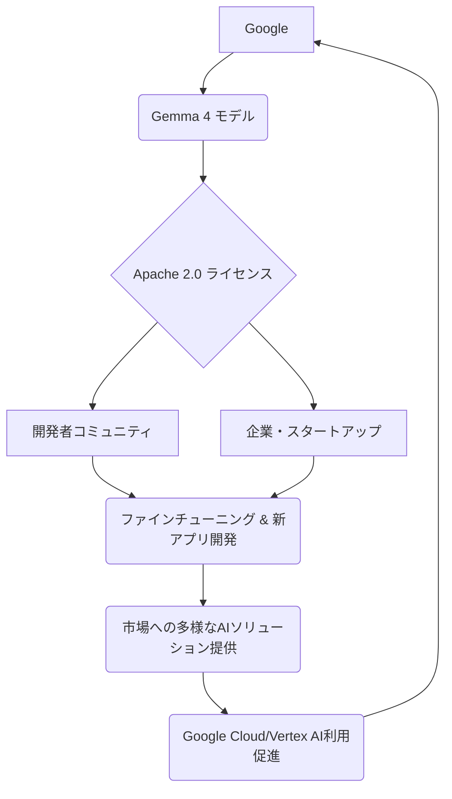

「Googleが本気で舵を切った」。シリコンバレーでこのニュースが流れた時、多くの開発者や企業関係者がそう感じたに違いありません。世界を牽引するテックジャイアント、Googleが最新のオープンソースモデル「Gemma 4」を発表し、そのライセンスを**Apache 2.0**に切り替えたのです。これは単なる新モデルのリリースに留まらない、AIエコシステム全体に大きな波紋を広げる戦略的転換点と言えるでしょう。

これまでGoogleは、一部のモデルを限定的に公開するか、より条件の厳しいライセンスで提供してきました。しかし、Gemma 4をApache 2.0ライセンスで提供するということは、商用利用、改変、再配布の自由が大幅に拡大されることを意味します。この動きは、特に企業がAIモデルをオンプレミスや独自の環境で利用したいと考える際に、計り知れないメリットをもたらします。大手クラウドプロバイダーが、その中核技術の一つであるAIモデルを「完全に開示する」という決断は、競争が激化するAI市場において、Googleがどのようなビジョンを描いているのかを雄弁に物語っています。

## Googleの「Gemma 4」：完全オープン化の衝撃

Googleが今回リリースしたGemma 4は、その性能もさることながら、Apache 2.0ライセンスという点が最も注目されています。MashableやArs Technicaの報道が示すように、このライセンス変更は、AIコミュニティ全体にとって画期的な出来事です。

Gemmaシリーズは、Googleの「Gemini」モデルファミリーの軽量版として開発され、ローカル環境での実行や特定のアプリケーションへの組み込みを目的としています。Gemma 4は、前バージョンからさらに改良が加えられ、推論能力や多言語対応能力が向上していると見られています。具体的なベンチマークはまだ出揃っていませんが、Googleがこのモデルを戦略的にオープンソース化するからには、一定以上の実用性と信頼性を提供しているはずです。

### Apache 2.0ライセンスが意味するもの

Apache 2.0ライセンスは、その高い自由度からソフトウェア業界で広く採用されてきました。AIモデルに適用された場合、以下の点が特に重要になります。

*   **商用利用の自由**: 企業はGemma 4をベースにした製品やサービスを開発し、販売することができます。収益化にあたってGoogleへのロイヤリティ支払いなどは発生しません。
*   **改変・派生版作成の自由**: モデルのコードを自由に修正し、自社のニーズに合わせてカスタマイズした派生モデルを作成できます。これは、特定の業界特化型AIや、企業独自のデータセットでファインチューニングを行う際に極めて重要です。
*   **再配布の自由**: 改変したモデルも含め、自由に再配布が可能です。これは、オープンソースコミュニティにおける知識共有とイノベーションを加速させます。
*   **特許権の扱い**: ライセンス利用者がモデルを使用する際に、Googleが保有する関連特許権の侵害を主張しないという条項が含まれるため、安心して利用できます。

このオープン戦略は、Googleが生成AIの「コモディティ化」を加速させ、自身のクラウドプラットフォームであるGoogle Cloud、特にVertex AIやBedrockといったAIサービスのエコシステムへの流入を促す狙いがあると考えられます。優れたオープンモデルを提供することで、開発者の裾野を広げ、最終的にはGoogleのクラウドサービスへの需要を高めるという、長期的な視点に立った戦略と見ることができます。

## なぜ今、Googleは「開放戦略」に舵を切るのか？

GoogleがGemma 4でApache 2.0という完全なオープン戦略に踏み切った背景には、いくつかの複合的な要因が存在します。

一つは、**競争の激化**です。MetaのLlamaシリーズ、Mistral AI、そしてDeepSeekのような新興勢力が、高性能なオープンウェイトモデルを次々とリリースし、市場の主導権を握ろうとしています。特にMetaのLlamaは、その高い性能とオープン性から、開発コミュニティで圧倒的な支持を得てきました。Googleがこの領域で存在感を示すためには、単に高性能なモデルを出すだけでなく、より魅力的な提供条件が必要だったのでしょう。過去にOpenAIが「GPT-oss」を発表した際も、そのオープン性に大きな注目が集まりましたが、Googleはさらに踏み込んだ形です。

二つ目は、**ローカルAIの需要の高まり**です。プライバシー規制の強化（例: EUのデジタルオムニバス法案）、セキュリティ意識の向上、そしてクラウドコストの最適化といった理由から、企業は自社のサーバーやデバイスでAIモデルを動作させる「ローカルLLM」への関心を強めています。Gemma 4のような軽量かつオープンなモデルは、まさにこのニーズに応えるものです。

三つ目は、**エコシステムの拡大とデファクトスタンダードの確立**です。Googleは自社の技術をより多くの開発者や企業に利用してもらうことで、AI開発の標準技術としてGemmaを普及させたいと考えているはずです。開発者がGemmaベースで様々なアプリケーションやサービスを構築すればするほど、GoogleのAI技術は市場に深く浸透し、最終的にはGoogle Cloudの顧客基盤強化に繋がります。これは、かつてAndroidがモバイルOS市場で果たした役割と重なる部分があるかもしれません。

四つ目は、**AIの倫理と透明性への配慮**です。完全にオープンソースにすることで、モデルの内部構造や挙動がコミュニティによって検証可能となり、AIの信頼性向上に貢献します。これは、AI開発における「責任あるAI」の原則にも合致する動きです。

以下は、Googleのオープン戦略がどのようにエコシステムを形成するかを示す簡略化された図です。

## ローカルAI戦線、激化するモデル競争

Gemma 4の登場は、ただでさえ激しいローカルAIモデルの競争にさらなる拍車をかけます。現在、市場には様々な特性を持つオープンウェイトモデルが存在し、それぞれが特定の用途やハードウェア環境に最適化されています。

例えば、Mistral AIは、そのコンパクトさと性能の高さで注目を集めており、最新のMistral Large 3やMinistral 3、さらには開発者向けのDevstral 2といったモデルを投入しています。Devstral 2はラップトップでも動作する「laptop-friendly version」が提供されるとされ、手軽にローカルでコーディングAIを動かしたい開発者にとって魅力的な選択肢です。

また、DeepSeek V3.2のようなMITライセンスのモデルも登場しており、強力なローカル推論AIとして注目されています。これらのモデルは、コンテキストウィンドウの長さ、VRAMターゲット（必要なGPUメモリ量）、そしてライセンスの条件によって、利用可能なユースケースが大きく異なります。

ローカルLLMの活用は、データプライバシーの確保、リアルタイム推論の実現、そしてオフライン環境での利用といった点で、クラウドベースのLLMにはないメリットを提供します。そのため、企業は自社の要件に合わせて最適なモデルを選択する必要があるのです。

| モデルシリーズ | 提供元 | 主なライセンス | 商用利用 | 改変・派生版 | ローカル実行 | 主な特徴 |
| :------------- | :----- | :------------- | :------- | :----------- | :--------- | :------- |
| **Gemma 4**    | Google | Apache 2.0     | **可能** | **可能**     | **可能**** | Google製、完全オープン、幅広いユースケース |
| Llama 2/3      | Meta   | Llama 2: 特定条件あり / Llama 3: Meta Llama License | **可能** | **可能**     | **可能** | 高性能、コミュニティ支持、大規模 |
| Mistral        | Mistral AI | Apache 2.0 / Mistral AI Non-Production License | **モデルにより異なる** | **モデルにより異なる** | **可能** | 軽量・高速、コーディング特化版あり |
| DeepSeek V3.2  | DeepSeek | MIT License    | **可能** | **可能**     | **可能** | 推論能力に特化、高い自由度 |

※上記表のライセンス情報はモデルのバージョンによって異なる場合があります。常に公式情報を確認してください。

## 日本企業が問われる「オープンモデル」活用力

Gemma 4の登場は、日本企業にとって二つの側面から大きな意味を持ちます。一つは、**高品質なAIモデルを自社でコントロールできる機会**が拡がったこと。もう一つは、この機会をどれだけ迅速かつ効果的に活用できるかという、**企業としての適応力が問われる**ことになります。

これまで日本企業は、SaaS型のAIサービスや、API経由で大手プロバイダーのモデルを利用するケースが主流でした。これは手軽さというメリットがある一方で、データのプライバシー懸念、カスタマイズの限界、そして特定のベンダーへのロックインといった課題も抱えています。

Gemma 4のような完全オープンなモデルは、これらの課題を解決する可能性を秘めています。例えば、機密性の高い顧客データや企業内部の業務データを扱う場合でも、モデルを自社の閉域ネットワーク内で実行することで、外部へのデータ漏洩リスクを最小限に抑えられます。また、日本の商習慣や言語特性に合わせたファインチューニングを行うことで、汎用モデルでは達成できない高精度なAIシステムを構築することも可能です。

しかし、そのためには、モデルのデプロイ、運用、そしてカスタマイズに必要な**AIエンジニアリング能力**を社内で育成または確保することが不可欠です。Apache 2.0ライセンスの恩恵を最大限に享受するには、単にモデルをダウンロードして動かすだけでなく、その内部構造を理解し、必要に応じて手を加えられる技術力が求められます。日本企業がこのチャンスを活かすためには、外部のベンダー任せにするのではなく、自律的なAI開発体制を構築する投資が急務となります。

## 🧐 エバンジェリストの辛口オピニオン

はっきり言いましょう。GoogleがGemma 4をApache 2.0で出した今、まだ「うちはクラウドのAPIで十分」「よく分からないから様子見」などと言っている日本企業は、本当に危機感を持つべきです。これは、ただの「オープンソースモデルがまた一つ増えましたね」という話ではありません。

Googleのような巨大企業が、自社の最先端モデルをここまで開く意味を、どれだけの日本企業が深く理解しているでしょうか？彼らは、オープンソースコミュニティを巻き込み、GemmaをAI開発のデファクトスタンダードに押し上げようと本気で考えているのです。そして、その先には、Google Cloudのエコシステムへの莫大なトラフィックと、新たなビジネスチャンスを見据えています。

日本企業の多くは、いまだに「安定志向」や「リスク回避」の名のもとに、最新技術の導入に及び腰です。特にAI領域では、海外の巨大テック企業が提供する完成品を「消費する」という姿勢が根強い。しかし、Gemma 4のようなモデルは、消費するものではなく、**「育てて、使いこなす」**ものです。

「うちにはAI人材がいないから」と嘆いている場合ではありません。人材は外から連れてくるか、育てるしかありません。そして、その学習コストや初期投資を「高い」と見て先送りする企業は、結局は数年後に「あの時やっておけばよかった」と後悔することになるでしょう。オープンソースモデルは「無料」ではありません。使いこなすための知力、労力、そして戦略的な投資が必要な「高価な無料」なのです。

この自由度の高いGemma 4を前にして、日本企業に問われるのは、変化を恐れず、自らの手でAIの未来を切り拓く覚悟があるか、ということです。クラウドベンダーに依存し続ける「従属」の道を選ぶのか、それともオープンモデルを使いこなし「自律」への道を歩むのか。今、その岐路に立っていると私は断言します。

## 🔗 関連ツール・サービス

**[Google Cloud Platform](https://cloud.google.com/)** — Googleの提供するクラウドコンピューティングサービス群で、Vertex AIなどのAI開発環境も含まれます。
**[Apache Software Foundation](https://www.apache.org/)** — Apache 2.0ライセンスを管理する非営利団体で、オープンソースソフトウェア開発を支援しています。
**[Hugging Face](https://huggingface.co/)** — オープンソースの機械学習モデルやデータセットを共有・利用できるプラットフォームです。
**[Mistral AI](https://mistral.ai/)** — 高性能なオープンウェイトの大規模言語モデルを開発・提供するフランスのスタートアップです。