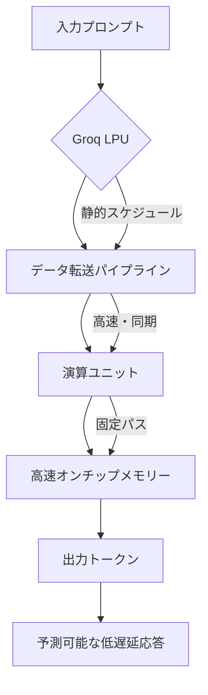

AIインフラの心臓部を担う**AIチップ**市場は、長らくNvidiaの一強時代が続いていました。その圧倒的な性能とCUDAエコシステムは、AI開発者にとって不可欠な存在となっています。しかし、この盤石な市場に今、大きな揺さぶりをかける存在が現れました。それが、サンフランシスコを拠点とするAIチップスタートアップ、**Groq**です。彼らが最近、10億ドル（約1500億円）を超える巨額の資金調達ラウンドを完了したと報じられ、業界に大きな波紋を広げています。

この資金調達は単なるニュースではありません。Nvidiaの牙城を崩す可能性を秘めた、新たな選択肢が市場に提示されたことを意味します。特に注目すべきは、Groqが推し進める独自の**LPU（Language Processor Unit）**アーキテクチャです。これは、AIの「推論」フェーズに特化することで、従来のGPUとは一線を画す高速性と低遅延を実現すると主張しています。AIサービスのリアルタイム化が進む現代において、このLPUの登場は、開発者や企業にとってどのような価値をもたらすのでしょうか。そして、この新しいプレイヤーが、日本のAI戦略にどのような影響を与えるのか、深く掘り下げていきます。

## AIチップ市場の巨人Nvidiaに挑む新星Groq

AIチップ市場は、Nvidiaが約8割のシェアを握ると言われるほどの寡占状態にあります。特にAIモデルの学習（トレーニング）フェーズにおいては、その並列処理能力とソフトウェアエコシステムの成熟度から、NvidiaのGPUがデファクトスタンダードとなっています。しかし、AIの学習が進み、いざそのモデルを実際のサービスに組み込み、ユーザーからの入力に対して高速に応答する「推論」フェーズにおいては、必ずしもGPUが唯一の最適解とは限りません。

Groqはこの推論市場に特化し、新たなアプローチで挑んでいます。2016年に創業されたGroqは、GoogleのTPU開発に携わった技術者らが中心となって設立されました。彼らは、AIの学習と推論では求められる性能特性が異なるという洞察に基づき、特に推論のボトルネックとなっていた「遅延」と「スループット」の改善に焦点を当てたLPUを開発しました。

今回の10億ドルを超える資金調達は、Groqの技術力と市場ポテンシャルへの期待の表れです。この投資により、GroqはLPUの生産体制を強化し、より大規模な顧客への展開を加速させることになります。Nvidiaの牙城に風穴を開け、AIインフラ市場の多様化を促す存在として、Groqの動向は今後ますます注目されるでしょう。

## Groq LPUアーキテクチャの秘密：なぜ高速なのか？

GroqのLPUがなぜ高速な推論を可能にするのか、その秘密は独自のアーキテクチャにあります。一般的なGPUが数千から数万個の小さなコアを持ち、それぞれが並列に処理を実行するのに対し、GroqのLPUは「決定論的なシングルコア」設計に近いアプローチを取ります。

GPUは膨大な並列処理能力を持つ一方で、多数のコア間でデータを共有したり同期したりする際のオーバーヘッドが発生し、特にシーケンシャルな処理が多いLLMの推論においては、その並列性の恩恵を最大限に受けにくい側面があります。LPUは、このオーバーヘッドを最小限に抑えるため、プロセッサ内部のデータフローを静的に、かつ厳密にスケジュールすることで、予測可能で一貫した低遅延を実現します。

具体的には、LPUは命令レベルでの並列性を最大限に高め、計算とデータ転送を完全に分離したパイプライン処理を行います。これにより、チップ内部でのデータ転送の遅延が極めて少なくなり、常にデータを処理できる状態を維持できるのです。

このアーキテクチャは、LLMのような大規模モデルがトークンを一つずつ生成していくシーケンシャルな推論において、その真価を発揮します。トークン生成の間の「待ち時間」を劇的に短縮することで、ユーザーはまるで人間と会話しているかのような、途切れないインタラクションを体験できるようになります。

## 高速AI推論がビジネスにもたらす価値

GroqのLPUが提供する高速なAI推論は、単なる技術的な進歩に留まりません。これは、AIを活用したビジネスモデルそのものを変革する可能性を秘めています。

これまでのAIサービスでは、ユーザーからの問い合わせから応答までの遅延（レイテンシー）が課題となることが少なくありませんでした。特にLLMを利用したチャットボットやバーチャルアシスタント、リアルタイム翻訳などのアプリケーションでは、数秒の遅延でもユーザー体験を著しく損ねます。GroqのLPUは、このレイテンシーをミリ秒単位まで短縮することで、以下のような新たな価値を生み出します。

*   **リアルタイム性の向上**: 大規模LLMを搭載した顧客サービスチャットボットが、人間とほぼ同等の速度で応答できるようになります。これにより、顧客満足度の向上や業務効率化に直結します。
*   **インタラクティブなAI体験**: AIが生成するコンテンツ（テキスト、画像、コードなど）が瞬時に表示されることで、ユーザーはより深く、よりスムーズにAIと協力できるようになります。開発段階でのイテレーションサイクルも大幅に短縮されるでしょう。
*   **新たなアプリケーションの創出**: 自動運転車におけるリアルタイムな状況判断や、金融市場における高速トレーディング、医療診断支援での瞬時な画像解析など、低遅延が必須とされる分野でのAI活用が一層加速します。
*   **コスト効率の改善**: 推論処理に特化することで、必ずしも高価なGPUをフル活用する必要がなくなり、特定のユースケースにおいては電力消費や運用コストの削減に繋がる可能性も出てきます。

以下の表は、Groq LPUと汎用的なNvidia GPUが、AIの異なるフェーズやユースケースでどのような特性を持つかを示しています。

| 特性/用途             | Groq LPU (推論特化)                                       | Nvidia GPU (汎用)                                          |
| :-------------------- | :-------------------------------------------------------- | :--------------------------------------------------------- |
| **主要用途**          | 大規模LLMの高速推論、リアルタイムAI、エッジAI推論           | AI学習、複雑なモデルの推論、グラフィックス、HPC             |
| **遅延**              | 極めて低い、予測可能（ミリ秒単位）                            | 低い (高負荷時やモデル複雑性により変動あり)                   |
| **スループット**      | 高い (推論時におけるトークン生成速度)                       | 高い (学習時および多様な計算負荷に対応)                       |
| **アーキテクチャ**    | シーケンシャル、静的スケジュール、専用メモリーバンド幅       | 大規模並列、動的スケジュール、汎用メモリー構造               |
| **消費電力効率**      | 推論時において競合製品より優位な場合あり（単位推論あたり） | 汎用性とのトレードオフ                                       |
| **エコシステム**      | 専用SDK/コンパイラ、比較的新しい                               | CUDAエコシステム、非常に成熟                                 |
| **得意なワークロード** | LLMの対話型アプリケーション、リアルタイム予測                 | 大規模ニューラルネットワークのトレーニング、科学技術計算      |

## 🧐 エバンジェリストの辛口オピニオン

Groqの巨額資金調達とLPUの性能は確かに目を引きます。しかし、これを手放しでNvidiaの「終わり」と捉えるのは早計です。Nvidiaの強さは、単にチップの性能だけでなく、CUDAという圧倒的なソフトウェアエコシステムと、長年にわたるAI研究者・開発者コミュニティとの連携にあります。学習から推論まで一貫したプラットフォームを提供できるNvidiaに対し、Groqは推論に特化している点が、良くも悪くも彼らの戦略の核心です。

私が日本企業に伝えたいのは、この多様化の流れを「脅威」ではなく「機会」として捉えるべきだという点です。Nvidia一強の市場では、常に高価な最新GPUを調達し続ける必要があり、コスト面での負担は避けられませんでした。Groqのような推論特化型チップの台頭は、特定のAIサービスにおいては、より最適化されたハードウェアを選択できる可能性を開きます。これは、コスト削減だけでなく、サービス品質の向上、ひいては競争優位性の確立に直結する話です。

日本企業は、今一度自社のAI活用戦略を見直すべきです。特に、リアルタイム性を要求される顧客接点でのAI活用や、社内業務の自動化においてLLMの導入を検討している企業は、GroqのLPUのような新しい選択肢を真剣に評価するフェーズに来ています。ベンチマークデータだけでなく、実際にPoC（概念実証）を通じて、自社のワークロードでのLPUの性能とコストメリットを検証することが不可欠です。

ただし、注意も必要です。Groqはまだ新しいプレイヤーであり、サプライチェーンの安定性、スケーラビリティ、そしてNvidiaのような成熟したソフトウェアツール群の提供には時間を要します。また、推論特化であるということは、学習フェーズでは依然としてNvidiaや他のGPUを頼ることになります。つまり、これからは「どちらか一方」ではなく、「適材適所」でAIチップを選択する時代になるということです。Nvidiaとの協調、そしてGroqのような新興勢力との連携を視野に入れ、柔軟なAIインフラ戦略を構築できる企業が、次の時代をリードするでしょう。日本のAI戦略は、特定のベンダーに依存せず、常に最新の技術動向を評価し、自社のニーズに最も合致する最適な組み合わせを見つける洞察力が求められています。

## Groqの挑戦が描くAIインフラの未来図

Groqの資金調達は、AIチップ市場の新たな競争時代を象徴する出来事です。これまでAIチップの進化は、主に学習フェーズでの性能向上に焦点が当てられてきましたが、GroqのLPUは推論フェーズの重要性を改めて浮き彫りにしました。この動きは、AIインフラ全体に以下のような変化をもたらす可能性があります。

第一に、AIハードウェアの専門化と多様化が進むでしょう。学習にはGPU、推論にはLPUやFPGAなど、特定のタスクに特化したチップがそれぞれの強みを活かし、市場を細分化していく未来が考えられます。これにより、AI開発者はより効率的かつ経済的にAIサービスをデプロイできるようになります。

第二に、NvidiaのCUDAに代表されるような、ベンダー独自のソフトウェアエコシステムへの依存度が相対的に低下する可能性があります。Groqのような企業が独自のSDKやコンパイラを提供し、開発者が複数のハードウェアプラットフォーム間でAIモデルをより柔軟に移行できるようなツールが進化すれば、市場の競争はさらに活性化するでしょう。

最後に、AIサービスのコスト構造に大きな変化をもたらす可能性も秘めています。推論コストが大幅に削減されれば、AIを組み込んだ製品やサービスの価格設定にも影響を与え、AIの普及をさらに加速させる要因となります。

Groqの挑戦は、単にNvidiaに挑む一企業の物語ではありません。AIが社会のあらゆる層に浸透していく中で、その基盤を支えるインフラがどのように進化し、多様化していくかを示す重要な指標となるでしょう。日本の企業や開発者にとって、この変化の波に乗り遅れないよう、常にアンテナを張り、最適なAIインフラ戦略を再考することが求められます。

## 🔗 関連ツール・サービス

**Nvidia GPUクラウド (NGC)](https://www.nvidia.com/ja-jp/deep-learning-ai/solutions/data-center/nvidia-gpu-cloud/)** — AI開発・デプロイメント向けのGPU最適化ソフトウェアハブ。

**[GroqCloud API](https://groq.com/cloud-api)** — Groq LPUを活用した高速LLM推論APIサービス。

**[TensorFlow](https://www.tensorflow.org/)** — Googleが開発するオープンソースの機械学習ライブラリ。

**[PyTorch](https://pytorch.org/)** — Facebook (Meta) が開発するオープンソースの機械学習フレームワーク。