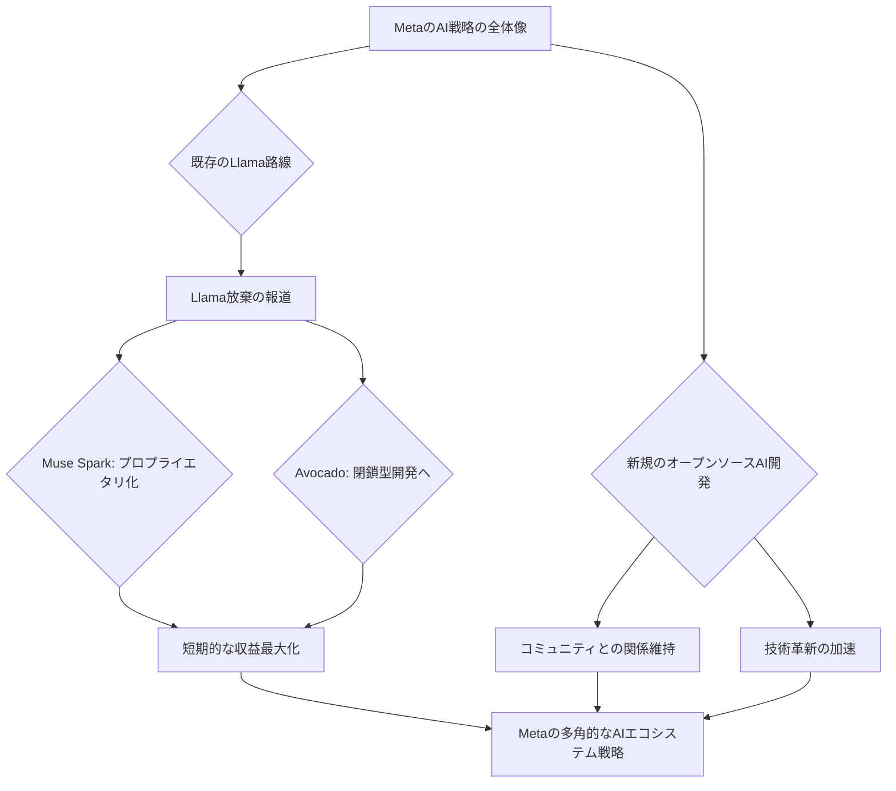

MetaのAI戦略に「矛盾」が生じているのではないか——。

シリコンバレーでAIの動向を追い続けて15年になる私だが、今回のニュースには少なからず驚きと同時に、Metaのしたたかさを感じている。つい先日、「MetaがオープンソースのLlamaを放棄し、プロプライエタリなMuse Sparkへ移行する」という衝撃的な報道があったばかりだ。さらに、次期モデル「Avocado」も閉鎖型開発にシフトするという観測も広がっていた。

しかし、2026年4月6日付のSiliconANGLEの報道は、この既成概念を揺るがすものだった。なんと、**Metaが「今後登場するAIモデルのオープンソース版を開発している」**というのだ。これは一体どういうことなのか。Llamaのオープンソース路線から「脱却」したかに見えたMetaが、なぜ再びオープンソースに舵を切る、あるいは少なくとも並行して開発を続けるのか。その真意を深掘りすることは、激動のLLMエコシステムの未来を読み解く上で極めて重要となる。

## Metaの「二重戦略」：クローズドとオープンの狭間で

MetaのAI戦略は、一見すると大きな方向転換を示唆していた。特に「Muse Sparkへの移行」や「Avocadoの閉鎖型開発」というニュースは、Llamaが築き上げたオープンソースLLMの金字塔を、Meta自らが放棄するかのような印象を与えた。オープンソースコミュニティからは失望の声も上がっていたのは記憶に新しい。

Llamaは、その強力な性能と比較的オープンなライセンスによって、世界中の研究者や開発者に爆発的に普及し、LLMの民主化に貢献した。数々の派生モデルが生まれ、イノベーションを加速させた功績は計り知れない。MetaにとってLlamaは、単なる技術モデル以上の意味を持つ、強力なエコシステムの核だったはずだ。

それだけに、プロプライエタリ路線への転換は、短期的な収益化や競争優位性の確保という経営判断があったにせよ、大きな賭けに見えた。しかし、今回のSiliconANGLEの報道は、Metaが「Llamaの放棄」を意味する戦略転換の裏で、**水面下で別のオープンソースAIモデルの開発を進行させている**という、極めて複雑な実態を浮き彫りにした。これは単なる揺り戻しではない。Metaは、クローズド戦略とオープン戦略を巧みに使い分ける、デュアルポートフォリオ戦略を構築しようとしている可能性が高い。

編集部で特に注目したのは、この二つの戦略軸が**「同時並行」**で進められている点だ。Llamaのオープンソース路線での成功体験を完全に捨てるのではなく、一部で継続しつつ、別の柱としてプロプライエタリな収益源を確保するという、まさに「二兎を追う」戦略だ。

上記の図は、MetaのAI戦略が、Llamaの歴史と今後の方向性、そして新たに報じられたオープンソース開発の継続という複数の要素が絡み合う複雑なものであることを示している。これは、単純な「オープン vs クローズド」の二元論では語れない、したたかな経営判断の現れと見るべきだろう。

## なぜMetaはオープンソースを「手放さない」のか？

Metaがプロプライエタリモデルへのシフトを一部で進める一方で、なぜオープンソースAIの開発を継続するのか？その理由はいくつか考えられる。

まず第一に、**エコシステムとコミュニティの維持**だ。Llamaが示したように、オープンソースモデルは世界中の開発者、研究者、そしてスタートアップ企業を巻き込み、巨大なエコシステムを形成する。このエコシステムは、Metaにとって重要な技術フィードバック源であり、新たなイノベーションの温床となる。また、AI技術の発展を特定の企業に独占させないという哲学的な側面も、Metaが公言してきたオープンネスの姿勢と無関係ではない。

次に、**人材確保とブランドイメージ**の観点も大きい。オープンソースプロジェクトは、優秀なAIエンジニアや研究者にとって魅力的な活動の場だ。Metaがオープンソースへのコミットメントを完全に失えば、最先端の才能が他のオープンなプラットフォームや競合企業へと流出するリスクがある。継続的なオープンソースへの貢献は、Metaが「AIの未来を牽引する企業」としてのブランドイメージを維持し、トップタレントを引きつける上で不可欠な要素なのだ。

さらに、**技術的なリスクヘッジ**という側面も見逃せない。AI技術の進化は予測不能であり、どのモデルやアプローチが最終的に市場を制するかは誰にも分からない。プロプライエタリモデルが期待通りの成果を出せないリスクや、オープンソースコミュニティから予期せぬブレイクスルーが生まれる可能性もある。複数の戦略を持つことで、Metaは未来の不確実性に対するリスクを分散し、あらゆる局面に対応できる柔軟性を確保しようとしているのだろう。

GoogleのGemmaシリーズや、Arcee AIのような新興勢力が400Bパラメータ級のオープンソースLLMを開発するなど、オープンソースLLM市場の競争は激化の一途を辿っている。このような状況下でMetaがオープンソースの地盤を完全に手放すことは、長期的に見て得策ではないと判断した可能性も十分に考えられる。

| モデル名/戦略     | ライセンス形態       | 主な目的                 | ターゲットユーザー        | 編集部の注目点                                                               |
|-------------------|--------------------|------------------------|-----------------------|-------------------------------------------------------------------------|
| **Llama (初期)**  | オープンソース       | 研究促進、エコシステム形成 | 研究者、開発者            | LLMオープン化の牽引役として、コミュニティに多大な影響を与えた。                 |
| **Muse Spark**    | プロプライエタリ     | 商用利用、高収益性         | 大企業、エンタープライズ   | Llamaからプロプライエタリへの明確なシフトを示唆。高精度な商用AIモデルとして期待。 |
| **Avocado**       | プロプライエタリ     | 特定ユースケース向け最適化 | 特定業界の企業            | クローズド戦略への転換を象徴する、用途特化型モデルの旗手。                     |
| **新規OSSモデル** | オープンソース       | 技術検証、コミュニティ維持 | スタートアップ、研究機関   | Llama後のMetaの真意を探る鍵。オープンソースエコシステムへの継続的なコミット。   |

この表からも分かるように、Metaは単一のAI戦略に固執せず、異なるモデル、異なるライセンス形態を並行して推進している。これは、それぞれの戦略が持つメリットとリスクを理解した上で、全体としてのポートフォリオ最適化を図ろうとする、極めて戦略的なアプローチだ。

## 市場への影響：複雑化するLLMエコシステム

Metaの二重戦略は、LLM市場全体に複雑な波紋を投げかけるだろう。

まず、開発者や企業は、MetaのAIモデルを選ぶ際に、そのライセンス形態や将来のサポート方針について、これまで以上に慎重な判断を求められることになる。Llamaの事例を見ても、オープンソースとされていても、その背後にある企業の方針転換によって、利用戦略の見直しを迫られる可能性は常にある。どのMetaモデルが自社のビジネスモデルや開発方針に合致するのか、深い洞察が必要だ。

次に、オープンソースLLMの進化は止まらない。Metaが一部でオープンソース開発を継続する一方で、Arcee AIのような新興勢力は、既存のMetaモデルを超えるような高性能なオープンソースLLMをゼロから構築している。これは、オープンソースコミュニティ全体の活力と、特定のメガテック企業に依存しないイノベーションの可能性を示している。市場は、常に新しい選択肢と技術的進歩に満ち溢れている。

また、「オープンソース vs クローズド」という議論が、これまで以上に複雑な様相を呈して再燃するだろう。Metaのような巨大企業が、両方の戦略を追求する中で、それぞれのメリット・デメリット、そして使い分けのベストプラクティスがより具体的に議論されることになる。企業は、自社のデータ主権、セキュリティ、コスト、カスタマイズ性などを考慮し、どちらのモデルが最適かを判断する必要がある。

特に、オンプレミスでのLLM運用を検討している日本企業にとっては、Metaが提供し続けるオープンソースモデルの存在は依然として重要だ。データガバナンスや機密性保持の観点から、外部クラウドサービスに依存しないモデルのニーズは高い。Metaがこの領域に一定のコミットメントを続けることは、日本市場にとって歓迎すべきニュースと言える。

## 日本企業が学ぶべきMetaの「したたかさ」

Metaの今回の動きは、日本企業にとって貴重な教訓となる。
AI戦略を考える上で、単一の方向性に固執することの危険性、そして多角的な視点でのポートフォリオ構築の重要性を再認識すべきだ。

これまで多くの日本企業は、AI技術の導入において「流行」や「大手ベンダー」の動向に過度に依存する傾向があった。しかし、Metaのような巨大企業ですら、戦略を柔軟に変化させ、時には一見矛盾するようなアプローチを同時に追求している。これは、AIの領域がいかに不確実性に満ち、迅速な適応が求められるかを示している。

日本企業は、Metaのデュアル戦略から、以下の点を学ぶべきだろう。

1.  **単一戦略への固執の危険性:** 「オープンソース一択」「プロプライエタリモデルこそ正解」といった硬直した思考は、変化の激しいAI市場では命取りになりかねない。自社の状況、競争環境、将来のビジョンに基づき、複数の選択肢を常に検討し、柔軟に方針転換できる体制が不可欠だ。
2.  **多角的なAIポートフォリオの構築:** 基盤モデル、SaaS型サービス、オンプレミスLLM、特化型AIなど、複数のAI技術と利用形態を組み合わせたポートフォリオを構築することで、リスクを分散し、さまざまなビジネスニーズに対応できる。Metaが示すように、自社開発のオープンソースと商用モデルを両立させる「ハイブリッド戦略」は有力な選択肢となる。
3.  **オープンソースと商用モデルの使い分け:** オープンソースは、コスト削減、高い透明性、カスタマイズの自由度といったメリットがある一方で、サポート体制やセキュリティ、バージョン管理などの課題も存在する。商用モデルは、手厚いサポートと安定性を提供するが、ベンダーロックインのリスクやコスト増の可能性もある。それぞれの特性を深く理解し、自社の事業フェーズや重要度に応じて最適な使い分けをすることが肝要だ。

Metaの「したたかな」戦略は、日本企業がAI導入で直面するであろう複雑な意思決定のヒントを多く含んでいる。

## 🧐 編集部の辛口オピニオン

MetaのAI戦略が「Llamaを捨ててクローズドへ」という単純なものではないと判明した今回の報道は、一部で「Metaはやっぱり優柔不断だ」といった見方もあるかもしれない。しかし、そんな甘い解釈ではシリコンバレーの現実を読み解くことはできない。これは**「優柔不断」ではなく「したたかなリスクヘッジ」**、そして**「市場のあらゆる可能性を刈り取るための布石」**と断言する。

Metaは、Llamaでオープンソースエコシステムを確立し、自社技術を世界標準に押し上げた。その成功体験を完全に捨てる愚は犯さない。プロプライエタリモデルで短期的な収益と差別化を図りつつ、水面下で次のオープンソースの種を蒔くことで、コミュニティとの関係維持、将来の技術トレンドへの適応、そして優秀な人材の引き留めを図っているのだ。これはまさに**「虎視眈々」**という言葉がぴったりくる。

日本企業は、このMetaの「二枚舌」…いや、「二刀流」戦略から何を学ぶべきか。それは、**流行りのAIツールに飛びつく前に、自社の競争優位をどこに置くかを明確にする**ことだ。「みんなが使っているから」という理由で特定のモデルやサービスに依存すれば、Metaのように突然の戦略転換で足元をすくわれるリスクがある。

特に「オープンソースだから安心」という幻想は危険だ。ライセンス条件の変更、コミュニティの分裂、サポートの終了といったリスクは常にある。また、プロプライエタリモデルであっても、そのブラックボックスゆえの限界も存在する。大事なのは、**「自社のデータ資産をどう守り、どう活用するか」**という揺るぎない軸を持つことだ。

Metaは、自社の利益最大化と市場での優位性確保のために、時には矛盾を孕むような戦略も平然と実行する。この「強かさ」を直視し、日本企業は自社のAI戦略をより戦略的かつ多角的な視点で見直す時期に来ている。でなければ、いつまで経っても「流行を追いかける側」から脱却できないだろう。

## 💡 よくある質問（FAQ）

### Q: Metaは本当にLlamaのオープンソース開発を完全にやめるのか？
A: 最新の報道によれば、MetaはLlamaの一部プロプライエタリ化やMuse Spark、Avocadoといった閉鎖型モデル開発を進める一方で、**「今後登場するAIモデルのオープンソース版を開発している」**とされています。これは、Llamaそのもののオープンソース開発を完全に終了するわけではないか、あるいはLlamaとは別のオープンソースモデルを並行して開発する可能性を示唆しています。単一の戦略ではなく、複数軸でのアプローチを取っていると見るべきでしょう。

### Q: Metaのこの二重戦略は業界全体にどのような影響を与えるか？
A: 開発者や企業は、Metaが提供するAIモデルの選択において、より複雑な判断を求められます。オープンソースモデルはコミュニティの力で急速に進化する可能性がある一方で、プロプライエタリモデルは安定したサポートと特定の用途での高精度を提供するでしょう。この二重戦略は、AIエコシステム全体の多様性を促進し、オープンソースとクローズドソース間の競争と共存を加速させる可能性があります。他の大手企業も同様のハイブリッド戦略を検討するかもしれません。

### Q: 日本企業はMetaのどのAIモデルに注目すべきか？
A: 日本企業は、自社のビジネスモデル、セキュリティ要件、コスト構造、カスタマイズの必要性に応じて、Metaの多様なモデル群から最適な選択をすべきです。オンプレミスでのデータガバナンスを重視するなら、今後登場するオープンソースモデルが選択肢に入ります。一方、手軽な導入と強力なサポートを求める場合は、Muse SparkやAvocadoのようなプロプライエタリサービスが適しているでしょう。単一のモデルに依存せず、常に最新の情報を収集し、柔軟にAIポートフォリオを構築する姿勢が重要となります。

## 🔗 関連ツール・サービス

**[Meta AI](https://ai.meta.com/)** — Metaが提供する様々なAIサービスや研究成果の公式ポータルサイト。
**[Hugging Face](https://huggingface.co/)** — オープンソースの機械学習モデルやデータセットが集まる世界最大のプラットフォーム。
**[AWS SageMaker](https://aws.amazon.com/jp/sagemaker/)** — 機械学習モデルの構築、トレーニング、デプロイを支援する包括的なAWSサービス。
**[Google Cloud AI Platform](https://cloud.google.com/ai-platform)** — Googleが提供する機械学習開発プラットフォームで、多様なAIソリューションを統合。
---