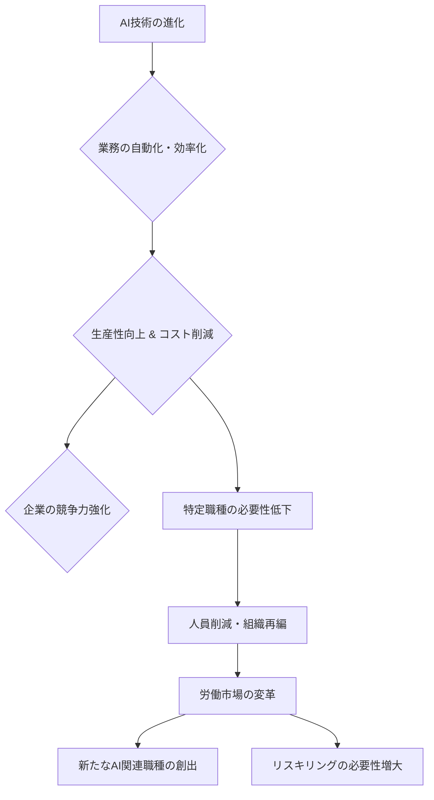

シリコンバレーで15年間、最先端の技術動向を追い続けてきた私にとって、今日のCNBCの報道は単なるニュースを超え、ある種の予兆として胸に突き刺さりました。大手テック企業、**MetaとMicrosoftが合計2万人の大規模人員削減を発表**したというのです。これは単なる景気後退によるリストラとは一線を画します。各方面で囁かれていた「AIが引き起こす労働危機」が、いよいよ現実のものとして目の前に現れたのかもしれません。この動きは、遠いアメリカの話ではありません。日本の企業、そして私たち一人ひとりの仕事の未来に、深く関わってくる重大な転換点となるでしょう。

## テック巨頭を襲う「AIリストラの波」

今回のMetaとMicrosoftによる人員削減は、合計2万人という規模もさることながら、その背景にAIの急速な進化が強く関係していると見られている点で、過去のリストラとは明確に異なります。CNBCの報道では、両社がAI技術への大規模投資を加速させる一方で、従来の業務プロセスをAIで効率化・自動化することで、多くの職種が「不要」になっている実態を指摘しています。

例えば、MetaはAIを活用したコンテンツモデレーションや広告最適化において、以前は人手に頼っていた部分を大幅に削減できるようになったと伝えられています。また、Microsoftも、Copilotのような生成AIツールがコード生成、ドキュメント作成、カスタマーサポートなどの業務を効率化し、結果として組織のスリム化を進めている状況です。

これまでのテック業界のリストラは、主に経済情勢の悪化や過剰な採用が原因でした。しかし、今回の削減は、**「AIによる生産性向上」が直接的に雇用に影響を与えている**という、新たなパラダイムシフトを示唆しています。企業はAI投資によって競争力を維持し、さらなる成長を目指す一方で、その陰で大量の雇用が失われるという厳しい現実が浮き彫りになったのです。これは、一時的なトレンドではなく、労働市場の構造そのものが大きく変容する時代の始まりを告げていると、編集部では見ています。

### 従来のリストラとの決定的な違い

過去数年間、特にパンデミック後の過熱した採用競争の反動として、多くのテック企業が人員削減を行ってきました。しかし、それらは主に**「成長の鈍化」や「経済の不確実性」**といった外的要因、あるいは**「投資家からの圧力」**によって引き起こされるケースがほとんどでした。今回のAI主導のリストラは、企業が内部的に「AIが代替可能な業務」を再定義し、戦略的に組織構造を最適化しようとする動きです。

これは、言い換えれば「AIが人間の仕事を奪う」というSFのような話が、もう現実世界で起こっていることに他なりません。特に、データ入力、定型業務、一部のカスタマーサービス、さらにはプログラミングの一部といった領域で、AIの代替可能性が急速に高まっています。

## AIが変える労働市場の構造転換

AIの進化は、私たちがこれまで当然と考えてきた「仕事」の定義そのものを揺るがしています。かつては人間が行っていた、あるいは人間でなければ不可能だと思われていた業務が、今やAIによって、より速く、より正確に、そしてはるかに低コストで実行できるようになりつつあるのです。

例えば、プログラマーはコードの大部分をAIに生成させ、テストも自動化できます。マーケターはAIを使って顧客データを分析し、パーソナライズされた広告キャンペーンを瞬時に生成可能です。カスタマーサポートはAIチャットボットが一次対応を完全に担い、人間のエージェントはより複雑な問題解決に集中する、あるいはその必要すらなくなるかもしれません。

この潮流の中で、労働市場には明らかな二極化が生まれています。一つは**「AIの使い手」**、つまりAIを効果的に活用し、自らの生産性や創造性を高められる人材です。彼らはAIをツールとして操り、従来の何倍もの価値を生み出すことができます。もう一つは、**「AIに取って代わられる仕事」**、主に定型的で反復性の高い業務に従事する人々です。彼らは、AIの進化によって職を失うリスクに直面しています。

| 職種カテゴリ     | AI導入前の主な業務              | AI導入後の変化（影響度）              |
| :--------------- | :------------------------------ | :------------------------------------ |
| カスタマーサポート | 定型的な問い合わせ対応、情報検索 | AIチャットボットによる一次対応（高） |
| データ入力・分析   | 手動入力、報告書作成            | 自動データ収集、AIによる洞察抽出（高） |
| ソフトウェア開発   | コード記述、デバッグ            | AIによるコード生成、テスト自動化（中〜高） |
| コンテンツ作成   | 原稿執筆、画像・動画編集        | AIによるドラフト生成、編集補助（中）   |
| 経理・事務       | 伝票処理、請求書発行            | RPAによる自動処理、監査支援（中〜高） |

この表が示すように、AIは特定の業務を消滅させるだけでなく、既存の職種の役割と求められるスキルを根本から変革しています。もはや、単に現在のスキルを磨き続けるだけでは不十分で、AIと協調しながら新たな価値を生み出す能力が、すべての労働者に求められる時代が到来したのです。これは生産性向上という明るい側面を持つ一方で、社会全体としての雇用の再定義という、重く、かつ喫緊の課題を突きつけています。

## 企業が直面する「AI人材」育成と「余剰人材」の課題

AIの時代において、企業が直面する最大の課題の一つは、どのようにして**「AIを使いこなせる人材」を育成し、同時に「AIによって余剰となる人材」を再配置・再教育するか**という点です。単純な人員削減は短期的なコスト削減にはなるものの、長期的な視点で見れば企業の競争力や士気を損ねる可能性があります。

### リスキリング（再教育）の重要性

MetaやMicrosoftのような先進企業でさえ、大規模な人員削減に踏み切らざるを得ない状況は、リスキリングの重要性を改めて浮き彫りにします。AIによって自動化される業務に従事していた従業員を、AIを管理・活用する新しい役割や、AIでは代替しにくい創造的・戦略的な業務へとシフトさせるための**大規模な再教育プログラム**が不可欠です。しかし、このリスキリングは容易ではありません。既存のスキルセットからの転換には時間とコストがかかり、個人の学習意欲や適性も大きく関わってきます。

### 新たなAI関連職種の創出とその難易度

AIの進化は、**プロンプトエンジニア、AI倫理学者、AIオペレーション（MLOps）エンジニア**など、新たな職種も生み出しています。しかし、これらの新しい職種は専門性が高く、誰もが容易に転換できるわけではありません。また、新たな職種の創出ペースが、AIによる自動化で失われる職種のペースを上回る保証もありません。企業は、需要と供給のミスマッチを解消するための戦略的な人材ポートフォリオ構築を迫られています。

### 企業文化と従業員のモチベーション維持

AIによる効率化が前面に出る一方で、従業員が「いつかAIに仕事を奪われるのではないか」という不安を抱くことは避けられません。このような状況下で、いかに従業員のモチベーションを維持し、変化への適応を促す企業文化を醸成するかが、経営層にとっての喫緊の課題です。透明性のあるコミュニケーションと、リスキリングへの積極的な投資が、従業員の信頼とエンゲージメントを保つ鍵となるでしょう。

## 政府と社会が担うべきセーフティネットの構築

テック企業の動きは、労働市場全体へのAIの波及を予見させます。このような変革期において、政府と社会が果たすべき役割は計り知れません。

### 普遍的ベーシックインカムや新たな社会保障制度の議論

AIによる自動化が広がり、広範な失業が生じる可能性が高まる中で、**普遍的ベーシックインカム（UBI）**のような新たな社会保障制度の導入が世界中で議論されています。労働が価値創出の主要な手段でなくなる未来において、すべての人々が基本的な生活を維持できる仕組みは不可欠となるかもしれません。これは単なる経済政策ではなく、AI時代における人間の尊厳をどう守るかという、根源的な問いでもあります。

### 教育システムの見直しと生涯学習の推進

現在の教育システムは、AI時代が求めるスキルセットと乖離している部分が多いと指摘されています。**批判的思考、問題解決能力、創造性、そして共感性**といった、AIには代替しにくい人間独自の能力を育む教育への転換が急務です。また、一度学べば一生安泰という時代は終わりを告げ、**生涯にわたる継続的な学習（リスキリング、アップスキリング）**が個人の生存戦略として必須となります。政府は、これらの学習機会へのアクセスを保障し、費用面での支援を行うべきでしょう。

### 政策立案者への提言

政府は、企業がAI技術を導入する際の倫理的ガイドラインや、雇用への影響を緩和するためのインセンティブを検討する必要があります。例えば、AIによる生産性向上で得られた利益の一部を、失業対策やリスキリングプログラムに再投資するような仕組みも考えられるでしょう。**AIの恩恵を社会全体で分かち合う**ための、包括的な政策フレームワークの構築が求められます。

## 🧐 編集部の辛口オピニオン

MetaやMicrosoftによる2万人の人員削減、これは日本企業にとって対岸の火事では断じてありません。むしろ、より深刻な形でこの「AIリストラの波」が押し寄せる可能性すらあると、私は危惧しています。

よく「日本の雇用慣行は強いから大丈夫だ」という声を聞きますが、それはもはや幻想です。グローバル競争に晒される日本企業は、いつまでも「メンバーシップ型雇用」を盾にAIによる効率化を避け続けることはできません。**生産性の差は、そのまま企業の死活問題に直結する**からです。特に、**大手企業ほど変革が遅れるリスクが高い**と指摘せざるを得ません。既存の巨大な組織構造と硬直化した文化が、AI導入による大胆な組織再編を妨げ、結果として手遅れになる可能性は十分にあります。

今すぐ動かない日本企業は、数年後には国際競争力の面で決定的な劣位に立たされるでしょう。AIを導入しない選択肢は、すでに存在しません。問題は、**「いかにAIと共に、日本独自の雇用システムの中で持続可能な人材戦略を構築するか」**です。現状維持は緩慢な死を意味します。経営層は、この厳しい現実を直視し、従業員と共に未来の仕事のあり方を再定義する、**「痛み」を伴う覚悟**を持つべきです。そうでなければ、日本の労働市場は、気づかぬうちに「AI失業危機」の渦に巻き込まれていくことになるでしょう。

## 💡 よくある質問（FAQ）

### Q: AIによる失業は一時的なものか、それとも永続的なトレンドとなるのでしょうか？
A: 一時的なものではなく、永続的な構造変化と見るべきです。AIは特定の業務を効率化するだけでなく、労働市場全体のスキル需要を根本から変え、高付加価値な仕事へのシフトを加速させます。失業は一時的に増える可能性がありますが、同時に新たな職種も生まれるため、市場は常に変化し続けるでしょう。

### Q: 日本企業も同様の大規模人員削減に直面する可能性はありますか？
A: 雇用慣行の違いから、欧米のような直接的な大規模リストラは起こりにくいかもしれませんが、AIによる業務効率化に伴う自然減や、配置転換による間接的な「余剰人員化」は避けられないでしょう。競争力を維持するためには、日本企業もAIを活用した生産性向上に取り組む必要があり、その過程で従来の雇用モデルの変革が求められます。

### Q: 個人としてAI時代を生き抜き、キャリアを維持・発展させるにはどうすれば良いでしょうか？
A: 最も重要なのは「学習し続ける」ことです。AIには代替されにくい創造性、批判的思考力、問題解決能力、そして対人スキルを磨きながら、AIを使いこなすための技術的知識（プロンプトエンジニアリングなど）を習得することが不可欠です。積極的にリスキリングプログラムに参加し、自らの市場価値を高める努力を継続するべきです。

## 🔗 関連ツール・サービス

*   **[Coursera](https://www.coursera.org/)** — 世界トップクラスの大学や企業が提供するAI・データサイエンス分野のオンライン講座でリスキリングを。
*   **[Udemy](https://www.udemy.com/)** — プログラミングからAI活用術まで、実践的なスキルを学べる多様なコースが揃うオンライン学習プラットフォーム。
*   **[DeepLearning.AI](https://www.deeplearning.ai/)** — AIと機械学習に特化した高品質なコースを提供し、AI時代に不可欠な専門知識を深めることができます。
*   **[GitHub Copilot](https://github.com/features/copilot/)** — AIを活用したペアプログラマー。AIによるコード生成を体験し、その効率性を実感する第一歩に。