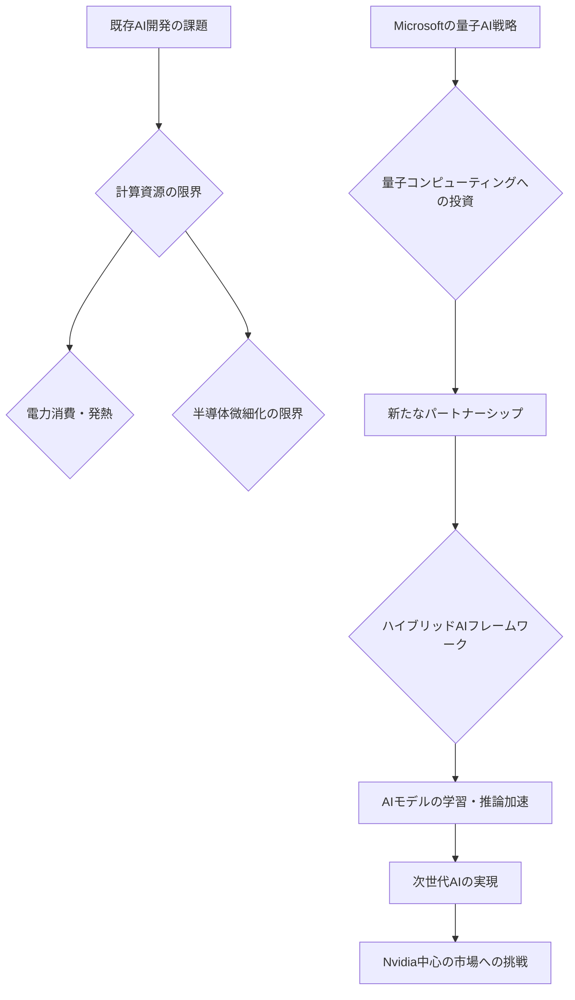

シリコンバレーのAI熱狂は、いまや古典的なコンピューティングの限界を突き破り、新たな地平へと向かっています。その最前線に立つのが、Microsoftが満を持して発表した量子AIへの大規模な「ダブルダウン」戦略です。AIの進化がかつてないスピードで進む中、既存の半導体技術だけではやがてボトルネックに直面するという懸念は、業界の誰もが抱えていた共通認識でしょう。ここにきてMicrosoftが量子コンピューティングとの融合を加速させるというニュースは、まさに未来のAI競争の行方を占う上で極めて重要な一打だと、私は確信しています。

これは単なるR&D投資の話ではありません。Microsoftは、AIの根本的な計算能力を再定義し、Nvidiaが築き上げてきた現在のAIインフラの「牙城」に、全く異なる角度から挑もうとしているのです。この動きは、来るべき超高性能AI時代の幕開けを告げると同時に、全ての企業にとってAI戦略の再考を迫るものとなるでしょう。

## AI計算能力の限界と量子コンピューティングの必然性

現在、我々が目にする生成AIの驚異的な性能は、主にGPUを始めとする従来の半導体技術の急速な進化と、膨大なデータ、そして巧妙なアルゴリズムの組み合わせによって実現されています。しかし、大規模言語モデル（LLM）のパラメータ数はすでに兆単位に達し、さらに次世代モデルの開発には天文学的な計算資源が必要とされています。Nvidiaの最新GPUは確かに素晴らしいですが、物理的な電力消費や発熱、そして微細化技術の限界という、超えられない壁が目の前に迫っているのです。

ここで脚光を浴びるのが、量子コンピューティングです。量子力学の原理を利用し、従来の0と1のビットではなく、「0でもあり1でもある」重ね合わせの状態や、複数の量子ビットが相関を持つ「もつれ」といった現象を用いることで、特定の計算問題を指数関数的に高速化できる可能性を秘めています。特に、最適化問題、分子シミュレーション、機械学習におけるパターン認識など、AIが直面する多くの困難なタスクにおいて、量子コンピュータは画期的な解決策をもたらすと期待されているのです。

Microsoftが今回のパートナーシップで目指すのは、この量子コンピューティングが持つ潜在能力を、具体的なAIモデルの学習や推論に直接的に応用する道筋を確立することでしょう。既存のAIフレームワークと量子回路をいかにシームレスに連携させるか、そして「量子アドバンテージ」をどのAIタスクで最大限に引き出すか、そのロードマップを明確に提示することが、この戦略の成否を分ける鍵となります。これは単なる研究テーマではなく、次世代の産業インフラを構築する壮大な挑戦です。

## Microsoftの戦略：量子計算とAIの融合が拓く新境地

Microsoftはこれまでも、Azure Quantumを通じて量子コンピューティング分野に積極的に投資してきました。今回の「ダブルダウン」は、そのコミットメントをさらに深め、より具体的なAI応用へと舵を切ったことを意味します。彼らの戦略は、大きく分けて以下の3つの柱で構成されると私は見ています。

### 量子ハードウェアの進化とアクセス拡大
量子コンピューターはまだ発展途上の技術であり、安定した量子ビットの生成やエラー訂正といったハードウェア面での課題が山積しています。Microsoftは、世界有数の量子ハードウェア開発企業との連携を強化することで、高性能な量子プロセッサへのアクセスを確保し、その技術的ボトルネックの解消を加速させるでしょう。Azure Quantumを通じたクラウドベースの量子リソース提供は、より多くの研究者や開発者が量子コンピューティングに触れる機会を創出し、革新的なAIアルゴリズムの開発を促すはずです。

### ハイブリッドAIフレームワークの開発
量子コンピューターが全てのAIタスクを代替するわけではありません。むしろ、既存の古典的なAIと量子AIを組み合わせた「ハイブリッド型」のアプローチが現実的な解となるでしょう。Microsoftは、量子アルゴリズムと古典アルゴリズムが協調動作するような新しいAIフレームワークの開発に注力すると考えられます。これにより、LLMの事前学習における複雑な最適化問題や、特定の専門領域での推論能力の飛躍的向上など、量子コンピューターが最も効果を発揮するAIの「キラーアプリ」を特定し、実装することが可能になります。

### 人材育成とエコシステムの構築
どんなに素晴らしい技術も、それを使いこなす人材がいなければ宝の持ち腐れです。Microsoftは、量子AIの研究者やエンジニアを育成するためのプログラムを強化し、オープンソースコミュニティとの連携を通じて、この新しい技術領域のエコシステムを拡大していくでしょう。量子AIはまだニッチな分野ですが、Microsoftのような巨大テック企業が本腰を入れることで、一気にメインストリームへと押し上げられる可能性を秘めています。彼らは単に技術を開発するだけでなく、その技術が広く活用されるための土壌作りにも力を入れているのです。

## Nvidiaへの挑戦状：チップ戦争の新たな局面

Nvidiaは、GPUがAI計算のデファクトスタンダードとなって以来、その市場で圧倒的な優位性を確立してきました。しかし、Microsoftの量子AIへの注力は、このNvidiaの一強体制に対する強力なカウンターとなる可能性があります。もし量子コンピューティングが特定のAIタスクにおいてGPUを上回る性能を発揮できるようになれば、AIチップ市場の勢力図は根本から書き換えられるかもしれません。

もちろん、これは短期的な話ではありません。量子コンピューターが実用的なレベルでAIの主流になるまでには、まだ多くの技術的ハードルを乗り越える必要があります。しかし、Microsoftのような巨人が、来るべき「ポストGPU時代」を見据えて今から布石を打っている事実は、Nvidiaにとっても無視できない警告となるでしょう。

将来的には、AIモデルの学習や推論が、古典的なGPUと量子プロセッサを組み合わせた「量子アクセラレーテッドAIシステム」へと移行していく可能性も十分に考えられます。このパラダイムシフトが実現すれば、AIの開発コスト、電力消費、そして性能の全てにおいて、現在の常識を覆すような変化が起こり得ます。

| 特徴       | 古典コンピューティング（GPUなど）             | 量子コンピューティング                         |
| :--------- | :--------------------------------------------- | :--------------------------------------------- |
| **データ単位** | ビット (0または1)                              | 量子ビット (0と1の重ね合わせ、もつれ)            |
| **計算原理** | 論理ゲートによる逐次処理                     | 量子現象（重ね合わせ、もつれ、干渉）を利用した並列処理 |
| **得意分野** | 線形代数、大量データの並列処理                 | 最適化問題、分子シミュレーション、素因数分解     |
| **AI応用**   | 大規模言語モデル、画像認識、強化学習の学習・推論 | 新素材開発、創薬、複雑なグラフ問題、量子機械学習 |
| **開発段階** | 成熟した技術、実用化済み                       | 研究開発段階、限定的な実用化                     |
| **消費電力** | 高い（特に大規模AIモデル）                   | 低い可能性（一部タスクで）                     |
| **将来性**   | 微細化の限界に直面、計算能力向上に限界         | 指数関数的な計算能力向上、未開拓の可能性         |

## 🧐 編集部の辛口オピニオン

今回のMicrosoftの量子AI戦略は、日本企業にとって「警鐘」以外の何物でもありません。シリコンバレーでは、AIのフロンティアがすでに既存の技術の先、つまり量子力学の領域にまで踏み込んでいるというのに、日本の多くの企業は未だに「とりあえず生成AIを使ってみよう」というレベルから抜け出せずにいるのが現状ではないでしょうか。

この動きは、単にAIの性能が上がるという話ではありません。未来の基盤技術そのものがシフトする可能性を示唆しています。日本企業がこれまで得意としてきた半導体材料や精密機器の分野でも、量子コンピューティングの進展によって求められる技術やサプライチェーンが根本的に変わるかもしれません。

私は、このニュースに接して「またしても周回遅れになるのか」という強い危機感を抱かざるを得ません。量子AIは、まだ実用化には時間を要するでしょう。しかし、Microsoftのような巨大企業が、今このタイミングで大規模な投資を行うということは、彼らが「未来は量子AIにある」という確信を持っている証拠です。

日本企業に必要なのは、目先のAI導入効果に一喜一憂するだけでなく、10年、20年先を見据えたR&D戦略と人材への投資です。特に、量子物理学、コンピューターサイエンス、そしてAIの知識を兼ね備えた「量子AI人材」の育成は喫緊の課題。政府も企業も、この分野への国家レベルでの戦略的投資を急がなければ、真の意味での「AI後進国」として世界から取り残される事態になりかねません。覚悟を持って、この技術の波に乗るか、あるいは静かに沈んでいくか、岐路に立たされていると肝に銘じるべきです。

## 💡 よくある質問（FAQ）

### Q: 量子AIはいつ頃、実用化されると見込まれていますか？
A: 量子コンピューティング自体はまだ研究開発段階であり、汎用的な実用化には早くとも5〜10年、本格的な普及にはそれ以上の時間が必要とされています。しかし、特定のAIタスクにおける「量子アドバンテージ」は、より早い段階で限定的に実現される可能性があります。Microsoftのような企業が投資することで、そのロードマップは加速するでしょう。

### Q: 量子AIが既存のAI市場に与える影響はどのようなものでしょうか？
A: 短期的には大きな影響はありませんが、長期的にはAIモデルの性能、開発コスト、電力効率に革命をもたらす可能性があります。特に、現在GPUの計算能力に依存している大規模言語モデルの学習や、新素材開発、創薬といった分野で、従来のAIでは不可能だった複雑な問題解決が可能になることで、AI市場の競争環境を根本から変える可能性があります。

### Q: 日本企業は量子AIの動向にどう対応すべきでしょうか？
A: まずは、量子コンピューティングとAIの基礎技術への理解を深めることが重要です。研究機関や大学との連携を強化し、共同研究や人材育成に投資すべきでしょう。また、自社の事業領域において、量子AIがどのような価値を生み出し得るかを早期に特定し、具体的なユースケースの検証に着手することが求められます。

## 🔗 関連ツール・サービス

**[Azure Quantum](https://azure.microsoft.com/ja-jp/products/quantum)** — Microsoftが提供するクラウドベースの量子コンピューティングプラットフォームです。
**[IBM Quantum](https://www.ibm.com/jp-ja/quantum-computing/)** — IBMが提供する量子コンピューティングサービスと開発ツール群です。
**[Google Quantum AI](https://quantumai.google/)** — Googleの研究部門で、量子コンピューティングハードウェアとソフトウェアの開発をリードしています。