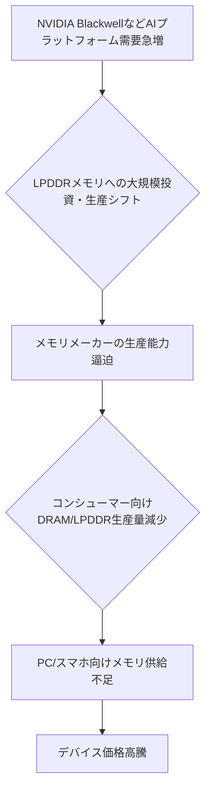

AIブームが我々の生活に与える影響は、もはやソフトウェアの世界に留まらない。昨年後半から、シリコンバレー界隈では「AIがあなたのPCやスマホの値段を押し上げる」という話で持ちきりだ。特にWccftechが2025年11月19日に報じた**「NVIDIAのBlackwellのようなAIプラットフォームのLPDDRメモリ需要増大が、ラップトップやデスクトップPCのコンシューマーグレードDRAMにさらなる負荷をかける可能性がある」**というヘッドラインは、そのメカニズムを具体的に示唆しており、非常に示唆に富んでいる。これは単なる一時的なトレンドではなく、今後のIT戦略、そして我々の消費行動に深く影響する構造的な変化の兆候だと捉えるべきだろう。

### AIブームの余波：PCとスマホを襲う「見えない危機」

AIの進化は、まさに日進月歩の勢いで進んでいる。大規模言語モデル（LLM）の台頭を皮切りに、画像生成、動画生成、そして最近ではエージェントAIの登場など、その応用範囲は広がる一方だ。しかし、この目覚ましい進化の裏側で、我々の身近なデバイスが思わぬ形でその影響を受けている。「なぜ2026年にあなたの携帯電話からPCまですべてが高価になるのか」（BBC、2026年1月1日）、「AIブームがいかにあなたの電話、PC、ビデオゲーム機をより高価にしているか」（Axios、2025年12月16日）といった報道が相次ぐ中、その背景にはAIを動かすための「ハードウェア」を巡る熾烈な争奪戦が存在する。

特に顕著なのがメモリ市場だ。International Data Corporation (IDC)が2025年12月18日に発表したレポート「グローバルメモリ不足危機：2026年のスマートフォンおよびPC市場への潜在的影響」は、すでに差し迫った供給逼迫を警告している。AIモデルの高性能化に伴い、処理に必要なデータ量が爆発的に増加しており、これを支える高速・大容量メモリの需要が飽和状態にある。この供給不足が、最終的に我々消費者の手元に届くPCやスマホの価格に跳ね返ってくる構図だ。これは単なる市場のサイクルではなく、AIという新たな産業の基盤が急速に構築される中で生じる、避けられない摩擦と言える。

### NVIDIA Blackwellの衝撃：ハイエンド需要がコンシューマー市場を直撃

では、なぜデータセンター向けのAIプラットフォーム、特にNVIDIAの最新アーキテクチャであるBlackwellが、我々のPCやスマホの価格に影響を与えるのか。その鍵は「LPDDRメモリ」にある。

LPDDR（Low-Power Double Data Rate）メモリは、その名の通り低消費電力でありながら高い帯域幅を持つDRAMの一種だ。これまで主にスマートフォンや薄型ノートPC、エッジAIデバイスなどで採用されてきた。しかし、NVIDIAのBlackwellアーキテクチャのような次世代AI GPUは、HBM（High Bandwidth Memory）というさらに高性能なメモリを主に使用する一方で、システム全体としてLPDDRメモリの需要も高めている。BlackwellはHBM3Eメモリを搭載するが、GPU周辺の補助的な用途や、データセンター全体での効率的なデータ転送を考慮した際に、LPDDRのような高性能汎用メモリの重要性が増しているのだ。

つまり、データセンターで稼働する最先端のAIプラットフォームが、これまでのモバイルデバイス向けに開発されてきたLPDDRメモリを大量に消費し始めている。メモリメーカーの生産ラインは有限であり、高性能AI向けLPDDRの需要が急増すれば、その分、コンシューマー向けの標準的なDRAM（DDR5など）や、これまでLPDDRを採用してきたスマホ・ノートPC向けのLPDDRの生産能力が圧迫されるのは必然の成り行きだ。この「需要のシフト」こそが、コンシューマー市場におけるメモリ供給不足と価格高騰の直接的な引き金となっている。

このサプライチェーンにおける連鎖反応を視覚化してみよう。

この流れは、単に「メモリが足りない」という話で終わらない。AIハードウェアの性能競争が激化すればするほど、高性能メモリへの投資が優先され、汎用メモリの供給は相対的に冷遇される。結果として、我々が普段使っているデバイスのコスト構造に、じわじわと、しかし確実に影響を及ぼしていくのだ。

### 止まらないメモリ高騰：サプライチェーンの新たな歪み

2026年のメモリ市場は、間違いなく厳しい局面を迎えるだろう。前述のIDCレポートが指摘するように、グローバルなメモリ不足はすでに現実のものとなりつつある。これに拍車をかけるのが、TSMCのようなファウンドリ企業の生産能力の限界だ。Bloomberg.comが2026年3月10日に報じたように、TSMCの売上はAIハードウェアの持続的な需要により30%も成長しているが、これは同時に、最先端プロセスの生産ラインが飽和状態にあることを意味する。NVIDIAのような大手顧客が優先的にリソースを確保することで、他のデバイスメーカーがチップを確保しにくくなるという構造的な問題が発生する。

特にDRAM市場では、モバイルデバイスやPC向けの汎用DRAMと、AIサーバー向けLPDDRやHBMといった特殊DRAMの間で、生産リソースの奪い合いが激化している。DRAMメーカーは、より高利益が見込めるAI向けメモリの生産にシフトする傾向が強まるため、コンシューマー向けDRAMの供給がさらにタイトになる。

ここで、主要なメモリタイプの特性と用途を比較してみよう。

| メモリタイプ | 特徴                                    | 主な用途                                        | AI関連での役割                                    |
| :----------- | :-------------------------------------- | :---------------------------------------------- | :------------------------------------------------ |
| HBM          | 超高帯域幅、積層型、高コスト            | データセンター、高性能GPU (NVIDIA H100/Blackwell) | 大規模AIモデル学習/推論におけるボトルネック解消 |
| LPDDR        | 低消費電力、高帯域幅、小型              | スマートフォン、ノートPC、エッジAIデバイス        | モバイルAI、オンデバイスAI、一部GPU補助         |
| DDR (DDR5/DDR4) | 高性能汎用、標準的、比較的手頃なコスト | デスクトップPC、サーバー、一部ノートPC            | 汎用PCのAIアプリ、ローカルLLM、OS動作          |

この表からもわかるように、AIブームが特定の高性能メモリに需要を集中させ、それが汎用メモリ市場に波及する形で価格と供給に影響を与えているのだ。

### 「AI PC」の代償：高性能化と価格上昇のジレンマ

このような市場状況は、現在注目されている「AI PC」のトレンドにも大きな影響を与える。HPが2025年10月5日に公開した「AI PCを購入すべきか？2025年完全購入ガイド」や、Windows Centralが2025年12月16日に紹介した「ベストAIラップトップ」といった記事に見られるように、CPUにAI処理用のNPU（Neural Processing Unit）を統合した「AI PC」は、今後のPC市場の主力になると目されている。

これらのAI PCは、ローカル環境でAIモデルを動かすことで、プライバシー保護や低遅延、オフラインでの利用といったメリットを提供する。しかし、ローカルAIの性能を最大限に引き出すためには、高性能なNPUだけでなく、高速かつ大容量のメモリが不可欠だ。特にLPDDRメモリは、その低消費電力と高帯域幅から、モバイルAI PCにおいて理想的な選択肢とされてきた。

ところが、前述の通り、ハイエンドAIプラットフォームからのLPDDR需要がコンシューマー市場を圧迫することで、AI PC自体の製造コストが上昇する。これは「AI機能を搭載した新しいPCを手に入れたい」と考える消費者にとって、二重の負担となるだろう。高性能化は歓迎される一方で、その代償としてデバイス価格がさらに高騰するというジレンマに直面しているのだ。

例えば、Lenovoが2025年10月27日に発表した「Smarter AI for All」戦略のように、ポケットからクラウドまでAIを統合するビジョンは素晴らしい。しかし、その「ポケット」デバイス（スマートフォン）や「エッジ」デバイス（PC）を構成するハードウェアのコストが高騰すれば、AIの「全ての人への普及」という理想は、経済的な障壁に直面することになる。

### 🧐 エバンジェリストの辛口オピニオン

この状況を日本のビジネス、特に企業IT部門やデバイスメーカー、そして我々消費者はどう捉えるべきか。私の見解は極めて厳しい。

まず、日本の企業IT部門は、2026年以降のPCやスマートフォンの調達計画を根本的に見直すべきだ。これまでのように数年おきに一斉にデバイスをリフレッシュするという牧歌的な調達サイクルは、もはや通用しない。メモリ価格の高騰と供給不足は、単なるデバイスコストの上昇に留まらず、納期遅延や必要なスペックのデバイスが入手できないといった実務上の問題を引き起こす。AIを導入する際のボトルネックが、意外なところで「ハードウェア不足」になる可能性も十分にある。

特に「AI PC」への移行を検討している企業は、その必要性とコストパフォーマンスを慎重に見極めるべきだ。オンデバイスAIは魅力的だが、それが本当に必要な業務なのか、クラウドAIで十分ではないのか、そしてそのために高額なデバイス費用を正当化できるのか、徹底したROI分析が必要になる。単に「最新だから」「AIブームだから」という理由で飛びつくのは、企業の財務を圧迫する愚策となるだろう。早期に戦略を立て、場合によっては前倒しでの購入や、既存デバイスの延命措置も選択肢に入れるべきだ。

日本のデバイスメーカーも、このメモリ市場の歪みにどう対応するか、喫緊の課題だ。自社製品のサプライチェーン強靭化はもちろんのこと、AIハードウェアの設計においても、より効率的なメモリ利用や、LPDDR以外の代替メモリの検討など、柔軟な発想が求められる。単に海外のAIチップを組み込むだけでなく、日本独自の強み（例えば、低消費電力技術や信頼性）を活かしたアプローチで、この「AI PC」市場に切り込む余地はないのか。ただ、現状を見る限り、グローバルなメモリ調達競争で日本のメーカーが優位に立つのは至難の業だ。むしろ、この潮流の中で、どのように生存戦略を描くかという厳しい現実に直面している。

そして、一般の消費者である我々も、これまでの「当たり前」を疑う必要がある。PCやスマホの買い替え時期が迫っているなら、2026年を待たずに購入を検討するのも一考だ。また、「AI機能」という言葉に踊らされることなく、本当に自分に必要な機能を見極めることが重要となる。高性能なローカルAI処理が必須でなければ、過剰なスペックを追い求めるのは賢明ではないかもしれない。今後のAI PCは確実に高価になる。その「AIの代償」を意識した賢い選択が求められる時代が来るのだ。

### 賢い消費と企業の戦略：2026年を見据えて

AIブームがもたらすハードウェア市場の変動は、2026年以降も続くと予想される。この状況を乗り切るためには、企業も個人も、より戦略的な視点を持つことが不可欠だ。

**企業向け戦略：**

*   **早期調達の検討:** 必要性が明確なAI PCや高性能デバイスは、価格高騰と品薄が予想される前に調達計画を前倒しで実施する。
*   **クラウドAIとのバランス:** ローカルAIとクラウドAIのコスト、セキュリティ、性能を総合的に評価し、業務に適したAI活用モデルを構築する。
*   **既存資産の有効活用:** 既存のPCやサーバーの延命、あるいはアップグレード可能性を検討し、不必要な買い替えを避ける。
*   **サプライチェーンの可視化と多様化:** 部品供給元のリスクを詳細に分析し、可能であれば複数のサプライヤーからの調達を検討する。

**消費者向け戦略：**

*   **買い替え時期の検討:** 現在のデバイスがすぐに限界を迎えるわけではない場合、2026年の市場動向を注意深く見守り、高値掴みを避ける。一方で、必須であれば早めの購入も視野に入れる。
*   **「AI機能」の真の必要性:** 新しいAI PCが謳う「AI機能」が、本当に自分の使い方に合致しているかを見極める。不要な高スペックモデルに飛びつく必要はない。
*   **中古市場や型落ち品の活用:** 必ずしも最新モデルである必要がなければ、型落ち品や中古市場の選択肢も賢い消費行動となり得る。

AIは未来を拓く技術だが、その道のりには必ず摩擦や試練が伴う。今回のメモリ不足と価格高騰は、その典型的な例だ。我々は、この変化の波に乗りつつも、その影に潜むリスクを冷静に見極め、賢明な判断を下す準備をしておくべきだろう。

## 🔗 関連ツール・サービス

**NVIDIA Blackwell製品群** — データセンター向け高性能AIチップで、HBMメモリとLPDDRメモリ需要を牽引します。
**TSMC (台湾積体電路製造)** — 世界最大の半導体ファウンドリで、AIチップ製造の鍵を握る企業です。
**Micron Technology (マイクロン・テクノロジー)** — 世界的なDRAMおよびNANDフラッシュメモリの主要メーカーの一つです。
**Samsung Electronics (サムスン電子)** — 世界有数のDRAMおよびLPDDRメモリのサプライヤーであり、AIハードウェア市場を支えています。
---