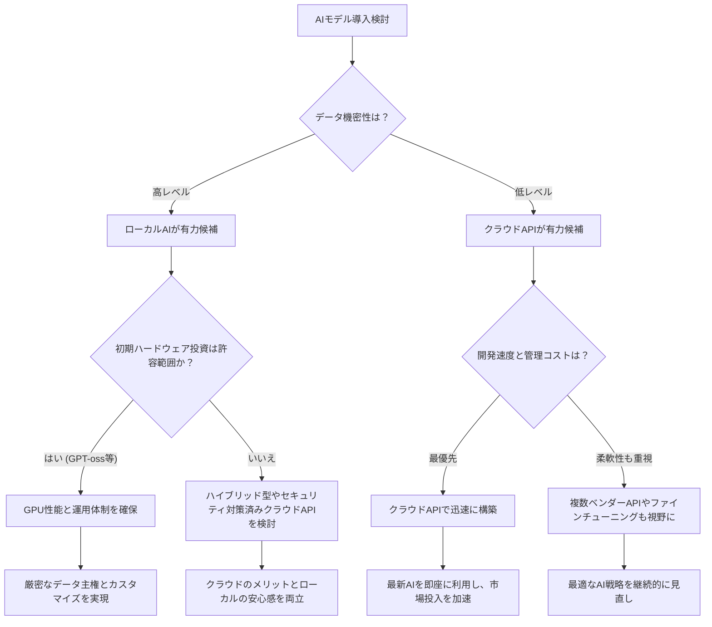

> **💡 この記事のポイント**
> - OpenAIが約5年ぶりに初のオープンウェイトモデル「GPT-oss」をリリースし、AI業界に衝撃を与えました。
> - GPT-ossの登場は、データプライバシー、コスト効率、カスタマイズ性で優位なローカルAIの普及を大きく加速させます。
> - 日本企業は、この「ローカルAI」と「オープンウェイトモデル」の波に乗り、独自のAI戦略を迅速に構築する必要があります。

AI業界の激震を覚えていますか？2025年8月5日、あの**OpenAI**が、長らく閉鎖的と思われていた戦略を大きく転換し、初のオープンウェイトモデル「**GPT-oss**」をリリースしたんです！「え、OpenAIがオープンソース（っぽいもの）を？！」と、私のSlackも一瞬で沸騰しましたね。このニュースが、今後のAI、特に私たち日本企業にとってどれほどの意味を持つのか、徹底的に深掘りしていきましょう。

### OpenAI、沈黙を破り「GPT-oss」を投入！その衝撃と意味

かつて、OpenAIは「オープンAI」という名前の通り、研究成果を積極的に公開していました。しかし、商業化の波と性能競争の激化に伴い、彼らの主力モデルであるGPTシリーズは基本的にクローズドなAPI提供が中心となり、その内部構造は秘密のベールに包まれてきました。そんな中、突如としてサム・アルトマン氏が発表したのが、約5年ぶりとなるオープンウェイトモデル「**GPT-oss**」です。MIT Technology ReviewやBusiness Insiderが一斉に報じたこのニュースは、AI業界のランドマークとなる出来事でした。

なぜOpenAIはこのタイミングで、かつての方針に回帰するかのような手を打ったのでしょうか？私の見立てでは、これは複数の要因が絡み合った、極めて戦略的な一手です。まず、**Mistral AI**や**MetaのLlamaシリーズ**、そして**DeepSeek**といったオープンウェイトモデル群が急速に性能を向上させ、エンタープライズ領域で存在感を増している現状があります。特に、これらのモデルはカスタマイズ性やオンプレミスでの運用が可能なため、データガバナンスに厳しい企業からの需要が高まっています。OpenAIとしては、この成長市場を静観するわけにはいかなかったのでしょう。

「GPT-oss」は特に「**reasoning LLM（推論特化型LLM）**」として注目されています。Nature誌が報じたように、その名の通り、複雑な論理的推論能力に強みを持つとされています。この特性は、プログラミング支援、データ分析、法務・医療文書の解釈といった、高度な思考力を要するタスクにおいて本領を発揮するでしょう。そして、「ダウンロードして自由に調整できる」という点は、開発者にとって夢のような話。これまでAPI経由でしか触れられなかったOpenAIの最先端技術を、手元で細かくチューニングできるようになったのですから、そのインパクトは計り知れません。

ただし、「オープンウェイト」と「オープンソース」は厳密には異なります。モデルの重み（ウェイト）は公開されていますが、学習データや学習コードの全てが公開されているわけではありません。それでも、モデルそのものを手元で動かし、ファインチューニングできるようになったことは、これまでのOpenAIの戦略からは考えられないほどの大きな変化であり、AIの民主化に向けた大きな一歩だと言えるでしょう。

### ローカルAIの夢、ついに現実へ？「GPT-oss」がもたらす変化

「GPT-oss」の登場は、間違いなく**ローカルAI**時代の幕開けを告げる号砲となりました。これまでもローカルLLMは存在しましたが、OpenAIという業界の巨頭がその旗を振ったことで、その信頼性と普及速度は格段に加速するでしょう。SitePointやHackerNoonの2026年版ガイドが「ローカルLLM」を特集していることからも、このトレンドが単なるバズワードではないことが分かります。

ローカルでAIを動かすことのメリットは、多岐にわたります。

*   **プライバシーとセキュリティ**: 最も大きな利点です。機密性の高いデータを外部クラウドに送信することなく、企業や個人の環境内で処理できるため、情報漏洩のリスクを最小限に抑えられます。特に、日本企業ではこの点がAI導入の大きな障壁となっていました。
*   **コスト効率**: 長期的にはクラウドAPI利用料よりもコストを抑えられる可能性があります。特に大量の推論を実行する場合や、特定のニーズに合わせてモデルをカスタマイズ・最適化できるため、無駄なリソース消費を減らせます。
*   **オフライン運用**: インターネット接続がない環境や、通信が不安定な場所でもAIを利用できます。エッジデバイスでの利用や、災害時の活用など、可能性は広がります。
*   **カスタマイズと制御**: モデルのウェイトが手元にあるため、独自のデータでファインチューニングしたり、特定のタスクに特化させたりすることが容易になります。ブラックボックスだったAIが、より透明性の高い「道具」へと進化するのです。
*   **レイテンシの改善**: クラウドへの通信往復がなくなるため、応答速度が向上し、リアルタイム性が求められるアプリケーションでの活用が期待されます。

しかし、良いことばかりではありません。Lifehackerが「お勧めしない」と評したように、ローカルで高性能なLLMを動かすには、それなりの「**肉厚なリグ**」、つまり高性能なハードウェアが必須です。NVIDIAのブログが「GeForce RTXおよびRTX PRO GPUでローカル加速」と明言しているように、グラフィックカードの性能が鍵を握ります。RTXカードでも十分な性能が求められるとなると、企業レベルでの導入には相応の初期投資が必要になることを忘れてはなりません。

個人的には、このGPT-ossが、開発者が自身のワークステーションでAIを自由に実験し、イノベーションを起こすきっかけになることに最も期待しています。まるで、インターネット黎明期のウェブ開発のように、手軽にAIをいじり倒せる時代が来た、そんな感覚です。

### クラウドvsローカル：TCOは本当に逆転するのか？

ローカルAIの台頭で、多くの企業が頭を悩ませるのが「**結局、クラウドとローカル、どちらが経済的なのか？**」という疑問でしょう。SitePointが2026年のTCO（総所有コスト）分析でこのテーマを取り上げていることからも、その関心の高さが伺えます。

一概にどちらが良いとは言えませんが、考慮すべき点は多岐にわたります。

#### **クラウドAPIのTCO要素**

*   **メリット**:
    *   **初期投資が最小限**: ハードウェア購入や設置のコストが不要。
    *   **運用・保守が容易**: インフラ管理はベンダー任せ。
    *   **スケーラビリティ**: 需要に応じてリソースを柔軟に拡張・縮小可能。
    *   **最新モデルへのアクセス**: ベンダーが常に最新のモデルを提供する。
*   **デメリット**:
    *   **API利用料**: 利用量に比例してコストが増大。特に大規模利用では高額になる傾向。
    *   **データ転送コスト**: 入出力のデータ量に応じて課金される場合がある。
    *   **ベンダーロックイン**: 特定のプロバイダーに依存し、移行が困難になる可能性。
    *   **データプライバシー**: 機密データが外部に送信されるリスク。

#### **ローカルAI（GPT-ossなど）のTCO要素**

*   **メリット**:
    *   **長期的なコスト削減**: 一度ハードウェアを導入すれば、推論ごとの追加費用は基本的に不要。
    *   **データ主権**: データを外部に出すことなく処理できるため、最高のプライバシーとセキュリティを確保。
    *   **カスタマイズの自由度**: モデルのファインチューニングや、独自の運用ポリシーを適用可能。
    *   **オフライン運用**: インターネット接続に依存しない。
*   **デメリット**:
    *   **高額な初期投資**: 高性能GPUサーバーやワークステーションの購入費用。
    *   **運用・保守コスト**: ハードウェアの管理、電力消費、冷却、ソフトウェアのアップデートなど。
    *   **スケーラビリティの限界**: ハードウェアの物理的制約。
    *   **専門知識**: モデルのデプロイ、最適化、トラブルシューティングには専門的な知識が必要。

ここで、クラウドとローカルのTCOに関する比較表を見てみましょう。

| 項目         | クラウドAPI利用                                  | ローカルAI運用（GPT-ossなど）                        |
| :----------- | :----------------------------------------------- | :--------------------------------------------------- |
| **初期投資** | 低（アカウント開設のみ）                           | 高（高性能GPU、サーバー等）                            |
| **変動コスト** | 高（利用量に応じて課金）                           | 低（電力消費、保守費のみ）                             |
| **データ主権** | 低（外部プロバイダーに依存）                       | 高（自社管理）                                       |
| **スケーラビリティ** | 高（プロバイダーに依存）                           | 中〜低（ハードウェア増設が必要）                       |
| **運用負荷** | 低（ベンダーが管理）                               | 高（自社での管理・保守）                             |
| **レイテンシ** | 中〜高（通信距離に依存）                           | 低（自社内ネットワーク）                             |
| **カスタマイズ性** | 低（APIで提供される範囲内）                       | 高（モデルを直接ファインチューニング可能）             |
| **セキュリティ** | プロバイダーのポリシーに依存（共有責任モデル）       | 自社ポリシーに依存（完全な制御が可能）                 |

TCO分析は、短期的な視点だけでなく、中長期的な戦略と、データの性質、利用頻度、必要なカスタマイズレベルによって大きく変わります。機密性の高いデータを大量に扱う日本企業にとって、ローカルAIは非常に魅力的な選択肢となり得るでしょう。

このフローチャートのように、自社の状況を多角的に評価することが、最適なAI導入戦略を見つける鍵となります。

### 日本企業よ、このビッグウェーブに乗り遅れるな！「GPT-oss」が描く未来

「GPT-oss」の登場とローカルAIの加速は、日本企業にとって**千載一遇のチャンス**です。これまで、データプライバシーやセキュリティの懸念から、AI導入に二の足を踏んでいた企業は少なくありませんでした。特に金融、医療、製造業といった分野では、機密情報の外部持ち出しは厳しく制限されています。GPT-ossのようなオープンウェイトモデルを自社インフラ内で運用できることは、これらの業界のAI活用を劇的に前進させる可能性を秘めていると私は確信しています。

日本企業がこの波に乗るために、具体的に何をすべきか、私の見解を述べさせてください。

1.  **AI人材の育成と確保**: ローカル環境でAIモデルをデプロイ、運用、ファインチューニングするには、従来のクラウドAIの知識に加え、GPUインフラの構築・管理、モデルの最適化、セキュリティ対策など、より専門的なスキルが必要です。社内教育プログラムの強化や、外部からの専門家採用を加速すべきです。
2.  **PoC（概念実証）の積極的な実施**: まずは小規模でも良いので、GPT-ossを自社の既存データで動かし、その可能性を探るPoCを迅速に実施することが重要です。実際の業務課題に適用することで、具体的なメリットと課題が見えてきます。
3.  **既存システムとの連携戦略**: 多くの日本企業は、レガシーシステムを抱えています。ローカルAIを導入する際、これらの既存システムとどのように連携させ、データを安全かつ効率的にやり取りするかが成功の鍵となります。API連携やデータパイプラインの構築は必須です。
4.  **オープンイノベーションへの参加**: GPT-ossのようなオープンウェイトモデルは、コミュニティ全体で進化していくエコシステムの上に成り立っています。Hugging Faceのようなプラットフォームを活用し、国内外のオープンソースコミュニティに参加することで、最新の知見や技術動向をいち早くキャッチアップし、自社のAI戦略に活かすことができます。
5.  **リスク管理の徹底**: オープンウェイトモデルとはいえ、利用規約やライセンスは存在します。また、モデルの信頼性、公正性、頑健性（ロバストネス）を評価し、潜在的なリスク（ハルシネーションなど）に対する対策を講じることも忘れてはなりません。

この変革期は、単に技術的なトレンドに追随するだけでなく、企業のあり方、ビジネスモデルそのものを見直す機会でもあります。ローカルAIを武器に、日本企業が世界市場で再び輝く姿を、私は心待ちにしています。

### 🧐 エバンジェリストの辛口オピニオン

OpenAIがGPT-ossを出したからといって、手放しで喜んでばかりはいられません。むしろ、これはAI業界における新たな「分断」と「淘汰」の始まりを告げる合図だと私は見ています。OpenAIはこれまで、クローズド戦略で市場を席巻してきました。それが突如として「オープンウェイト」を繰り出す。これは彼らが、クラウドAPI一辺倒のビジネスモデルだけでは、もはや覇権を維持できないという強い危機感の表れではないか。競合のオープンモデル群が急速に追いつき、追い越そうとしている中で、彼らも変化を余儀なくされたのです。

しかし、ここで日本企業が「よっしゃ、これで無料で最新AIが使える！」と安易に飛びつくのは危険です。高性能なGPUサーバーの導入には初期投資がかかるし、それを運用・管理する専門人材はさらに希少価値が高い。安易なローカルAI導入は、かえってITコストの肥大化と管理負担の増大を招きかねません。そして「オープンウェイト」は「オープンソース」とは違う。ライセンス条件の変更や、上位モデルへの誘導など、結局はOpenAIのビジネス戦略に組み込まれる可能性も常に頭に入れておくべきです。

正直言って、日本企業はAIの導入において、常に**「石橋を叩きすぎた上に結局渡らない」**傾向があります。セキュリティやプライバシーを理由にAI導入を躊躇してきた企業は多いですが、ローカルAIはその言い訳を消し去ってしまいました。これからは「なぜローカルAIを導入しないのか？」「なぜ自社データでモデルをファインチューニングしないのか？」と問われる時代が来ます。今すぐ動かない企業は、データと知見が社内に蓄積されず、デジタル競争力において致命的な遅れをとることになるでしょう。このビッグウェーブに乗り遅れることは、もはや「選択」ではなく「敗北」を意味すると肝に銘じてください。

## 🔗 関連ツール・サービス

**[OpenAI Developer Platform](https://platform.openai.com/)** — GPT-ossを含むOpenAIモデルの情報を確認し、APIを試すための公式プラットフォーム。
**[Hugging Face](https://huggingface.co/)** — オープンソースAIモデルやデータセットが集まるコミュニティハブ。GPT-ossのようなオープンウェイトモデルもここで見つかる可能性があります。
**[NVIDIA GeForce RTXシリーズ](https://www.nvidia.com/ja-jp/geforce/graphics-cards/rtx-30-series/)** — ローカルでの高性能LLM推論を加速するための必須GPU。
**[Mistral AI](https://mistral.ai/)** — OpenAIの強力な競合であり、高性能なオープンウェイトモデルを提供するフランス発のAI企業。