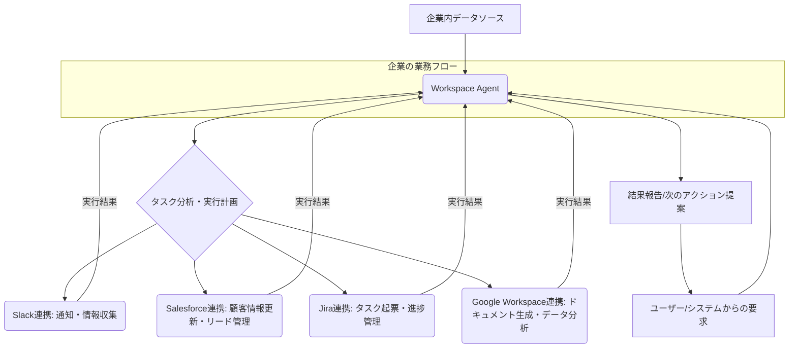

シリコンバレーから緊急速報です。OpenAIがまたしても、ビジネスの現場を根底から変えかねない新サービス「Workspace Agents」を発表しました。これまで個別最適化の切り札とされてきたカスタムGPTsから一歩踏み込み、企業全体のワークフローに自律的に介入し、主要なビジネスアプリケーションと連携する「仕事の代理人」を送り出してきたのです。これは、単なる機能追加ではありません。AIの役割が「個人のアシスタント」から「企業の自動化インフラ」へとシフトする、極めて重要な戦略転換を意味します。

なぜ今、OpenAIは企業向けAIエージェントの深掘りを選択したのでしょうか。それは、ビジネス現場の非効率性と、より高度な自動化への飽くなき要求に応えるためです。散在する情報、煩雑な手作業、異なるSaaS間の連携の壁――これらをAIが自律的に乗り越え、企業の生産性を劇的に向上させる。そんな未来が、Workspace Agentsによっていよいよ現実のものとなります。日本の企業にとって、これは競争優位性を確立する大きなチャンスであると同時に、素早い対応を迫られる喫緊の課題となるでしょう。

## 「カスタムGPTsの次」が示すもの：Workspace Agentsの登場

2023年末に登場したカスタムGPTsは、特定タスクに特化したAIアシスタントを誰もが簡単に作成できる画期的なサービスでした。しかし、その利用は主に個人や小規模チーム、あるいは特定プロジェクトでの限定的な活用に留まる傾向がありました。外部APIとの連携機能（Actions）はあったものの、本格的な企業システムとの深度ある統合や、複数のSaaSをまたぐ自律的な業務遂行には限界があったのが実情です。

今回発表された「Workspace Agents」は、この限界を打ち破るべく、明確に**エンタープライズ領域**に照準を合わせています。OpenAI自身が「カスタムGPTsの真の後継者」と位置付けていることからも、その戦略的な意図は明白です。Workspace Agentsは、単にプロンプトに基づいて応答するだけでなく、**企業のSaaS環境に深くプラグインし、複数のステップにわたる複雑な業務を自律的に計画・実行する能力**を持っています。

例えば、顧客からの問い合わせをSlackで受け取り、Salesforceで顧客情報を確認し、必要に応じてJiraでタスクを起票し、最後に状況をチームに報告するといった一連のフローを、人間が逐一指示することなくAIエージェントが完結させる。これこそが、Workspace Agentsが目指す「仕事の代理人」の姿です。この進化は、企業がAIをどのように活用し、組織全体の生産性をどのように再定義するかについて、根本的な問いを投げかけるものです。

上記のMermaid図が示すように、Workspace Agentは単一のSaaSに留まらず、企業のデータハブとして機能し、様々なツールを横断して業務を遂行する中心的な役割を担います。これは、従来のRPAツールやシンプルなAPI連携とは一線を画す、AIの「知性」に基づく自律的なアクションが実現されたことを意味します。

## なぜ今、エンタープライズ特化型AIエージェントなのか

OpenAIがWorkspace Agentsを投入した背景には、明確な市場ニーズと戦略的な狙いがあります。

第一に、**企業における非効率な反復業務の多さ**です。多くの企業では、情報検索、データ入力、レポート作成、承認プロセスといった定型業務に膨大な時間が費やされています。これらは人間の創造性や戦略的思考を必要としないにもかかわらず、手作業によって行われることが少なくありません。AIエージェントは、これらの業務を24時間365日、エラーなく遂行する能力を持っています。

第二に、**SaaSエコシステムの複雑化とデータサイロの問題**です。現代の企業は、Salesforce、Slack、Jira、Zendesk、Google Workspace、Microsoft 365など、多種多様なSaaSツールを導入しています。それぞれのツールが特定の機能に特化している一方で、ツール間の連携不足が新たな非効率を生み出す「データサイロ」の問題も深刻化しています。Workspace Agentsは、これら複数のSaaSを横断的に理解し、連携させることで、分断された業務プロセスをシームレスにつなぐ「接着剤」となることを目指しています。

第三に、**OpenAIの戦略的な差別化**です。マイクロソフトのCopilotやGoogleのGemini for Workspaceなど、競合他社も企業向けAIアシスタントの領域に注力しています。しかし、それらの多くは「既存のSaaS環境にAI機能を組み込む」アプローチが主流です。これに対し、OpenAIのWorkspace Agentsは、特定のSaaSに縛られず、あらゆるSaaSや社内システムを「連携対象」として捉え、**AIが自律的に「仕事そのもの」を遂行する**という、よりアグレッシブなビジョンを提示しています。これは、AIが単なる補助ツールではなく、企業のオペレーションの中核を担う存在へと進化する、というOpenAIの強い意思表示と捉えることができます。

この流れは、企業が直面するIT投資の課題にも答えるものです。既存のSaaSツールを捨てることなく、むしろそれらを最大限に活用しながら、AIの知能によって価値を最大化する。Workspace Agentsは、そんな現実的なソリューションとして、多くの企業にとって魅力的な選択肢となるでしょう。

## Slack, Salesforce他、主要ビジネスツールとの連携がもたらす変革

Workspace Agentsの最大の特徴は、その卓越した連携能力にあります。Venturebeatの報道が示す通り、SlackやSalesforceといった企業が日常的に利用する主要なビジネスツールに直接プラグインすることで、AIが業務の「現場」に入り込み、リアルタイムで価値を提供することを可能にします。

具体的な連携とユースケースをいくつか挙げてみましょう。

*   **顧客サポートの自動化:** Slackで顧客からの問い合わせを検知し、Workspace AgentがSalesforceで過去の購買履歴や問い合わせ履歴を検索。FAQから自動で回答を生成するか、解決が難しい場合は適切な担当者にJiraでタスクを起票し、関連情報を添えて通知する。これにより、顧客対応の初動を高速化し、オペレーターはより複雑な問題に集中できるようになります。
*   **営業プロセスの最適化:** 新規リードがSalesforceに入力されると、Workspace Agentが自動で過去の類似案件や関連資料を検索し、営業担当者への初回アプローチメールのドラフトを作成。さらに、リードの状況変化に応じてSlackでチームに通知し、次のアクションを推奨する。
*   **プロジェクト管理の効率化:** Slackのチャネルで議論された内容や決定事項から、Workspace AgentがJiraでタスクを自動生成し、担当者と期日を設定。進捗状況に応じて週次レポートのドラフトをGoogle Docsで作成し、チームに共有する。
*   **人事・総務業務の合理化:** 新入社員のオンボーディングプロセスにおいて、Workspace AgentがSaaSアカウントの開設申請、社内資料の案内、初期タスクリストの作成などを自動で実行し、人事担当者の負担を軽減する。

これらのユースケースはごく一部に過ぎません。Workspace Agentsは、企業が直面するあらゆる反復的でルールベースの業務をAIの知能によって自動化し、従業員がより戦略的で価値の高い仕事に集中できる環境を創出します。

ここで、カスタムGPTsとWorkspace Agentsの主な違いを比較してみましょう。

| 特徴          | カスタムGPTs                           | Workspace Agents                       |
| :------------ | :------------------------------------- | :------------------------------------- |
| **主な利用者**    | 個人、小規模チーム、特定プロジェクト     | 企業、部門、大規模組織                 |
| **目的**        | 特定のタスク支援、情報整理、簡易自動化   | 高度な業務自動化、プロセス最適化、データ連携、意思決定支援 |
| **統合深度**    | 外部Actionによる簡易連携、会話中心     | 主要SaaS（Slack, Salesforce等）へのネイティブかつ深い統合、社内システム連携の拡張性 |
| **自律性**      | ユーザーの指示に基づくステップ実行、会話ドリブン | 複雑なワークフローの自律的計画・実行、状況判断能力の向上 |
| **管理・ガバナンス** | 個人レベル、セキュリティはユーザー任せ | 企業レベルの管理機能、セキュリティ、監査機能、権限管理（必須機能として強化） |
| **費用モデル**    | ChatGPT Plus/Enterpriseの一部として提供 | エンタープライズ向けの従量課金またはライセンス（高額化の可能性） |
| **対象業務**      | 情報収集、文章生成、ブレインストーミングなど個人支援 | 複数システム連携、顧客対応、営業支援、プロジェクト管理など部門横断業務 |

この比較から明らかなように、Workspace Agentsは、単なるAIアシスタントの進化ではなく、**企業オペレーションの基盤をAIで再構築する**という、より大きなビジョンに基づいています。

## 日本企業が直面するチャンスと課題

Workspace Agentsの登場は、日本の企業にとって大きなチャンスとなる一方で、乗り越えるべき課題も浮き彫りにします。

**チャンスの側面:**

*   **生産性の大幅な向上:** 少子高齢化による労働力不足が深刻化する日本において、AIエージェントによる業務自動化は、限られたリソースで生産性を最大化する強力な手段となります。定型業務から解放された人材を、より創造的・戦略的な業務に再配置することで、企業全体の競争力を高めることができます。
*   **グローバル競争力の強化:** 世界のAI先進企業が次々とAIエージェントを導入する中、日本企業も追随することで、国際的な競争環境における立ち遅れを防ぎ、むしろリードする可能性を秘めています。
*   **既存SaaS投資の最大化:** 多くの日本企業が導入しているSalesforceやSlackなどのSaaSは、その機能の一部しか活用されていないケースも少なくありません。Workspace Agentsは、これらのツールをAIが横断的に活用することで、既存投資のROI（投資対効果）を最大化する道筋を示します。

**課題の側面:**

*   **データガバナンスとセキュリティ:** Workspace Agentsが企業内の機密データや顧客情報にアクセスし、SaaS間でやり取りすることは避けられません。日本企業はデータガバナンス、プライバシー保護、サイバーセキュリティに対する意識が特に高く、これらをどのように担保するかが最大の課題となります。OpenAIが提供するセキュリティ機能だけでなく、企業自身がデータのアクセス権限や利用範囲を厳格に管理する体制構築が不可欠です。
*   **既存システムとの統合:** 複雑に絡み合ったレガシーシステムや独自の業務プロセスを持つ日本企業にとって、Workspace Agentsのスムーズな導入は一筋縄ではいかないでしょう。導入前の詳細なアセスメント、段階的なロールアウト、そして既存システムとのAPI連携やデータマッピングの設計が重要になります。
*   **人材の育成と組織文化の変革:** AIエージェントを最大限に活用するには、AIの能力を理解し、適切な指示を与え、その結果を評価できる人材が不可欠です。また、AIに業務を任せることへの抵抗感や、新たなワークフローへの適応を促す組織文化の変革も求められます。
*   **コストとROIの評価:** 初期導入コストや運用コスト、そしてそれに見合う投資対効果をどのように評価し、経営層を納得させるかという点も重要です。具体的な成果指標（KPI）を設定し、パイロット導入で効果を検証するアプローチが現実的でしょう。

Workspace Agentsは、まさに「諸刃の剣」です。的確に活用すれば企業の飛躍を促しますが、安易な導入や準備不足は混乱を招きかねません。

## 🧐 編集部の辛口オピニオン

今回のOpenAIのWorkspace Agents発表は、日本のビジネスパーソン、特に経営層やDX推進を担う方々にとっては、まさに「タイムリミットを告げる警鐘」だと私は断言します。これまで「AIは個人のツール」「まだ発展途上」といった生ぬるい認識で見ていた企業は、本気で目を覚ますべきです。これは、単なる流行りの技術ではありません。**企業オペレーションのOSそのものをAIが担い始める**という、根本的なパラダイムシフトの到来です。

日本の企業はこれまで、新しいSaaSを導入する際も「まず現状維持」という思考停止に陥りがちでした。「うちは特殊だから」「既存システムとの連携が難しい」と、変化への抵抗を正当化する口実を探し続けてきた。しかし、今回のWorkspace Agentsは、その言い訳を許しません。SaaSベンダーが提供する機能をただ使うだけではなく、**AIが複数のSaaSを横断し、自律的に業務を遂行する**のです。これは、個々のSaaSの活用レベルが低い日本企業にとって、まさに「足元をすくわれる」リスクを孕んでいます。

「様子見」は、もはや戦略ではありません。欧米の競合他社は、この種のAIエージェントを導入し、業務効率を劇的に改善し、新たな価値創出にまい進するでしょう。その中で、日本の企業が「手作業」や「部分的なSaaS活用」に固執すれば、あっという間に競争力を失うのは目に見えています。

私は日本の経営層に強く提言します。今すぐ、自社の主要業務プロセスを棚卸しし、どの部分にWorkspace AgentsのようなAIエージェントが適用可能かを検討すべきです。そして、**データのガバナンスとセキュリティ体制を最優先で強化し、パイロット導入を通じて具体的な成果を測定する**ことです。AIに業務を任せることへの従業員の不安や抵抗は当然ありますが、それを乗り越えるためのビジョンとリーダーシップが問われています。

繰り返しますが、これは「次世代のツール」ではありません。**「今日から、あなたの会社の業務を変革するインフラ」**です。このチャンスを逃せば、日本のビジネスの未来は、さらに厳しいものになるでしょう。

## 💡 よくある質問（FAQ）

### Q: Workspace Agentsは既存のRPAツールとどう違うのでしょうか？
A: 従来のRPA（Robotic Process Automation）ツールは、人間が設定した厳密なルールに基づいて定型業務を自動化するもので、変化する状況への対応や判断能力には限界がありました。Workspace Agentsは、大規模言語モデル（LLM）の高度な知能を基盤としているため、単なるルール実行に留まらず、文脈を理解し、複雑な状況に応じて自律的に計画を立て、複数のSaaSツールを横断して判断・実行することができます。RPAが「ロボット」なら、Workspace Agentsは「自律的な代理人」と言えるでしょう。

### Q: Workspace Agentsを導入する際のセキュリティ対策について教えてください。
A: Workspace Agentsは企業の機密情報やSaaSデータにアクセスするため、厳格なセキュリティ対策が不可欠です。OpenAIはエンタープライズ向けの機能として、アクセス制御、データ暗号化、監査ログ、コンプライアンス基準への準拠などを強化すると考えられます。しかし、企業側も、AIエージェントへのアクセス権限を最小限に抑える「最小権限の原則」、データ利用ポリシーの策定、定期的なセキュリティ監査、そして従業員へのセキュリティ教育を徹底する必要があります。可能であれば、閉域網での運用やオンプレミスに近い形でのデータ管理を検討することも重要です。

### Q: 小規模企業でもWorkspace Agentsの恩恵を受けられますか？
A: 現時点での発表内容から判断すると、Workspace Agentsはエンタープライズ向けのソリューションであり、初期導入コストや運用に必要な専門知識は小規模企業には負担が大きい可能性があります。しかし、OpenAIは常に技術の民主化を目指しているため、将来的に中小企業向けの簡易版や、特定のSaaSと連携に特化した廉価版が登場する可能性もゼロではありません。当面は、ChatGPT Enterpriseプランで提供されるカスタムGPTsの活用や、より簡易なAI連携ツールから試行し、将来的な本格導入に備えるのが現実的なアプローチでしょう。

## 🔗 関連ツール・サービス

**[ChatGPT Enterprise](https://openai.com/enterprise)** — 企業の生産性向上とデータセキュリティに特化したOpenAIの法人向けプランです。
**[Slack](https://slack.com/intl/ja-jp/)** — チームコミュニケーションとワークフロー自動化を支援するビジネスチャットツールです。
**[Salesforce](https://www.salesforce.com/jp/)** — 顧客関係管理（CRM）の世界的リーダーで、営業、サービス、マーケティングを統合します。
**[Jira](https://www.atlassian.com/ja/software/jira)** — ソフトウェア開発チーム向けのプロジェクト管理および課題追跡ツールです。