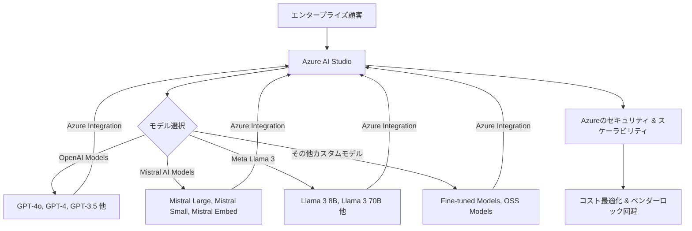

シリコンバレーで15年間、最先端の技術動向を追ってきた私にとって、AIの世界で今、最も興味深い動きの一つが、まさかの「盟友」間の競争勃発です。これまでMicrosoftはOpenAIの最大の支援者であり、その技術をAzureプラットフォームを通じて企業顧客に提供することで、AIエコシステムのリーダーシップを築いてきました。しかし、最近の発表は、その「蜜月」の関係に新たな局面を迎えることを示唆しています。

Microsoftは、フランスのAIスタートアップであるMistral AIとの戦略的パートナーシップを深化させ、同社の最先端モデル群（Mistral Large、Mistral Small、Mistral Embedなど）をAzure AIプラットフォームにネイティブ統合することを発表しました。これは単なる提携強化にとどまらず、Azure上でOpenAIのGPTシリーズと競合する新たな選択肢を企業顧客に提供するという、非常に大胆な戦略転換を意味します。この動きは、エンタープライズAI市場の競争を一気に激化させ、これからの企業がAI戦略を練る上で無視できない、決定的なパラダイムシフトの兆候だと捉えています。

## Microsoft、"盟友"OpenAIに挑む新戦略

MicrosoftがMistral AIとの提携を深めた背景には、企業AI市場における新たな需要と、市場の健全な競争を促進したいという意図が透けて見えます。これまでAzure AIの顧客は、高性能な生成AIモデルを求める場合、実質的にOpenAIのモデルが主要な選択肢でした。もちろん、その性能は疑いの余地がありません。しかし、企業によってはコスト、モデルの透明性、特定の地域でのデータ主権の要件、あるいは単にベンダーロックインのリスクを避けたいという強い要望がありました。

今回の提携により、Mistral AIのモデルはAzure AI Studioを通じて利用可能となり、OpenAIモデルと同様に、Azureの強力なインフラストラクチャの上でスケーラブルかつセキュアに展開できるようになります。これは、企業がこれまでOpenAIモデルで享受してきたのと同レベルのサポートと統合性を、Mistral AIモデルでも得られることを意味します。例えば、多言語処理に特化したアプリケーション開発や、より高い効率性や低コストでの推論が求められるユースケースにおいて、Mistral AIのモデルは非常に魅力的な選択肢となるでしょう。

Microsoftのこの戦略は、Azureというプラットフォームの価値を最大化する動きだと分析できます。彼らはOpenAIへの投資と協力関係を継続しつつも、Azureを「あらゆる最先端AIモデルが利用できる、中立的なハブ」として位置付けたいのです。これにより、企業顧客は特定のモデルに依存することなく、用途や予算に応じて最適なモデルを自由に選択し、活用できる環境が整います。これは結果的にAzureの魅力度を高め、クラウド市場での競争力を一層強化することになるでしょう。

### なぜ今、Mistral AIなのか？フランスの「知性」が持つ強み

では、なぜMicrosoftが数あるAIスタートアップの中からMistral AIに目をつけ、これほど大規模な提携に踏み切ったのでしょうか。編集部で特に注目したのは、Mistral AIが持つ**「高い効率性」と「オープンソースへのコミットメント」**です。

Mistral AIは、設立わずか1年足らずで、GPT-3.5やGPT-4に匹敵する、あるいは特定のベンチマークで上回る性能を持つモデルをリリースし、世界を驚かせました。彼らのモデルは、その性能にもかかわらず、比較的小規模なデータセットと計算資源で効率的に学習されている点が特徴です。これにより、推論コストを抑えつつ、高速なレスポンスを実現できるため、特にコストに敏感な企業や、リアルタイム性が求められるアプリケーションでの採用が期待されます。

また、Mistral AIは、Mistral 7Bのようなモデルをオープンソースとして公開しており、コミュニティからの評価も非常に高いです。このオープンソース戦略は、AIの民主化を加速させるとともに、モデルの透明性とカスタマイズ性を重視する企業にとって大きな魅力となります。もちろん、Azureで提供されるのは商用利用が想定された高性能モデルが中心ですが、彼らの技術哲学が「効率性」と「柔軟性」にあることは間違いありません。

さらに、フランスを拠点とするMistral AIは、**欧州におけるデータ主権やAI規制の動向**にも敏感に対応しており、EU圏内の企業にとっては心理的なハードルが低いという側面も無視できません。グローバル展開を目指すMicrosoftにとって、地域ごとのニーズに応えられるパートナーを持つことは、戦略的に非常に重要です。彼らは単に強力なモデルを得ただけでなく、多様な市場ニーズに応えるための重要なピースを手に入れたのです。

## エンタープライズAI市場の激変：マルチベンダー時代の到来

MicrosoftとMistral AIの提携は、エンタープライズAI市場が「マルチベンダー・マルチモデル」の時代へと本格的に移行する決定的なサインです。これまで、企業が生成AIを導入する際、「とりあえずGPT-4」という選択が多かったかもしれません。しかし、これからは企業はより戦略的な視点でAIモデルを選定する必要があります。

この変化は、企業にとって複数のメリットをもたらします。

*   **ベンダーロックインの回避**: 特定のAIモデルプロバイダーに過度に依存するリスクを軽減できます。これにより、将来的なコスト上昇や機能制約から解放される可能性が高まります。
*   **コスト最適化**: 各モデルの強みとコストパフォーマンスを比較し、用途に応じて最適なモデルを選択できるようになります。例えば、複雑なタスクには高性能モデルを、定型的なタスクにはより安価で効率的なモデルを使い分けることが可能です。
*   **ソリューションの多様化**: モデルごとに異なる特性や得意分野を活かすことで、より多様で高度なAIアプリケーションを開発できるようになります。例えば、画像生成にはMidjourneyやStable Diffusionを、コード生成にはCode LlamaやGPT-4 Turboを、といった具体的な使い分けが一般的になります。
*   **データ主権とコンプライアンス**: 特定の地域や業界に特化した規制（GDPRなど）に対応するため、データ処理の所在地やモデルの学習データ源に関して、より柔軟な選択が可能になります。

このマルチベンダー戦略は、既にAmazon BedrockやGoogle Vertex AIといった競合プラットフォームでも進められています。Azureがこれに本格的に参入することで、AIモデルの選択肢はさらに広がり、企業は自社のビジネス課題に最適なAIを、より競争力のある条件で利用できる環境が整いつつあります。

上図は、Azure AI Studioが提供するモデル選択肢の拡大と、それが企業顧客にもたらすメリットを示しています。OpenAI、Mistral AI、そしてMetaのLlama 3など、主要なモデルがプラットフォーム上で横断的に利用できるようになることで、企業は単一のベンダーに依存することなく、自社のニーズに最も適したAI戦略を構築できるのです。

## 🧐 編集部の辛口オピニオン

MicrosoftとMistral AIの今回の提携は、一見すると健全な市場競争の促進に見えますが、私はここに、OpenAIとMicrosoftという「盟友」の関係における、より深遠で戦略的な思惑が隠されていると見ています。Microsoftは、OpenAIへの巨額投資を通じてAI分野でのリードを築きましたが、その裏で、OpenAIの技術が過度に標準化されることで、OpenAI自身の市場での交渉力が強まり、Microsoftのコントロールが及びにくくなるリスクも抱えていました。今回の動きは、OpenAIへの「けん制球」であり、同時にAzureというプラットフォームの価値を、特定のモデルプロバイダーに依存しない形で高めるための、極めて巧妙な一手です。

正直に申し上げて、この動きはLLMのコモディティ化を加速させるでしょう。ChatGPTが切り開いた「対話型AI」の衝撃は大きかったですが、モデル自体の性能差は、汎用的な利用においては徐々に縮まりつつあります。これからは、**「どのモデルを選ぶか」よりも、「そのモデルをいかに自社のビジネスに最適化して組み込み、運用するか」**という部分にこそ、真の競争優位性が生まれます。

日本の企業にとって、この動きは警鐘と捉えるべきです。未だに「とりあえずGPT-4」で満足している企業や、「AI導入を検討中」の段階から抜け出せない企業が多いのが現状です。しかし、世界はすでに「マルチモデル、マルチベンダー」戦略へとシフトしています。特定のベンダーやモデルに依存することは、将来的なビジネスリスクに直結します。

「お上が決めるのを待つような姿勢」や「他社が成功するまで様子見」といった旧態依然とした思考では、世界のAI競争からは周回遅れになるどころか、市場から置き去りにされるでしょう。今こそ、自社で複数のモデルを評価し、それぞれの強みと弱みを理解し、柔軟に切り替えられるAI基盤を構築する時期です。そのためには、社内のAI人材育成はもちろん、外部の専門家との連携も不可欠です。AIの導入は、もはや「あればいい」レベルのツールではなく、経営インフラそのもの。この激変する市場で生き残るため、日本の企業はもっとアグレッシブに、そして戦略的にAIと向き合うべきです。

---
| 特徴 / モデル       | OpenAI (GPT-4o)                                | Mistral AI (Mistral Large)                      | Meta (Llama 3)                               |
| :------------------ | :--------------------------------------------- | :---------------------------------------------- | :------------------------------------------- |
| **主な強み**        | 最先端の推論能力、マルチモーダル、幅広い用途   | 高効率、コストパフォーマンス、多言語対応      | オープンソース、カスタマイズ性、大規模コミュニティ |
| **企業導入のメリット** | 革新的なアプリケーション、複雑なタスク処理   | コスト最適化、特定の言語・地域での強み          | データ主権、高度なカスタマイズ、ベンダーロック回避 |
| **考慮すべき点**    | 高コスト、API依存、データプライバシー（一部懸念） | 最新モデルとの性能差（一部）、コミュニティサポート | インフラ構築の労力、安全性対策の必要性、商用ライセンス |
| **Azureでの利用**   | ネイティブ統合、最高レベルのサポート           | ネイティブ統合、高いサポートレベル              | ネイティブ統合（一部）、サポート拡大中         |

---

## 💡 よくある質問（FAQ）

### Q: MicrosoftとOpenAIの関係はどうなるのでしょうか？
A: MicrosoftとOpenAIの戦略的パートナーシップは引き続き維持されますが、今回のMistral AIとの提携は、MicrosoftがAzure上でOpenAIモデル以外の選択肢も積極的に提供していく姿勢を示しています。これは、MicrosoftがAI市場の健全な競争を促進しつつ、Azureプラットフォームの価値をさらに高めようとする動きであり、必ずしも関係が悪化するわけではありません。むしろ、両社は異なるAIモデルの強みを活かし、市場全体のパイを広げる方向で協調する可能性も残されています。

### Q: Mistral AIモデルをAzureで使うメリットは何ですか？
A: AzureでMistral AIモデルを利用する最大のメリットは、高いパフォーマンスとコスト効率を両立できる点です。Mistral AIのモデルは効率的な設計により、同等性能の他社モデルと比較して推論コストを抑えられる可能性があります。また、Azureの堅牢なセキュリティ、スケーラビリティ、エンタープライズグレードのサポートを利用できるため、安心してビジネスアプリケーションに組み込むことができます。特に多言語対応や特定のドメインに特化したファインチューニングを検討している企業には、魅力的な選択肢となるでしょう。

### Q: 日本企業にとって、この動きは何を意味するのでしょうか？
A: 日本企業にとっては、AIモデルの選択肢が広がり、より柔軟で戦略的なAI導入が可能になるという大きな意味を持ちます。特定のモデルに依存せず、ビジネス課題や予算、コンプライアンス要件に応じて最適なモデルを柔軟に選択・組み合わせる「マルチモデル戦略」の重要性が一層高まります。この変化に乗り遅れないためには、自社のAI活用ケースを深く掘り下げ、複数のモデルを実際に評価・検証する体制を構築し、迅速に導入を進めるアジリティが求められます。

## 🔗 関連ツール・サービス

**[Azure AI Studio](https://azure.microsoft.com/ja-jp/products/ai-services/ai-studio)** — さまざまな基盤モデルを組み合わせてAIアプリケーションを開発できるMicrosoftのプラットフォーム。
**[Hugging Face](https://huggingface.co/)** — 最先端のオープンソースAIモデル、データセット、デモが集まる最大のコミュニティハブ。
**[Weights & Biases](https://wandb.ai/)** — 機械学習モデルの実験追跡、可視化、コラボレーションを支援するMLOpsプラットフォーム。
**[LangChain](https://www.langchain.com/)** — LLMを活用したアプリケーション開発を効率化するフレームワーク。